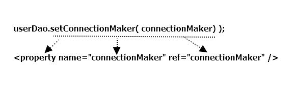

## 1.8 XML을 이용한 설정

*DaoFactory* 
-> DI의 동작원리를 잘 활용한 독립적인 오브젝트 팩토리로 시작

-> DI 컨테이너 도입 후 애노테이션을 추가해서 DI 작업에 참고하는 이롲ㅇ의 참고정보로 사용

-> 본격적인 범용 DI 컨테이너를 사용하면서, 오브젝트 사이의 의존 정보는 일일이 자바 코드로 만들어 주려면 번거로움

### 1.8.1 XML 설정
; 스프링의 애플리케이션 컨텍스트는 XML에 담긴 DI 정보를 활용할 수 있음

DI 정보가 담긴 XML 파일은 <beans>를 루트 엘리먼트로 사용

=> @Configuration -> <beans>  // @Bean -> <bean>에 대응해서 생각

하나의 @Bean 메소드를 통해 얻을 수 있는 빈의 DI 정보

- 빈의 이름 : @Bean 메소드 이름이 빈의 이름. 이 이름은 getBean()에서 사용
- 빈의 클래스 : 빈 오브젝트를 어떤 클래스를 이용해서 만들지 정의
- 빈의 의존 오브젝트 : 빈의 생성자나 수정자 메소드를 통해 의존 오브젝트를 넣어 줌  
   의존 오브젝트도 하나의 빈이므로 이름이 있을 것이고, 그 이름에 해당하는 메소드를 호출해서  
   의존 오브젝트를 가져옴. 의존 오브젝트는 하나 이상 일 수 있음
   

**connectionMaker() 전환**

*클래스 설정과 XML 설정의 대응항목*
<table>
	<tr>
		<th>&nbsp;</th> <th>자바 코드 설정 정보</th> <th>XML 설정정보</th> 
	</tr>
	<tr>
		<td>빈 설정 파일</td>
		<td>@Configuration</td>
		<td>&lt;beans&gt;</td>
	</tr>
	<tr>
		<td>빈의 이름</td>
		<td>@Bean methodName()</td>
		<td>&lt;bean id="methodName"&gt;</td>
	</tr>
	<tr>
		<td>빈의 클래스</td>
		<td>return new BeanClass();</td>
		<td>class="a.b.c..BeanClass"</td>
	</tr>
</table>

**userDao() 전환**

-> 자바빈의 관례를 따라서 수정자 메소드는 프로퍼티가 되므로, 수정자 메소드를 선호하 함

<preperty> 태그의 name : 프로퍼티 이름 , ref : 수정자 메소드를 통해 주입해줄 오브젝트의 빈 이름

*userDao 빈 설정*

<pre>
&lt;bean id=&quot;userDao&quot; class=&quot;springbook.dao.UserDao&quot;&gt;
	&lt;property name=&quot;connectionMaker&quot; ref=&quot;connectionMaker&quot; /&gt;
&lt;/bean&gt;
</pre>

**XML의 의존관계 주입 정보**

*완성된 XML 설정정보*
<pre>
&lt;beans&gt;

	&lt;bean id=&quot;connectionMaker&quot; class=&quot;springbook.user.dao.DConnectionMaker&quot; /&gt;
	
	&lt;bean id=&quot;userDao&quot; class=&quot;springbook.user.dao.UserDao&quot;&gt;
		&lt;property name=&quot;connectionMaker&quot; ref=&quot;connectionMaker&quot; /&gt;
	&lt;/bean&gt;
	
&lt;/beans&gt;
</pre>

- name : DI에 사용할 수정자 메소드의 프로퍼티 이름
- ref : 주입할 오브젝트를 정의한 빈의 ID

=> 프로퍼티 이름, 빈 이름은 주입할 빈 오브젝트의 인터페이스를 따르는 경우가 많음

( 바뀔 수 있는 클래스 이름보다는 대표적인 인터페이스 이름을 따르는 편이 자연스러움 )

=> 빈 이름이 바뀔 경우, 이를 참조할 ref 애트리뷰트의 값도 함께 변경해줘야함

=> 가능하면 처음부터 이름을 잘 정하고 수정하지 않는 편이 좋음

개발팀 내에서 공통적으로 따를 수 있는 명명(naming)규칙을 처음부터 잘 준비하는게 좋음!

*같은 인터페이스 타입의 빈을 여러개 정의한 경우*
<pre>
&lt;beans&gt;
	
	&lt;bean id=&quot;localDBConnectionMaker&quot; class=&quot;...LocalDbConnetionMaker&quot; /&gt;
	&lt;bean id=&quot;testDBConnectionMaker&quot; class=&quot;...TestDBConnectionMaker&quot; /&gt;
	&lt;bean id=&quot;productionDBConnectionMaker&quot; class=&quot;...ProductionDBConnectionMaker&quot; /&gt;
	
	&lt;bean id=&quot;&quot; class=&quot;userDao&quot; class=&quot;springbook.user.dao.UserDao&quot;&gt;	
		&lt;property name=&quot;connectionMaker&quot; ref=&quot;localDBConnectionMaker&quot; /&gt;
	&lt;/bean&gt;
	
&lt;/beans&gt;	
</pre>

=> 상황에 따라 userDao 빈의 ref 값을 다르게 지정한 XML 파일을 두고 사용하면 됨!

**DTD와 스키마**

; XML 문서의 구조를 정의하는 방법에는 DTD와 Schema가 있음

DTD를 사용하는 경우 <beans> 엘리먼트 앞에 아래와 같은 DTD 선언을 넣어 줌

<!DOCTYPE beans PUBLIC "-//SPRING//DTD BEAN 2.0//EN"
	"http://www.springframework.org/dtd/spring-beans-2.0.dtd">
	
-> 스프링은 DI를 위한 기본 태그인 <beans> , <bean> 외에도 특별한 목적을 위해 별도의 태그를 사용할 수 있는 방법 제공

-> 별도의 네임스페이스를 사용해야 함

<beans xmlns="http://www.springframework.org/schema/beans"  
	xmlns:xsi="http://www.w3.org/2001/XMLSchema-instance"  
	xsi:schemaLocation="http://www.springframework.org/schema/beans   http://www.springframework.org/schema/beans/spring-beans.xsd">  
	

### 1.8.2 XML을 이용하는 애플리케이션 컨텍스트

*XML 설정 정보를 담은 applicationContext.xml*
<pre>
&lt;?xml version=&quot;1.0&quot; encoding=&quot;UTF-8&quot;?&gt;
&lt;beans xmlns=&quot;http://www.springframework.org/schema/beans&quot;
	xmlns:xsi=&quot;http://www.w3.org/2001/XMLSchema-instance&quot;
	xsi:schemaLocation=&quot;http://www.springframework.org/schema/beans http://www.springframework.org/schema/beans/spring-beans.xsd&quot;&gt;
	
	&lt;bean id=&quot;connectionMaker&quot; class=&quot;springbook.user.dao.DConnectionMaker&quot; /&gt;
	
	&lt;bean id=&quot;userDao&quot; class=&quot;springbook.user.dao.UserDao&quot;&gt;
		&lt;property name=&quot;connectionMaker&quot; ref=&quot;connectionMaker&quot; /&gt;
	&lt;/bean&gt;

&lt;/beans&gt;
</pre>	

*애플리케이션 컨텍스트를 생성하는 코드*
<pre>
// 클래스패스를 시작하는 /는 생략 가능
// 생략해도, 항상 루트에서부터 시작하는 클래스패스
ApplicationContext context 
	= new GenericXmlApplicationContext("applicationContext.xml");
</pre>

*ClassPathXmlApplicationContext*

springbook.user.dao 패키지 안에 daoContext.xml이라는 설정 파일 존재

-> GenericXmlApplicationContext를 이용하는 경우

<pre>
ApplicationContext context  
	= new GenericXmlApplicationContext("/springbook/user/dao/daoContext.xml");
</pre>

-> ClassPathXmlApplicationContext를 이용하는 경우 

<pre>
ApplicationContext context  
	= new ClassPathXmlApplicationContext("daoContext.xml",UserDao.class);
</pre>

### 1.8.3 DataSource 인터페이스로 변환

**DataSource 인터페이스 적용**

기존 ConnectionMaker는 DB 커넥션을 생성해주는 기능 하나만을 정의한 매우 단순한 인터페이스

IoC와 DI의 개념을 설명하기 위해 직접 위 인터페이스를 정의 & 사용

-> 자바에ㅓ는 DB 커넥션을 가져오는 오브젝트의 기능을 추상화해서

비슷한 용도로 사용할 수 있게 만들어진 DataSource라는 인터페이스가 이미 존재

(단, DataSource는 여러 개의 메소드를 갖고 있어서 인터페이스를 직접 구현하기는 부담 스러움) 

-> 이미 다양한 방법으로 DB 연결과 풀링(pooling) 기능을 갖춘 

많은 DataSource 구현 클래스가 존재하고, 이를 가져다 사용해도 충분

*DataSource 인터페이스*
<pre>
package javax.sql

public interface DataSource extends CommonDataSource, Wrapper {
	Connection getConnection() throws SQLException;
	...
}
</pre>

==> DataSource 인터페이스와 다양한 DataSource 구현 클래스를 사용할 수 있도록

UserDao 리팩토링

*DataSource를 사용하는 UserDao*
<pre>
...
import java.sql.Connection;

import javax.sql.DataSource;

import springbook.user.domain.User;

public class UserDao {
	
	private DataSource dataSource;

	public void setDataSource(DataSource dataSource) {
		this.dataSource = dataSource;
	}

	public void add(User user) throws SQLException {
		Connection conn = dataSource.getConnection();
		...
	}
	...
}
</pre>

**자바 코드 설정 방식**

*DataSource 타입의 dataSource 빈 정의 메소드*
<pre>
	@Bean
	public DataSource dataSource() {		
		SimpleDriverDataSource dataSource = new SimpleDriverDataSource();
		
		dataSource.setDriverClass( com.mysql.jdbc.Driver.class );		
		dataSource.setUrl("jdbc:mysql://localhost/spring");
		dataSource.setUsername("spring");
		dataSource.setPassword("book");
			
		return dataSource;
	}
</pre>

*DataSource 타입의 빈을 DI 받는 userDao() 빈 정의 메소드*
<pre>
	@Bean 
	public UserDao userDao() {
		UserDao userDao = new UserDao();
		userDao.setDataSource( dataSource() );
		return userDao;
	}
</pre>

**XML 설정 방식**

*dataSource 빈*
<pre>
&lt;bean id=&quot;dataSource&quot; class=&quot;org.springframework.jdbc.datasource.SimpleDriverDataSource&quot;/&gt;
</pre>

=> dataSource() 메소드에서 SimpleDriverDataSource 
 
오브젝트의 수정자로 넣어준 DB 접속 정보 존재하지 않음

### 1.8.4 프로퍼티 값의 주입

**값 주입**

=>setDriverClass() 메소드의 경우 Class 타입의 오브젝트 이긴 하지만

, 다른 빈 오브젝트를 DI 방식으로 가져와서 넣는 것음 아님

=> 다른 빈 오브젝트의 레퍼런스가 아닌 단순 정보도 오브젝트를 초기화 하는 과정에서 수정자 메소드에 넣을 수 있음

=> DI처럼 다이나믹하게 바꿀 수 있게 해주는 목적이 아니라, 클래스 외부에서

DB 연결정보와 같이 변경 가능한 정보를 설정해줄 수 있도록 만들기 위해서!

e.g) DB 접속 아이디가 바뀌었어도 클래스 코드는 수정해줄 필요가 없게 해주는 것

=> 텍스트나 단순 오브젝트 등을 수정자 메소드에 넣어주는 것을 스프링에서는 

'값을 주입한다'고 말함. ( 성격은 다르지만, 일종의 DI 라 볼 수 있음.

사용할 오브젝트 자체를 바꾸지는 않지만 오브젝트의 특성은 외부에서 변경할 수 있기 때문 )

*코드를 이용한 DB 연결정보 주입*
<pre>
	dataSource.setDriverClass( com.mysql.jdbc.Driver.class );		
	dataSource.setUrl("jdbc:mysql://localhost/spring");
	dataSource.setUsername("spring");
	dataSource.setPassword("book");
</pre>

*XML을 이용한 DB 연결정보 설정*
<pre>
&lt;bean id=&quot;dataSource&quot; class=&quot;org.springframework.jdbc.datasource.SimpleDriverDataSource&quot;&gt;
	&lt;property name=&quot;driverClass&quot; value=&quot;com.mysql.jdbc.Driver&quot; /&gt;
	&lt;property name=&quot;url&quot; value=&quot;jdbc:mysql://localhost/springbook&quot; /&gt;
	&lt;property name=&quot;username&quot; value=&quot;spring&quot; /&gt;
	&lt;property name=&quot;password&quot; value=&quot;book&quot; /&gt;
&lt;/bean&gt;
</pre>

**value 값의 자동 변환**

url,username,password는 String 타입이라 텍스트로 정의되는 value 애트리뷰트 값을 사용하는 것 문제 X

BUT driverClass는 java.lang.Class 타입

=> 스프링이 프로퍼티 값을 수정자 메소드의 파라미터 타입을 참고해서 적절한 형태로 변환 해줌

e.g)

Class driverClass = Class.forName("com.mysql.jdbc.Driver");
dataSource.setDriverClass(drvierClass);

=> 스프링은 value에 지정한 텍스트 값을 적절한 자바 타입으로 변환해줌

*DataSource를 적용 완료한 applicationContext.xml*
<pre>
&lt;?xml version=&quot;1.0&quot; encoding=&quot;UTF-8&quot;?&gt;
&lt;beans xmlns=&quot;http://www.springframework.org/schema/beans&quot;
	xmlns:xsi=&quot;http://www.w3.org/2001/XMLSchema-instance&quot;
	xsi:schemaLocation=&quot;http://www.springframework.org/schema/beans http://www.springframework.org/schema/beans/spring-beans.xsd&quot;&gt;
	
	&lt;bean id=&quot;dataSource&quot; class=&quot;org.springframework.jdbc.datasource.SimpleDriverDataSource&quot;&gt;
		&lt;property name=&quot;driverClass&quot; value=&quot;com.mysql.jdbc.Driver&quot; /&gt;
		&lt;property name=&quot;url&quot; value=&quot;jdbc:mysql://localhost/springbook&quot; /&gt;
		&lt;property name=&quot;username&quot; value=&quot;spring&quot; /&gt;
		&lt;property name=&quot;password&quot; value=&quot;book&quot; /&gt;
	&lt;/bean&gt;
	
	&lt;bean id=&quot;userDao&quot; class=&quot;springbook.user.dao.UserDao&quot;&gt;
		&lt;property name=&quot;dataSource&quot; ref=&quot;dataSource&quot; /&gt;
	&lt;/bean&gt;

&lt;/beans&gt;
</pre>

	
	
	
	

 

       

    

   

   