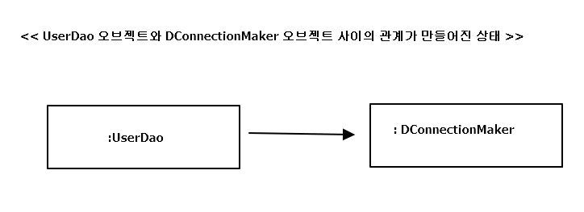
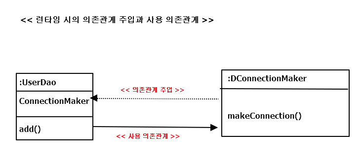
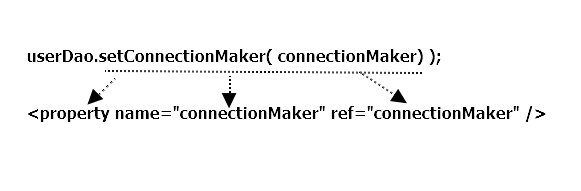

# ch1 오브젝트와의 의존 관계

- <a href="#1.1">1.1 초난감 DAO</a>
- <a href="#1.2">1.2 DAO의 분리</a>
- <a href="#1.3">1.3 DAO의 확장</a>
- <a href="#1.4">1.4 제어의 역전(IoC)</a>
- <a href="#1.5">1.5 스프링의 IoC</a>
- <a href="#1.6">1.6 싱글톤 레지스트리와 오브젝트 스코프 </a>
- <a href="#1.7">1.7 의존관계주입(DI) </a>
- <a href="#1.8">1.8 XML이용한 설정 </a>
- <a href="#1.9">1.9 정리 </a>

## Intro

- 오브젝트 : 오브젝트가 생성되고, 다른 오브젝트와 관계를 맺고, 사용되고 , 소멸 하는 과정 + 어떻게 설계돼고 어떤 단위로 만들어지며 어떤 과정을 통해 존재를 드러내는지
- 디자인 패턴 : 다양한 목적을 위해 재활용 가능한 설계 방법
- 리팩토링 : 좀 더 깔끔한 구조가 되도록 지속적으로 개선해나가는 작업
- 단위 테스트 등등..

*DAO (Data Access Object) : DB를 사용해 데이터를 조회하거나 조작하는 기능을 전담하도록 만든 오브젝트*

### 1.1.1 User

**User.java**
<pre>
public class User {
	String id;
	String name;
	String password;

	public String getId() {
		return id;
	}
	public void setId(String id) {
		this.id = id;
	}
	public String getName() {
		return name;
	}
	public void setName(String name) {
		this.name = name;
	}
	public String getPassword() {
		return password;
	}
	public void setPassword(String password) {
		this.password = password;
	}
}
</pre>

**table.sql**
<pre>
create table users(
	id varchar(10) primary key,
	name varchar(20) not null,
	password varchar(10) not null
);
</pre>

=> 자바 빈 ? 
비주얼 컴포넌트라기보다는 아래와 같은 두 가지 관례를 따라 만들어진 오브젝트를 가리킴  

- 디폴트 생성자 : 툴이나 프레임워크에서 리플렉션을 이용해 오브젝트를 생성하기 때문
- 프로퍼티 : 자바빈이 노출하는 이름을 가진 속성을 프로퍼티 라함. setter, getter 를 통해 수정 또는 조회  

### 1.1.2 UserDao

JDBC를 이용하여 작업의 순서
1. DB 연결을 위한 Connection 가져오기
2. SQL을 담은 Statement(or PreparedStatement)를 만들기
3. 만들어진 Statement 를 실행
4. 조회의 경우 SQL 쿼리의 실행 결과를 ResultSet으로 받아서 정보를 저장할 오브젝트에 옮겨줌
5. 작업 중 생성 된 Connection , Statement , ResultSet 같은 리소스는 작업을 마치고 닫아준다.
6. JDBC API가 만들어내는 예외를 잡아서 직접 처리 , 메소드에 throws를 선언해서 메소드 밖으로 던지기

**UserDao.java**
<pre>
import java.sql.Connection;
import java.sql.DriverManager;
import java.sql.PreparedStatement;
import java.sql.ResultSet;
import java.sql.SQLException;

import springbook.user.domain.User;

public class UserDao {

	public void add(User user) throws ClassNotFoundException, SQLException {
		Class.forName("com.mysql.jdbc.Driver");

		Connection conn = DriverManager.getConnection("jdbc:mysql//localhost/springbook","spring","book");

		PreparedStatement ps = conn.prepareStatement( "insert into users (id,name,password) values(?,?,?)" );
		ps.setString(1, user.getId());
		ps.setString(2, user.getName());
		ps.setString(3, user.getPassword());

		ps.executeUpdate();

		ps.close();
		conn.close();
	}

	public User get(String id) throws ClassNotFoundException, SQLException {
		Class.forName("com.mysql.jdbc.Driver");

		Connection conn = DriverManager.getConnection("jdbc:mysql//localhost/springbook","spring","book");

		PreparedStatement ps = conn.prepareStatement( "select * from users where id = ? " );
		ps.setString(1,id);

		ResultSet rs = ps.executeQuery();
		rs.next();

		User user = new User();
		user.setId(rs.getString("id"));
		user.setName(rs.getString("name"));
		user.setPassword(rs.getString("password"));

		rs.close();
		ps.close();
		conn.close();

		return user;
	}
}
</pre>

### 1.1.3 main() 을 이용한 DAO 테스트 코드

<pre>
	public static void main(String[] args) throws ClassNotFoundException, SQLException {
		UserDao dao = new UserDao();

		User user = new User();
		user.setId("whiteship");
		user.setName("백기선");
		user.setPassword("married");

		dao.add(user);

		System.out.println(user.getId() + " 등록 성공");

		User user2 = dao.get("whiteship");
		System.out.println(user2.getName());
		System.out.println(user2.getPassword());

		System.out.println(user2.getId() + " 조회 성공");

	}
</pre>

**스프링은 단지 좋은 결론을 내릴 수 있도록 객체지향 기술과 자바 개발자의 선구자들이 먼저 고민하고 제안한 방법에 대한 힌트를 제공해줄 뿐이다.**

---

## 1.2 DAO의 분리

### 1.2.1 관심사의 분리

객체 지향 기술은
1. 실세계를 최대한 가깝게 모델링 해낼 수 있기 때문에 의미 있음
2. 객체지향 기술이 만들어내는 가상의 추상세계 자체를 효과적으로 구성할 수 있고,  
이를 자유롭고 편리하게 변경,발전,확장 시킬 수 있는데 의미 가 더큼.
=> 변화의 폭을 최소한으로 줄여주는 것  
=> **분리와 확장**을 고려한 설계!

문제점 : 변화는 대체로 집중된 한 가지 관심에 대해 일어나지만, 그에 따른 작업은 한곳에 집중되지 않는 경우가 많다. 
e.g) DB 접속 암호 변경 -> DAO 클래스 수백개 수정? || 트랜잭션 기술 변경 -> 비즈니스 로직이 담긴 코드 모두 수정??  
=> 변화가 한 번에 한 가지 관심에 집중돼서 일어나면, 준비해야 할 일은 한가지 관심이 한 군데에 집중.  
=> == 관심이 같은 것끼리는 모으고, 관심이 다른 것은 따로 떨어져 있게 하는것  
=> **관심사의 분리 Separation of Concenrns**

### 1.2.2 커넥션 만들기의 추출

#### UserDao의 관심사항
1. DB와 연결을 위한 커넥션을 어떻게 가져올까는 관심( 세분화 하면, 어떤 DB, 어떤 드라이버, 어떤 로그인 정보 등등...)
2. 사용자 등록으리 위한 DB에 보낼 SQL 문장을 담을 Statement를 만들고 실행.
3. 작업이 끝나면, 사용한 리소스인 Statement와 Connection 오브젝트를 닫아줘서 공유 리소스를 시스템에게 돌려 주는 것.

=> 가장 먼저 Connection 오브젝트를 가져오는 부분을 보면, 메소드가 늘어 날 수록 중복코드 계속 증가.

#### 중복 코드의 메소드 추출

**getConnection()) 메소드를 추출해서 중복을 제거한 UserDao**
<pre>
	public User get(String id) throws ClassNotFoundException, SQLException {		
		Connection conn = getConnection();
		...
	}
	public void add(User user) throws ClassNotFoundException, SQLException {
		Connection conn = getConnection();
		...
	}
	private Connection getConnection() throws ClassNotFoundException, SQLException {
		Class.forName("com.mysql.jdbc.Driver");
		Connection c = DriverManager.getConnection("jdbc:mysql://localhost/springbook", "spring","book");
		return c;
	}
</pre>

=> 만약 URL 변경 or 로그인 정보 변경 => getConnection() 한 메소드의 코드만 수정하면 됨.  
=> 관심의 종류에 따라 코드를 구분해놓았기 떄문에 가능!

#### 변경사항에 대한 검증 : 리팩토링과 테스트

=> 이전에 사용했던 main메소드 사용  
=> 위의 작업은 UserDao의 기능에는 아무런 변화X  
=> 여러 메소드에 중복돼서 등장하는 특정 관심사항이 담긴 코드를 별도의 메소드로 분리  
=> 이 작업은 기능에는 영향을 주지 않으면서 코드의 구조만 변경   
=> 코드가 훨씬 깔끔 & 미래의 변화에 좀 더 손쉽게 대응할 수 있는 코드  
=> 리팩토링 (refactoring) ( 메소드 추출(extract method) 기법 ) 

### 1.2.3 DB 커넥션 만들기의 독립

가정 )  
UserDao 를 판매하는 상황 + 구매 업체마다 다른 종류의 DB 사용 + DB 커넥션을 가져오는 데 독자적으로 만든 방법 적용하고 싶음  

#### 상속을 통한 확장

UserDao에서 메소드의 구현 코드 제거 & getConnection()을 추상메소드로 만들기

*상속을 통한 UserDao 확장 방법*

<pre>

public abstract class UserDao {
	public void add(User user) throws ClassNotFoundException, SQLException {
		Connection conn = getConnection();
		...
	}

	public User get(String id) throws ClassNotFoundException, SQLException {		
		Connection conn = getConnection();
		...
	}

	public abstract Connection getConnection() throws ClassNotFoundException, SQLException;
}

public class NUserDao extends UserDao {
	public Connection getConnection() throws ClassNotFoundException, SQLException {
		// N사 DB connection 생성 코드
	}
}

public class DUserDao extends UserDao {
	public Connection getConnection() throws ClassNotFoundException, SQLException {
		// D사 DB connection 생성 코드
	}
}

</pre>

관심사항
- UserDao  
 : 데이터를 등록하고 가져오는 것 ( SQL 작성 ,파라미터 바인딩, 쿼리 실행, 검색정보 전달)
- NUserDao, DUserDao  
 : DB 연결 방법은 어떻게 할 것인가

**템플릿 메소드 패턴(template method pattern)**  
 : 슈퍼 클래스에 기본적인 로직의 흐름을 만들고, 그 기능의 일부를 추상 메소드나 오버라이딩이 가능한 protected 메소드 등으로  
   만든 뒤 서브클래스에서 이런 메소드를 필요에 맞게 구현해서 사용하는 방법  

**팩토리 메소드 패턴(factory method pattern)**  
 : 서브클래스에서 구체적인 오브젝트 생성 방법을 결정 하게 하는 것  
( UserDao의 getConnection() 메소드는 Connection 타입의 오브젝트를 생성한다는 기능을 정의해놓은 추상 메소드  
  & UserDao의 서브클래스의 getConnection() 메소드는 어떤 Connection 클래스의 오브젝트를 어떻게 생성할 것인지를 결정하는 방법 )

*UserDao에 적용된 팩토리 메소드 패턴*

==> 탬플릿 메소드 패턴 or 팩토리 메소드 패턴으로 관심사항이 다른 코드를 분리해내고, 서로 독집적적으로 변경 OR 확장  
할 수 있도록 만드는 것은 간단하면서 매우 효과적!

*여전히 존재하는 문제점*
- 상속을 사용했다는 단점 
 ( 다른 목적을 위해 상속을 사용하거나 등 후ㅠ에 다른 목적으로 UserDao에 상속을 적용하기 힘듬 )
- 상속을 통한 상하위 클래스의 관계는 생각보다 밀접함  
 ( 서브클래스는 슈퍼 클래스의 기능을 직접 사용가능  
   => 슈퍼 클래스 변경? -> 서브 클래스 모두 변경 or 다시 개발  
   => or 위와 같은 변화에 따른 불편을 주지 않기 위해, 슈퍼 클래스의 제약 을 가해야함 )
- 확장 기능(DB 커넥션 생성 코드)를 다른 다른 DAO 클래스에 적용할 수 없음  

---  

## 1.3 DAO의 확장

모든 오브젝트는 변하지만, 다 동일한 방식으로 변하는 건 아님 
=> 관심사에 따라서 분리한 오브젝트들은  제각기 독특한 변화의 특징이 있음 
(데이터 엑세스 로직을 어떻게 만들 것인가와 DB 연결을 어떤 방법을 할 것인가 라는 두 관심을 상하위 클래스로 분리함) 

=> 추상 클래스를 만들고 이를 상속한 서브클래스에서 변화가 필요한 부분만 바꿔서 쓸 수 있게 만든 이유  
 : 변화의 성격이 다른 것을 분리 & 서로 영향을 주지 않은 채, 각각 필요한 시점에 독립적으로 변경할 수 있기 위해서! 
 BUT 여러 단점이 많은 상속이라는 방법을 사용한 것이 불편함.

### 1.3.1 클래스의 분리  

(이전 작업)
- 독립된 메소드를 만들어 분리
- 상하위 클래스로 분리
 

(현 작업)
- 완전히 독립적인 클래스

*UserDao.java*
<pre>
public class UserDao {

	private SimpleConnectionMaker simpleConnectionMaker;

	public UserDao() {
		simpleConnectionMaker = new SimpleConnectionMaker();
	}

	public void add(User user) throws ClassNotFoundException, SQLException {
		Connection conn = simpleConnectionMaker.makeConneection();
		...
	}
	public User get(String id) throws ClassNotFoundException, SQLException {		
		Connection conn = simpleConnectionMaker.makeConneection();
		..
	}
</pre>

*독립시킨 DB 연결 기능인 SimpleConnectionMaker.java*
<pre>
import java.sql.Connection;
import java.sql.DriverManager;
import java.sql.SQLException;

public class SimpleConnectionMaker {

	public Connection makeConneection() throws ClassNotFoundException,SQLException {		
		Class.forName("com.mysql.jdbc.Driver");
		Connection c = DriverManager.getConnection(
						"jdbc:mysql://localhost/springbook", "spring","book");
		return c;
	}
}
</pre>

=> main()을 이용해서 테스트 해보기

*또 다른 문제점 *  
: N 사와 D 사의 UserDao 클래스만 공급하고 상속을 통한 DB 커넥션 기능을 확장해서 사용했던 점

해결해야하는 문제 :
- SimpleConnectionMaker의 메소드 문제  
 : makeNewConnection()을 사용해 DB 커넥션을 가져오는데, 만약 D사가 openConnection() 이라는 메소드를 사용하면,  
   수십, 수백개가 되면 작업 양이 너무 커짐.
- DB 커넥션을 제공하는 클래스가 어떤 것인지를 UserDao가 구체적으로 알고 있어야 함. 

=> UserDao가 바뀔 수 있는 정보 , i.e DB 커넥션을 가져오는 클래스에 대해 너무 많이 알고 있기 때문임. 
(어떤 클래스가 쓰일지, 그 클래스에서 커넥션을 가져오는 메소드는 이름이 뭔지 일일이 알아야함..)

### 1.3.2 인터페이스의 도입
위의 문제를 해결하기 위해, 
두 개의 클래스가 서로 긴밀하게 연결되어 있지 않도록, 중간에 추상적인 느슨한 연결고리를 만들어 주는 것 

**추상화**  
: 어떤 것들의 공통적인 성격을 뽑아내어 이를 따로 분리해내는 작업  
=> 인터페이스

*ConnectionMaker 인터페이스*
<pre>
package springbook.user.dao;

import java.sql.Connection;
import java.sql.SQLException;

public interface ConnectionMaker {
	public Connection makeConnection() throws ClassNotFoundException, SQLException;

}
</pre>

*ConnectionMaker 구현 클래스*
<pre>
package springbook.user.dao;

import java.sql.Connection;
import java.sql.SQLException;

public class DConnectionMaker implements ConnectionMaker {
	@Override
	public Connection makeConnection() throws ClassNotFoundException, SQLException {
		// D 사의 독자적인 방법으로 Connection 을 생성하는 코드..
		return null;
	}
}
</pre>

*UserDao.java*
<pre>
package springbook.user.dao;

import java.sql.Connection;
import java.sql.PreparedStatement;
import java.sql.ResultSet;
import java.sql.SQLException;

import springbook.user.domain.User;

public class UserDao {

	// 인터페이스를 통해 오브젝트에 접근하므로,
	// 구체적인 클래스 정보를 알 필요가 없음
	private ConnectionMaker connectionMaker;

	public UserDao() {
		//아직 까지 클래스 이름이 나옴..;
		connectionMaker = new DConnectionMaker();
	}

	public void add(User user) throws ClassNotFoundException, SQLException {
		// 인터페이스에 정의된 메소드를 사용하므로, 클래스가 바뀐다 해도
		// 메소드 이름이 변경될 걱정은 없음!
		Connection conn = connectionMaker.makeConnection();
		...
	}
	public User get(String id) throws ClassNotFoundException, SQLException {		
		Connection conn = connectionMaker.makeConnection();
		..
	}

</pre>

=> 여전히 문제 ?  
connectionMaker = **new DConnectionMaker();**

### 1.3.3 관계설정 책임의 분리
여전히 UserDao 에는 어떤 ConnectionMaker 구현 클래스를 사용할지를 결정하는 코드가 남아 있다.  
UserDao의 관심사항
- JDBC API와 User 오브젝트를 이용해 DB에 정보를 넣고 빼는 관심 사항 => X
- ConnectionMaker 인터페이스로 대표되는 DB 커넥션을 어떻게 가져올 것인가 라는 관심사항 => X
=> UserDao가 어떤 ConnectionMaker 구현 클래스의 오브젝트를 이용하게 할지 결정하는 것

사용되는 오브젝트를 서비스 / 사용하는 오브젝트를 클라이언트라 할 때,  
클라이언트를 통해 UserDao와 ConnectionMaker 구현 클래스를 분리할 수 있음!  

=> 오브젝트 사이에 런타임 사용관계 또는 링크 , 또는 의존관계라고 불리는 관계를 맺어주는 것  
=> 클라이언트는 UserDao를 사용해야 할 입장이므로, UserDao의 세부 전략이라고 볼 수 있는  
ConnectionMaker 구현 클래스 선택, 선택한 클래스의 오브젝트를 생성해서 UserDao 와 연결

*수정한 생성자 : UserDao.java*
<pre>
	public UserDao(ConnectionMaker connectionMaker) {
		this.connectionMaker = connectionMaker;
	}
</pre>

*관계설정 책임이 추가된 UserDao 클라이언트인 main() 메소드*
<pre>
public class UserDaoTest {

	public static void main(String[] args) throws ClassNotFoundException, SQLException {

		ConnectionMaker connecionMaker = new DConnectionMaker();

		UserDao dao = new UserDao(connecionMaker);
		....
	}
}
</pre>

=> UserDaoTest는 UserDao와 ConnectionMaker 구현 클래스와의 런타임 오브젝트 의존관계를 설정하는 책임을 담당  
=> UserDao에 있으면 안 되는 다른 관심사항, 책임을 클라이언트로 떠넘기는 작업 완료!  

### 1.3.4 원칙과 패턴

**개방 폐쇄 원칙 (Open-Closed Principle)**  
'클래스나 모듈은 확장에는 열려 있어야 하고, 변경에는 닫혀 있어야 한다' 
=> 깔끔한 설계를 위해 적용 가능한 객체지향 설계 원칙 중의 하나  
e.g)  
UserDao는 DB 연결 방법이라는 기능을 확장하는 데는 열려 있음  
UserDao는 자신의 핵심 기능을 구현한 코드는 그런 변화에 영향을 받지 않고 유지할 수 있으므로, 변경에는 닫혀 있음  

**높은 응집도와 낮은 결합도 (high coherence and low coupling)**  
: 응집도가 높다는 것은 하나의 모듈, 클래스가 하나의 책임 또는 관심사에만 집중되어 있다는 뜻  

- 높은 응집도  
 응집도가 높다는 것은 변화가 일어날 때 해당 모듈에서 변하는 부분이 크다는 것으로 설명할 수 있음.  
 처음 초난감DAO 처럼 여러 관심사와 책임이 얽혀 있는 복잡한 코드에서는, 변경이 필요한 부분을 찾기도 어렵고 그렇게  
 변경한 것이 혹시 DAO의 다른 기능에 영향을 줘서 오류를 발생시키지는 않는지도 일일이 확인해야 한다.  
 BUT DB 연결 방식에 변경이 일어난 경우에, 이를 검증하려고 하면 ConnectionMaker 구현 클래스만 테스트 해보는 것으로 충분!

- 낮은 응집도  
 '하나의 오브젝트가 변경이 일어날 때에 관계를 맺고 있는 다른 오브젝트에게 변화를 요구하는 정도' 라고 할 수 있음  
 낮은 결합도는 높은 응지도보다 더 민감한 원칙. 책임과 관심사가 다른 오브젝트 또는 모듈과는 낮은 결합도  
 -> 즉 느슨하게 연결된 형태를 유지하는 것이 바람직하다  
 -> 결합도가 낮아지면, 변화에 대응하는 속도가 높아지고 구성이 깔끔 & 확장하기에도 매우 편리 
 ( 지속해서 변경 한 패턴을 보면, ConnectionMaker 와 UserDao는 인터페이스를 통해 결합도가 낮아짐 )  

**전략 패턴 (Strategy Pattern)**  
 : 자신의 기능 맥락(Context)에서, 필요에 따라 변경이 필요한 알고리즘을 인터페이스를 통해 통째로 외부로 분리시키고,  
   이를 구현한 구체적인 알고리즘 클래스를 필요에 따라 바꿔서 사용할 수 있게 하는 디자인 패턴  
-> 컨텍스트(UserDao)를 사용하는 클라이언트(UserDaoTest)는 컨텍스트가 사용할 전략(ConnectionMaker를 구현한 클래스) 
  을 컨텍스트의 생성자 등을 통해 제공해주는 게 일반적!  

>스프링이란 바로 지금까지 설명한 객체지향적 설계 원칙과 디자인 패턴에 나난 장점을 자연스럽게 개발자들이 활용할 수 있게 해주는 프레임워크

---  

##1.4 제어의 역전(IoC)
:제어의 역전 (IoC, Inversion Of Control)

### 1.4.1 오브젝트 팩토리

문제점  
: UserDaoTest가 ConnectionMaker 구현 클래스를 사용할지 결정하는 기능을 엉겁결에 떠맡음. 
BUT UserDaoTest는 UserDao 기능이 잘 동작하는지를 테스트하려고 만든것. -> 그러므로 이것도 분리 
=> 이렇게 분리될 기능은 UserDao와 ConnectionMaker 구현 클래스의 오브젝트를 만드는 것과 
    그렇게 만들어진 두 오브젝트가 연결돼서 사용할 수 있도록 관계를 맺어주는 것.

#### 팩토리
분리 시킬 기능을 담당할 클래스 하나 만들기 ( 객체의 생성 방법을 결정 & 그렇게 만들어진 오브젝트를 반환 == 팩토리(factory) )  
( 디자인 패턴에서 말하는 추상 팩토리 패턴, 팩토리 메소드 패턴과 다른 개념 )  

*UserDao의 생성 책임을 맡은 팩토리 클래스 : DaoFactory.java*

<pre>
package springbook.user.dao;

public class DaoFactory {
	public UserDao userDao() {
		// 팩토리의 메소드는 UserDao 타입의 오젝트를
		// 어떻게 만들고, 어떻게 준비 시킬지 결정
		ConnectionMaker connectionMaker = new DConnectionMaker();
		UserDao userDao = new UserDao(connectionMaker);
		return userDao;
	}
}
</pre>

*팩토리를 사용하도록 수정한 UserDaoTest*

<pre>
public class UserDaoTest {
	public static void main(String[] args) throws ClassNotFoundException, SQLException {

//		// 변경 전 코드
//		ConnectionMaker connecionMaker = new DConnectionMaker();
//		UserDao dao = new UserDao(connecionMaker);

		//변경 후 코드
		UserDao dao = new DaoFactory().userDao();
</pre>

=> 리팩토링 후 테스트 잊지 말기!!

#### 설계도로서의 팩토리
UserDao , ConnectionMaker : 각각 애플리케이션의 핵심적인 데이터 로직과 기술 로직 담당  
DaoFactory : 이런 애플리케이션의 오브젝트들을 구성하고 그 관계를 정의하는 책임을 맡고 있음  

=> 핵심 기술인 UserDao는 변경이 필요 없으므로, 안전하게 소스코드를 보존 + DB 연결 방식은 자유로운 확장이 가능  
  ( DaoFactory를 수정해서 변경된 클래스를 생성해 설정해주도록 코드를 수정해주면 되므로)  

=>DaoFactory를 분리했을 때 얻을 수 있는 장점 중 , 애플리케이션의 컴포넌트 역할을 하는 오브젝트와  
   애플리케이션의 구조를 결정하는 오브젝트를 분리했다는 데 가장 의미가 있음   

### 1.4.2 오브젝트 팩토리의 활용

*만약 여러 개의 DAO를 생성해야하는 경우 DaoFactory?*  
<pre>
package springbook.user.dao;

public class DaoFactory {
	//ConnectionMaker를 선정하고 생성하는 코드의 중복 발생

	public UserDao userDao() {
		return new UserDao(new DConnectionMaker());
	}

	public AccountDao accountDao() {
		return new AccountDao(new DConnectionMaker());
	}

	public MessageDao messageDao() {
		return new MessageDao(new DConnectionMaker());
	}		
}
</pre>

=> 중복 문제를 해결하려면 분리해내는 게 가장 좋은 방법!  

*생성 오브젝트 코드 수정*
<pre>
package springbook.user.dao;

public class DaoFactory {
	public UserDao userDao() {
		return new UserDao(connectionMaker());
	}

	public AccountDao accountDao() {
		return new AccountDao(connectionMaker());
	}

	public MessageDao messageDao() {
		return new MessageDao(connectionMaker());
	}		

	public ConnectionMaker connectionMaker() {
		// 분리해서 중복을 제거한
		// ConnectionMaker 타입 오브젝트 생성코드
		return new DConnectionMaker();
	}
}
</pre>

### 1.4.3 제어권의 이전을 통한 제어관계 역전

제어의 역전 ? 간단히 프로그램의 제어 흐름 구조가 뒤바뀌는 것  

일반적인 흐름 :
main() 메소드와 같이 프로그램의 시작 지점 -> 다음에 사용할 오브젝트를 결정 -> 결정한 오브젝트 생성  
-> 만들어진 오브젝트에 있는 메소드 호출 -> ...

제어의 역전 :
이런 제어 흐름의 개념을 거꾸로 뒤집는 것(제어의 역전에서는 오브젝트가 자신이 사용할 오브젝트를 스스로 선택 X)  
-> 모든 제어 권한을 자신이 아닌 다른 대상에게 위임  
e.g)
- 서블릿 , EJB 등
- 처음 구현했던 템플릿 메소드 패턴에서 슈퍼 클래스가 결정하는 것

*라이브러리 vs 프레임워크*  
- 라이브러리  
  : 라이브러리를 사용하는 애플리케이션 코드는 애플리케이션 흐름을 직접 제어 한다. 
    ( 단지 동작하는 중에 필요한 기능이 있을 때 능동적으로 라이브러리를 사용)
- 프레임워크  
  : 거꾸로 애플리케이션 코드가 프레임워크에 의해 사용된다.  
    ( 보통 프레임워크 위에 개발한 클래스를 등록해두고, 프레임워크가 흐름을 주도하는 중에, 개발자가 만든 애플리케이션  
       코드를 사용하도록 만드는 방식 )

제어의 역전에서는 프레임워크 or 컨테이너와 같이 애플리케이션 컴포넌트의 생성과 관계설정, 사용, 생명주기 관리 등을  
관장하는 존재가 필요하다.  
DaoFactory는 오브젝트 수준의 가장 단순한 IoC 컨테이너 or IoC 프레임워크라 불릴 수 있다. 

> 스프링은 IoC를 모든 기능의 기초가 되는 기반 기술로 삼고 있으며, IoC를 극한까지 적용하고 있는 프레임워크           

---  

## 1.5 스프링의 IoC

### 1.5.1 오브젝트 팩토리를 이용한 스프링 IoC

**애플리케이션 컨텍스트와 설정정보** 
빈(bean) : in spring, 스프링이 제어권을 가지고 직접 만들고 관계를 부여하는 오브젝트  
           == 스프링 컨테이너가 생성과 관계설정, 사용 등을 제어해주는 제어의 역전이 적용 된 오브젝트

=> 빈의 생성과 관계설정 같은 제어를 담당하는 IoC 오브젝트  
== 빈 팩토리(bean factory) 
== (이를 확장 한) 애플리케이션 컨텍스트 (application context)  
=>그림 1.8의 설계도라는 것이 애플리케이션 컨텍스트와 그 설정정보를 말한다고 봐도 됨  
=> 그 자체로는 애플리케이션 로직을 담당하지는 않지만  
  IoC 방식을 이용해 컴포넌트 생성 & 사용할 관계를 맺어주는 등의 책임

**DaoFactory를 사용하는 애플리케이션 컨텍스트**  
; DaoFactory를 스프링의 빈 팩토리가 사용할 수 있는 설정정보로 만들기  

*애노테이션이 적용 된 DaoFactory ( == XML 과 같은 스프링 전용 설정정보 )*
<pre>
package springbook.user.dao;

import org.springframework.context.annotation.Bean;
import org.springframework.context.annotation.Configuration;

//스프링 빈 팩토리를 위한 오브젝트 설정을
//담당하는 클래스라고 인식할 수 있도록 => @Configuration
@Configuration
public class DaoFactory {

	//오브젝트 생성을 담당하는 IoC 용 메소드라는 표시
	@Bean
	public UserDao userDao() {
		return new UserDao(connectionMaker());
	}

	@Bean
	public ConnectionMaker connectionMaker() {
		// 분리해서 중복을 제거한
		// ConnectionMaker 타입 오브젝트 생성코드
		return new DConnectionMaker();
	}
}
</pre>

*애플리케이션 컨텍스트를 적용한 UserDaoTest*
<pre>
import java.sql.SQLException;

import org.springframework.context.ApplicationContext;
import org.springframework.context.annotation.AnnotationConfigApplicationContext;

import springbook.user.domain.User;

public class UserDaoTest {

	public static void main(String[] args) throws ClassNotFoundException, SQLException {

		ApplicationContext context =
				new AnnotationConfigApplicationContext(DaoFactory.class);

		// DaoFactory의 메소드 이름 == 빈 이름
		UserDao dao = context.getBean("userDao",UserDao.class);

		User user = new User();
		user.setId("whiteship");
		user.setName("백기선");
		user.setPassword("married");

		dao.add(user);

		System.out.println(user.getId() + "등록 성공");

		User user2 = dao.get( user.getId() );
		System.out.println(user2.getName());
		System.out.println(user2.getPassword());

		System.out.println(user2.getId() + "조회 성공");
	}
}
</pre>

위 코드만 보면 DaoFactory를 직접 이용하는 것보다 번거로워 보이나 ,  
스프링은 DaoFactory를 통해서는 얻을 수 없는 방대한 기능과 활용 방법을 제공

### 1.5.2 애플리케이션 컨텍스트의 동작방식

- DaoFactory  
  : UserDao를 비롯한 DAO 오브젝트를 생성하고 DB 생성 오브젝트와 관계를 맺어주는 제한적인 역할 담당  
    ( @Configuration이 붙으므로 애플리케이션 컨텍스트가 활용하는 IoC 설정 정보 )
- 애플리케이션 컨텍스트  
  : 애플리케이션에서 IoC를 적용해서 관리할 모든 오브젝트에 대한 생성과 관계설정을 담당  
    ( 대신 ApplicationContext에는 DaoFactory와 달리 직접 오브젝트 생성 및 관계를 맺는 코드가 없음 )

*DaoFactory를 오브젝트 팩토리로 직접 사용하는 것과 비교해서 애플리케이션 컨텍스트를 사용함으로써의 장점?*  

- 클라이언트는 구체적인 팩토리 클래스를 알 필요가 없다.  
  -> 애플리케이션이 발전하면, DaoFactory 처럼 IoC를 적용한 오브젝트 계속 추가 됨  
  -> 클라이언트가 필요한 오브젝트를 가져오려면 어떤 팩토리 클래스를 사용해야 할 지 알아야 함  
	<pre>+ 필요할 때마다 팩토리 오브젝트를 생성해야 하는 번거로움<pre> 
  => 애플리케이션 컨텍스트를 사용하면, 이를 알아야 하거나 직접 사용할 필요가 없음  
  => + 일관된 방식으로 원하는 오브젝트를 가져올 수 있음  
  => DaoFactory 처럼 자바 코드를 작성하는 대신 XML 처럼 단순한 방법을 사용해 IoC 설정 정보를 만들 수 있음

- 애플리케이션 컨텍스트는 종합 IoC 서비스를 제공해준다.  
  => 애플리케이션 컨텍스트의 역할은 단지 오브젝트 생성과 다른 오브젝트의 관계설정만이 전부가 아님  
  => 오브젝트가 만들어지는 방식, 시점과 전략을 다르게 가져갈 수 있음  
  => 부가적으로 자동생성, 오브젝트에 대한 후처리, 정보의 조합, 설정 방식의 다변화, 인터셉팅 등 다기능 제공  
  => 빈이 사용할 수 있는 기반기술 서비스 or 외부 시스템과의 연동 등을 컨테이너 차원에서 제공해주기도 함  

- 애플리케이션 컨텍스트는 빈을 검색하는 다양한 방법을 제공한다.
  => 애플리케이션 컨텍스트의 getBean() 메소드는 빈의 이름을 이용해 빈을 찾아줌  
  => 타입만으로 빈 검색 or 특별한 애노테이션 설정이 되어 있는 빈을 찾을 수도 있음

### 1.5.3 스프링 IoC의 용어 정리

- 빈 (bean)  
: 스프링이 IoC 방식으로 관리하는 오브젝트 ( == 관리되는 오브젝트(managed object) )  
스프링을 사용하는 애플리케이션에서 만들어지는 모든 오브젝트가 빈이 아니라, 
 그 중 스프릉이 직접 생성과 제어를 담당하는 오브젝트만을 빈이라 부름  

- 빈 팩토리 (bean factory)  
: 스프링의 IoC를 담당하는 핵심 컨테이너  
빈을 등록 / 생성 / 조회 / 돌려주고 / 그 외 부가적인 빈을 관리하는 기능  
보통은 빈 팩토리를 바로 사용하지 않고 이를 확장한 애플리케이션 컨텍스트를 이용  
BeanFactory라고 붙여쓰면 빈 팩토리가 구현하고 있는 가장 기본적인 인터페이스의 이름이 됨  
( 이 인터페이스에 getBean()과 같은 메소드가 정의 )

- 애플리케이션 컨텍스트 (application context)  
: 빈 팩토리를 확장 한 IoC 컨테이너 ( 빈을 등록하고 관리하는 기본적인 기능은 빈 팩토리와 동일 ) 
여기에 스프링이 제공하는 각종 부가 서비스를 추가로 제공하는 것  
( 빈 팩토리 : 주로 빈의 생성과 제어의 관점에서 이야기 하는 것  
  애플리케이션 컨텍스트 : 스프링이 제공하는 애플리케이션 지원 기능을 모두 포함해서 이야기 하는 것 ) 
ApplicationContext는 BeanFactory를 상속

- 설정정보/설정 메타정보 (configuration metadata)  
: 애플리케이션 컨테스트 or 빈 팩토리가 IoC를 적용하기 위해 사용하는 메타 정보  
( 'configuration' == 구성정보 or 형상정보 )  
스프링의 설정정보는 컨테이너에 어떤 기능을 세팅하거나 조정하는 경우에도 사용하지만,  
그보다는 IoC 컨테이너에 의해 관리되는 애플리케이션 오브젝트를 생성하고 구성할 때 사용  
== 애플리케이션의 형상정보 or 애플리케이션의 전체 그림이 그려진 청사진(blueprints) 라고도 함

- 컨테이너 (container) OR IoC 컨테이너  
: IoC 방식으로 빈을 관리한다는 의미에서, 애플리케이션 컨텍스트나 빈 팩토리를 컨테이너 or IoC 컨테이너라 함  

- 스프링 프레임 워크  
: IoC 컨테이너, 애플리케이션 컨텍스트를 포함해서 스프링이 제공하는 모든 기능을 통들어 말할 때

---  

## 1.6.싱글톤 레지스트리와 오브젝트 스코프

DaoFactory를 직접 사용하는 것과 @Configuration 애노테이션을 추가해서 스프링의 애플리케이션 컨텍스트를 통해  
사용하는 것은 테스트 결과만 보자면 동일한 것 같음  

*스프링 애플리케이션 컨텍스트는 기존에 직접 만든 오브젝트 팩토리와는 중요한 차이가 존재*

**오브젝트의 동일성과 동등성** 
동일성(identity) vs 동등성(equality)  

*직접 생성한 DaoFactory 오브젝트 출력 코드*
<pre>
	DaoFactory factory = new DaoFactory();
	UserDao dao1 = factory.userDao();
	UserDao dao2 = factory.userDao();

	System.out.println(dao1);
	System.out.println(dao2);
</pre>
=>다른 주소값이 나옴

*스프링 컨텍스트로부터 가져온 오브젝트 출력 코드*
<pre>
	ApplicationContext context =
			new AnnotationConfigApplicationContext(DaoFactory.class);

	UserDao dao3 = context.getBean("userDao",UserDao.class);
	UserDao dao4 = context.getBean("userDao",UserDao.class);

	System.out.println(dao3);
	System.out.println(dao4);
</pre>
=> 같은 주소 값 나옴

### 1.6.1 싱글톤 레지스트리로서의 애플리케이션 컨텍스트
: 애플리케이션 컨텍스트 DaoFactory와 비슷한 방식으로 동작하는 IoC 컨테이너  
 (+)싱글톤을 저장하고 관리하는 싱글톤 레지스트리(singleton registry)  

**서버 애플리케이션과 싱글톤**

*왜 스프링은 싱글톤으로 빈을 생성 ?* 
=> 스프링이 주로 적용되는 대상이 자바 엔터프라이즈 기술을 사용하는 환경이기 때문  

스프링이 처음 설계됐던 대규모의 엔터프라이즈 서버환경은 
-> 서버 하나당 최대로 초당 수십~수백번 씩 브라우저나 여타 시스템으로부터 요청을 받아 처리할 수 있는 높은 성능 요구
-> 하나의 요청을 처리하기 위해 데이터 엑세스 로직, 서비스 로직, 비즈니스 로직, 프레젠테이션 로직 등의 다양한 기능을  
담당하는 오브젝트들이 참여하는 계층형 구조로 이뤄진 경우가 대부분
-> 매 요청마다 새로운 오브젝트가 생성되면, 아무리 성능이 좋아져도 부하가 걸리면 서버가 감당하기 힘듬  
-> 엔터프라이즈 분야에서는 서비스 오브젝트라는 개념을 일찍부터 사용 ( e.g 서블릿 )  

**싱글톤 패턴의 한계**

자바의 싱글톤 구현 방법은 보통 아래와 같음  

- 클래스 밖에서는 오브젝트를 생성하지 못하도록 생성자를 private
- 생성된 싱글톤 오브젝트를 저장할 수 있는 자신과 같은 타입의 스태틱 필드 정의
- 스태틱 팩토리 메소드인 getInstance()를 만들고 이 메소드가 최초로 호출되는 시점에서 한번만 오브젝트가 만들어지게 됨  
  생성 된 오브젝트는 스태틱 필드에 저장 OR 스태틱 필드의 초기값으로 오브젝트를 미리 만듬
- 한번 오브젝트(싱글톤)가 만들어지고 난 후에는 getInstance() 메소드를 통해 이미 만들어져 스태틱 필드에 저장해둔  
  오브젝트를 넘김

*싱글톤 패턴을 적용한 UserDao*  
<pre>
public class UserDao {
	private static UserDao INSTANCE;
	private UserDao(ConnectionMaker connectionMaker) {
		this.connectionMaker = ConnectionFeatureNotAvailableException;
	}
	public static synchronized UserDao getInstance() {
		if( INSTANCE == null )
			INSTANCE = new UserDao(???);
		return INSTANCE;
	}
</pre>

<b> 싱글톤 패턴의 문제점 </b>
- private 생성자를 갖고 있기 때문에 상속할 수 없다.  
  -> private를 가진 클래스는 다른 생성자가 없다면, 상속이 불가능  
  -> 객체지향의 장점인 상속과 이를 이용한 다형성을 적용할 수 없음  

- 싱글톤은 테스트하기가 힘들다.  
  -> 테스트 어렵거나, 테스트 방법에 따라 아예 테스트가 불가능  
     ( 만들어지는 방식이 제한적이기 때문에 테스트에서 사용될 때 목 오브젝트 등으로 대체하기 힘듬 )  
  -> 초기화 과정에서 생성자 등을 통해 사용할 오브젝트를 다이내믹하게 주입하기 힘들기 때문에  
     필요한 오브젝트는 직접 오브젝트를 만들어 사용할 수 밖에 없음  

- 서버환경에서는 싱글톤이 하나만 만들어지는 것을 보장하지 못한다.  
  -> 서버에서 클래스 로더를 어떻게 구성하고 있느냐에 따라 싱글톤 클래스임에도 하나 이상의 오브젝트가 만들어질 수 있음  
  -> 자바 언어를 이용한 싱글톤 패턴 기법은 서버환경에서는 싱글톤이 꼭 보장된다고 볼 수 없음  
  -> 여러 개의 JVM에 분산돼서 설치가 되는 경우에도 각각 독립적으로 오브젝트가 생기기 때문 싱글톤으로서의 가치 떨어짐

- 싱글톤의 사용은 전역 상태를 만들 수 있기 때문에 바람직하지 못하다.  
  -> 싱글톤은 사용하는 클라이언트가 정해져 있지 않음  
  -> 언제든지 싱글톤에 쉽게 접근할 수 있기 때문에 애플리케이션 어디서든지 사용될 수 있어  
        자연스럽게 전역 상태(global state)로 사용되기 쉬움  
  -> 아무 객체나 자유롭게 접근하고 수정하고 공유할 수 있는 전역 상태를 갖는 것은 객체지향 프로그래밍에서 권장 X  

**싱글톤 레지스트리 (singleton registry)**  
: 스프링은 서버환경에서 싱글톤이 만들어져 서비스 오브젝트 방식으로 사용되는 것은 적극 지지  
-> 자바의 기본적인 싱글톤 패턴의 구현 방식에는 여러 단점 존재 
-> 스프링은 직접 싱글톤 형태의 오브젝트를 만들고 관리하는 기능을 제공 == singleton registry  
=> 평범한 클래스를 IoC방식의 컨테이너를 사용해 생성과 관계 설정, 사용 등에 관한 제어권을 컨테이너 에게 넘기면  
     싱글톤 방식으로 만들어져 관리되게 할 수 있음  
=> 스프링은 IoC 컨테이너 뿐만 아니라 싱글톤을 만들고 관리해주는 싱글톤 레지스트리  

### 1.6.2 싱글톤과 오브젝트의 상태
-> 싱글톤은 멀티스레드 환경이라면 여러 스레드가 동시에 접근해서 사용 가능  
-> 상태 관리에 주의를 기울여야 함  

기본적으로 싱글톤이 멀티스레드 환경에서 서비스 형태의 오브젝트로 사용되는 경우  
=> 상태정보를 내부에 갖고 있지 않은 무상태(stateless) 방식으로 만들어져야 함

*인스턴스 변수를 사용하도록 수정한 UserDao*
<pre>
public class UserDao {
	// 초기에 설정하면 사용 중에는 바뀌지 않는 읽기전용 인스턴스 변수
	private ConnectionMaker connectionMaker;

	// 매번 새로운 값으로 바뀌는 정보를 담은 인스턴스 변수
	// -> 심각한 문제 발생
	private Connection c;
	private User user;
	...

	public User get(String id) throws ClassNotFoundException, SQLException {
		this.c = connectionMaker.makeConnection();
		...
		this.user = new User();
		this.user.setId( rs.getString("id") );
		this.user.setName( rs.getString("name"));
		...
		return this.user;
	}
}
</pre>

=> 멤버필드는 멀티스레드 환경에서 공유하므로 , 쓰레드에 안전하지 않음  
=> 개별적으로 바뀌는 정보는 로컬 변수로 정의 or 파라미터로 주고받으면서 사용해야 함  
=> connectionMaker 는 읽기전용이므로, 사용해도 상관 X  

### 1.6.3 스프링 빈의 스코프
: 스코프(scope) - 스프링이 관리하는 오브젝트, 즉 빈이 생성되고, 존재하고, 적용되는 범위  

- 싱글톤 스코프 (singleton scope)  
  : 컨테이너 내에 한 개의 오브젝트만 만들어짐

- 프로토타입 스코프 (prototype scope)  
  : 컨테이너에 빈을 요청할 때마다 매번 새로운 오브젝트를 만듬

- 요청 스코프 (request scope)  
  : 웹을 통해 새로운 HTTP 요청이 생길 때 마다 생성

- 세션 스코프(session scope)

자세한 건 10장에서..

---  

## 1.7 의존관계 주입(DI)

### 1.7.1 제어의 역전(IoC)과 의존관계 주입
; IoC는 소프트웨어에서 자주 발견하는 개념  
스프링의 IoC는 조금 포괄적임 
- 서버에서 동작하는 서비스 컨테이너(like Servlet) ?
- IoC 개념이 적용된 탬플릿 메소드 패턴을 이용해 만든 프레임워크 ?
- 또 다른 IoC 특징을 지닌 기술이라는 것?

=> 스프링이 제공하는 IoC 방식을 핵심을 직업주는  
=> *"의존관계 주입(Dependency Injection)* 사용하기 시작  
=> 의존관계 주입 컨테이너, DI 컨테이너

### 1.7.2 런타임 의존관계 설정

**의존관계** 

두 개의 클래스 or 모듈이 의존관계에 있을 때  
=> 방향성을 부여해줘야 함  
( UML 에서는 위의 그림과 같이 두 클래스의  
의존관계(dependency relationship)를 점선으로 된  
화살표로 나타냄 )

=> 의존한다 == 의존대상(B)이 변하면 A에 영향을 미침  
e.g)  
A가 B를 사용하는 경우(==사용에 대한 의존관계),

B의 메소드가 변경되면 A도 그에 따라서 변경

단, B는 A의 변화에 영향을 받지 않음

**UserDao의 의존관계**

UserDao 가 ConnectionMaker에 의존하고 있는 형태

-> ConnectionMaker 인터페이스가 변하면 그 영향을 UserDao가 직접 받음

-> BUT ConnectionMaker를 구현한 DConnectionMaker의 변화는

UserDao는 영향이 없음  

=> 인터페이스에 대해서만 의존관계를 만들어 주면, 인터페이스 구현 클래스와의 관계는

느슨해지면서 변화에 영향을 덜 받는 상태 == 결합도가 낮다

모델이나 코드에서 클래스와 인터페이스를 통해 드러나는 의존관계 말고

런타임시에 오브젝트 사이에서 만들어지는 의존관계도 존재

=> 프로그램이 시작되고 UserDao 오브젝트가 만들어지고 나서 런타임 시에

의존관계를 맺는 대상, 즉 실제 사용대상인 오브젝트 == *의존 오브젝트 (dependent object)*

( 의존관계 주입은 구체적인 의존 오브젝트와 그것을 사용할 주체, 보통 클라이언트라 부르는

오브젝트를 런타임 시에 연결해주는 작업을 말함. )

Summary

- 클래스 모델이나 코드에는 런타임 시점의 의존관계가 드러나지 않는다  
   그러기 위해서는 인터페이스만 의존하고 있어야 한다.
- 런타임 시점의 의존관계는 컨테이너나 팩토리 같은 제3의 존재가 결정
- 의존관계는 사용할 오브젝트에 대한 레퍼런스를 외부에서 제공(주입)해줌으로써 만들어 짐

의존관계 주입의 핵심은 설계 시점에는 알지 못했던 두 오브젝트의 관계를 맺도록 도와주는 제3의 존재가 있음

( DI에서 말하는 제3의 존재는 관계설정 책임을 가진 코드를 분리해서 만들어진 오브젝트라 볼 수 있음 )

=> 스프링 애플리케이션 컨텍스트, 빈 팩토리, IoC 컨테이너 등이 모두 외부에서

오브젝트 사이의 런타임 관계를 맺어주는 책임을 지닌 제3의 존재라고 볼 수 있음

**UserDao의 의존관계 주입**

*관계설정 책임 분리 전의 UserDao 생성자*
<pre>
public UserDao() {
	connectionMaker = new DConnectionMaker();
}
</pre>

=> UserDao는 이미 설계 시점에서 DConnectionMaker라는 구체적인

클래스 존재를 알고 있음 i.e ConnectionMaker 인터페이스 관계뿐

아니라 런타임 의존관계 (DConnectionMaker)를 사용하겠다는 것까지

UserDao가 결정하고 관리하고 있는 셈

문제 : 런타임 시의 의존관계가 코드 속에 다 미리 결정되어 있음

=> IoC 방식을 써서 런타임 의존관계를 드러내는 코드 제거 &

제 3의 존재에 런타임 의존관계 결정 권한을 위임

=> DaoFactory

( 런타임 시점에 UserDao가 사용할 ConnectionMaker 타입의 오브젝트를 결정 &

이를 생성한 후에 UserDao의 생성자 파라미터로 주입 &

UserDao가 DConnectionMaker의 오브젝트와 런타임 의존관계를 맺게 해줌

=> 런타임 시점의 의존관계를 결정하고 만들기 위해 제3의 존재 == DaoFactory )

DI 는 자신이 사용할 오브젝트에 대한 선택과 생성 제어권을 외부로 넘기고

자신은 수동적으로 주입받은 오브젝트를 사용한다는 점에서 IoC 개념에 잘 맞음

*스프링 컨테이너의 IoC는 주로 의존관계 주입 또는 DI라는 데 초점이 맞춰져 있음*

*=> IoC 컨테이너 || DI 컨테이너 || DI 프레임워크라 부름*

### 1.7.3 의존관계 검색과 주입
; 스프링이 제공하는 IoC 방법에는 의존관계 주입만 있는 것이 아님

=> 의존관계를 맺는 방법이 외부로 부터의 주입이 아니라 스스로 검색을 이용하기 때문에,

의존관계 검색(dependency lookup)이라고 불리는 것도 존재

*DaoFactory를 이용하는 생성자*
<pre>
public UserDao() {
	DaoFactory daoFactory = new DaoFactory();
	this.connectionMaker = daofactory.connectionMaker();
</pre>

DaoFactory가 IoC 컨테이너라고 하면

UserDao는 여전히 자신이 어떤 ConnectionMaker 오브젝트를 사용할 지 미리 알지 못함

( 코드의 의존대상은 ConnectionMaker 인터페이스 뿐)

또한, 런타임 시에 DaoFacotyr가 만들어서 돌려주는 오브젝트와 다이내믹하게

런타임 의존관계를 맺으므로 IoC 개념을 잘 따르고 있음

BUT 적용 방법은 외부로부터의 주입이 아니라, 스스로 IoC 컨테이너인 DaoFactory에게 요청

일반화한 스프링의 애플리케이션 컨텍스트라면, 미리 정해놓은 이름을 전달해서 그 이름에

해당하는 오브젝트를 찾아므로 일종의 검색 == 의존관계 검색

=> 스프링의 IoC 컨테이너인 애플리케이션 컨텍스트는 getBean()이라는 메소드 제공

*의존관계 검색을 이용하는 UserDao 생성자*
<pre>
public UserDao() {
	AnnotationConfigApplicationContext context =
		new AnnotationConfigApplicationContext(DaoFactory.class);
	this.connectionMaker = context.getBean("connectionMaker", ConnectionMaker.class);		
</pre>

=> UserDao는 사용자에 대한 DB 정보를 어떻게 가져와야하는 것인가에 집중해야하므로

의존관계 검색( 스프링 API , 오브젝트 팩토리 클래스 등의 코드가 등장하므로) 보다

의존관계 주입이 훨씬 단순하고 깔끔함

*의존관계 검색이 필요한 경우 ?*

=> 애플리케이션의 기동시점에서 적어도 한 번은 의존관계 검색 방식을 사용해

오브젝트를 가져와야 함 ( e.g UserDaoTest )

( static 메소드인 main() 에서는 DI를 이용해 오브젝트를 주입받을 방법이 없으므로 )

(in Server) 서블릿에서 스프링 컨테이너에 담긴 오브젝트를 사용하려면 한 번은 의존관계

검색 방식을 사용해 오브젝트를 가져와야 함 ( 직접 구현 하지는 않지만,)

*의존관계 검색 vs 의존관계 주입의 중요한 차이점 ?*

- 의존관계 검색

=> 검색하는 오브젝트는 자신이 스프링의 빈일 필요가 없음

e.g) UserDao에 getBean()을 사용한 경우, UserDao는 굳이 스플링이 만들고

관리하는 빈일 필요가 없음. 그냥 어디가에서 직접 new 연산자를 통해 사용해도 됨

(ConnectionMaker만 스프링의 빈이기만 하면 됨)

- 의존관계 주입

=> UserDao --> ConnectionMaker 사이에 DI가 적용되려면, UserDao도 반드시

컨테이너가 만드는 빈 오브젝트여야 한다.

( 컨테이너가 UserDao에 ConnectionMaker 오브젝트를 주입해주려면 UserDao에 대한

생성과 초기화 권한을 갖고 있어야 하려면, UserDao는 IoC 방식으로 컨테이너에서 생성

되는 오브젝트, 즉 빈이어야 하기 때문 )

### 1.7.4 의존관계 주입의 응용

*DI 기술 ( 런타임 시에 사용 의존관계를 맺을 오브젝트를 주입 ) 의 장점 ?*

- 코드에는 런타임 클래스에 대한 의존관계가 나타지 않고
- 인터페이스를 통해 결합도가 낮은 코드를 만들고
- 다른 책임을 가진 사용 의존관계에 있는 대상이 변경되어도 자신은 영향 X
- 변경을 통한 다양한 확장 방법에는 자유로움
- 그 외에도 스프링이 제공하는 기능의 대부분이 DI 의 혜택을 이용하고 있음

**기능 구현의 교환**

가정 :  
실제 운영 시 사용할 데이터베이스는 매우 중요한 자원이므로, 평상시에도 항상 부하를 많이 받고 있음

개발 중에는 절대 사용하지 말아야 하므로, 로컬 DB로 사용 & 개발 후 배포 하는 상황   

DI 방식을 적용하지 않았다고 가정

-> 로컬 DB에 연결 기능이 있는 LocalDBConntionMaker 만들고, 모든 DAO에서

이 클래스의 오브젝트를 매번 생성해서 사용하다가 서버에 배포 시

ProductionDBConnectionMaker라는 클래스로 변경 해야 한다면?

-> DAO가 100개라면 최소한 100군데 코드를 수정해야 함. 하나라도 빼 먹으면 오류가 발생

-> 다시 Local로 사용하려면, 또 수정..

DI를 적용하면 ?

-> 모든 DAO는 생성 시점에 ConnectionMaker 타입의 오브젝트를 컨테이너로부터 제공 받는다.

*개발용 ConnectionMaker 생성 코드*

<pre>
@Bean
public ConnectionMaker connectionMaker() {
	return new LocalDBConnectionMaker();
}
</pre>

*운영용 ConnectionMaker 생성 코드*

<pre>
@Bean
public ConnectionMaker connectionMaker() {
	return new ProductionDBConnectionMaker();
}
</pre>

=> 개발환경과 운영환경에서 DI의 설정정보에 해당하는 DaoFactory만 다르게 만들어 두면

나머지 코드에는 전혀 손대지 않고 개발 시와 운영 시에 각각 다른 런타임 오브젝트에 의존관계를 갖게 해줘서 문제 해결 가능!

추가적으로, 다른 팀이 테스트용의 별도의 테스트 DB를 만들어서 개발한 코드를 쓸 때도 DAO를 손댈 필요 X

**부가기능 추가**

가정 :

DAO가 DB를 얼마나 많이 연결해서 사용하는지 파악

-> 모든 DAO의 makeConnection()에 코드 추가해야 함

-> 노가다 일 뿐만 아니라, DB의 연결횟수를 세는 일은 DAO의 관심사항도 아님

==> DI 컨테이너라면, DAO와  DB 커넥션을 만드는 오브젝트 사이에

연결횟수를 카운팅하는 오브젝트를 하나 더 추가해주면 간편히 해결

*연결횟수 카운팅 기능이 있는 클래스*
<pre>
import java.sql.Connection;
import java.sql.SQLException;

//자신의 관심사인 DB 연결 횟수 카운팅 작업
public class CountingConnectionMaker implements ConnectionMaker {

	int counter = 0;
	private ConnectionMaker realConnectionMaker;

	// DI 받음
	public CountingConnectionMaker(ConnectionMaker realConnectionMaker) {
		this.realConnectionMaker = realConnectionMaker;
	}

	@Override
	public Connection makeConnection() throws ClassNotFoundException, SQLException {
		this.counter++;
		return realConnectionMaker.makeConnection();
	}

	public int getCounter() {
		return this.counter;
	}
}
</pre>

*CountingConnectionMaker 의존관계가 추가된 DI 설정용 클래스*
<pre>
import org.springframework.context.annotation.Bean;
import org.springframework.context.annotation.Configuration;

@Configuration
public class CountingDaoFactory {
	@Bean
	public UserDao userDao() {
		return new UserDao(connectionMaker());
	}

	@Bean
	public ConnectionMaker connectionMaker() {
		return new CountingConnectionMaker( realConnectionMaker() );
	}

	@Bean
	public ConnectionMaker realConnectionMaker() {
		return new DConnectionMaker();
	}
}
</pre>

*CountingConnectionMaker에 대한 테스트 클래스*
<pre>
import java.sql.SQLException;

import org.springframework.context.annotation.AnnotationConfigApplicationContext;

public class UserDaoConnectionCountingTest {

	public static void main(String[] args) throws ClassNotFoundException, SQLException {
		AnnotationConfigApplicationContext context =
				new AnnotationConfigApplicationContext( CountingDaoFactory.class );

		UserDao dao = context.getBean("userDao",UserDao.class);

		/*
		 * DAO 사용 코드
		 */
		CountingConnectionMaker ccm = context.getBean("connectionMaker",CountingConnectionMaker.class);
		System.out.println("Connection counter : " + ccm.getCounter() );		
	}

}
</pre>

=> DI의 장점은 관심사의 분리(SoC)를 통해 얻어지는 높은 응집도에서 나옴

=> 모든 DAO가 의존해서 사용할 ConnectionMaker 타입의 오브젝트는 connectionMaker()에서 만듬

=> CountingConnectionMaker의 의존관계를 추가하려면, 이 메소드만 수정하면 끝

=> 또한, CountingConnectionMaker를 이용한 분석 작업이 모두 끝나면, 다시

CountingDaoFactory 설정 클래스를 DaoFactory로 변경 or connectionMaker() 메소드를 수정

하는 것만으로 DAO의 런타임 의존관계는 이전상태로 복구!!

> 스프링은 DI를 편하게 사용할 수 있도록 도와주는 도구이면서 그 자체로 DI를 적극 활용한 프레임 워크 이기도 함

### 1.7.5 메소드를 이용한 의존관계 주입
지금까지 UserDao의 의존관계 주입을 위해 생성자를 사용했지만, 일반 메소드를 이용하는 방법은

아래와 같음

- 수정자 메소드를 이용한 주입  
수정자(Setter) 메소드는 외부에서 오브젝트 내부의 애트리뷰트 값을 변경하려는 용도로 주로 사용  
- 일반 메소드를 이요한 주입  
여러 개의 파라미터를 갖는 일반 메소드를 DI용으로 사용할 수도 있음  
(한번에 모든 필요한 파라미터를 다 받아야 하는 생서자 보다 나음)  

*수정자 메소드 DI 방식을 사용한 UserDao*
<pre>
public class UserDao {

	private ConnectionMaker connectionMaker;

	public void setConnectionMaker(ConnectionMaker connectionMaker) {
		this.connectionMaker = connectionMaker;
	}
	....
}
</pre>

*수정자 메소드 DI를 사용하는 팩토리 메소드*
<pre>
	@Bean
	public UserDao userDao() {
		UserDao userDao = new UserDao();
		userDao.setConnectionMaker( connectionMaker() );
		return userDao;
	}
</pre>

---  

## 1.8 XML을 이용한 설정

*DaoFactory*
-> DI의 동작원리를 잘 활용한 독립적인 오브젝트 팩토리로 시작

-> DI 컨테이너 도입 후 애노테이션을 추가해서 DI 작업에 참고하는 이롲ㅇ의 참고정보로 사용

-> 본격적인 범용 DI 컨테이너를 사용하면서, 오브젝트 사이의 의존 정보는 일일이 자바 코드로 만들어 주려면 번거로움

### 1.8.1 XML 설정
; 스프링의 애플리케이션 컨텍스트는 XML에 담긴 DI 정보를 활용할 수 있음

DI 정보가 담긴 XML 파일은 <beans>를 루트 엘리먼트로 사용

=> @Configuration -> <beans>  // @Bean -> <bean>에 대응해서 생각

하나의 @Bean 메소드를 통해 얻을 수 있는 빈의 DI 정보

- 빈의 이름 : @Bean 메소드 이름이 빈의 이름. 이 이름은 getBean()에서 사용
- 빈의 클래스 : 빈 오브젝트를 어떤 클래스를 이용해서 만들지 정의
- 빈의 의존 오브젝트 : 빈의 생성자나 수정자 메소드를 통해 의존 오브젝트를 넣어 줌  
   의존 오브젝트도 하나의 빈이므로 이름이 있을 것이고, 그 이름에 해당하는 메소드를 호출해서  
   의존 오브젝트를 가져옴. 의존 오브젝트는 하나 이상 일 수 있음

**connectionMaker() 전환**

*클래스 설정과 XML 설정의 대응항목*
<table>
	<tr>
		<th>&nbsp;</th> <th>자바 코드 설정 정보</th> <th>XML 설정정보</th>
	</tr>
	<tr>
		<td>빈 설정 파일</td>
		<td>@Configuration</td>
		<td>&lt;beans&gt;</td>
	</tr>
	<tr>
		<td>빈의 이름</td>
		<td>@Bean methodName()</td>
		<td>&lt;bean id="methodName"&gt;</td>
	</tr>
	<tr>
		<td>빈의 클래스</td>
		<td>return new BeanClass();</td>
		<td>class="a.b.c..BeanClass"</td>
	</tr>
</table>

**userDao() 전환**

-> 자바빈의 관례를 따라서 수정자 메소드는 프로퍼티가 되므로, 수정자 메소드를 선호하 함

<preperty> 태그의 name : 프로퍼티 이름 , ref : 수정자 메소드를 통해 주입해줄 오브젝트의 빈 이름

*userDao 빈 설정*

<pre>
&lt;bean id=&quot;userDao&quot; class=&quot;springbook.dao.UserDao&quot;&gt;
	&lt;property name=&quot;connectionMaker&quot; ref=&quot;connectionMaker&quot; /&gt;
&lt;/bean&gt;
</pre>

**XML의 의존관계 주입 정보**

*완성된 XML 설정정보*
<pre>
&lt;beans&gt;

	&lt;bean id=&quot;connectionMaker&quot; class=&quot;springbook.user.dao.DConnectionMaker&quot; /&gt;

	&lt;bean id=&quot;userDao&quot; class=&quot;springbook.user.dao.UserDao&quot;&gt;
		&lt;property name=&quot;connectionMaker&quot; ref=&quot;connectionMaker&quot; /&gt;
	&lt;/bean&gt;

&lt;/beans&gt;
</pre>

- name : DI에 사용할 수정자 메소드의 프로퍼티 이름
- ref : 주입할 오브젝트를 정의한 빈의 ID

=> 프로퍼티 이름, 빈 이름은 주입할 빈 오브젝트의 인터페이스를 따르는 경우가 많음

( 바뀔 수 있는 클래스 이름보다는 대표적인 인터페이스 이름을 따르는 편이 자연스러움 )

=> 빈 이름이 바뀔 경우, 이를 참조할 ref 애트리뷰트의 값도 함께 변경해줘야함

=> 가능하면 처음부터 이름을 잘 정하고 수정하지 않는 편이 좋음

개발팀 내에서 공통적으로 따를 수 있는 명명(naming)규칙을 처음부터 잘 준비하는게 좋음!

*같은 인터페이스 타입의 빈을 여러개 정의한 경우*
<pre>
&lt;beans&gt;

	&lt;bean id=&quot;localDBConnectionMaker&quot; class=&quot;...LocalDbConnetionMaker&quot; /&gt;
	&lt;bean id=&quot;testDBConnectionMaker&quot; class=&quot;...TestDBConnectionMaker&quot; /&gt;
	&lt;bean id=&quot;productionDBConnectionMaker&quot; class=&quot;...ProductionDBConnectionMaker&quot; /&gt;

	&lt;bean id=&quot;&quot; class=&quot;userDao&quot; class=&quot;springbook.user.dao.UserDao&quot;&gt;
		&lt;property name=&quot;connectionMaker&quot; ref=&quot;localDBConnectionMaker&quot; /&gt;
	&lt;/bean&gt;

&lt;/beans&gt;
</pre>

=> 상황에 따라 userDao 빈의 ref 값을 다르게 지정한 XML 파일을 두고 사용하면 됨!

**DTD와 스키마**

; XML 문서의 구조를 정의하는 방법에는 DTD와 Schema가 있음

DTD를 사용하는 경우 <beans> 엘리먼트 앞에 아래와 같은 DTD 선언을 넣어 줌

<!DOCTYPE beans PUBLIC "-//SPRING//DTD BEAN 2.0//EN"
	"http://www.springframework.org/dtd/spring-beans-2.0.dtd">

-> 스프링은 DI를 위한 기본 태그인 <beans> , <bean> 외에도 특별한 목적을 위해 별도의 태그를 사용할 수 있는 방법 제공

-> 별도의 네임스페이스를 사용해야 함

<beans xmlns="http://www.springframework.org/schema/beans"  
	xmlns:xsi="http://www.w3.org/2001/XMLSchema-instance"  
	xsi:schemaLocation="http://www.springframework.org/schema/beans   http://www.springframework.org/schema/beans/spring-beans.xsd">  

### 1.8.2 XML을 이용하는 애플리케이션 컨텍스트

*XML 설정 정보를 담은 applicationContext.xml*
<pre>
&lt;?xml version=&quot;1.0&quot; encoding=&quot;UTF-8&quot;?&gt;
&lt;beans xmlns=&quot;http://www.springframework.org/schema/beans&quot;
	xmlns:xsi=&quot;http://www.w3.org/2001/XMLSchema-instance&quot;
	xsi:schemaLocation=&quot;http://www.springframework.org/schema/beans http://www.springframework.org/schema/beans/spring-beans.xsd&quot;&gt;

	&lt;bean id=&quot;connectionMaker&quot; class=&quot;springbook.user.dao.DConnectionMaker&quot; /&gt;

	&lt;bean id=&quot;userDao&quot; class=&quot;springbook.user.dao.UserDao&quot;&gt;
		&lt;property name=&quot;connectionMaker&quot; ref=&quot;connectionMaker&quot; /&gt;
	&lt;/bean&gt;

&lt;/beans&gt;
</pre>

*애플리케이션 컨텍스트를 생성하는 코드*
<pre>
// 클래스패스를 시작하는 /는 생략 가능
// 생략해도, 항상 루트에서부터 시작하는 클래스패스
ApplicationContext context
	= new GenericXmlApplicationContext("applicationContext.xml");
</pre>

*ClassPathXmlApplicationContext*

springbook.user.dao 패키지 안에 daoContext.xml이라는 설정 파일 존재

-> GenericXmlApplicationContext를 이용하는 경우

<pre>
ApplicationContext context  
	= new GenericXmlApplicationContext("/springbook/user/dao/daoContext.xml");
</pre>

-> ClassPathXmlApplicationContext를 이용하는 경우

<pre>
ApplicationContext context  
	= new ClassPathXmlApplicationContext("daoContext.xml",UserDao.class);
</pre>

### 1.8.3 DataSource 인터페이스로 변환

**DataSource 인터페이스 적용**

기존 ConnectionMaker는 DB 커넥션을 생성해주는 기능 하나만을 정의한 매우 단순한 인터페이스

IoC와 DI의 개념을 설명하기 위해 직접 위 인터페이스를 정의 & 사용

-> 자바에ㅓ는 DB 커넥션을 가져오는 오브젝트의 기능을 추상화해서

비슷한 용도로 사용할 수 있게 만들어진 DataSource라는 인터페이스가 이미 존재

(단, DataSource는 여러 개의 메소드를 갖고 있어서 인터페이스를 직접 구현하기는 부담 스러움)

-> 이미 다양한 방법으로 DB 연결과 풀링(pooling) 기능을 갖춘

많은 DataSource 구현 클래스가 존재하고, 이를 가져다 사용해도 충분

*DataSource 인터페이스*
<pre>
package javax.sql

public interface DataSource extends CommonDataSource, Wrapper {
	Connection getConnection() throws SQLException;
	...
}
</pre>

==> DataSource 인터페이스와 다양한 DataSource 구현 클래스를 사용할 수 있도록

UserDao 리팩토링

*DataSource를 사용하는 UserDao*
<pre>
...
import java.sql.Connection;

import javax.sql.DataSource;

import springbook.user.domain.User;

public class UserDao {

	private DataSource dataSource;

	public void setDataSource(DataSource dataSource) {
		this.dataSource = dataSource;
	}

	public void add(User user) throws SQLException {
		Connection conn = dataSource.getConnection();
		...
	}
	...
}
</pre>

**자바 코드 설정 방식**

*DataSource 타입의 dataSource 빈 정의 메소드*
<pre>
	@Bean
	public DataSource dataSource() {		
		SimpleDriverDataSource dataSource = new SimpleDriverDataSource();

		dataSource.setDriverClass( com.mysql.jdbc.Driver.class );		
		dataSource.setUrl("jdbc:mysql://localhost/spring");
		dataSource.setUsername("spring");
		dataSource.setPassword("book");

		return dataSource;
	}
</pre>

*DataSource 타입의 빈을 DI 받는 userDao() 빈 정의 메소드*
<pre>
	@Bean
	public UserDao userDao() {
		UserDao userDao = new UserDao();
		userDao.setDataSource( dataSource() );
		return userDao;
	}
</pre>

**XML 설정 방식**

*dataSource 빈*
<pre>
&lt;bean id=&quot;dataSource&quot; class=&quot;org.springframework.jdbc.datasource.SimpleDriverDataSource&quot;/&gt;
</pre>

=> dataSource() 메소드에서 SimpleDriverDataSource

오브젝트의 수정자로 넣어준 DB 접속 정보 존재하지 않음

### 1.8.4 프로퍼티 값의 주입

**값 주입**

=>setDriverClass() 메소드의 경우 Class 타입의 오브젝트 이긴 하지만

, 다른 빈 오브젝트를 DI 방식으로 가져와서 넣는 것음 아님

=> 다른 빈 오브젝트의 레퍼런스가 아닌 단순 정보도 오브젝트를 초기화 하는 과정에서 수정자 메소드에 넣을 수 있음

=> DI처럼 다이나믹하게 바꿀 수 있게 해주는 목적이 아니라, 클래스 외부에서

DB 연결정보와 같이 변경 가능한 정보를 설정해줄 수 있도록 만들기 위해서!

e.g) DB 접속 아이디가 바뀌었어도 클래스 코드는 수정해줄 필요가 없게 해주는 것

=> 텍스트나 단순 오브젝트 등을 수정자 메소드에 넣어주는 것을 스프링에서는

'값을 주입한다'고 말함. ( 성격은 다르지만, 일종의 DI 라 볼 수 있음.

사용할 오브젝트 자체를 바꾸지는 않지만 오브젝트의 특성은 외부에서 변경할 수 있기 때문 )

*코드를 이용한 DB 연결정보 주입*
<pre>
	dataSource.setDriverClass( com.mysql.jdbc.Driver.class );		
	dataSource.setUrl("jdbc:mysql://localhost/spring");
	dataSource.setUsername("spring");
	dataSource.setPassword("book");
</pre>

*XML을 이용한 DB 연결정보 설정*
<pre>
&lt;bean id=&quot;dataSource&quot; class=&quot;org.springframework.jdbc.datasource.SimpleDriverDataSource&quot;&gt;
	&lt;property name=&quot;driverClass&quot; value=&quot;com.mysql.jdbc.Driver&quot; /&gt;
	&lt;property name=&quot;url&quot; value=&quot;jdbc:mysql://localhost/springbook&quot; /&gt;
	&lt;property name=&quot;username&quot; value=&quot;spring&quot; /&gt;
	&lt;property name=&quot;password&quot; value=&quot;book&quot; /&gt;
&lt;/bean&gt;
</pre>

**value 값의 자동 변환**

url,username,password는 String 타입이라 텍스트로 정의되는 value 애트리뷰트 값을 사용하는 것 문제 X

BUT driverClass는 java.lang.Class 타입

=> 스프링이 프로퍼티 값을 수정자 메소드의 파라미터 타입을 참고해서 적절한 형태로 변환 해줌

e.g)

Class driverClass = Class.forName("com.mysql.jdbc.Driver");
dataSource.setDriverClass(drvierClass);

=> 스프링은 value에 지정한 텍스트 값을 적절한 자바 타입으로 변환해줌

*DataSource를 적용 완료한 applicationContext.xml*
<pre>
&lt;?xml version=&quot;1.0&quot; encoding=&quot;UTF-8&quot;?&gt;
&lt;beans xmlns=&quot;http://www.springframework.org/schema/beans&quot;
	xmlns:xsi=&quot;http://www.w3.org/2001/XMLSchema-instance&quot;
	xsi:schemaLocation=&quot;http://www.springframework.org/schema/beans http://www.springframework.org/schema/beans/spring-beans.xsd&quot;&gt;

	&lt;bean id=&quot;dataSource&quot; class=&quot;org.springframework.jdbc.datasource.SimpleDriverDataSource&quot;&gt;
		&lt;property name=&quot;driverClass&quot; value=&quot;com.mysql.jdbc.Driver&quot; /&gt;
		&lt;property name=&quot;url&quot; value=&quot;jdbc:mysql://localhost/springbook&quot; /&gt;
		&lt;property name=&quot;username&quot; value=&quot;spring&quot; /&gt;
		&lt;property name=&quot;password&quot; value=&quot;book&quot; /&gt;
	&lt;/bean&gt;

	&lt;bean id=&quot;userDao&quot; class=&quot;springbook.user.dao.UserDao&quot;&gt;
		&lt;property name=&quot;dataSource&quot; ref=&quot;dataSource&quot; /&gt;
	&lt;/bean&gt;

&lt;/beans&gt;
</pre>

---

## 정리

사용자 정보를 DB에 등록 or 아이디로 조회하는 기능을 가진 간단한 DAO를 만들고

그 코드의 문제점을 살펴 본 뒤, 다양한 방법과 패턴, 원칙, IoC/DI 프레임워크까지 적용해서 개선

- 책임이 다른 코드를 분리해서 두 개의 클래스를 만듬(관심사의 분리, 리팩토링)

- 바뀔 수 있는 쪽의 클래스는 인터페이스를 구현하도록 하고 다른 클래스에서  
    인터페이스를 통해 접근하도록 만듬  
  => 인터페이스를 정의한 쪽의 구현 방법이 달라져 클래스가 바뀌더라도, 그 기능을  
     사용하는 클래스의 코드는 같이 수정할 필요가 없었음 (*전략패턴*)

- 위의 작업을 통해, 자신의 책임 자체가 변경되는 경우 외에는 불필요한 변화가 발생하지 않도록 막아주고  
   자신이 사용하는 외부 오브젝트의 기능은 자유롭게 확장하거나 변경할 수 있게 만듬(*개방폐쇄원칙*)

- 한쪽의 기능변화가 다른 쪽의 변경을 요규하지 않아도 되게 헀고(*낮은 결합도*) 
    자신의 책임과 관심사에만 순수하게 집중(*높은 응집도*)하는 깔끔한 코드 생성

- 오브젝트가 생성되고 , 타 오브젝트와 관계를 맺는 작업의 제어권을 별도의 오브젝트 팩토리를 만들어 넘김  
  or 오브젝트 팩토리의 기능을 일반화한 IoC 컨테이너로 넘겨서 오브젝트가 자신이 사용할 대상의 생성이나  
    자신이 사용할 대상의 생성이나 선택에 관한 책임으로부터 자유롭게 만들어줌(*제어의 역전/IoC*)

- 전통적인 싱글톤 패턴 구현 방식의 단점을 살피고, 극복할 수 있도록 설계된 컨테이너를  
    활용하는 방법에 대해 알아봄(*싱글톤 레지스트리*)

- 설계 시점과 코드에서는 클래스-인터페이스 사이에 느슨한 의존관계만 만들어 놓고  
    런타임시에 실제로 사용할 구체적인 오브젝트를 제3자(DI 컨테이너)의 도움으로  
    주입받아서 다이내믹한 의존관계를 갖게 해주는 IoC의 특별한 케이스를 알아봄(*의존관계 주입/DI*)

- 의존 오브젝트를 주입할 때 생성자 + 수정자 메소드를 이용하는 방법을 알아봄(*생성자 주입과 수정자 주입*)

- XML을 이용해 DI 설정정보를 만드는 방법과 의존 오브젝트가 아닌 일반 값을 외부에서 설정해서  
    런타임 시에 주입하는 방법을 알아봄 (*XML 설정*)

> 스프링이란 '어떻게 오브젝트가 설계되고, 만들어지고, 어떻게 관계를 맺고 사용되는지에 관심을 갖는 프레임워크'

=> 스프링의 관심은 오브젝트와 그 관계

=> 개발자는 오브젝트를 어떻게 설계,분리,개선하고 어떤 의존관계를 가질지 결정하는 일을 책임
