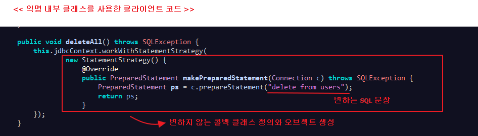
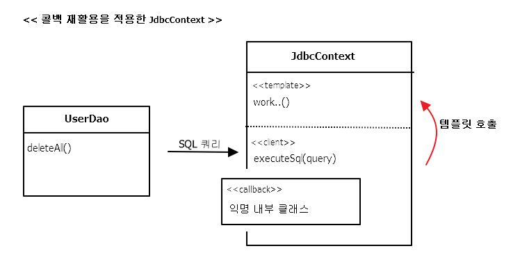

# ch3 템플릿

- <a href="#3.1">다시 보는 초난감 DAO</a>
- <a href="#3.2">변하는 것과 변하지 않는 것</a>
- <a href="#3.3">JDBC 전략 패턴의 최적화</a>
- <a href="#3.4">컨텍스트와 DI</a>
- <a href="#3.5">템플릿과 콜백</a>
- <a href="#3.6">스프링의 JdbcTempalte</a>
- <a href="#3.7">정리</a>

  

## Intro
개방 폐쇄 원칙(OCP, 확장에는 자유롭게 열려 있고 변경에는 굳게 닫혀 있다는 객체지향 설계의 핵심 원칙)

== 코드에서 어떤 부분은 변경을 통해 그 기능이 다양해지고 확장하려는 성질이 있고,

어떤 부분은 고정되어 있고 변하지 않으려는 성질을 가진 것

**탬플릿** 이란, 바뀌는 성질이 다른 코드 중에서 변경이 거의 일어나지 않으며

일정한 패턴으로 유지되는 특성을 가진 부분을 자유롭게 변경되는 성질을 가진 부분으로

부터 독립시켜서 효과적으로 활용할 수 있도록 하는 방법

### 3.1 다시 보는 초난감 DAO

DB 연결과 관련된 여러 가지 개선 작업은 했지만, 예외상황에 대한 처리 문제 발생

#### 3.1.1 예외처리 기능을 갖춘 DAO

*JDBC API를 이용한 DAO 코드인 deleteAll()*
<pre>
public void deleteAll() throws SQLException {	 
	Connection c = this.dataSource.getConnection();
	PreparedStatement ps = c.prepareStatement("delete from users");
	ps.executeUpdate();
	ps.close();
	c.close();					
}
</pre>

=> 중간 부분에서 예외가 발생하면, 밑의 close() 호출 X
( Connection, PreparedStatement라는 두 개의 공유 리소스를
가져와서 사용하므로 문제 발생 , close()는 리소스를 반환하는 것으로 이해나는 것도 좋음)

*예외 발생 시에도 리소스를 반환하도록 수정한 deleteAll()*
<pre>
public void deleteAll() throws SQLException {
	Connection c = null;
	PreparedStatement ps = null;
	try {
		// ==== 예외 발생 가능 ====
		c = this.dataSource.getConnection();
		ps = c.prepareStatement("delete from users");
		ps.executeUpdate();
		// ==================
	} catch(SQLException e) {
		//예외 발생 시 부가적인 작업을 해줄 수 있도록 catch 블록
		throw e;
	}
	finally {
		if( ps!= null ) try{ps.close();}catch(SQLException e){}
		// Connection 반환
		if( c != null ) try{c.close();}catch(SQLException e){}
	}				
}
</pre>

=> 다른것도 try - catch - finally 블록 감싸주기
=> 널체크 안하면, ps.close(); 에서 NullPointerException 발생
=> finally에서 ps를 try-catch로 안하면, close()하다가 예외 발생 시 c.close()가 호출 안될 수 있음

---

  

## 3.2 변하는 것과 변하지 않는 것

### 3.2.1 JDBC try/catch/finally 코드의 문제점
; try/catch/finally 블록이 2중 중첩 + 모든 메소드 반복

=> Copy&Paste 신공으로 여러 번 복붙은 어려운 건 아니지만,  
실수로 잘못 복붙했거나, 초반엔 발견되지 않고 배치 후 에러 발생 등  
실수 확률이 너무 높음  
=> 테스트를 통해 리소스를 반납하는 건 적용하지 쉽지 않음

### 3.2.2 분리와 재사용을 위한 디자인 패턴 적용

*개선할 deleteAll() 메소드*

**메소드 추출**

*변하는 부분을 메소드로 추출한 후의 deleteAll()* 
<pre>
	public void deleteAll() throws SQLException {
		...

		try {
			c = this.dataSource.getConnection();

			ps = makeStatement(c);

			ps.executeUpdate();
		} catch(SQLException e) {
			...				
	}

	private PreparedStatement makeStatement(Connection c) throws SQLException {
		PreparedStatement ps;
		ps = c.prepareStatement("delete from users");
		return ps;
	}
</pre>

=> 자주 바뀌는 부분을 메소드로 독립했지만, 당장 봐서는 별 이득 X

메소드 추출 리팩토링을 적용하는 경우에는 분리된 메소드를 다른 곳에서

재사용할 수 있어야 하는데, 이건 반대로 분리시키고 남은 메소드가

재사용이 필요한 부분이고, 분리된 메소드는 DAO 로직마다 새롭게 만들어서

확장돼야 하는 부분이기 때문에 뭔가 반대로 됐음

**탬플릿 메소드 패턴의 적용**  
; 상속을 통해 기능을 확장해서 사용하는 부분

( 변하지 않는 부분은 슈퍼클래스에 두고, 변하는 부분은 추상 메소드로

정의해둬서 서브클래스에서 오버라이드하여 새롭게 정의해 쓰도록 하는 것 )

*템플릿 메소드 패턴의 적용* 
<pre>
	public abstract class UserDao {
		...
		abstract protected PreparedStatement makeStatement(Connection c) throws SQLException;
		..
	}

	public class UserDaoDeleteAll extends UserDao {
		protected PreparedStatement makeStatement(Connection c) throws SQLException {
			PreparedStatement ps;
			ps = c.prepareStatement("delete from users");
			return ps;
		}
	}
</pre>

==> UserDao 클래스의 기능을 확장하고 싶을 때마다 상속을 통해 자유롭게 확장할 수 있고,

확장 때문에 기존의 상위 DAO 클래스에 불필요한 변화는 생기지 않도록 할 수 있으니 객체지향 설계의

핵심 원리인 개방 폐쇄 원칙(OCP)을 그럭저럭 지키는 구조는 만든 것 같음

**BUT** DAO 로직마다 상속을 통해 새로운 클래스를 만들어야 함 > 단점이 더 많아 보임

**전략 패턴의 적용**  
; 개방 폐쇄 원칙(OCP)을 잘 지키는 구조이면서도 템플릿 메소드 패턴보다 유연하고

확장성이 뛰어난 것이, 오브젝트를 아예 둘로 분리하고 클래스 레벨에서는 인터페이스를 통해서만

의존하도록 만드는 전략 패턴

=> 전략 패턴은 OCP 관점에 보면 확장에 해당하는 변하는 부분을 별도의 클래스로 만들어

추상화된 인터페이스를 통해 위임하는 방식

위의 그림에서, deleteAll() 메소드에서 변하지 않는 부분이라고 명시한 것이

contextMethod()가 됨

=> deleteAll()은 JDBC를 이용해 DB를 업데이트하는 작업이라는 변하지 않는

맥락(context)을 갖는다

*deleteAll()의 컨텍스트를 정리*

- DB 커넥션 가져오기
- PreparedStatement를 만들어줄 외부 기능 호출하기 (전략)
- 전달받은 PreparedStatement 실행하기
- 모든 경우에 만들어진 PreparedStatement와 Connection을 적절히 닫아주기

==> 전략 패턴의 구조를 따라 이 기능을 인터페이스로 만들어두고 인터페이스의 메소드를 통해

PreparedStatement 생성 전략을 호출

*StatementStrategy 인터페이스*

<pre>
package springbook.user.dao;

...

public interface StatementStrategy {
	PreparedStatement makePreparedStatement(Connection c) throws SQLException;
}
</pre>

*deleteAll() 메소드의 기능을 구현한 StatementStrategy*

<pre>
package springbook.user.dao;

...

public class DeleteAllStatement implements StatementStrategy {
	@Override
	public PreparedStatement makePreparedStatement(Connection c) throws SQLException {
		PreparedStatement ps = c.prepareStatement("delete from users");
		return ps;
	}
}
</pre>

*전략 패턴을 따라 DeleteAllStratement가 적용된 deleteAll() 메소드*

<pre>
	public void deleteAll() throws SQLException {
		...		
		try {
			c = this.dataSource.getConnection();

			StatementStrategy strategy = new DeleteAllStatement();			
			ps = strategy.makePreparedStatement(c);

			ps.executeUpdate();
		} catch(SQLException e) {
			...			
	}
</pre>

=> 전략 패턴은 필요에 따라 컨텍스트는 그대로 유지되면서(OCP의 폐쇄원칙)

전략을 바꿔 쓸 수 있다(OCP의 개방 원칙)는 것인데, 위처럼 컨텍스트 안에서

이미 구체적인 전략 클래스인 DeleteAllStatement를 사용하도록 고정되어

있으므로 이상함

=> 컨텍스트가 StatementStrategy 인터페이스와 특정 구현 클래스인

DeleteAllStatement를 직접 알고 있는 건, 전략 패턴과 OCP에도 잘 들어맞지X

**DI 적용을 위한 클라이언트/컨텍스트 분리**

; 전략 패턴에 따르면 Context가 어떤 전략을 사용하게 할 것인가는

Context를 사용하는 앞단의 Client가 결정하는게 일반적.

(Client가 구체적인 전략의 하나를 선택하고 오브젝트로 만들어서 Context에 전달)

==> like 1장에서 컨텍스트(UserDao)가 필요로 하는 전략(ConnectionMaker)의

특정 구현 클래스(DConnectionMaker) 오브젝트를 클라이언트(UserDaoTest)가

만들어서 제공하는 방법

==> 결국 이 구조에서 전략 오브젝트 생성과 컨텍스트로의 전달을 담당하는 책임을 분리 \

시킨 것이 바로 ObjectFactory이며, 이를 일반화한 것이 앞에서 살펴봤던 의존관계 주입(DI)

==> 결국 DI란, 이러한 전략 패턴의 장점을 일반적으로 활용할 수 있도록 만든 구조!

*메소드로 분리한 try/catch/finally 컨텍스트 코드*

<pre>
// stmt : 클라이언트가 컨텍스트를 호출할 때 넘겨줄 전략 파라미터
public void jdbcContextWithStatementStrategy(StatementStrategy stmt) throws SQLException {
	Connection c = null;
	PreparedStatement ps = null;

	try {
	c = this.dataSource.getConnection();

		ps = stmt.makePreparedStatement(c);

		ps.executeUpdate();
	} catch(SQLException e) {
		throw e;
	} finally {
		if( ps!= null ) try{ps.close();}catch(SQLException e){}
		if( c != null ) try{c.close();}catch(SQLException e){}
	}
}
</pre>

==> 클라이언트로부터 StatementStrategy 타입의 전략 오브젝트를 제공 받고,

JDBC try/catch/finally 구조로 만들어진 컨텍스트 내에서 작업을 수행

( 제공받은 전략 오브젝트는 PreparedStatement 생성이 필요한 시점에 호출해서 사용 )

클라이언트 deleteAll() :

deleteAll()은 전략 오브젝트를 만들고, 컨텍스트를 호출하는 책임을 지고 있음

*클라이언트 책임을 담당할 deleteAll() 메소드*

<pre>
public void deleteAll() throws SQLException {
	// 선정한 전략 클래스의 오브젝트 생성
	StatementStrategy st = new DeleteAllStatement();
	// 컨텍스트 호출. 전략 오브젝트 전달
	jdbcContextWithStatementStrategy(st);
}
</pre>

=> 구조로 볼 때 완벽한 전략 패턴의 모습을 갖춤

(비록 클라이언트와 컨텍스트는 클래스로 분리하지 않았지만, 의존관계와

책임을 볼 때 이상적인 클라이언트/컨텍스트 관계를 갖고 있음)

=> 이 구조가 기반이 돼서 앞으로 진행할 UserDao 코드의 본격적인

개선 작업이 가능한 것

*마이크로 DI*

: 의존관계 주입(DI)는 다양한 형태로 적용할 수 있음

( *제3자의 도움을 통해 두 오브젝트 사이의 유연한 관계가 설정되도록 만드는 것 )

- 의존관계에 있는 두 개의 오브젝트와 이 관계를 다이내믹하게 설정해주는 오브젝트 팩토리(DI 컨테이너) 
클라이언트라는 4개의 오브젝트 사이에서 일어나는 것

- 원시적인 전략 패턴 구조를 따라 클라이언트가 오브젝트 팩토의 책임을 함께 지고 있을 수도 있음

- 클라이언트와 전략(의존 오브젝트)이 결합될 수도 있음

- 클라이언트와 DI 관계에 있는 두 개의 오브젝트가 모두 하나의 클래스 안에 담길 수도 있음

=> 밑의 경우, DI가 매우 작은 단위의 코드와 메소드 사이에서 일어나기도 함.

얼핏 보면 DI 같아 보이지 않지만, 세밀하게 관찰해보면 작은 단위지만 엄연히 DI가 이뤄지고 있음을 알 수 있음

=> DI의 장점을 단순화해서 IoC 컨테이너의 도움 없이 코드 내에서 적용한 경우를

마이크로 DI  or 수동 DI(코드에 의한 DI)라고 부를 수 있음

---

  

## 3.3 JDBC 전략 패턴의 최적화
; deleteAll() 메소드에 담겨 있던 변하지 않는 부분, 자주 변하는 부분을

전략 패턴을 사용해 깔끔하게 분리

=> 컨텍스트 : PreparedStatement를 실행하는 JDBC의 작업 흐름

전략 : PreparedStatement를 생성하는 것

### 3.3.1 전략 클래스의 추가 정보
; add() 메소드에 적용하기

---
> add() 메소드의 PreparedStatement 생성 로직을 분리한 클래스
<pre>
package springbook.user.dao;

import java.sql.Connection;
import java.sql.PreparedStatement;
import java.sql.SQLException;

import springbook.user.domain.User;

public class AddStatement implements StatementStrategy {

	@Override
	public PreparedStatement makePreparedStatement(Connection c) throws SQLException {
		PreparedStatement ps =  c.prepareStatement(
								"insert into users(id, name, password) values(?,?,?)");

		ps.setString(1, user.getId());
		ps.setString(2, user.getName());
		ps.setString(3, user.getPassword());

		return ps;
	}
}
</pre>
---

=> User 인스턴스가 없어서 컴파일 에러  
=> 생성자로 전달 받기

---
> add() 메소드의 PreparedStatement 생성 로직을 분리한 클래스
<pre>
...
public class AddStatement implements StatementStrategy {
	User user;

	public AddStatement(User user) {
		this.user = user;
	}
	...
}
</pre>
---

---
> user정보를 AddStatement에 전달해주는 add() 메소드
<pre>
...
public class UserDao {
	...

	public void add(User user) throws SQLException {
		StatementStrategy st = new AddStatement(user);
		jdbcContextWithStatementStrategy(st);
	}

	...
}
</pre>
---

=> 잊지 말고 테스트 돌리기  
=> 테스트가 있기 때문에 자유롭게 DAO 코드를 개선할 수 있음!

### 3.3.2 전략과 클라이언트의 동거
; 지금까지 많은 문제점을 개선 BUT  
1. DAO 메소드 마다 새로운 StatementStrategy 구현 클래스를 만들어야 함  
 => UserDao 떄보다 클래스가 많아짐
2. DAO 메소드에서 StatementStrategy에 전달할 User와 같은 부가적인

 정보가 있는 경우, 이를 위해 오브젝트를 전달받는 생성자와 이를 저장해둘 인스턴스 변수를
 번거롭게 만들어야 함.

**로컬 클래스**

---
> add() 메소드 내의 로컬 클래스로 이전한 AddStatement
<pre>
public void add(final User user) throws SQLException {
	//add()메소드에 정의 된 로컬 클래스
	class AddStatement implements StatementStrategy {
		@Override
		public PreparedStatement makePreparedStatement(Connection c) throws SQLException {
			PreparedStatement ps =  c.prepareStatement("insert into users(id, name, password) values(?,?,?)");

			// 로컬(내부)클래스의 코드에서 외부의 메소드
			// 로컬 변수에 직접 접근 가능
			ps.setString(1, user.getId());
			ps.setString(2, user.getName());
			ps.setString(3, user.getPassword());

			return ps;
		}
	}

	StatementStrategy st = new AddStatement();
	jdbcContextWithStatementStrategy(st);
}
</pre>
---

=> 클래스 파일이 줄었고, add() 메소드 안에서 PreparedStatement 생성 로직을

함께 볼 수 있어 코드이해가 좋아짐

=> 매개 변수 등 정보에 접근할 수 있는 점

**익명 내부 클래스**

---
> AddStatement를 익명 내부 클래스로 전환 + 메소드 파라미터(jdbcContext..)

<pre>
	public void add(final User user) throws SQLException {		
		jdbcContextWithStatementStrategy(
				new StatementStrategy() {
					@Override
					public PreparedStatement makePreparedStatement(Connection c) throws SQLException {
						PreparedStatement ps =
									c.prepareStatement("insert into users(id, name, password) values(?,?,?)");
						ps.setString(1, user.getId());
						ps.setString(2, user.getName());
						ps.setString(3, user.getPassword());

						return ps;
					}
				}
		);
	}
</pre>
---

> 익명 내부 클래스를 적용한 deleteAll() 메소드
<pre>
public void deleteAll() throws SQLException {
	jdbcContextWithStatementStrategy(new StatementStrategy() {
		@Override
		public PreparedStatement makePreparedStatement(Connection c) throws SQLException {
			PreparedStatement ps = c.prepareStatement("delete from users");
			return ps;
		}
	});
}
</pre>  

---

  

## 컨텍스트와 DI

### 3.4.1 JdbcContext의 분리
;전략 패턴의 구조를 보면
<table>
	<tr>
		<th>클라이언트</th>
		<td>UserDao의 메소드</td>
	</tr>
	<tr>
		<th>개별 전략</th>
		<td>익명 내부 클래스</td>
	</tr>
	<tr>
		<th>컨텍스트</th>
		<td>jdbcContextWithStatementStrategy()</td>
	</tr>
</table>

=> JDBC의 일반적인 작업 흐름을 담고 있는 jdbcContextWithStatementStrategy()는

다른 DAO에서도 사용 가능.

**클래스 분리**

---
> JDBC 작업 흐름을 분리해서 만든 JdbcContext 클래스

<pre>
package springbook.user.dao;
...
public class JdbcContext {
	private DataSource dataSource;

	public void setDataSource(DataSource dataSource) {
		this.dataSource = dataSource;
	}

	public void workWithStatementStrategy(StatementStrategy stmt) throws SQLException {
		Connection c = null;
		PreparedStatement ps = null;

		try {
			c = this.dataSource.getConnection();

			ps = stmt.makePreparedStatement(c);

			ps.executeUpdate();
		} catch(SQLException e) {
			throw e;
		} finally {
			if( ps!= null ) try{ps.close();}catch(SQLException e){}
			if( c != null ) try{c.close();}catch(SQLException e){}
		}
	}
}
</pre>
---

---
> JdbcContext를 DI 받아서 사용하도록 만든 UserDao

<pre>
package springbook.user.dao;
...
public class UserDao {
	private JdbcContext jdbcContext;

	public void setJdbcContext(JdbcContext jdbcContext) {
		this.jdbcContext = jdbcContext;
	}

	public void add(final User user) throws SQLException {		
		this.jdbcContext.workWithStatementStrategy(
		...
	}

	public void deleteAll() throws SQLException {
		this.jdbcContext.workWithStatementStrategy(
				new StatementStrategy() {...}
		);
	}
</pre>

---

**빈 의존관계 변경**

; JdbcContext는 DataSource와는 달리 구체 클래스

-> 그 자체로 독립적인 JDBC 컨텍스트를 제공해주는 서비스 오브젝트로서

의미가 있을 뿐이고, 구현 방법이 바뀔 가능성은 없음

-> 별도의 인터페이스를 구현하도록 만들지 X

---
> JdbcContext 빈을 추가하도록 수정한 설정 파일
<pre>
&lt;?xml version=&quot;1.0&quot; encoding=&quot;UTF-8&quot;?&gt;
&lt;beans xmlns=&quot;http://www.springframework.org/schema/beans&quot;
	xmlns:xsi=&quot;http://www.w3.org/2001/XMLSchema-instance&quot;
	xsi:schemaLocation=&quot;http://www.springframework.org/schema/beans
						http://www.springframework.org/schema/beans/spring-beans-3.0.xsd&quot;&gt;

	&lt;bean id=&quot;dataSource&quot; class=&quot;org.springframework.jdbc.datasource.SimpleDriverDataSource&quot;&gt;
		&lt;property name=&quot;driverClass&quot; value=&quot;com.mysql.jdbc.Driver&quot; /&gt;
		&lt;property name=&quot;url&quot; value=&quot;jdbc:mysql://localhost/springbook?characterEncoding=UTF-8&quot; /&gt;
		&lt;property name=&quot;username&quot; value=&quot;spring&quot; /&gt;
		&lt;property name=&quot;password&quot; value=&quot;book&quot; /&gt;
	&lt;/bean&gt;

	&lt;bean id=&quot;jdbcContext&quot; class=&quot;springbook.user.dao.JdbcContext&quot;&quot;&gt;
		&lt;property name=&quot;dataSource&quot; ref=&quot;dataSource&quot; /&gt;
	&lt;/bean&gt;

	&lt;bean id=&quot;userDao&quot; class=&quot;springbook.user.dao.UserDao&quot;&gt;
		&lt;property name=&quot;dataSource&quot; ref=&quot;dataSource&quot; /&gt;		
		&lt;property name=&quot;jdbcContext&quot; ref=&quot;jdbcContext&quot; /&gt;
	&lt;/bean&gt;
&lt;/beans&gt;
</pre>
---

### 3.4.2 JdbcContext의 특별한 DI
; UserDao와 JdbcContext 사이에는 인터페이스를 사용하지 않고 DI를 적용

-> 지금까지 적용한 DI는 클래스 레벨에서 구체적은 의존관계 만들어지지 않도록 인터페이스를 사용

-> 설정을 변경하는 것만으로 다양한 의존 오브젝트를 변경해서 사용할 수 있음

=> UserDao는 인터페이스를 거치지 않고, 코드에서 바로 JdbcContext 클래스를 사용

( UserDao와 JdbcContext는 클래스 레벨에서 의존관계가 결정 )

**스프링 빈으로 DI**

; 스프링 DI의 기본 의도에 맞게 인터페이스 정의 후 사용해도 상관은 없지만, 그럴 필요도 없음

의존관계 주입(DI)의 개념

: 인터페이스를 사이에 둬서 클래스 레벨에서는 의존관계가 고정되지 않게 하고, 런타임 시에 의존할 오브젝트와의

관계를 다이내믹하게 주입해주는 것이 맞음

BUT 스프링의 DI는 넓게 보면, 객체의 생성과 관계설정에 대한 제워권한을 오브젝트에서 제거하고

외부로 위임했다는 IoC라는 개념을 포괄

=> JdbcContext를 스프링을 이용해 UserDao 객체에서 사용하게 주입한 건 DI의 기본을 따르고 있음

*why JdbcContext를 UserDao와 DI 구조로 만드는지?*

- JdbcContext가 스프링 컨테이너의 싱글톤 레지스트리에서 관리되는 싱글톤 빈이 되기 때문  
 JdbcContext는 그 자체로 변경되는 상태정보를 갖고 있지 않음. (dataSource는 읽기 전용)
- JdbcContext가 DI를 통해 다른 빈에 의존하고 있기 때문(중요)  
 dataSource 프로퍼티를 통해 오브젝트를 주입 받도록 되어 있음.	  
 DI를 위해서는 주입되는 오브젝트와 주입받는 오브젝트 양쪽 모두 스프링 빈으로 등록 되어야 함.

=> 인터페이스가 없다는 건 UserDao와 JdbcContext가 매우 긴밀한 관계를 가지고 강하게 결합

**코드를 이용한 수동 DI**
;UserDao 내부에서 직접 DI를 적용하는 방법

=>
1. 싱글톤을 포기 (그렇다고 매번 새로운 것 생성 X)  
=> DAO마다 JdbcContext 오브젝트를 갖고 있게 하는 것  
- JdbcContex는 DAO 개수만큼 생성 됨
- JdbcContext는 내부에 두는 상태 정보가 없어서, 메모리에 주는 부담 적음
- 자주 만들었다가 제거되는 게 아니기 때문에 GC에 대한 부담도 없음

2. DataSource의 DI에 의해 의존하고 있음  
=> JdbcContext에 대한 제어권을 갖고 생성과 관리를 담당하는 UserDao에게 DI까지 맡기는 것

---

> jdbcContext 빈을 제거한 설정 파일

<pre>
&lt;?xml version=&quot;1.0&quot; encoding=&quot;UTF-8&quot;?&gt;
&lt;beans xmlns=&quot;http://www.springframework.org/schema/beans&quot;
	xmlns:xsi=&quot;http://www.w3.org/2001/XMLSchema-instance&quot;
	xsi:schemaLocation=&quot;http://www.springframework.org/schema/beans
						http://www.springframework.org/schema/beans/spring-beans-3.0.xsd&quot;&gt;

	&lt;bean id=&quot;dataSource&quot; class=&quot;org.springframework.jdbc.datasource.SimpleDriverDataSource&quot;&gt;
		...
	&lt;/bean&gt;

	&lt;bean id=&quot;userDao&quot; class=&quot;springbook.user.dao.UserDao&quot;&gt;
		&lt;property name=&quot;dataSource&quot; ref=&quot;dataSource&quot; /&gt;		
	&lt;/bean&gt;
&lt;/beans&gt;
</pre>
---

=> 설정 파일만 보면 UserDao가 직접 DataSource를 의존하고 있는 것 같지만,

내부적으로는 JdbcContext를 통해 간접적으로 DataSource를 사용하고 있을 뿐.

---

> jdbcContext 생성과 DI 작업을 수행하는 setDataSource() 메소드

<pre>
...
public class UserDao {
	private JdbcContext jdbcContext;
	private DataSource dataSource;

	// 수정자 메소드 이면서 JdbcContext에 대한
	// 생성, DI 작업을 동시에 수행
	public void setDataSource(DataSource dataSource) {
		//JdbcContext 생성(IoC)
		jdbcContext = new JdbcContext();

		// 의존 오브젝트 주입(DI)
		jdbcContext.setDataSource(dataSource);

		// 아직 jdbcContex를 적용하지 않은 메소드를 위해 저장
		this.dataSource = dataSource;
	}
	...
}
</pre>

---

=> 인터페이스를 두지 않아도 될 만큼 긴밀한 관계를 갖는 DAO 클래스와 JdbcContext를 어색하게

따로 빈으로 분리하지 않고 내부에서 직접 만들어 사용하면서도 다른 오브젝트에 댛나 DI를 적용할 수 있다는 점

<table>
	<tr>
		<th>&nbsp;</th>
		<th>장점</th>
		<th>단점</th>
	</tr>		
	<tr>
		<th>빈으로 등록해서 사용<th>
		<td>오브젝트 사이의 실제 의존관계가 설정파일에 명확하게 드러남
		</td>
		<td>DI의 근본적인 원칙에 부합하지 않는 구체적인 클래스와 관계가 설정에 직접 노출된다는 단점
		</td>		
	</tr>
	<tr>
		<th>수동 DI<th>
		<td>
			JdbcContext가 UserDao의 내부에서 만들어지고 사용되면서 그 관계를 외부에 드러내지 않는 장점
		</td>
		<td>
			JdbcContext를 여러 오브젝트가 사용하더라도 싱글톤으로 만들 수 없고, DI 작업을 위한
			부가적인 코드가 필요하다는 단점
		</td>		
	</tr>
</table>

=> 일반적으로 어떤 방법이 더 낫다고 말할 수는 없지만, 상황에 따라 적절하다고 판단 되는 방법을 선택해서 사용!

단, 왜 그렇게 선택했는지에 대한 분명한 이유와 근거는 있어야 함.(귀찮아서 등등 X)

---

   

## 3.5 템플릿과 콜백
;UserDao, StatementStrategy, JdbcContext를 이용해 만든 코드는

일종의 전략 패턴이 적용 된 것.

( 복잡하지만 바뀌지 않는 일정한 패턴을 갖는 작업 흐름이 존재하고 그 중 일부분만 자주 바꿔서

사용해야 하는 경우에 적합한 구조 )

=> 전략 패턴의 기본 구조에 익명 내부 클래스를 활용한 방식.

=> 이러한 방식을 스프링에서는 **템플릿/콜백 패턴**이라고 부름.

( 전략 패턴의 컨텍스트 == 템플릿 // 익명 내부 클래스 오브젝트 == 콜백 )

*템플릿(template)*  
=> 어떤 목적을 위해 미리 만들어둔 모양이 있는 틀

( JSP는 HTML이라는 고정된 부분에 EL과 스크립트릿이라는 변하는 부분을 넣은 일종의

템플릿 파일 )

*콜백(callback)* 
=> 실행되는 것을 목적으로 다른 오브젝트의 메소드에 전달되는 오브젝트를 말함.

( 파라미터로 전달되지만 값을 참조하기 위한 것이 아니라 특정 로직을 담은 메소드를

실행시키기 위해 사용. 자바에서는 메소드 자체를 파라미터로 전달할 방법이 없기 때문에

메소드가 담긴 오브젝트를 전달(펑셔널 오브젝트(functional object) 라고도 부름)

### 3.5.1 템플릿/콜백의 동작원리

**템플릿/콜백의 특징**

-> 보통 단일 메소드 인터페이스를 사용

( 템플릿의 작업 흐름 중 특정 기능을 위해 한 번 호출되는 경우가 일반적이므로

하나의 템플릿에서 여러 가지 종류의 전략을 사용해야 한다면, 하나 이상의 콜백 오브젝트를 사용할 수 도 있음 )

---

> 클라이언트 : UserDao
<pre>
public class UserDao {
	...
	public void add(final User user) throws SQLException {		
		this.jdbcContext.workWithStatementStrategy(
				new StatementStrategy() {
					@Override
					public PreparedStatement makePreparedStatement(Connection c) throws SQLException {
						PreparedStatement ps =
									c.prepareStatement("insert into users(id, name, password) values(?,?,?)");
						ps.setString(1, user.getId());
						ps.setString(2, user.getName());
						ps.setString(3, user.getPassword());

						return ps;
					}
				}
		);
	}
	..
}
</pre>

> 콜백 : 익명 클래스 (in UserDao)
<pre>
new StatementStrategy() {
	@Override
	public PreparedStatement makePreparedStatement(Connection c) throws SQLException {
		PreparedStatement ps =
				c.prepareStatement("insert into users(id, name, password) values(?,?,?)");
		ps.setString(1, user.getId());
		ps.setString(2, user.getName());
		ps.setString(3, user.getPassword());

		return ps;
	}
}
</pre>

> 템플릿 : JdbcContext
<pre>
public class JdbcContext {
	...
	public void workWithStatementStrategy(StatementStrategy stmt) throws SQLException {
		Connection c = null;
		PreparedStatement ps = null;

		try {
			c = this.dataSource.getConnection();

			ps = stmt.makePreparedStatement(c);

			ps.executeUpdate();
		} catch(SQLException e) {
			throw e;
		} finally {
			if( ps!= null ) try{ps.close();}catch(SQLException e){}
			if( c != null ) try{c.close();}catch(SQLException e){}
		}
	}
}
</pre>

---

- 클라이언트의 역할은 템플릿 안에서 실행될 로직을 담은 콜백 오브젝트를 만들고,

콜백이 참조할 정보를 제공. 만들어진 콜백은 클라이언트가 템플릿의 메소드를 호출할 때

파라미터로 전달

- 템플릿은 정해진 작업 흐름을 따라 작업을 진행하다 내부에서 생성한 참조정보를 가지고

콜백 오브젝트의 메소드를 호출. 콜백은 클라이언트 메소드에 있는 정보와 템플릿이 제공한 참조정보를

이용해서 작업을 수행하고 그 결과를 다시 템플릿에 돌려줌

- 템플릿은 콜백이 돌려준 정보를 사용해서 작업을 마저 수행.

경우에 따라 최종 결과를 클라이언트에 다시 돌려주기도 함

=> 템플릿/콜백 방식은 전략 패턴과 DI의 장점을 익명 내부 클래스 사용 전략과 결합한

독특한 활용법이라고 이해할 수 있음.

---

**JdbcContext에 적용된 템플릿/콜백**

=>JdbcContext의 workWithStatementStrategy() 템플릿은 리턴 값이 없는

단순한 구조. 조회 작업에서는 보통 템플릿의 작업 결과를 클라이언트에 리턴 해줌

( 복잡한 경우에는 한 번 이상 콜백을 호출하기도 하고 여러 개의 콜백을 클라이언트로부터

받아서 사용하기도 한다 )

### 3.5.2 편리한 콜백의 재활용

;템플릿/콜백 방식은 템플릿에 담긴 코드를 여기저기서 반복적으로 사용하는 원시적인 방법에 비해

많은 장점이 있음.

- JdbcContext를 사용하기만 해도 기존에 JDBC 기반의 코드를 만들었을 때 발생했던 여러 가지 문제점과

불편한 점을 제거할 수 있음

- DAO의 메소드는 간결해지고 최소한의 데이터 엑세스 로직만 갖고 있게 됨

BUT DAO 메소드에서 매번 익명 클래스를 사용하기 때문에 상대적으로 코드를 작성하고 읽기가 불편!

**콜백의 분리와 재활용**

; 복잡한 익명 내부 클래스의 사용을 최소화할 수 있는 방법 찾아 보기.

---

> 변하지 않는 부분을 분리시킨 delteAll() 메소드

<pre>
	public void deleteAll() throws SQLException {
		executeSql("delete from users"); // 변하는 SQL 문장
	}

	/// ---- 분리 ----

	private void executeSql(final String query) throws SQLException {
		this.jdbcContext.workWithStatementStrategy(new StatementStrategy() {
			@Override
			public PreparedStatement makePreparedStatement(Connection c) throws SQLException {
				return c.prepareStatement(query);
			}
		});
		// 변하지 않는 콜백 클래스 정의와 오브젝트 생성
	}
</pre>

---

=> 재활용 가능한 콜백을 담은 메소드가 만들어짐

=> 변하는 것과 변하지 않는 것을 분리하고 변하지 않는 건 유연하게 재활용할 수 있게

만든다는 간단한 원리를 계속 적용했을 때, 위와 같이 단순하면서도 안전하게 작성 가능한

JDBC 활용 코드가 완성!

---

**콜백과 템플릿의 결합**

; 조금더 나아가, executeSql() 메소드는 UserDao만 사용하기 아까움!

-> 재사용 가능한 콜백을 담고 있는 메소드라면, DAO가 공유할 수 있는 템플릿

클래스 안으로 옮겨도 됨! (엄밀히 템플릿은 JdbcContext가 아니라, work..()메소드 )

---

> JdbcContext로 옮긴 executeSql() 메소드
<pre>
public class JdbcContext {
	...
	public void executeSql(final String query) throws SQLException {
		workWithStatementStrategy(new StatementStrategy() {
			@Override
			public PreparedStatement makePreparedStatement(Connection c) throws SQLException {
				return c.prepareStatement(query);
			}
		});
	}
}
</pre>

> JdbcContext로 옮긴 executeSql()을 사용하는 deleteAll() 메소드

<pre>
public void deleteAll() throws SQLException {
	this.jdbcContext.executeSql("delete from users");
}
</pre>

---

-> 모든 DAO 메소드에서 executeSql() 메소드를 사용할 수 있게 됨

-> JdbcContext 안에 클라이언트와 템플릿, 콜백이 모두 함께 공존하면서

동작하는 구조가 됨!

=> 일반적으로는 성격이 다른 코드들은 가능한 한 분리하는 편이 낫지만,

위의 경우는 반대임. 하나의 목적을 위해 서로 긴밀하게 연관되어 동작하는

응집력이 강한 코드들이기 때문에, 한 군데 모여 있는게 유리.

=> i.e 구체적인 구현, 내부의 전략 패턴, 코드에 의한 DI, 익명 내부 클래스 등의

기술은 최대한 감춰두고, 외부에는 꼭 필요한 기능을 제공하는 단순한 메소드만 노출해주는 것!

-> add() 에도 같은 방법을 적용할 수 있음. 바인딩 될 파라미터 내용이 추가 돼야 함

### 3.5.3 템플릿/콜백의 응용

; 템플릿/콜백 패턴은 스프링에서만 사용할 수 있는 독점적인 기술은 아니지만,

스프링만큼 적극적으로 활용하는 프레임워크는 없음

; DI 역시 객체지향의 장점을 잘 살려서 설계하고 구현하도록 도와주는 여러 가지 원칙과 패턴의

활용 결과일 뿐임. 단지 스프링은 이를 편리하게 사용할 수 있도록 도와주는 컨테이너를 제공하고

이런 패턴의 사용방법을 지지하는 것. 템플릿/콜백 패턴도 DI와 객체지향 설계를 적극적 응용한 결과

-> 고정된 작업 흐름을 갖고 있으면서 여기저기서 자주 반복되는 코드가 있다면, 중복되는 코드를

분리할 방법을 생각하는 습관을 기르기. (우선 메소드로 분리)

-> 그중 일부 작업을 필요에 따라 바꾸어 사용해야 한다면 인터페이스를 사이에 두고 분리해서

전략 패턴을 적용하고 DI로 의존관계를 관리하도록 만듬

-> 바뀌는 부분이 한 애플리케이션 안에서 동시에 여러 종류가 만들어질 수 있다면, 템플릿/콜백

패턴을 적용하는 것을 고려해볼 수 있음

==> 가장 전형적인 템플릿/콜백 패턴 후보는 try/catch/finally

**테스트와 try/catch/finally**

e.g ) 간단한 템플릿/콜백 예제

; 파일을 하나 열어서 모든 라인의 숫자를 더한 합을 돌려주는 코드를 만들기.

---

> 예외시 BufferedReader를 닫아주고, 로그를 남기는 Calculator

<pre>
package springbook.learningtest.template;

import java.io.BufferedReader;
import java.io.FileReader;
import java.io.IOException;

public class Calculator {
	public Integer calcSum(String filepath) throws IOException {
		BufferedReader br = null;
		try {			
			// 한줄씩 읽기 편하게 BufferedReader
			br = new BufferedReader(new FileReader(filepath));
			Integer sum = 0;
			String line = null;
			while( ( line = br.readLine() ) != null ) {
				sum += Integer.valueOf(line);
			}
			return sum;
		} catch(IOException e) {
			System.out.println(e.getMessage());
			throw e;
		} finally {
			if( br != null ) {
				try{ br.close();}
				catch(IOException e){System.out.println(e.getMessage());}
			}
		}		
	}
}

</pre>

> 파일의 숫자 합을 계산하는 코드의 테스트 CalcSumTest

<pre>
package springbook.learningtest.template;

import static org.hamcrest.CoreMatchers.is;
import static org.junit.Assert.assertThat;

import java.io.IOException;

import org.junit.Test;

public class CalcSumTest {
	@Test
	public void sumOfNumbers() throws IOException {
		Calculator calculator = new Calculator();		
		int sum = calculator.calcSum(getClass().getResource("numbers.txt").getPath());
		assertThat(sum, is(10));
	}
}
</pre>

> numbers.txt
<pre>
1
2
3
4
</pre>

---

-> Caculator는 DAO의 JDBC 코드에 적용했던 것과 기본 개념은 같음

- 만들어진 모든 리소스는 확실히 정리하고 빠져나오도록 만드는 것
- 모든 예외상황에 대해서는 적절한 처리를 해주도록 하는 것

---

**중복의 제거와 템플릿/콜백 설계**

*가정 : *

- 모든 숫자의 곱을 계산하는 기능을 추가
- 앞으로 많은 파일에 담긴 숫자 데이터를 여러 가지 방식으로 처리하는 기능이 추가 될 것

-> 복붙 ? 세 번 이상 반복된다면 코드를 개선할 시점이라고 생각해야 객체지향 언어를 사용하고

객체지향 설계를 통해 코드를 작성하는 개발자의 기본 자세!!

=> 템플릿/콜백 패턴을 적용해보면,

-> 템플릿에 담을 반복되는 작업 흐름이 어떤 것인지 살펴 보기

-> 템플릿이 콜백에게 전달해줄 내부의 정보는 무엇이고

-> 콜백이 템플릿에 돌려줄 내용은 무엇인지각

-> 템플릿이 작업을 마친 뒤 클라이언트에게 전달해줘야 할 것도 있을 것

==> 템플릿과 콜백의 경계를 정의하고 각각 전달하는 내용이 무엇인지 파악하는게 가장 중요

(그에 따라 인터페이스를 정의해야 하므로)

==> 가장 쉽게 생각해볼 수 있는 구조는

템플릿 : 파일을 열고 각 라인을 읽어올 수 있는 BufferedReader를 만들어서 콜백에 전달

콜백 : 각 라인을 읽어서 처리 한 후에, 최종 결과만 템플릿에게 돌려주는 것

---

> BufferedReader를 전달받는 콜백 인터페이스

<pre>
package springbook.learningtest.template;

import java.io.BufferedReader;
import java.io.IOException;

public interface BufferedReaderCallback {
	Integer doSomethingWithReader(BufferedReader br) throws IOException;
}
</pre>

> BufferedReaderCallback을 사용하는 템플릿 메소드 + 합,곱 메소드

<pre>
package springbook.learningtest.template;

...

public class Calculator {
	public Integer calcSum(String filepath) throws IOException {
		BufferedReaderCallback sumCallback = new BufferedReaderCallback() {
			@Override
			public Integer doSomethingWithReader(BufferedReader br) throws IOException {
				Integer sum = 0;
				String line = null;
				while( (line = br.readLine()) != null ) {
					sum += Integer.valueOf(line);
				}
				return sum;
			}			
		};
		return fileReadTemplate(filepath, sumCallback);
	}

	public Integer calcMultiply(String filepath) throws IOException {
		BufferedReaderCallback sumCallback = new BufferedReaderCallback() {
			@Override
			public Integer doSomethingWithReader(BufferedReader br) throws IOException {
				Integer multyply = 1;
				String line = null;
				while( (line = br.readLine()) != null ) {
					multyply *= Integer.valueOf(line);
				}
				return multyply;
			}			
		};
		return fileReadTemplate(filepath, sumCallback);
	}

	public Integer fileReadTemplate(String filepath, BufferedReaderCallback callback) throws IOException {
		BufferedReader br = null;
		try {
			br = new BufferedReader(new FileReader(filepath));
			// 콜백 오브젝트 호출. 템플릿에서 만든 컨텍스트 정보인 BufferedReader를 전달해 주고
			// 콜백의 작업 결과를 받아 둔다.
			int ret = callback.doSomethingWithReader(br);
			return ret;
		} catch(IOException e) {
			System.out.println(e.getMessage());
			throw e;
		} finally {
			if( br != null ) {
				try{ br.close();}
				catch(IOException e){System.out.println(e.getMessage());}
			}
		}
	}
}
</pre>

> 테스트 코드

<pre>
package springbook.learningtest.template;

import static org.hamcrest.CoreMatchers.is;
import static org.junit.Assert.assertThat;

import java.io.IOException;

import org.junit.Before;
import org.junit.Test;

public class CalcSumTest {
	Calculator calculator;
	String numFilepath;

	@Before
	public void setUp() {
		calculator = new Calculator();
		numFilepath = getClass().getResource("numbers.txt").getPath();
	}

	@Test
	public void sumOfNumbers() throws IOException {
		assertThat(calculator.calcSum(numFilepath), is(10));
	}

	@Test
	public void multiplyOfNumbers() throws IOException {
		assertThat(calculator.calcMultiply(numFilepath), is(24));
	}

}
</pre>

---

**템플릿/콜백의 재설계**

; 파일을 읽어 처리하는 코드를 상당히 깔끔하게 정리함!

그런데, calcSum()과 calcMultiply()에 나오는 두 개의 콜백을 비교해 보자

<table>
	<tr>
		<th>calcSum()</th>
		<th>calcMultiply()</th>
	</tr>
	<tr>
		<td>
			Integer sum = 0; 
			String line = null; 
			while( (line = br.readLine()) != null ) { 
				<strong>sum += Integer.valueOf(line);</strong> 
			}  
			return sum;
		</td>
		<td>
			Integer multyply = 1; 
			String line = null; 
			while( (line = br.readLine()) != null ) { 
				<strong>multyply *= Integer.valueOf(line);</strong> 
			} 
			return multyply; 
		</td>
	</tr>
</table>

=> 바뀌는 부분은 네번째 라인 뿐!

---

> 라인별 작업을 정의한 콜백 인터페이스

<pre>
package springbook.learningtest.template;

public interface LineCallback {
	/**
	 * 파일의 각 라인과 현재까지 계산한 값을 넘겨주는 메소드
	 *
	 * @param line 읽은 라인
	 * @param value 현재까지 계산 한 값
	 * @return value에 line을 계산한 값
	 */
	Integer doSomethingWithLine(String line, Integer value);
}
</pre>

> LineCallback을 사용하는 템플릿

<pre>
package springbook.learningtest.template;

...

public class Calculator {
	...
	public Integer lineReadTemplate(String filepath, LineCallback callback, int initVal)
																		throws IOException {
		BufferedReader br = null;
		try {
			br = new BufferedReader(new FileReader(filepath));
			Integer res = initVal;
			String line = null;
			while( (line = br.readLine()) != null ) {
				res = callback.doSomethingWithLine(line, res);
			}
			return res;
		} catch(IOException e) {
			System.out.println(e.getMessage());
			throw e;
		} finally {
			if( br != null ) { try{ br.close();}
			catch(IOException e){System.out.println(e.getMessage());} }
		}
	}
	...
</pre>

> lineReadTemplate()을 사용하도록 수정한 calcSum(), calcMultiply() 메소드

<pre>
package springbook.learningtest.template;

...

public class Calculator {
	...
	public Integer calcSum(String filepath) throws IOException {
		LineCallback sumCallback = new LineCallback() {
			@Override
			public Integer doSomethingWithLine(String line, Integer value) {				
				return value + Integer.valueOf(line);
			}			
		};
		return lineReadTemplate(filepath,sumCallback,0);
	}
	public Integer calcMultiply(String filepath) throws IOException {
		LineCallback sumCallback = new LineCallback() {
			@Override
			public Integer doSomethingWithLine(String line, Integer value) {				
				return value * Integer.valueOf(line);
			}			
		};
		return lineReadTemplate(filepath,sumCallback,1);
	}
	...
}

</pre>

---

-> 익명 내부 클래스 때문에, 라인 수가 많아 보이긴 하지만, 핵심 코드는 딱 한줄!

-> 로우레벨 파일 처리 코드가 템플릿으로 분리되고 순수한 계산 로직만 남아 있기 때문에,

코드의 관심이 무엇인지 명확하게 보임!

---

**제네릭스를 이용한 콜백 인터페이스**

; 템플릿과 콜백이 만들어내는 결과가 Integer 외에 다양하게 가져가고 싶다면 제네릭스(Generics)를 이용!

*가정 :*

파일의 각 라인에 있는 문자를 모두 연결해서 하나의 스트링으로 돌려주는 기능을 만든다고 가정.

---

> 타입 파라미터를 적용한 LineCallback

<pre>
package springbook.learningtest.template;

public interface LineCallback<T> {
	T doSomethingWithLine(String line, T value);
}
</pre>

> 타입 파라미터를 추가해서 제네릭 메소드로 만든 Calculator.lineReadTemplate()

<pre>
	public <T> T lineReadTemplate(String filepath,
			LineCallback<T> callback, T initVal) throws IOException {
		BufferedReader br = null;
		try {
			br = new BufferedReader(new FileReader(filepath));
			T res = initVal;
			String line = null;
			while( (line = br.readLine()) != null ) {
				res = callback.doSomethingWithLine(line, res);
			}
			return res;
		} catch(IOException e) {
			System.out.println(e.getMessage());
			throw e;
		} finally {
			if( br != null ) { try{ br.close();}
			catch(IOException e){System.out.println(e.getMessage());} }
		}
	}
</pre>

> 문자열 연결 기능 콜백을 이용해 만든 concatenate() 메소드

<pre>
	public String concatenate(String filepath) throws IOException {
		LineCallback<String> callback = new LineCallback<String>() {
			@Override
			public String doSomethingWithLine(String line, String value) {
				return value + line;
			}			
		};
		return lineReadTemplate(filepath,callback,"");
	}
</pre>

> concatenate() 메소드에 대한 테스트

<pre>
@Test
public void concatenateStrings() throws IOException {
	assertThat(calculator.concatenate(numFilepath), is("1234"));
}
</pre>

---

  

## 3.6 스프링의 JdbcTemplate
; 스프링이 제공하는 템플릿/콜백 기술을 살펴봄  
( 거의 모든 종류의 JDBC 코드에 사용 가능한 템플릿과 콜백 제공 )

---

> JdbcTemplate의 초기화를 위한 코드

<pre>
public class UserDao {
	...
	private JdbcTemplate jdbcTemplate;
	public void setDataSource(DataSource dataSource) {
		jdbcTemplate = new JdbcTemplate(dataSource);
		// 아직 jdbcContex를 적용하지 않은 메소드를 위해 저장
		this.dataSource = dataSource;		
	}
}
</pre>

---

### 3.6.1 update()
; deleteAll()에 적용하기

---

> JdbcTemplate을 적용한 deleteAll() 메소드

<pre>
public void deleteAll() throws SQLException {
	this.jdbcTemplate.update( new PreparedStatementCreator() {
		@Override
		public PreparedStatement createPreparedStatement(Connection con) throws SQLException {				
			return con.prepareStatement("delete from users");
		}		
	});
}
</pre>

> 내장 콜백을 사용하는 update()로 변경한 deleteAll() 메소드

<pre>
public void deleteAll() throws SQLException {
	this.jdbcTemplate.update("delete from users");
}
</pre>

> 가변인자를 사용하는 update()로 변경한 add() 메소드

<pre>
	public void add(final User user) throws SQLException {
		this.jdbcTemplate.update("insert into users(id, name, password)
					values(?,?,?)",user.getId(), user.getName(), user.getPassword() );		
	}
</pre>

### 3.6.2 queryForInt()
;getCount() 에 JdbcTemplate 적용하기 
( getCount()는 SQL 쿼리를 실행하고 ResultSet을 통해 결과 값을 가져오는 코드 )

-> 이런 작업 흐름을 가진 코드에서 사용할 수 있는 템플릿은 PreparedStatementCreator 콜백과

ResultSetExtrator 콜백을 파라미터로 받는 query() 메소드

**ResultSetExtrator** : PreparedStatement의 쿼리를 실행해서 얻은 ResultSet을 전달 받는 콜백

-> i.e PreparedStatementCreator 콜백은 템플릿으로부터 Connection을 받고, PreparedStatement를 돌려주고

ResultSetExtrator는 템플릿으로부터 ResultSet을 받고 거기서 추출한 결과를 돌려줌

---

> JdbcTempalte을 이용해 만든 getConut()

<pre>
public int getConut() throws SQLException {
	return this.jdbcTemplate.query(
		new PreparedStatementCreator() {
			@Override
			public PreparedStatement createPreparedStatement(Connection con) throws SQLException {
				return con.prepareStatement("select count(*) from users");
			}
		}, new ResultSetExtractor<Integer>() {
			@Override
			public Integer extractData(ResultSet rs) throws SQLException, DataAccessException {
				rs.next();
				return rs.getInt(1);
			}
		}
	);
}
</pre>

---

- 기존 코드 중 변하는 부분만 콜백으로 만들어져서 제공한다고 생각하면 이해하기 쉬움.
- 두 번째 콜백에서 리턴하는 값은 결국 템플릿 메소드의 결과로 다시 리턴
- ResultSetExtractor의 제네릭스 타입 > query의 리턴 타입도 변경  
( public <T> T query(PreparedStatementCreator psc, ResultSetExtractor<T> rse)... )

-> 위의 콜백 오브젝트는 재사용하기 좋은 구조.

=> JdbcTemplate는 이런 기능을 가진 콜백을 내장하고 있는 queryForInt() 라는 메소드를 제공!

---

> queryForInt()를 사용하도록 수정한 getCount()

<pre>
public int getConut() throws SQLException {		
	return this.jdbcTemplate.queryForInt("select count(*) from users");
}
</pre>
-> 예외처리와 안전한 리소스 반환, DI 된 DataSource를 이용하는 것까지 기능은 모두 동일

---

### 3.6.3 queryForObject()
; get() 메소드에 JdbcTempalte 적용하기

- SQL은 바인딩이 필요한 치환자를 가지고 있음  
 -> add()에서 사용했던 방법 적용
- ResultSet에서 User 오브젝트로 만드는 작업  
 -> RowMapper 콜백  사용  

<table>
	<tr>
		<th>ResultSetExtractor</th>
		<th>RowMapper</th>
	</tr>
	<tr>
		<td colspan="2">
			템플릿으로부터 ResultSet을 전달 받고 필요한 정보를 추출해서  
			리턴하는 방식으로 동작.
		</td>
	</tr>
	<tr>
		<td>
			ResultSet을 한 번 전달받아 알아서 추출 작업을 모두 진행하고  
			최종 결과만 리턴해주면 됨.
		</td>
		<td>
			RowMapper는 ResultSet의 로우 하나를 매핑하기 위해 사용되기 때문에  
			여러 번 호출될 수 있음
		</td>
	</tr>
</table>    

---

> queryForObject()와 RowMapper를 적용한 get() 메소드

<pre>
public User get(String id) throws SQLException {
	return jdbcTemplate.queryForObject("select * from users where id = ?",
			new Object[] {id},
			new RowMapper<User>() {
				@Override
				public User mapRow(ResultSet rs, int rowNum) throws SQLException {
					User user = new User();
					user.setId(rs.getString("id"));
					user.setName(rs.getString("name"));
					user.setPassword(rs.getString("password"));
					return user;
				}			
			}
	);		
}
</pre>

-> queryForObject`s parameters  
- PreparedStatement를 만들기 위한 SQL 문
- SQL에 바인딩 할 값(뒤에 다른 파라미터가 있어서 가변인자 X)
- ResultSet 한 로우의 결과를 오브젝트로 매핑해주는 RowMapper 콜백  
 -> queryForObject()는 SQL을 실행하면 한 개의 로우만 얻을 것이라고 기대  
 -> ResultSet의 next() 호출 후 RowMapper 콜백 호출 (next() 할 필요X)  

=> queryForObject()는 SQL을 실행해서 받은 로우의 개수가 하나가 아니라면 예외를 던짐  
 == EmptyResultDataAccessException     

---

### 3.6.4 query()

**기능 정의와 테스트 작성**

-> getAll() 메소드 추가( 현재 등록되어 있는 모든 사용자 정보를 가져오는 )  
- 여러 도메인을 담기 위해 컬렉션을 이용. List<User> 타입
- 기본키인 id 순으로 정렬해서 가져오도록 만들기
- 테스트 먼저 만들기(테스트를 하려면 검증이 필요하니까 검증이 가능한 예를 가지고 다시 구체적으로 정리)
 + User 타입의 오브젝트인 user1,user2,user3 세 개를 DB에 등록
 + getAll() 호출 시 List<User> 타입의 결과를 돌려 받음
 + 리스트의 크기는 3, user1, user2 ,user3와 동일한 내용을 가진 오브젝트가 id 순서대로 담겨 있어야 함
 + 주의 : User 오브젝트를 비교할 때는 동일성 비교가 아니라 동등성 비교를 해야 함
 + 꼼꼼하게 테스트 하기 위해 user1, user2, user3를 하나씩 추가하면서 매번 getAll() 테스트  
    ( 불필요하게 테스트를 복잡하게 하는 건 좋은 습관은 아니지만, 성의 없이 결과 한 가지만 검사해보는 것도 위험!)

---

> getAll()에 대한 테스트

<pre>
@Test
public void getAll() throws SQLException {
	dao.deleteAll();

	dao.add(user1); // id : gyumee
	List<User> users1 = dao.getAll();
	assertThat(users1.size(), is(1));
	checkSameUser(user1,users1.get(0));

	dao.add(user2); // id : leegw700
	List<User> users2 = dao.getAll();
	assertThat(users2.size(), is(2));
	checkSameUser(user1, users2.get(0));
	checkSameUser(user2, users2.get(1));

	dao.add(user3); // id : bumjin
	List<User> users3 = dao.getAll();
	assertThat(users3.size(), is(3));

	checkSameUser(user3, users2.get(0));
	checkSameUser(user1, users2.get(1));
	checkSameUser(user2, users2.get(2));		
}
private void checkSameUser(User user1, User user2) {
	assertThat(user1.getId(), is(user2.getId()));
	assertThat(user1.getName(), is(user2.getName()));
	assertThat(user1.getPassword(), is(user2.getPassword()));
}
</pre>

---

**query() 템플릿을 이용하는 getAll() 구현**

---

> getAll() 메소드

<pre>
public List<User> getAll() {
	return this.jdbcTemplate.query("select * from users order by id",
			new RowMapper<User>() {
				@Override
				public User mapRow(ResultSet rs, int rowNum) throws SQLException {
					User user = new User();
					user.setId(rs.getString("id"));
					user.setName(rs.getString("name"));
					user.setPassword(rs.getString("password"));
					return user;
				}
			}
	);
}
</pre>

---

**테스트 보완**

-> 성공적인 테스트 결과를 보면 빨리 다음 기능으로 넘어가는 건 좋지 않음.

-> **항상 꼼꼼하게 빠진 것은 없는지 더 개선할 부분은 없는지 한 번쯤 생각 하기!!!**

== getAll()에서도 예외적인 조건에 대한 테스트를 빼먹지 말아야함. **네거티브 테스트**

-> e.g) 숫자를 입력해야 할 곳에 문자를 넣고, 생일에 음수 값을 넣고, 또는 아무것도 입력하지 않고 폼 저장

DB에 아무런 데이터가 없는 채로 조회하거나, 엉터리 검색 조건을 넣는 것도 테스트에서 자주 사용하는 방법!

=> getAll()에서 결과가 없다면 ?

=> 메소드에 따라, null, empty, 예외 등등..

=> 스프링 개발자 로드 존슨은 테스트를 작성할 때 항상 네거티브 테스트부터 만드는 습관이 있다고 함!!

=> 일단  query()를 사용하기로 했으니, query()가 어떤 결과를 돌려주는 알아야 함.

=> query()는 크기가 0인 List<T> 오브젝트를 반환.

---

> 데이터가 없는 경우에 대한 검증 코드가 추가된 getAll() 테스트
<pre>
	...
	dao.deleteAll();

	List<User> users0 = dao.getAll();
	assertThat(users0.size(), is(0));
	...
</pre>

---

Q. query() 메소드가 예외적인 경우에는 크기가 0인 리스트 오브젝트를 리턴하는 것으로 정해져 있음.  
   BUT getAll()에서 query()의 결과에 손댈 것도 아니면서 굳이 검증 코드를 추가해야 하나??

=> UserDao를 사용하는 쪽의 입장에서는 내부적으로 알 수 없고 알 필요도 없음.

getAll() 이라는 메소드가 어떻게 동작하는지에만 관심이 있는 것.

=> UserDaoTest 클래스의 테스트는 UserDao의 getAll()이라는 메소드에 기대하는 동작방식에 대한 검증이 우선.

따라서, 예상되는 결과를 모두 검증하는 게 옳음

=> 후에 query() 대신 다른 방법으로 구현을 바꿔도 동일한 기능을 유지하는 UserDao인지 확인이 가능.

### 3.6.5 재사용 가능한 콜백의 분리
; 현재는 핵심적인 SQL 문장 / 파라미터 / 생성되는 결과의 타입정보만 남기고

모든 판에 박힌 로우레벨 중복 코드는 제거 됨.

**DI를 위한 코드 정리**

---

> 불필요한 DataSource 변수를 제거하고 남은 UserDao의 DI 코드

<pre>
	...
	public void setDataSource(DataSource dataSource) {
		jdbcTemplate = new JdbcTemplate(dataSource);
	}
</pre>

---

**중복제거**

-> get(), getAll()을 보면 사용한 RowMapper의 내용이 똑같음.

-> 두번뿐이지만, 앞으로 UserDao의 추가될 기능을 예상해보면 RowMapper의 사용이 지속적으로 필요해 보임.

- 다양한 조건으로 사용자를 조회하는 검색 기능 추가 예상(이름 or 로그인을 위해 아이디와 비밀번호 등등)
- User 필드가 추가되거나 수정되는 경우도 충분히 예상

-> User 용 RowMapper 콜백을 메소드에서 분리 후 중복을 없애고 재사용되게 만들어야 함.

-> RowMapper 콜백 오브젝트는 상태정보가 없으므로, 하나의 콜백 오브젝트를 멀티스레드에서 동시에 사용해도 문제가 되지 않음.

-> RowMapper 콜백은 하나만 만들어서 공유.

---

> 재사용 가능하도록 독립시킨 RowMapper

<pre>
...
public class UserDao {
	...
	private RowMapper<User> userMapper = new RowMapper<User>() {
		@Override
		public User mapRow(ResultSet rs, int rowNum) throws SQLException {
			User user = new User();
			user.setId(rs.getString("id"));
			user.setName(rs.getString("name"));
			user.setPassword(rs.getString("password"));
			return user;
		}
	};
	...
}
</pre>

> 공유 userMapper를 사용하도록 수정한 get(), getAll()

<pre>
	public User get(String id) throws SQLException {
		return jdbcTemplate.queryForObject("select * from users where id = ?"
		,new Object[] {id},userMapper);		
	}		
	public List<User> getAll() {
		return this.jdbcTemplate.query("select * from users order by id", userMapper);
	}
</pre>

---

**템플릿/콜백 패턴과 UserDao**

---

> JdbcTemplate을 적용한 UserDao클래스

<pre>
...
public class UserDao {		
	private JdbcTemplate jdbcTemplate;
	private RowMapper<User> userMapper = new RowMapper<User>() {
		@Override
		public User mapRow(ResultSet rs, int rowNum) throws SQLException {
			User user = new User();
			user.setId(rs.getString("id"));
			user.setName(rs.getString("name"));
			user.setPassword(rs.getString("password"));
			return user;
		}
	};

	public void setDataSource(DataSource dataSource) {
		jdbcTemplate = new JdbcTemplate(dataSource);
	}

	public void add(final User user) throws SQLException {
		this.jdbcTemplate.update("insert into users(id, name, password) values(?,?,?)"
			,user.getId(), user.getName(), user.getPassword() );		
	}		

	public User get(String id) throws SQLException {
		return jdbcTemplate.queryForObject("select * from users where id = ?"
			,new Object[] {id},userMapper);		
	}

	public List<User> getAll() {
		return this.jdbcTemplate.query("select * from users order by id", userMapper);
	}

	public void deleteAll() throws SQLException {		
		this.jdbcTemplate.update("delete from users");
	}

	public int getCount() throws SQLException {
		return this.jdbcTemplate.queryForInt("select count(*) from users");		
	}
}
</pre>

<table>
<tr>
<th>높은 응집도</th>
<th>낮은 결합도</th>
</tr>
<tr>
<td>
- UserDao에는 User 정보를 DB에 넣거나 가져오거나 조작하는 방법에 대한 핵심적이인 로직만 존재
- User(Java Object) , User(table) 사이에 어떻게 정보를 주고 받을지, 
  DB와 커뮤니케이션하기 위한 SQL 문장이 어떤 것인지에 대한 최적화된 코드를 갖고 있음. 
  -> 만약 테이블과 필드정보가 바뀌면 UserDao의 거의 모든 코드가 바뀜(높은 응집도)
</td>
<td>
- JDBC API를 사용하는 방식, 예외처리, 리소스의 반납, DB 연결을 어떻게 가져올지에 관한  
  책임과 관심은 모두 JdbcTempalte에게 있음. 
 -> 변경이 일어난다 해도 UserDao 코드에는 아무런 영향X(낮은 결합도)  	
</td>
</tr>
</table>

---

**개선하고 싶은 부분**

1. UserMapper를 독립된 빈만들기.  
-> XML 설정에 User 테이블의 필드 이름과 User 오브젝트 프로퍼티의 매핑정보를 담을 수도 있을 것. 
-> User프로퍼티와 User 테이블의 필드 이름이 바뀌거나 매핑 방식이 바뀌는 경우에 UserDao 코드를 수정하지 않고 
매핑정보를 변경할 수 있음.
2. SQL문장을 외부 리소스에 담고 이를 읽어와 사용하기  
-> DB 테이블의 이름이나 필드 이름을 변경하거나 SQL 쿼리를 최적화해야 할 때도 UserDao를 손댈 필요X  
-> 어떤 개발팀은 정책적으로 모든 SQL 쿼리를 DBA들이 만들어서 제공 관리.

---

  

## 정리
; 예외처리와 안전한 리소스 반환을 보장해주는 DAO 코드를 만듬

- JDBC와 같은 예외가 발생할 가능성이 있으며 공유 리소스의 반환이 필요한 코드는 반드시  
 try/catch/finally 블록으로 관리
- 일정한 작업 흐름이 반복되면서 그중 일부 기능만 바뀌는 코드가 존재하면 전략 패턴 적용  
 ( 컨텍스트 : 바뀌지 않는 부분 // 전략 : 바뀌는 부분 )
- 같은 애플리케이션 안에서 여러 가지 종류의 전략을 다이내믹하게 구성하고 사용해야 하면,  
  컨텍스트를 이용하는 클라이언트 메소드에서 직접 전략을 정의하고 제공하게 만듬.
- 클라이언트 메소드 안에 익명 내부 클래스를 사용해서 전략 오브젝트를 구현하면 코드도 간결해지고  
  메소드의 정보를 직접 사용할 수 있어서 편리
- 컨텍스트가 하나 이상의 클라이언트 오브젝트에서 사용된다면 클래스를 분리해서 공유하도록 만듬
- 컨텍스트는 별도의 빈으로 등록해 DI 받거나 클라이언트 클래스에서 직접 생성해서 사용.  
  ( 클래스 내부에서 컨텍스트를 사용할 때 컨텍스트가 의존하는 외부의 오브젝트가 있다면 코드를 이용해 직접 DI)
- 템플릿/콜백 패턴 : 단일 전략 메소드를 갖는 전략 패턴이면서, 익명 내부 클래스를 사용해서 매번 전략을 새로 만들어  
  사용하고, 컨텍스트 호출과 동시에 전략 DI를 수행하는 방식
- 콜백의 코드에도 일정한 패턴이 반복된다면 콜백을 템플릿에 넣고 재활용하는 것이 편리
- 템플릿과 콜백의 타입이 다양하게 바뀔 수 있다면, 제네릭스를 이용
- 스프링은 JDBC 코드 작성을 위해 JdbcTempalte을 기반으로 하는 다양한 템플릿과 콜백을 제공
- 템플릿은 한 번에 하나 이상의 콜백을 사용할 수도 있고, 하나의 콜백을 여러 번 호출할 수도 있다.
- 템플릿/콜백을 설계할 때는 템플릿과 콜백 사이에 주고받는 정보에 관심을 둬야 한다.
