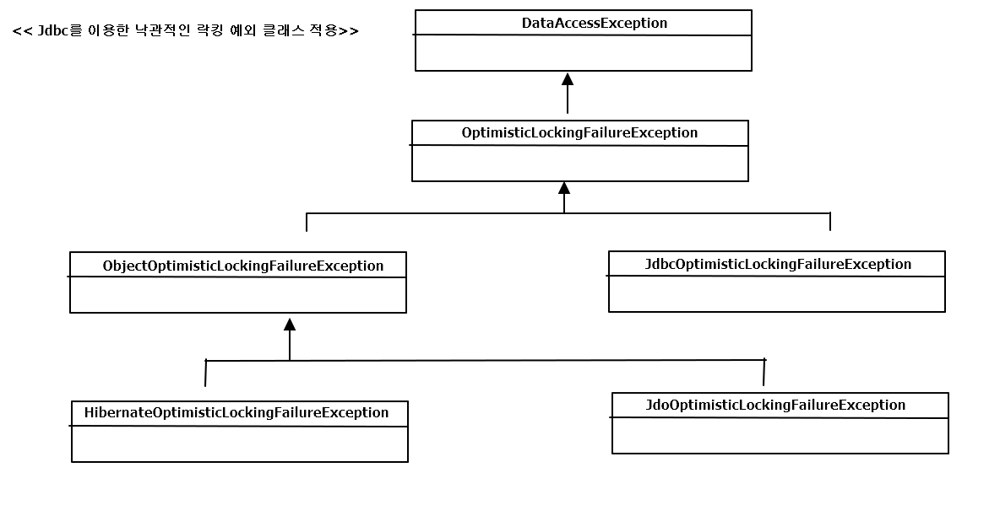
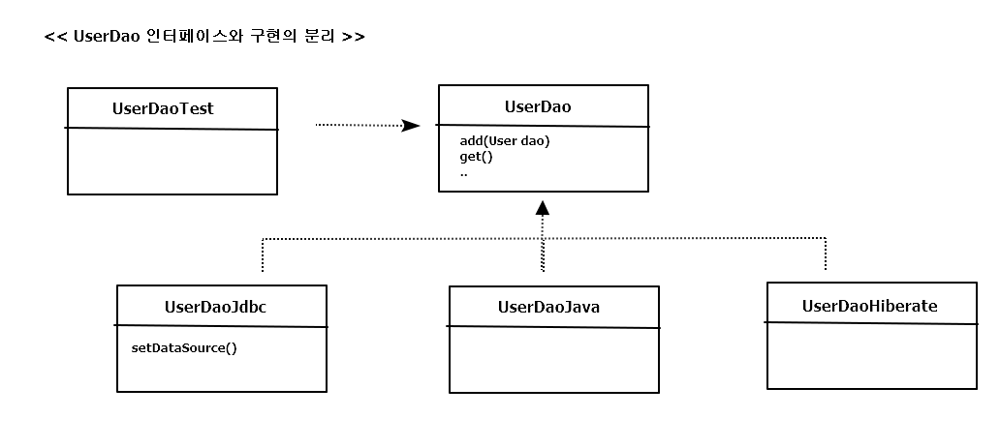

## 예외 전환

예외를 다른 것으로 바꿔서 던지는 예외 전환은 목적은

1. 굳이 필요하지 않은 catch/throws를 줄여주는 것
2. 로우레벨의 예외를 좀 더 의미 있고 추상화된 예외로 바꿔서 던져주는 것

=> JdbcTemplate의 DataAccessException 는 SQLException을 런타임 예외로 포장해주는 역할

또한, DataAccessException SQLException에 다루기 힘든 상세한 예외정보를 의미 있고

일관성 있는 예외로 전환해서 추상화해주려는 용도로 쓰임

### 4.2.1 JDBC의 한계

JDBC는 자바 표준 JDK에서도 가장 많이 사용되는 기능 중의 하나.

-> JDBC는 자바를 이용해 DB에 접근하는 방법을 추상화된 API 형태로 정의해놓고, 

각 DB 업체가 JDBC 표준을 따라 만들어진 드라이버를 제공하게 해줌.

BUT DB 종류에 상관없이 사용할 수 있는 데이터 엑세스 코드를 작성하는 일은 쉽지 않음.

표준화된 JDBC API가 DB프로그램 개발 방법을 학습하는 부담을 줄여주지만, DB를 자유롭게 바꾸어

사용할 수 있는 DB 프로그램을 작성하는 데는 2가지 걸림돌이 있음.

**비표준 SQL**

; JDBC 코드에서 사용하는 SQL. SQL은 어느 정도 표준화된 언어이고 몇 가지 표준 규약이 있긴 하지만,

대부분의 DB는 표준을 따르지 않고 비표준 문법과 기능도 제공. 이런 비표준 특정 DB 전용 문법은 매우 폭 넓게

사용되고 있음. 해당 DB의 특별한 기능을 사용하거나 최적화된 SQL을 만들 때 유용하기 때문.

=> 결국 DAO는 DB에 대해 종속적인 코드가 됨.

=> 이런 문제를 해결하기 위해 1) 표준 SQL만 사용  // 2) DB 별도의 DAO // 3) SQL을 외부로 독립  
1) 표준 SQL만 사용 ==> 예제 정도의 수준이면 모를까 현실성 X

**효환성 없는 SQLException의 DB 에러정보**

; SQLException.

=> SQL문법 오류, DB 커넥션 가져오기 실패, 테이블 필드 존재 X 등등 수백가지의 원인이 있음.

=> DB마다 SQL만 다른 것이 아니라, 에러의 종류와 원인도 각각 제각각 인 점. => SQLException에 담아 던짐

=> getErrorCode()로 가져올 수 있는 DB 에러 코드는 DB벤더가 정의한 고유 한 에러 코드를 사용하기 때문에 모두 다름.

=> SQLException은 예외가 발생했을 때의 DB 상태를 담은 SQL 상태정보를 부가적으로 제공. getSQLState() 메소드로

예외 상황에 대한 상태정보를 가져올 수 있음.

=> DB별로 달라지는 에러 코드를 대신할 수 있도록, Open Group의 XOPEN SQL 스펙에 정의된 SQL 상태 코드를 따르도록 되어 있음

e.g) 통신장애로 DB 연결 실패 == 08S01, 테이블 존재X == 42S02 같은 식으로 DB 독립적인 표준 상태 코드가 정의되어 있음.

( 앞의 두 자리는 클래스 코드, 뒤의 세 자리는 서브클래스 코드로 분류 )

BUT 문제는, DB의 JDBC 드라이버에서 SQLException을 담을 상태 코드를 정확하게 만들어주지 않는다는 점.

-> 어떤 경우에는 아예 표준 코드와는 상관없는 엉뚱한 값이 들어 있기도 하고, 어떤 DB는 반만 따르고 등등

=> 호환성 없는 에러 코드와 표준을 잘 따르지 않는 상태코드를 가진 SQLException만으로는 DB에 독립적인

유연한 코드를 작성하는 건 불가능에 가까움.

### 4.2.2 DB 에러 코드 매핑을 통한 전환
; DB 종류가 바뀌더라도 DAO를 수정하지 않으려면 이 두가지 문제를 해결 해야 함. SQL문은 뒤에서 설명,

여기서는 SQLException의 비표준 에러 코드와 SQL 상태정보에 대한 해결책을 찾아봄

-> DB별 에러 코드를 참고해서 발생한 예외의 원인이 무엇인지 해석해주는 기능을 만드는 것.

e.g) 키 값 중복은 MySQL == 1062, Oracle == 1, DB2 == -803 에러 코드

-> 스프링은 DataAccessException의 서브 클래스로 세분화 된 예외클래스들을 정의하고 있음.

<table>
	<tr>
		<th>BadSqlGrammarException</th>
		<td>SQL문법 에러</td>
	</tr>
	<tr>
		<th>DataAccessResourceFailureException</th>
		<td>DB 커넥션을 가져오지 못했을 때</td>
	</tr>	
	<tr>
		<th>DataIntegrityViolationException</th>
		<td>데이터의 제약 조건 위배 등 일관성을 지키지 않는 작업</td>
	</tr>
	<tr>
		<th>DuplicatedKeyException</th>
		<td>중복 키</td>
	</tr>
</table>

---

> 오클 에러 코드 매핑 파일 (org.springframework.jdbc.support.sql-error-codes.xml 중 )

<pre>
&lt;bean id=&quot;Oracle&quot; class=&quot;org.springframework.jdbc.support.SQLErrorCodes&quot;&gt;
		&lt;property name=&quot;badSqlGrammarCodes&quot;&gt;
			&lt;value&gt;900,903,904,917,936,942,17006&lt;/value&gt;
		&lt;/property&gt;
		&lt;property name=&quot;invalidResultSetAccessCodes&quot;&gt;
			&lt;value&gt;17003&lt;/value&gt;
		&lt;/property&gt;
		&lt;property name=&quot;duplicateKeyCodes&quot;&gt;
			&lt;value&gt;1&lt;/value&gt;
		&lt;/property&gt;
		&lt;property name=&quot;dataIntegrityViolationCodes&quot;&gt;
			&lt;value&gt;1400,1722,2291,2292&lt;/value&gt;
		&lt;/property&gt;
		&lt;property name=&quot;dataAccessResourceFailureCodes&quot;&gt;
			&lt;value&gt;17002,17447&lt;/value&gt;
		&lt;/property&gt;
		&lt;property name=&quot;cannotAcquireLockCodes&quot;&gt;
			&lt;value&gt;54&lt;/value&gt;
		&lt;/property&gt;
		&lt;property name=&quot;cannotSerializeTransactionCodes&quot;&gt;
			&lt;value&gt;8177&lt;/value&gt;
		&lt;/property&gt;
		&lt;property name=&quot;deadlockLoserCodes&quot;&gt;
			&lt;value&gt;60&lt;/value&gt;
		&lt;/property&gt;
	&lt;/bean&gt;

</pre>

-> JdbcTemplate은 SQLException을 단지 런타임 예외인 DataAccessException으로 포장하는 것이 아니라,

DB 에러 코드를 DataAccessException 계층구조의 클래스 중 하나로 매핑

=> 드라이버나 DB 메타정보를 참고해서 DB 종류를 확인하고 DB별로 미리 준비된 위와같은 매핑정보를

참고해서 적절한 예외 클래스를 선택하기 때문에 DB가 달라져도 같은 종류의 에러라면 동일한

예외를 받을 수 있는 것. 

> JdbcTemplate이 제공하는 예외 전환 기능을 이용하는 add()메소드

<pre>
public void add(final User user) throws DuplicateKeyException {		
	this.jdbcTemplate.update("insert into users(id, name, password) values(?,?,?)",
			user.getId(), user.getName(), user.getPassword() );
}
</pre>

-> DB종류에 상관없이 중복 키로 인해 발생하는 에러는 DataAccessException의 서브 클래스인 DuplicateKeyException

으로 매핑돼서 던저짐

---

=> 중복키 에러가 발생했을 때 애플리케이션에서 직접 정의한 예외를 발생시키고 싶은 경우가 존재

( 개발 정책 때문일 수도, DuplicateKeyExcepion의 런타임 예외이기 때문에 강제하지 않는 것이 불안 등등 )

---

> 중복키 예외의 전환

<pre>
public void add(final User user) throws DuplicatedUserIdException {
	try {
		this.jdbcTemplate.update("insert into users(id, name, password) values(?,?,?)",
				user.getId(), user.getName(), user.getPassword() );
	}
	catch(DuplicateKeyException e) {
		// 로그를 남기는 등의 필요한 작업
		// 예외를 전환할때는 원인이 되는 예외를 중첩하는 것이 좋음
		throw new DuplicatedUserIdException(e);
	}
}
</pre>

---

### 4.2.3 DAO 인터페이스와 DataAccessException 계층 구조
; DataAccessException는 JDBC의 SQLException을 전환하는 용도로만 만들어진

것이 아니라, JDBC 외의 데이터 엑세스 기술에서 발생하는 예외에도 적용 됨.

=> 자바에는 JDBC 외에도 데이터 엑세스를 위한 표준 기술이 존재.

=> DataAccessException은 의미가 같은 예외라면 데이터 엑세스 기술의 종류와 상관없이

일관된 예외가 발생하도록 만들어 줌.

**DAO 인터페이스와 구현의 분리**

*DAO를 굳이 따로 만들어서 사용하는 이유?*  
데이터 엑세스 로직을 담은 코드를 성격이 다른 코드에서 분리해놓기 위해. 또한, 분리된 DAO는  
전략 패턴을 적용해 구현 방법을 변경해서 사용할 수 있게 만들기 위해서이기도 함.  
( User와 같은 자바빈으로 만들어진, 특정 기술에 독립적이 ㄴ단순한 오브젝트를 주고 받으면서 데이터 엑세스   
기능을 사용하기만 하면 됨 )  

=> DAO는 인터페이스를 사용해 구체적인 클래스 정보와 구현 방법은 감추고, DI를 통해 제공되도록 만드는 것이 바람직!

---

> 기술에 독립적인 이상적인 DAO 인터페이스

<pre>
public interface UserDao {
	public void add(User user);
	...
}
</pre>

-> DAO에서 사용하는 데이터 엑세스 기술의 API가 예외를 던지기 때문에, 아래와 같이 선언돼야 함.

<pre>
public void add(User user) throws SQLException; 
public void add(User user) throws PersistenceException; //JPA
public void add(User user) throws HibernateException; //Hibernate
public void add(User user) throws JdoException; //JDO
</pre>

---

=> 가장 단순한 해결 방법은 throws Exception; 으로 선언하지만 무책임한 선언

=> JDO,Hibernate, JPA 등의 기술은 SQLException 같은 체크 예외 대신 런타임 예외를 사용

=> JDBC API를 사용하는 경우에는 Dao에서 직접 런타임 예외로 포장하면 throws 없이 add() 선언 가능.

==> 대부분의 데이터 엑세스 예외는 애플리케이션에서는 복구 불가능하거나 할 필요가 없는 것이지만,

모든 예외를 다 무시해야 하는 건 아님(중복 키 에러 처럼)

하지만 문제는 데이터 엑세스 기술에 따라 다르게 포장해야 됨

**데이터 엑세스 예외 추상화와 DataAccessException 계층구조**

; 스프링은 자바의 다양한 데이터 엑세스 기술을 사용할 때 발생하는 예외들을 추상화해서 DataAccessException 

계층구조 안에 정리해 놓음

=> 단순히 JDBC SQLException 전환용도가 아니라, 자바의 주요 데이터 엑세스 기술에서 발생할 수 있는 대부분의

예외를 추상화 하고 있음.JDBC에서 발생하지 않지만, ORM(JPA,하이버네이트..)에서만 발생하는 예외 중 공통적으로

나타나는 예외를 포함해서 계층구조로 분류

=> JDBC,JDO,JPA,하이버네이트에 상관없이 데이터 엑세스 기술을 부정확하게 사용했을 때는

InvalidDataAccessResourceUsageException이 발생

- JDBC : BadSqlGrammarException
- 하이버네이트 : HibernateQueryException or TypeMismatchDataAccessException 등으로 구분

=> 스프링이 기술의 종류에 상관없이 이런 성격의 예외를 InvalidDataAccessResourceUsageException 으로

던져주므로 시스템 레벨의 예외처리 작업을 통해 개발자에게 빠르게 통보해주도록 만들 수 있음.

=> JDO,JPA,하이버네이트처럼 오브젝트/엔티티 단위로 정보를 업데이트하는 경우에는 낙관적인 락킹(optimistic locking)

이 발생할 수 있음( 두 명 이상의 사용자가 동시에 조회하고 순차적으로 업데이트할 때, 뒤늦게 업데이트 한 것이 먼저 업데이트 한

것을 덮어쓰지 않도록 막아주는 데 쓸 수 있는 편리한 기능 )

=> 엑세스 기술마다 다른 종류의 낙관적인 락킹 예외를 던지지만, 스프링에서는 DataAccessException의 서브 클래스인

ObjectOptimisticLockingFailureException으로 통일 가능.

=> 기술에 상관없이 낙관적인 락킹이 발생했을 때 일관된 방식으로 예외처리를 하려면,

OptimisticLockingFailureException을 잡도록 만들면 됨!

추가적으로 IncorrectResultSizeDataAccessException 등 DataAccessException 계층 구조에는 

템플릿 메소드나 DAO 메소드에서 직접 활용할 수 있는 예외도 정의되어 있음.

### 4.2.4 기술에 독립적인 UserDao 만들기

**인터페이스 적용**

1. 인터페이스 구분하기 위해 인터페이스 이름 앞에는 I라는 접두어를 붙이는 방법
2. 인터페이스 이름은 가장 단순히 하고, 구현 클래스는 특징을 따르는 이름 <<사용

---

> UserDao 인터페이스

<pre>
...
public interface UserDao {	
	void add(User user);
	User get(String id);
	List<User> getAll();
	void deleteAll();
	int getCount();
}
...
</pre>

-> setDataSource() 메소드는 인터페이스 추가 하지 말기

(UserDao의 구현 방법에 따라 변경될 수 있는 메소드이고, UserDao를 사용하는

클라이언트가 알고 있을 필요도 X )

> UserDao 클래스 이름 변경

<pre>
public class UserDaoJdbc implements UserDao {
...	
</pre>

> 빈 클래스 변경
<pre>
&lt;bean id=&quot;userDao&quot; class=&quot;springbook.user.dao.UserDaoJdbc&quot;&gt;
		&lt;property name=&quot;dataSource&quot; ref=&quot;dataSource&quot; /&gt;		
&lt;/bean&gt;
</pre>

-> 보통 빈의 이름은 클래스 이름이 아니라 , 인터페이스 이름을 따르는 경우가 일반적.

---

**테스트 보완**

<pre>
public class UserDaoJdbcTest {
	@Autowired
	private UserDao dao;
	...	
</pre>

*UserDaoJdbc로 변경 해야 하나?*

-> 의도(테스트의 관심)에 따라서 작성하면 됨.

1. 구현 기술에 상관없이 DAO의 기능이 동작하는 데만 관심이 있다면, UserDao 인터페이스 참조 타입 선언
2. 특정 기술을 사용한 UserDao의 구현 내용에 관심을 가지면, UserDaoJdbc로 선언

---

> DataAccessException에 대한 테스트

<pre>
@Test(expected=DataAccessException.class)
public void duplicateKey() {
	dao.deleteAll();		
	dao.add(user1);
	dao.add(user1);
}
</pre>

-> 성공 시 DataAccessException이 던져짐.

-> 어떤 예외가 발생했는지 확인해보려면, 테스트를 실패하게 만들면 됨.(expected=Data... 지우고 테스트)

=> org.springframework.dao.DuplicateKeyException: PreparedStatementCallback; ...

=> DuplicateKeyException은 DataAccessException의 서브클래스로 

DataIntegrityViolationException의 한 종류임을 알 수 있음.

@Test(expected=DataIntegrityViolationException.class) 로 변경 후 테스트 성공하면

좀더 정확한 예외 발생을 확인하는 테스트가 됨.

---

**DataAccessException 활용 시 주의사항**

=> 스프링 3.x 버전 시점에서 (책 시점) DuplicateKeyException은 JDBC를 이용하는 경우에만 발생

e.g : 하이버네이트는 중복 키가 발생하는 경우에 하이버네이트의 ConstraintViolationException 발생

-> 제약조건을 위반하는 다른 상황에서도 동일한 예외가 발생하므로, DuplicateKeyException을 이용하는 

경우에 비해 이용가치가 떨어짐.

--- 

> SQLException 전환 기능의 학습 테스트

<pre>
...
@RunWith(SpringJUnit4ClassRunner.class)
@ContextConfiguration("classpath:test-applicationContext.xml")
public class UserDaoTest {	
	@Autowired
	private UserDao dao;
	@Autowired
	DataSource dataSource;
	...	
	@Test
	public void sqlExceptionTranslate() {
		dao.deleteAll();
		try {
			dao.add(user1);
			dao.add(user1);
		} catch(DuplicateKeyException ex) {
			SQLException sqlEx = (SQLException)ex.getRootCause();
			// 코드를 이용한 SQLException 전환
			SQLExceptionTranslator set = 
					new SQLErrorCodeSQLExceptionTranslator(this.dataSource);
			assertThat(set.translate(null, null, sqlEx),
					is(DuplicateKeyException.class));
		}
	}
	...
}
</pre>

1. 강제로 DuplicateKeyException을 발생
2. getRoodCause()를 이용해 중첩되어 있는 SQLException을 가져옴
3. DataSource를 이용해 SQLErrorCodeSQLExceptionTranslator 오브젝트 생성
4. translate()를 이용해 DataAccessExcetpion 타입 예외로 변환
5. DataAccessExcetpion이 DuplicateKeyException인지 check

