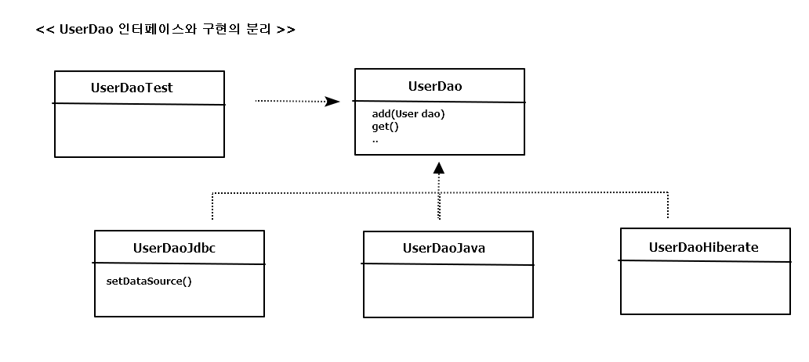

# ch4 예외

- <a href="#4.1">사라진 SQLException</a>
- <a href="#4.2">예외전환</a>
- <a href="#4.3">정리</a>

## 4.1 사라진 SQLException

---

> JdbcTemplate를 적용하기 전 달라진 부분

<pre>

/** JdbcTemplate 적용 전  */
public void deleteAll() throws SQLException {
	this.jdbcConext.executeSql("delete from users");
}

/** JdbcTemplate 적용 후  */
public void deleteAll() {
	this.jdbcTemplate.update("delete from users");
}
</pre>

-> 예외를 전가하는 부분!

---

### 4.1.1 초난감 예외처리
; 개발자들의 코드에서 종종 발견되는 초난감 예외처리의 대표선수들을 살펴보기

**예외블랙홀**

---

> 초난감 예외처리 코드 1

<pre>
try {
	...
}
catch(SQLException e) {
}
</pre>

-> 예외를 잡고 아무것도 하지 않음. 예외 발생을 무시해버리고 정상적인 상황인 것처럼 다음

라인으로 넘어가겠다는 분명한 의도가 있는 게 아니면, 연습 중에도 절대 만들어서는 안되는 코드!

-> 발생한 예외로 인해 어떤 기능이 비정상적으로 동작하거나, 메모리나 리소스가 소진되거나, 예상치

못한 다른 문제를 일으킴. 최종적으로 오작동을 하거나 시스템 오류가 나서 운영자가 알아차렸을 떄는 이미

조치를 취하기엔 너무 늦음.

> 초난감 예외처리 코드 2

<pre>
} catch(SQLExcpetion e) {
	System.out.println(e);
}
</pre>

> 초난감 예외처리 코드 3

<pre>
} catch(SQLExcpetion e) {
	e.printStackTrace();
}
</pre>

-> 개발 중에는 IDE 콘솔이나 서버 실행창에 이 메시지가 눈에 확 띄게 보이니 문제가 생겨도

금방 알아차리고 조취를 취할 수 있을지 모르지만, 다른 로그나 메시지에 금방 묻혀버리면 놓치기 쉽상.

-> 예외는 처리돼야 한다. 그런데 위 코드처럼 화면에 메세지를 출력한 것은 예외를 처리한 게 아니다.

==> 예외를 처리할 때 반드시 지켜야 할 핵심 원칙은 한 가지.

**모든 예외는 적절하가 복구되든지 아니면 작업을 중단시키고 운영자 또는 개발자에게 분명하게 통보돼야 함.**

-> SQLException이 발생하는 이유는 SQL 문법 에러가 있거나 DB에서 처리할 수 없을 정도로

데이터 엑세스 로직에 심각한 버그가 있거나, 서버가 죽거나 네트워크가 끊기는 등의 심각한 상황이 벌어졌기 때문.

> 그나마 나은 예외 처리

<pre>
} catch(SQLException e) {
	e.printStackTrace();
	System.exit(1);
}
</pre>

-> 실전에서 이렇게 만들라는 게 아니라, 예외를 무시하거나 잡아먹어 버리는 코드는 만들지 말라는 뜻.

---

**무의미하고 무책임한 throws**

-> catch 블록으로 예외를 잡아봐야 해결할 방법도 없고 JDK API나 라이브러리가 던지는 각종 이름도

긴 예외들을 처리하는 코드를 매번 throws로 선언하기도 귀찮아지기 시작하면, 아래와 같이 던지는 코드도 있음

-> EJB가 한창 쓰이던 시절에 흔히 볼 수 있던 코드. API 등에서 발생하는 예외를 일일이 catch 하기도 귀찮고,

별 필요도 없으며 매번 정확하게 예외 이름을 적어서 선언하기도 귀찮으니 아예 throws Exception이라는

모든 예외를 무조건 던져버리는 선언을 모든 메소드에 기계적으로 넣는 것!

-> 만약 저 메소드를 쓰려고 하면, 의미 있는 정보를 얻을 수 없음. 결국 throw Exception 반복 후 결과적으로

적절한 처리를 통해 복구될 수 있는 예외상황도 제대로 다룰 수 있는 기회를 박탈!

## 4.1.2 예외의 종류와 특징
; 예외처리에 관해서는 자바 개발자들 사이에서도 오랫동안 많은 논쟁이 있었음.

가장 큰 이슈는 체크 예외(checked exception), 명시적인 처리가 필요한 예외를 사용하고 다루는 방법

**Error**

; java.lang.Error의 서브클래스들은 시스템에 뭔가 비정상적인 상황이 발생했을 경우에 사용됨.

그래서 주로 자바 VM에서 발생시키는 것이고 애플리케이션 코드에서 잡으려고 하면 안됨

(OutOfMemoryError 나 ThreadDeath 같은 에러는 catch 블록으로 잡아도 아무런 대응 방법 X)

-> 시스템 레벨에서 특별한 작업을 하는 게 아니라면, 애플리케이션에서는 이런 에러에 대한 처리는 신경쓰지 않아도 됨.

**Exception과 체크 예외**

; java.lang.Exception 클래스와 그 서브클래스로 정의되는 예외들은 에러와 달리

개발자들이 만든 애플리케이션 코드의 작업 중에 예외상황이 발생했을 경우에 사용

- 체크 예외 : Exception의 서브클래스 && RuntimeException 클래스를 상속하지 않는 것
- 언체크 예외(unchecked exception) : RuntimeException을 상속한 클래스들

-> 일반적으로 예외라고 하면 Exception 클래스의 서브 클래스 중에서 RuntimeException을 상속하지

않은 것만을 말하는 체크 예외라고 생각 해도 됨.

-> 자바 언어와 JDK의 초기 설계자들은 체크 예외를 발생 가능한 예외에 모두 적용하려고 했던 것 같음. 그래서

IOException 이나 SQLException을 비롯해서 예외적인 상황에서 던져질 가능성이 있는 것들 대부분이

체크 예외로 만들어져 있음.

**RuntimeException과 언체크/런타임 예외**

; java.lang.RuntimeException 클래스를 상속한 예외들은 명시적인 예외처리를 강제하지 않기 때문에

언체크 예외 or 런타임 예외 라고 불림.

-> 대표적으로 NullPointerException 이나, 허용되지 않은 값을 사용해서 메소드를 호출할 때 발생하는
IllegalArgumentException 등이 있음.

=> 자바언어를 설계하고 JDK를 개발한 사람들의 이런 설계의도는 현실과 잘 맞지 않았고 비난의 대상이 됨.

특히, 체크 예외의 불필요성을 주장하는 사람들이 늘어갔음. 체크 예외가 예외처리를 강제하는 것 때문에

예외 블랙홀이나 무책임한 throws 같은 코드가 남발. 최근 새로 등장하는 자바 표준 스펙의 API들은 예상 가능한

예외상황을 다루는 예외를 체크 예외로 만들지 않는 경향이 있기도 함.

### 4.1.3 예외처리 방법
; 예외를 처리하는 일반적인 방법을 살펴보고 나서 효과적인 예외처리 전략을 생각해 보기.

**예외복구**

; 예외상황을 파악하고 문제를 해결해서 정상 상태로 돌려 놓는 것.

e.g )

1. 사용자가 요청한 파일을 읽으려고 시도했는데 해당 파일이 없거나 다른 문제가 있어서 읽히지 않아서 
IOException이 발생했다고 가정.

-> 사용자에게 상황을 알려주고 다른 파일을 이용하도록 안내해서 예외상황을 해결할 수 있음. 
( 예외로 인해 기본 작업 흐름이 불가능하다면, 다른 작업 흐름으로 자연스럽게 유도 )

2. 원격 DB 서버에 접속하다 실패해서 SQLException이 발생하는 경우

-> 일정시간 대기했다가 다시 접속을 시도해보는 방법을 사용해서 예외상황으로부터 복구를 시도할 수 있음.

=> 예외처리 코드를 강제하는 체크 예외들은 , 위와 같이 예외를 어떤 식으로든 복구할 가능성이 있는 경우에 사용.

API를 사용하는 개발자로 하여금 예외상황이 발생할 수 있음을 인식하도록 도와주고, 이에 대한 적절한 처리를 시도하도록 유도

---

> 재시도를 통해 에외를 복구하는 코드

<pre>
int maxretry = MAX_RETRY;
while(maxretry-- > 0) {
	try {
		... 	// 예외가 발생할 가능성이 있는 시도
		return; // 작업 성공
	}
	catch(SomeException e) {
		// 로그 출력. 정해진 시간만큼 대기
	}
	finally {
		// 리소스 반납. 정리 작업
	}
}
throw new RetryFailException(); // 최대 재시도 횟수를 넘기면 직접 예외 발생
</pre>

---

**예외처리 회피**

; 예외처리를 자신이 담당하지 않고, 호출한 쪽으로 던지는 것.

---

> 예외처리 회피1

<pre>
public void add() throws SQLException {
	// JDBC API
}
</pre>

> 예외처리 회피2

<pre>
public void add() throws SQLException {
	try {
		//JDBC API
	}
	catch(SQLException e) {
		// 로그 출력
		throw e;
	}
}
</pre>

---

-> 콜백 오브젝트는 SQLException을 처리하는 역할이 아니라고 보기 때문에, 모두 전가 되어 있음.

-> 콜백과 템플릿 처럼, 긴밀하게 역할을 분담하고 있는 관계가 아니라면, 자신의 코드에서 발생하는 예외를

던지는 것은 무책임한 회피!

-> DAO가 SQLException을 던지면 서비스 계층이나 웹 컨틀로러에서 SQLException을 제대로 처리할 수 있을까?

=> 예외를 회피하는 것은 예외를 복구하는 것처럼 의도가 분명해야 함. 콜백/템플릿처럼 긴밀한 관계에 있는 다른 오브젝트에게

예외처리 책임을 분명히 지게하거나 자신을 사용하는 쪽에서 예외를 다루는 게 최선의 방법이라는 분명한 확신이 있어야 함!

**예외 전환(Exception translation)**

; 예외 회피와 비슷하게 예외를 복구해서 정상적인 상태로는 만들 수 없기 때문에, 예외를 메소드 밖으로 던지는 것

발생한 예외를 그냥 넘기는 게 아니라, 적절한 예외로 전환해서 던지다는 특징이 있음!

*예외전환은 목적*

1. 내부에서 발생한 예외를 그대로 던지는 것이 그 예외상황에 대한 적절한 의미를 부여해주지 못하는 경우에, 의미를 분명하게

해줄 수 있는 예외로 바꾸기 위해. API가 발생하는 기술적인 로우레벨을 상황에 적합한 의미를 가진 예외로 변경 하는 것.

e.g) 사용자 등록 시 중복 아이디  
DAO 메소드가 SQLException을 그대로 밖으로 던져버리면, DAO를 이용해 사용자를 추가하려고 한 서비스 계층 등에서는 
자세한 이유를 알 수 없음. 아이디 중복은 충분히 예상 가능하고 복구 가능한 예외상황! 
-> DuplicateUserIdException 같은 예외로 바꿔서 던져주는 게 좋음. 
서비스 계층 오브젝트에서 SQLException의 원인을 해석해서 대응하는 것도 불가능하지는 않지만, 특정 기술의 정보를 해석하는 코드를 
비즈니스 로직을 담은 서비스 계층에 두는 건 매우 어색 

---

> 예외 전환 기능을 가진 DAO 메소드

<pre>
public void add(final User user) throws DuplicateUserIdException, SQLException {
	try {
		// JDBC를 이용해 user 정보를 DB에 추가하는 코드 또는
		// 그런 기능을 가진 다른 SQLException을 던지는 메소드를 호출하는 코드
	}
	catch(SQLException e) {
		// ErrorCode가 MySQL의 "Duplicate Entry(1062)"이면 예외 전환
		if( e.getErrorCode() == MysqlErrornumbers.ER_DUP_ENTRY )
			throw DuplicateUserIdException();
		else
			throw e; // 그 외의 경우는 SQLException 그대로
	}
}
</pre>

-> 보통 전환하는 예외에 원래 발생한 예외를 담아서 중첩 예외(nested exception)로 만드는 것이 좋음

> 중첩 예외 1

<pre>
catch(SQLException e) {
	...
	throw DuplicateUserIdException(e);
}
</pre>

> 중첩 예외 2
<pre>
catch(SQLException e) {
	...
	throw DuplicateUserIdException().initCause(e);
}
</pre>

---

2. 예외를 처리하기 쉽고 단순하게 만들기 위해 포장(wrap)하는 것.

-> 예외를 명확하게 하려고 다른 예외로 전환하는 것이 아니라,

주로 예외처리를 강제하는 체크 예외를 언체크 예외인 런타임 예외로 바꾸는 경우에 사용.

대표적으로 EJBException을 들 을 수 있음. EJB 컴포넌트 코드에서 발생하는 대부분의

체크 예외는 비즈니스 로직으로 볼 때 의미 있는 예외이거나 복구 가능한 예외가 아님\

---

> 예외 포장

<pre>
try {
	OrderHome orderHome = EJBHomeFactory.getInstance().getOrderHome();
	Order order = orderHome.findByPrimaryKey(Integer id);
} catch(NamingException ne) {
	throw new EJBException(ne);
} catch(SQLException se) {
	throw new EJBException(se);
} catch(RemoteException re) {
	throw new EJBException(re);
}
</pre>

-> EJBException은 RuntimeException 클래스를 상속한 런타임 예외

-> 시스템 익셉션으로 인식하고 트랜잭션을 자동으로 롤백.

-> 런타임 예외이기 때문에 EJB 컴포넌트를 사용하는 다른 EJB나 클라이언트에서 일일이

예외를 잡거나 다시 던지는 수고를 할 필요가 없음. 이런 예외는 잡아도 복구할 만한 방법X

---

=> 애플리케이션 로직상에서 예외조건이 발견되거나 예외상황이 발생할 수도 있음. 이런 것은 API가 던지는

예외가 아니라 애플리케이션 코드에서 의도적으로 던지는 예외

=> 이때는 체크 예외를 사용해 적절한 대응이나 복구 작업이 필요!

=> 무의미하거나 불필요하게 throws를 사용해 넘기지 않도록 해줘야 함.

=> 대부분의 서버 환경에서는 애플리케이션 코드에서 처리하지 않고 전달된 예외들을 일괄적으로 다룰 수 있는

기능을 제공.

=> 어차피 복구하지 못할 예외라면, 애플리케이션 코드에서는 런타임 예외로 포장해서 던져버리고 예외 처리 서비스 등을

이용해 자세한 로그를 남기고, 관리자에게는 메일 등으로 통보해주고 사용자에게 친절한 안내 메시지를 보여주는 식으로 처리하는 게

바람 직.

### 4.1.4 예외처리 전략
; 자바의 예외를 이용하는 것은 간단하지만, 예외를 효과적으로 사용하기 예외가 발생하는 코드를 깔끔하게 정리하는 데는

신경써야 할 사항들이 많음

**런타임 예외의 보편화**

체크 예외는 복구 할 가능성이 조금이라도 있기 때문에 catch or throws 선언을 강제하고 있음.

-> 개발자의 실수를 방지하기 위한 배려라고 볼 수도 있지만, 실제로는 예외를 제대로 다루고 싶지 않을 만큼

짜증나는 원인이 되기도 함.

-> 자바가 처음 만들어 질 때 많이 사용되던 애플릿,AWT,Swing 을 사용한 독립 애플리케이션에서는 통제 불가능 한

시스템 예외라고 할지라도 애플리케이션의 작업이 중단되지 않게 해주고 상황을 복구해야 했음.

-> 자바 엔터프라이즈 서버 환경은 다름. 수많은 사용자가 동시에 요청을 보내고, 각 요청이 독립적인 작업으로 취급 됨.

**add() 메소드의 예외처리**

; add()메소드는 DuplicatedUserIdException과 SQLException 두 가지의 체크 예외를 던지게 되어 있음.

-> DuplicatedUserIdException은 충분히 복구 가능한 예외이므로 add() 메소드를 사용하는 쪽에서 대응할 수

있지만, SQLException은 대부분 복구 불가능한 예외이므로 잡아봤자 처리할 것도 없고, 결국 throws를 타고 계속

앞으로 전달됨

=> 차라리 런타임 예외로 포장해 던져버려서 그 밖의 메소드들이 신경쓰지 않게 해주는 편이 나음.

=> DuplicatedUserIdException역시 굳이 체크 예외로 둬야하는 것은 아니고, 어디서든 이 예외를 처리할 수 있다면,

굳이 체크 예외로 만들지 않고 런타임 예외로 만드는게 낫고 대신 add() 메소드는 명시적으로 DuplicatedUserIdException을

던진다고 선언해야 함.

---

> 아이디 중복 시 사용하는 예외

<pre>
public class DuplicatedUserIdException extends RuntimeException {
	public DuplicatedUserIdException(Throwable cause) {
		super(cause);
	}
}
</pre>

-> 필요하면 언제든지 잡아서 처리할 수 있도록 별도의 예외로 정의하지만, 필요 없다면 신경쓰지 않아도 되도록

RuntimeException을 상속한 런타임 예외로 만들기.

> 예외처리 전략을 이용한 add()

<pre>
public void add(final User user) throws DuplicatedUserIdException {
	try {
		// JDBC를 이용해 user 정보를 DB에 추가하는 코드 또는
		// 그런 기능이 있는 다른 SQLException을 던지는 메소드를 호출하는 코드
	} catch(SQLException e) {
		if( e.getErrorCode() == MysqlErrorNumbers.ER_DUP_ENTRY )
			throw new DuplicatedUserIdException(e); // 예외 전환
		else
			throw new RuntimeException(e); // 예외 포장
	}				
}
</pre>

-> add()메소드를 사용하는 오브젝트는 SQLException을 처리하기 위해 불필요한

throws 를 선언 할 필요는 없으면서, 필요한 경우 아이디 중복 상황을 처리하기

위해 DuplicatedUserIdException을 이용할 수 있음.

---

=> 이렇게 런타임 예외를 일반화해서 사용하는 방법은 여러모로 장점이 많음. 단, 런타임

예외로 만들었기 때문에 사용에 더 주의를 기울일 필요가 있음. 컴파일 타임에 강제처리 되지 않으므로,

신경 쓰지 않으면 예외상황을 충분히 고려하지 않을 수도 있기 때문.

=> API 문서나 레퍼런스 문서 등을 통해, 메소드를 사용할 때 발생할 수 있는 예외의 종류와

원인, 활용 방법을 자세히 설명해두기!

**애플리케이션 예외**

런타임 예외 중심의 전략은 굳이 이름을 붙이면, 낙관적인 예외처리 기법

일단 복구할 수 있는 예외는 없다고 가정하고 예외가 생겨도 어차피 런타임 예외 이므로

시스템 레벨에서 알아서 처리해줄 것이고, 꼭 필요한 경우는 런타임 예외라도 잡아서 복구하거나

대응해줄 수 있으니 문제 될 것이 없다는 낙관적인 태도를 기반!

=> 반면 애플리케이션 자체의 로직에 의해 의도적으로 발생시키고, 반드시 catch 해서 무엇인가

조치를 취하도록 요구하는 예외도 있음 == 애플리케이션 예외

e.g ) 은행계좌에서 출금하는 기능을 가진 메소드(check 잔고확인, 허용 범위 등등 )  

1. 정상적인 출금처리를 했을 경우와 잔고 부족이 발생했을 경우에 각각 다른 종류의 리턴 값을 돌려주기  
정상 출금이면 양수, 아니면 0 or -1 과 같은 특별한 값을 리턴하기. 
 - 예외상황에 대한 리턴 값을 명확하게 코드화하고 잘 관리하지 않으면 혼란이 발생
 - 결과 값을 확인하는 조건문이 자주 등장
2. 정상적인 흐름을 따르는 코드는 그대로 두고, 잔고 부족과 같은 예외상황에서는 비즈니스적인 의미를 띈  
예외를 던지도록 만드는 것. 
-> 의도적으로 체크예외를 만들기.

---

> 애플리케이션 예외를 사용한 코드

<pre>
try {
	BigDecimal balance = account.withdraw(amount);
	...
	//정상적인 처리를 출력하도록 진행
}
catch(InsufficientBalanceException e) { // 체크 예외
	// InsufficientBalanceException에 담긴 인출 가능한 잠고금액 정보를 가져옴
	BigDecimal availFunds = e.getAvailFunds();
	...
	// 잔고 부족 안내 메시지를 준비하고 이를 출력하도록 진행
}
</pre>

---

### 4.1.5 SQLException은 어떻게 됐나?

*SQLException은 복구가 가능한 예외 인가?*  
99%는 코드 레벨에서는 복구할 방법이 없음. 프로그램의 오류 또는 개발자의 
부주의 때문에 발생하는 경우 or 통제할 수 없는 외부상황 때문에 발생하는 것. 
e.g) SQL문법이 틀렸거나, 제약조건 위반, DB 서버 다운, 네트워크 불안정, DB 커넥션 풀 문제 등 

=> 스프링의 JdbcTemplate은 바로 이 예외처리 전략을 따르고 있음. JdbcTemplate 탬플릿과

콜백 안에서 발생하는 모든 SQLException을 런타임 예외인 DataAccessException으로 포장해서 던져줌.

=> JdbcTemplate을 사용하는 UserDao 메소드에서는 꼭 필요한 경우에만 런타임 예외인 DataAccessException

을 잡아서 처리하면 되고, 그 외의 경우에는 무시해도 됨.

---

## 예외 전환

예외를 다른 것으로 바꿔서 던지는 예외 전환은 목적은

1. 굳이 필요하지 않은 catch/throws를 줄여주는 것
2. 로우레벨의 예외를 좀 더 의미 있고 추상화된 예외로 바꿔서 던져주는 것

=> JdbcTemplate의 DataAccessException 는 SQLException을 런타임 예외로 포장해주는 역할

또한, DataAccessException SQLException에 다루기 힘든 상세한 예외정보를 의미 있고

일관성 있는 예외로 전환해서 추상화해주려는 용도로 쓰임

### 4.2.1 JDBC의 한계

JDBC는 자바 표준 JDK에서도 가장 많이 사용되는 기능 중의 하나.

-> JDBC는 자바를 이용해 DB에 접근하는 방법을 추상화된 API 형태로 정의해놓고,

각 DB 업체가 JDBC 표준을 따라 만들어진 드라이버를 제공하게 해줌.

BUT DB 종류에 상관없이 사용할 수 있는 데이터 엑세스 코드를 작성하는 일은 쉽지 않음.

표준화된 JDBC API가 DB프로그램 개발 방법을 학습하는 부담을 줄여주지만, DB를 자유롭게 바꾸어

사용할 수 있는 DB 프로그램을 작성하는 데는 2가지 걸림돌이 있음.

**비표준 SQL**

; JDBC 코드에서 사용하는 SQL. SQL은 어느 정도 표준화된 언어이고 몇 가지 표준 규약이 있긴 하지만,

대부분의 DB는 표준을 따르지 않고 비표준 문법과 기능도 제공. 이런 비표준 특정 DB 전용 문법은 매우 폭 넓게

사용되고 있음. 해당 DB의 특별한 기능을 사용하거나 최적화된 SQL을 만들 때 유용하기 때문.

=> 결국 DAO는 DB에 대해 종속적인 코드가 됨.

=> 이런 문제를 해결하기 위해 1) 표준 SQL만 사용  // 2) DB 별도의 DAO // 3) SQL을 외부로 독립  
1) 표준 SQL만 사용 ==> 예제 정도의 수준이면 모를까 현실성 X

**효환성 없는 SQLException의 DB 에러정보**

; SQLException.

=> SQL문법 오류, DB 커넥션 가져오기 실패, 테이블 필드 존재 X 등등 수백가지의 원인이 있음.

=> DB마다 SQL만 다른 것이 아니라, 에러의 종류와 원인도 각각 제각각 인 점. => SQLException에 담아 던짐

=> getErrorCode()로 가져올 수 있는 DB 에러 코드는 DB벤더가 정의한 고유 한 에러 코드를 사용하기 때문에 모두 다름.

=> SQLException은 예외가 발생했을 때의 DB 상태를 담은 SQL 상태정보를 부가적으로 제공. getSQLState() 메소드로

예외 상황에 대한 상태정보를 가져올 수 있음.

=> DB별로 달라지는 에러 코드를 대신할 수 있도록, Open Group의 XOPEN SQL 스펙에 정의된 SQL 상태 코드를 따르도록 되어 있음

e.g) 통신장애로 DB 연결 실패 == 08S01, 테이블 존재X == 42S02 같은 식으로 DB 독립적인 표준 상태 코드가 정의되어 있음.

( 앞의 두 자리는 클래스 코드, 뒤의 세 자리는 서브클래스 코드로 분류 )

BUT 문제는, DB의 JDBC 드라이버에서 SQLException을 담을 상태 코드를 정확하게 만들어주지 않는다는 점.

-> 어떤 경우에는 아예 표준 코드와는 상관없는 엉뚱한 값이 들어 있기도 하고, 어떤 DB는 반만 따르고 등등

=> 호환성 없는 에러 코드와 표준을 잘 따르지 않는 상태코드를 가진 SQLException만으로는 DB에 독립적인

유연한 코드를 작성하는 건 불가능에 가까움.

### 4.2.2 DB 에러 코드 매핑을 통한 전환
; DB 종류가 바뀌더라도 DAO를 수정하지 않으려면 이 두가지 문제를 해결 해야 함. SQL문은 뒤에서 설명,

여기서는 SQLException의 비표준 에러 코드와 SQL 상태정보에 대한 해결책을 찾아봄

-> DB별 에러 코드를 참고해서 발생한 예외의 원인이 무엇인지 해석해주는 기능을 만드는 것.

e.g) 키 값 중복은 MySQL == 1062, Oracle == 1, DB2 == -803 에러 코드

-> 스프링은 DataAccessException의 서브 클래스로 세분화 된 예외클래스들을 정의하고 있음.

<table>
	<tr>
		<th>BadSqlGrammarException</th>
		<td>SQL문법 에러</td>
	</tr>
	<tr>
		<th>DataAccessResourceFailureException</th>
		<td>DB 커넥션을 가져오지 못했을 때</td>
	</tr>
	<tr>
		<th>DataIntegrityViolationException</th>
		<td>데이터의 제약 조건 위배 등 일관성을 지키지 않는 작업</td>
	</tr>
	<tr>
		<th>DuplicatedKeyException</th>
		<td>중복 키</td>
	</tr>
</table>

---

> 오클 에러 코드 매핑 파일 (org.springframework.jdbc.support.sql-error-codes.xml 중 )

<pre>
&lt;bean id=&quot;Oracle&quot; class=&quot;org.springframework.jdbc.support.SQLErrorCodes&quot;&gt;
		&lt;property name=&quot;badSqlGrammarCodes&quot;&gt;
			&lt;value&gt;900,903,904,917,936,942,17006&lt;/value&gt;
		&lt;/property&gt;
		&lt;property name=&quot;invalidResultSetAccessCodes&quot;&gt;
			&lt;value&gt;17003&lt;/value&gt;
		&lt;/property&gt;
		&lt;property name=&quot;duplicateKeyCodes&quot;&gt;
			&lt;value&gt;1&lt;/value&gt;
		&lt;/property&gt;
		&lt;property name=&quot;dataIntegrityViolationCodes&quot;&gt;
			&lt;value&gt;1400,1722,2291,2292&lt;/value&gt;
		&lt;/property&gt;
		&lt;property name=&quot;dataAccessResourceFailureCodes&quot;&gt;
			&lt;value&gt;17002,17447&lt;/value&gt;
		&lt;/property&gt;
		&lt;property name=&quot;cannotAcquireLockCodes&quot;&gt;
			&lt;value&gt;54&lt;/value&gt;
		&lt;/property&gt;
		&lt;property name=&quot;cannotSerializeTransactionCodes&quot;&gt;
			&lt;value&gt;8177&lt;/value&gt;
		&lt;/property&gt;
		&lt;property name=&quot;deadlockLoserCodes&quot;&gt;
			&lt;value&gt;60&lt;/value&gt;
		&lt;/property&gt;
	&lt;/bean&gt;

</pre>

-> JdbcTemplate은 SQLException을 단지 런타임 예외인 DataAccessException으로 포장하는 것이 아니라,

DB 에러 코드를 DataAccessException 계층구조의 클래스 중 하나로 매핑

=> 드라이버나 DB 메타정보를 참고해서 DB 종류를 확인하고 DB별로 미리 준비된 위와같은 매핑정보를

참고해서 적절한 예외 클래스를 선택하기 때문에 DB가 달라져도 같은 종류의 에러라면 동일한

예외를 받을 수 있는 것.

> JdbcTemplate이 제공하는 예외 전환 기능을 이용하는 add()메소드

<pre>
public void add(final User user) throws DuplicateKeyException {		
	this.jdbcTemplate.update("insert into users(id, name, password) values(?,?,?)",
			user.getId(), user.getName(), user.getPassword() );
}
</pre>

-> DB종류에 상관없이 중복 키로 인해 발생하는 에러는 DataAccessException의 서브 클래스인 DuplicateKeyException

으로 매핑돼서 던저짐

---

=> 중복키 에러가 발생했을 때 애플리케이션에서 직접 정의한 예외를 발생시키고 싶은 경우가 존재

( 개발 정책 때문일 수도, DuplicateKeyExcepion의 런타임 예외이기 때문에 강제하지 않는 것이 불안 등등 )

---

> 중복키 예외의 전환

<pre>
public void add(final User user) throws DuplicatedUserIdException {
	try {
		this.jdbcTemplate.update("insert into users(id, name, password) values(?,?,?)",
				user.getId(), user.getName(), user.getPassword() );
	}
	catch(DuplicateKeyException e) {
		// 로그를 남기는 등의 필요한 작업
		// 예외를 전환할때는 원인이 되는 예외를 중첩하는 것이 좋음
		throw new DuplicatedUserIdException(e);
	}
}
</pre>

---

### 4.2.3 DAO 인터페이스와 DataAccessException 계층 구조
; DataAccessException는 JDBC의 SQLException을 전환하는 용도로만 만들어진

것이 아니라, JDBC 외의 데이터 엑세스 기술에서 발생하는 예외에도 적용 됨.

=> 자바에는 JDBC 외에도 데이터 엑세스를 위한 표준 기술이 존재.

=> DataAccessException은 의미가 같은 예외라면 데이터 엑세스 기술의 종류와 상관없이

일관된 예외가 발생하도록 만들어 줌.

**DAO 인터페이스와 구현의 분리**

*DAO를 굳이 따로 만들어서 사용하는 이유?*  
데이터 엑세스 로직을 담은 코드를 성격이 다른 코드에서 분리해놓기 위해. 또한, 분리된 DAO는  
전략 패턴을 적용해 구현 방법을 변경해서 사용할 수 있게 만들기 위해서이기도 함.  
( User와 같은 자바빈으로 만들어진, 특정 기술에 독립적이 ㄴ단순한 오브젝트를 주고 받으면서 데이터 엑세스  
기능을 사용하기만 하면 됨 )  

=> DAO는 인터페이스를 사용해 구체적인 클래스 정보와 구현 방법은 감추고, DI를 통해 제공되도록 만드는 것이 바람직!

---

> 기술에 독립적인 이상적인 DAO 인터페이스

<pre>
public interface UserDao {
	public void add(User user);
	...
}
</pre>

-> DAO에서 사용하는 데이터 엑세스 기술의 API가 예외를 던지기 때문에, 아래와 같이 선언돼야 함.

<pre>
public void add(User user) throws SQLException; 
public void add(User user) throws PersistenceException; //JPA
public void add(User user) throws HibernateException; //Hibernate
public void add(User user) throws JdoException; //JDO
</pre>

---

=> 가장 단순한 해결 방법은 throws Exception; 으로 선언하지만 무책임한 선언

=> JDO,Hibernate, JPA 등의 기술은 SQLException 같은 체크 예외 대신 런타임 예외를 사용

=> JDBC API를 사용하는 경우에는 Dao에서 직접 런타임 예외로 포장하면 throws 없이 add() 선언 가능.

==> 대부분의 데이터 엑세스 예외는 애플리케이션에서는 복구 불가능하거나 할 필요가 없는 것이지만,

모든 예외를 다 무시해야 하는 건 아님(중복 키 에러 처럼)

하지만 문제는 데이터 엑세스 기술에 따라 다르게 포장해야 됨

**데이터 엑세스 예외 추상화와 DataAccessException 계층구조**

; 스프링은 자바의 다양한 데이터 엑세스 기술을 사용할 때 발생하는 예외들을 추상화해서 DataAccessException

계층구조 안에 정리해 놓음

=> 단순히 JDBC SQLException 전환용도가 아니라, 자바의 주요 데이터 엑세스 기술에서 발생할 수 있는 대부분의

예외를 추상화 하고 있음.JDBC에서 발생하지 않지만, ORM(JPA,하이버네이트..)에서만 발생하는 예외 중 공통적으로

나타나는 예외를 포함해서 계층구조로 분류

=> JDBC,JDO,JPA,하이버네이트에 상관없이 데이터 엑세스 기술을 부정확하게 사용했을 때는

InvalidDataAccessResourceUsageException이 발생

- JDBC : BadSqlGrammarException
- 하이버네이트 : HibernateQueryException or TypeMismatchDataAccessException 등으로 구분

=> 스프링이 기술의 종류에 상관없이 이런 성격의 예외를 InvalidDataAccessResourceUsageException 으로

던져주므로 시스템 레벨의 예외처리 작업을 통해 개발자에게 빠르게 통보해주도록 만들 수 있음.

=> JDO,JPA,하이버네이트처럼 오브젝트/엔티티 단위로 정보를 업데이트하는 경우에는 낙관적인 락킹(optimistic locking)

이 발생할 수 있음( 두 명 이상의 사용자가 동시에 조회하고 순차적으로 업데이트할 때, 뒤늦게 업데이트 한 것이 먼저 업데이트 한

것을 덮어쓰지 않도록 막아주는 데 쓸 수 있는 편리한 기능 )

=> 엑세스 기술마다 다른 종류의 낙관적인 락킹 예외를 던지지만, 스프링에서는 DataAccessException의 서브 클래스인

ObjectOptimisticLockingFailureException으로 통일 가능.

=> 기술에 상관없이 낙관적인 락킹이 발생했을 때 일관된 방식으로 예외처리를 하려면,

OptimisticLockingFailureException을 잡도록 만들면 됨!

추가적으로 IncorrectResultSizeDataAccessException 등 DataAccessException 계층 구조에는

템플릿 메소드나 DAO 메소드에서 직접 활용할 수 있는 예외도 정의되어 있음.

### 4.2.4 기술에 독립적인 UserDao 만들기

**인터페이스 적용**

1. 인터페이스 구분하기 위해 인터페이스 이름 앞에는 I라는 접두어를 붙이는 방법
2. 인터페이스 이름은 가장 단순히 하고, 구현 클래스는 특징을 따르는 이름 <<사용

---

> UserDao 인터페이스

<pre>
...
public interface UserDao {
	void add(User user);
	User get(String id);
	List<User> getAll();
	void deleteAll();
	int getCount();
}
...
</pre>

-> setDataSource() 메소드는 인터페이스 추가 하지 말기

(UserDao의 구현 방법에 따라 변경될 수 있는 메소드이고, UserDao를 사용하는

클라이언트가 알고 있을 필요도 X )

> UserDao 클래스 이름 변경

<pre>
public class UserDaoJdbc implements UserDao {
...
</pre>

> 빈 클래스 변경
<pre>
&lt;bean id=&quot;userDao&quot; class=&quot;springbook.user.dao.UserDaoJdbc&quot;&gt;
		&lt;property name=&quot;dataSource&quot; ref=&quot;dataSource&quot; /&gt;		
&lt;/bean&gt;
</pre>

-> 보통 빈의 이름은 클래스 이름이 아니라 , 인터페이스 이름을 따르는 경우가 일반적.

---

**테스트 보완**

<pre>
public class UserDaoJdbcTest {
	@Autowired
	private UserDao dao;
	...
</pre>

*UserDaoJdbc로 변경 해야 하나?*

-> 의도(테스트의 관심)에 따라서 작성하면 됨.

1. 구현 기술에 상관없이 DAO의 기능이 동작하는 데만 관심이 있다면, UserDao 인터페이스 참조 타입 선언
2. 특정 기술을 사용한 UserDao의 구현 내용에 관심을 가지면, UserDaoJdbc로 선언

---

> DataAccessException에 대한 테스트

<pre>
@Test(expected=DataAccessException.class)
public void duplicateKey() {
	dao.deleteAll();		
	dao.add(user1);
	dao.add(user1);
}
</pre>

-> 성공 시 DataAccessException이 던져짐.

-> 어떤 예외가 발생했는지 확인해보려면, 테스트를 실패하게 만들면 됨.(expected=Data... 지우고 테스트)

=> org.springframework.dao.DuplicateKeyException: PreparedStatementCallback; ...

=> DuplicateKeyException은 DataAccessException의 서브클래스로

DataIntegrityViolationException의 한 종류임을 알 수 있음.

@Test(expected=DataIntegrityViolationException.class) 로 변경 후 테스트 성공하면

좀더 정확한 예외 발생을 확인하는 테스트가 됨.

---

**DataAccessException 활용 시 주의사항**

=> 스프링 3.x 버전 시점에서 (책 시점) DuplicateKeyException은 JDBC를 이용하는 경우에만 발생

e.g : 하이버네이트는 중복 키가 발생하는 경우에 하이버네이트의 ConstraintViolationException 발생

-> 제약조건을 위반하는 다른 상황에서도 동일한 예외가 발생하므로, DuplicateKeyException을 이용하는

경우에 비해 이용가치가 떨어짐.

---

> SQLException 전환 기능의 학습 테스트

<pre>
...
@RunWith(SpringJUnit4ClassRunner.class)
@ContextConfiguration("classpath:test-applicationContext.xml")
public class UserDaoTest {
	@Autowired
	private UserDao dao;
	@Autowired
	DataSource dataSource;
	...
	@Test
	public void sqlExceptionTranslate() {
		dao.deleteAll();
		try {
			dao.add(user1);
			dao.add(user1);
		} catch(DuplicateKeyException ex) {
			SQLException sqlEx = (SQLException)ex.getRootCause();
			// 코드를 이용한 SQLException 전환
			SQLExceptionTranslator set =
					new SQLErrorCodeSQLExceptionTranslator(this.dataSource);
			assertThat(set.translate(null, null, sqlEx),
					is(DuplicateKeyException.class));
		}
	}
	...
}
</pre>

1. 강제로 DuplicateKeyException을 발생
2. getRoodCause()를 이용해 중첩되어 있는 SQLException을 가져옴
3. DataSource를 이용해 SQLErrorCodeSQLExceptionTranslator 오브젝트 생성
4. translate()를 이용해 DataAccessExcetpion 타입 예외로 변환
5. DataAccessExcetpion이 DuplicateKeyException인지 check

---

1. 바람직한 예외처리 방법은 무엇인지 살펴봄.
2. JDBC 예외의 단점 살피기, 스프링이 제공하는 효과적인

데이터 엑세스 기술의 예외처리 전략과 기능 살펴봄

**Summary**

- 예외를 잡아서 아무런 조취를 취하지 않거나 의미 없는 throws 선언을 남발하는 것은 위험하다.
- 예외는 복구하거나 예외처리 오브젝트로 의도적으로 전달하거나 적절한 예외로 전환해야 함
- 좀 더 의미있는 예외로 변경하거나, 불필요한 catch/throws를 피하기 위해 런타임 예외로 포장하는
두가지 방법의 예외 전환이 존재.
- 복구할 수 없는 예외는 가능한 한 빨리 런타임 예외로 전환하는 것이 바람직.
- 애플리케이션의 로직을 담기 위한 에외는 체크 예외로 만든다.
- JDBC의 SQLException은 대부분 복구할 수 없는 예외이므로 런타임 예외로 포장해야 함
- SQLException의 에러 코드는 DB에 종속되기 때문에 DB에 독립적인 예외로 전환될 필요가 있다
- 스프링은 DataAccessException을 통해 DB에 독립적으로 적용 가능한 추상화된 런타임 예외 계층을 제공
- DAO를 데이터 액세스 기술에서 독립시키려면 인터페이스 도입과 런타임 예외 전환, 기술에 독립적인 추상화된
예외로의 전환이 필요.
