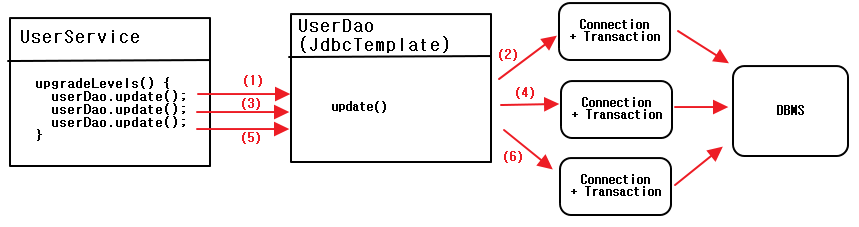
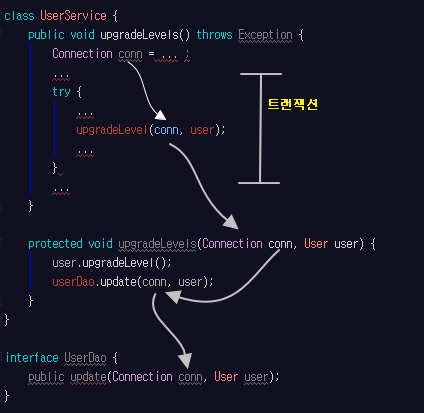
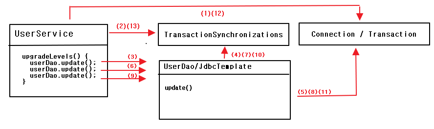

## 5.2 트랜잭션 서비스 추상화  

- <a href="#5.2.1">5.2.1 모 아니면 도 </a>
- <a href="#5.2.2">5.2.2 트랜잭션 경계설정</a>
- <a href="#5.2.3">5.2.3 트랜잭션 동기화</a>
- <a href="#5.2.4"></a>
- <a href="#5.2.4"></a>

```
정기 사용자 레벨 관리 작업을 수행하는 도중에 네트워크가 끊기거나 서버에 장애가 있는 경우
작업을 완료할 수 없다면,
1) 그때까지 변경된 사용자의 레벨은 그대로 둘 것 인가?
2) 모두 초기 상태로 되돌려 놓아야 할 것인가?  
```

<div id="5.2.1"></div>

### 모 아니면 도  
; 모든 사용자에 대해 업그레이드 작업을 진행하다가, 중간에 예외를 발생  

** 테스트용 UserService 대역 **  
(테스트를 위해 기존 코드를 수정하는 것이아니라, UserService의 대역을 만듬)  
=> UserService를 상속 & 테스트 할 코드를 오버라이딩  

> TestUserService static class

```
package springbook.user.service;

public class UserService {
	...
  // private => protected 임시 변환
	protected void upgradeLevel(User user) {
		user.upgradeLevel();
		userDao.update(user);
	}

  static class TestUserService extends UserService {
      private String id;

      private TestUserService(String id) {
          this.id = id;
      }

      @Override
      public void upgradeLevel(User user) {
          if (user.getId().equals(this.id)) {
              throw new TestUserServiceException();
          }
          super.upgradeLevel(user);
      }
  }

  static class TestUserServiceException extends RuntimeException {

  }
}
```

> UserServiceTest

```
@Test
public void upgradeAllOrNothing() {
    // 예외를 발생 시킬 ID
    UserService testUserService = new TestUserService(users.get(3).getId());
    // UserDao setting
    testUserService.setUserDao(this.userDao);

    // given
    userDao.deleteAll();
    for (User user : users) {
        userDao.add(user);
    }

    try {
        testUserService.upgradeLevels();
        // 아래 코드가 실행되면 fail
        fail("TestUserServiceException expected");
    } catch (TestUserServiceException e) {

    }
    checkLevelUpgraded(users.get(1), false);
}
```


**테스트 실패 원인**  
=> 트랜잭션 문제!!

<div id="5.2.2"></div>

### 5.2.2 트랜잭션 경계설정  

트랜잭션 롤백(transaction rollback)과 트랜잭션 커밋(transaction commit)  

**JDBC 트랜잭션의 트랜잭션 경계설정**  


```
Connection conn = dataSource.getConnection();

// 트랜잭션 시작
conn.setAutoCommit(false);
try {
  // pstmt, pstmt2 하나의 트랜잭션으로 묶인 단위 작업
  PreparedStatement pstmt = conn.preparedStatement(sql);
  pstmt.executeUpdate();

  PreparedStatement pstmt2 = conn.preparedStatement(sql2);
  pstmt2.executeUpdate();

  // 트랜잭션 커밋
  conn.commit();
}
catch(Exception e) {
  // 트랜잭션 롤백
  conn.rollback();
}

conn.close();
```

- 트랜잭션 경계설정(transaction demarcation)  
; 트랜잭션이 존재하는 범위(트랜잭션의 시작과 끝)를 지정하는 것  
- 로컬 트랜잭션(local transaction)  
; 하나의 DB 커넥션 안에서 만들어지는 트랜잭션  

**UserService와 UserDao 트랜잭션 문제**  

> UserService와 UserDao의 트랜잭션 처리 과정  



=> 데이터 엑세스 코드를 Dao로 만들어 분리해놌을 경우, DAO 메소드를 호출할 때 마다  
하나의 새로운 트랜잭션이 만들어지는 구조가 될 수 밖에 없음  

**비즈니스 로직 내의 트랜잭션 경계 설정**  
Sol1) DAO 메소드 안에 upgradeLevels() 메소드 내용을 옮기기  
=> 비즈니스 로직과 데이터 로직을 한데 묶어버리는 결과 초래  
Sol2) UserService에 트랜잭션 경계 설정  
```
public void upgradeLevels() throws Exception {
  (1) DB Connection 생성
  (2) 트랜잭션 시작
  try {
    (3) DAO 메소드 호출
    (4) 트랜잭션 커밋
  }
  catch(Exception e) {
    (5) 트랜잭션 롤백
    throw e;
  }
  finally {
    (6) DB Connection 종료
  }
}
```

> Connection 오브젝트를 파라미터로 전달받는 UserDao 메소드  

```
public interface UserDao {
  public void add(Connection conn, User user);
  public void get(Connection conn, String id);
  ...
  public void update(Connection conn, User user1);
}
```

> Connection을 공유하도록 수정한 UserService 메소드  



**UserService 트랜잭션 경계설정의 문제점**  

- DB 커넥션을 비롯한 리소스의 깔끔한 처리를 가능하게 했던 JdbcTemplate을 더이상 활용X
- DAO의 메소드와 비즈니스 로직을 담고 있는 UserService의 메소드에 Connection 파라미터가 추가되어야 함
- Connection 파라미터가 UserDao 인터페이스에 추가되면, UserDao 인터페이스는 데이터 엑세스 기술에 독립적 X
- 지금까지 작성한 테스트 코드 모두 변경  

<div id="5.2.3"></div>

### 5.2.3 트랜잭션 동기화
; 스프링의 독립적인 트랜잭션 동기화(transaction synchronization)방식

**Connection 파라미터 제거**  

> 트랜잭션 동기화를 사용한 경우의 작업 흐름  



(1) UserService에서 Connection 생성  
(2) 트랜잭션 동기화 저장소에 저장  
setAutoCommit(false);로 트랜잭션을 시작  
(3) 첫 update() 메소드 호출  
(4) 트랜잭션 동기화 저장소에 현재 시작된 트랜잭션을 가진 Connection 오브젝트가 존재하는지 확인  
(5) 가져온 Connection을 이용해 PreparedStatement를 생성하여 SQL 실행 & Connection 오픈상태유지  
(6)~(11) 까지 반복  
(12) 트랜잭션 내 작업 성공/실패 여부에 따라 Connection의 commit() or rollback()  
(13) 트랜잭션 저장소가 더 이상 Connection 오브젝트를 사용하지 않도록 이를 제거  

**트랜잭션 동기화 적용**  

> 동기화를 적용한 UserService  

```
...
import java.sql.Connection;
import javax.sql.DataSource;
import org.springframework.jdbc.datasource.DataSourceUtils;
import org.springframework.transaction.support.TransactionSynchronizationManager;
...

public class UserService {
    ...
    private DataSource dataSource;

    public void setDataSource(DataSource dataSource) {
        this.dataSource = dataSource;
    }

    ...

    public void upgradeLevels() throws Exception {
        // 트랜잭션 동기화 관리자를 이용해 동기화 작업                
        TransactionSynchronizationManager.initSynchronization();
        // DB 커넥션 생성 + 동기화
        Connection conn = DataSourceUtils.getConnection(dataSource);
        conn.setAutoCommit(false);

        try {
            List<User> users = userDao.getAll();
            for(User user : users) {
                if(canUpgradeLevel(user)) {
                    upgradeLevel(user);
                }
            }
            // 정상 작업 마치면 트랜잭션 커밋
            conn.commit();
        } catch(Exception e) {
            conn.rollback();
            throw e;
        } finally {
            // 스프링 유틸 메소드를 이용해 DB 커넥션을 안전하게 닫음
            DataSourceUtils.releaseConnection(conn,dataSource);
            // 동기화 작업 종료 및 정리
            TransactionSynchronizationManager.unbindResource(this.dataSource);
            TransactionSynchronizationManager.clearSynchronization();
        }
    }

    ...
}
```  

=> TransactionSynchronizationManager.initSynchronization(); 를 호출하면  
private static final ThreadLocal<Set<TransactionSynchronization>> synchronizations   
= new NamedThreadLocal("Transaction synchronizations"); 에 저장  
=> JdbcTemplate의 경우 Connection con = DataSourceUtils.getConnection(this.getDataSource());  
를 이용하여 Connection을 가져옴  


**트랜잭션 테스트 보완**  

```
@Test
public void upgradeAllOrNothing() throws Exception {
  ...
  // DataSource setting
  testUserService.setDataSource(dataSource);
  ...
}
```

**JdbcTemplate과 트랜잭션 동기화**  

JdbcTemplate은 Connection을 생성할 때 트랜잭션 동기화 저장소에 등록 된 DB 커넥션  
여부에 따라 적절히 생성 or 사용  


<br /><br /><br /><br /><br /><br /><br /><br />


---
