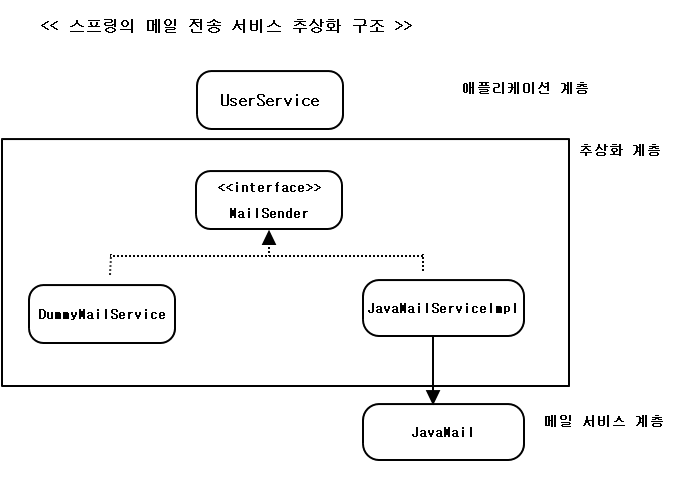
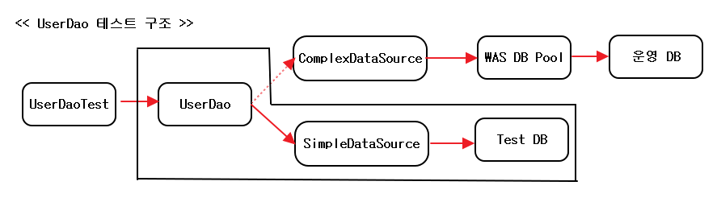
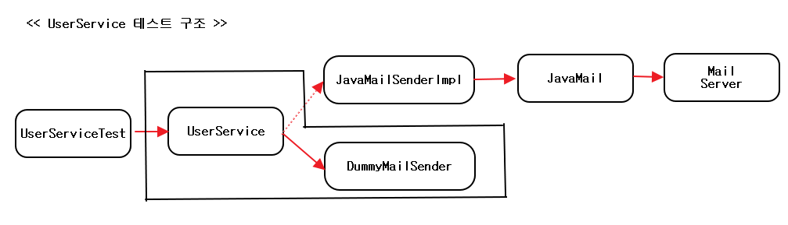

<div id="5.4"></div>

## 5.4 메일 서비스 추상화
; 새로운 요구 사항 : 레벨이 업그레이드 되는 사용자에게 안내 메일 발송  

#### index  

- <a href="#5.4.1">5.4.1 JavaMail을 이용한 메일 발송 기능</a>
- <a href="#5.4.2">5.4.2 JavaMail이 포함된 코드의 테스트</a>
- <a href="#5.4.3">5.4.3 테스트를 위한 서비스 추상화</a>
- <a href="#5.4.4">5.4.4 테스트 대역</a>
- <a href="#5.4.4"></a>


<div id="5.4.1"></div>  

### 5.4.1 JavaMail을 이용한 메일 발송 기능  

> 레벨 업그레이드 작업 메소드 수정  

```
public void upgradeLevels() {
    List<User> users = userDao.getAll();
    for (User user : users) {
        if (canUpgradeLevel(user)) {
            upgradeLevel(user);
        }
    }
}

protected void upgradeLevel(User user) {
    user.upgradeLevel();
    userDao.update(user);
    sendUpgradeEMail(user);
}
```  

> JavaMail을 이용한 메일 발송 메소드  

```
private void sendUpgradeEMail(User user) {
    Properties props = new Properties();
    props.put("mail.smtp.host", "mail.ksug.org");
    Session s = Session.getInstance(props, null);
    MimeMessage message = new MimeMessage(s);

    try {
        message.setFrom(new InternetAddress("useradmin@ksug.org"));
        message.addRecipients(Message.RecipientType.TO, new InternetAddress[]{new InternetAddress(user.getEmail())});
        message.setSubject("Upgrade 안내");
        message.setText("사용자님의 등급이 " + user.getLevel().name() + "로 업그레이드 되었습니다.");

        Transport.send(message);
    } catch (MessagingException e) {
        throw new RuntimeException(e);
    }
}
```  

<div id="5.4.2"></div>

### 5.4.2 JavaMail이 포함된 코드의 테스트  
; 메일 서버가 준비되어 있지 않다면 테스트 어떻게 진행?  
=> 서버가 준비되어 있지 않으면 javax.mail.MassagingException 발생  
=> 매번 테스트할 때 마다 메일을 발송하는게 바람직하지 않음  
=> JavaMail은 자바의 표준 기술이고 이미 수많은 시스템에 검증된 안정적인 모듈  
=> JavaMail API를 통해 요청이 들어간다는 보장만 있으면 굳이 테스트할 때마다  
JavaMail을 직접 구동시킬 필요 X  

<div id="5.4.3"></div>  

### 5.4.3 테스트를 위한 서비스 추상화  
; 실제 메일 전송을 수행하는 JavaMail 대신에 테스트에서 사용할 JavaMail과 같은  
인터페이스를 갖는 오브젝트를 만들어서 사용하면 문제는 모두 해결  

**JavaMail을 이용한 테스트의 문제점**  
```
Session s = Session.getInstance(props, null);

//javax.mail.Session 클래스
public final class Session {
  ...
  private Session(Properties props, Authenticator authenticator) {
    ...
  }
}
```  
=> Session 오브젝트를 만들어야만 메일 메시지를 생성하고 전송 가능  
BUT Session은 인터페이스가 아니라 클래스 && final 등 구현을 바꿔지치기 할 만한  
인터페이스의 존재X  
=> Transport도 마찬가지  

=> Spring은 JavaMail에 대한 추상화 기능을 제공하고 있음  

**메일 발송 기능 추상화**  

> JavaMail의 서비스 추상화 인터페이스  

```
package org.springframework.mail;

public interface MailSender {
    void send(SimpleMailMessage var1) throws MailException;

    void send(SimpleMailMessage[] var1) throws MailException;
}
```   

> 스프링의 MailSender를 이용한 메일 발송 메소드  

```
private void sendUpgradeEMail(User user) {
    // MailSender 구현 클래스의 인스턴스 생성
    JavaMailSenderImpl mailSender = new JavaMailSenderImpl();
    mailSender.setHost("mail.server.com");

    // MailMessage 인터페이스의 구현 클래스 오브젝트를 만들어 내용 작성
    SimpleMailMessage mailMessage = new SimpleMailMessage();
    mailMessage.setTo(user.getEmail());
    mailMessage.setFrom("useradmin@ksug.org");
    mailMessage.setSubject("Upgrade 안내");
    mailMessage.setText("사용자님의 등급이 " + user.getLevel().name() + "로 업그레이드 되었습니다.");

    mailSender.send(mailMessage);
}
```  

=> try/catch 블록이 사라짐 (MailException이라는 런타임 예외로 포장해서 던져 줌)  
=> 코드가 간결해졌지만, JavaMail API를 사용하지 않는 테스트용 오브젝트로 대체할 수 X  
=> 스프링의 DI를 이용하여 MailSender를 주입  

> 메일 전송 기능을 가진 오브젝트를 DI 받도록 수정한 UserService  

```
public class UserService {
  ...

  private MailSender mailSender;

  public void setMailSender(MailSender mailSender) {
      this.mailSender = mailSender;
  }

  ...

  private void sendUpgradeEMail(User user) {
    // MailMessage 인터페이스의 구현 클래스 오브젝트를 만들어 내용 작성
    SimpleMailMessage mailMessage = new SimpleMailMessage();
    mailMessage.setTo(user.getEmail());
    mailMessage.setFrom("useradmin@ksug.org");
    mailMessage.setSubject("Upgrade 안내");
    mailMessage.setText("사용자님의 등급이 " + user.getLevel().name() + "로 업그레이드 되었습니다.");

    mailSender.send(mailMessage);
  }
}

```  

> 메일 발송 오브젝트의 빈 등록  

```
<bean id="mailSender" class="org.springframework.mail.javamail.JavaMailSenderImpl">
    <property name="host" value="mail.server.com" />
</bean>

<bean id="userService" class="springbook.user.service.UserService">
    <property name="userDao" ref="userDao"/>
    <property name="mailSender" ref="mailSender" />
</bean>
```  

**테스트용 메일 발송 오브젝트**  
=> mailSender의 빈의 host 프로퍼티에는 메일 서버를 지정  
=> 테스트를 실행하면 JavaMail API를 직접 사용했을 때와 동일하게 지정 된  
서버로 메일이 발송  
=> WTD : JavaMail을 사용하지 않고, 메일 발송 기능이 포함된 코드를 테스트  

> 아무런 기능이 없는 MailSender 구현 클래스  

```
package springbook.user.service;

import java.util.Arrays;
import org.springframework.mail.MailException;
import org.springframework.mail.MailSender;
import org.springframework.mail.SimpleMailMessage;

public class DummyMailSender implements MailSender {

    public void send(SimpleMailMessage mailMessage) throws MailException {
        // Test시 콘솔로 확인
        System.out.println("DummayMailSender::send() is called.. " + mailMessage.toString());
    }

    public void send(SimpleMailMessage[] mailMessage) throws MailException {
        System.out.println("DummayMailSender::send([]) is called.." + Arrays.toString(mailMessage));
    }
}
```  

**테스트와 서비스 추상화**  

  
; 서비스 추상화 : 트랜잭션과 같이 기능은 유사하나 사용 방법이 다른 로우레벨의 다양한 기술에 대한  
추상 인터페이스와 일관성 있는 접근 방법을 제공해주는 것  

- JavaMail이 아닌 다른 메시징 서버의 API를 이용하는 경우 해당 기술의 API를 이용하는 MailSender  
구현 클래스를 만들어 DI  
- 메일 발송을 작업 큐를 이용하는 경우 MailSender인터페이스를 구현한 메일 발송 큐의 구현을  
하나 만들어두고 다시 DI를 통해 JavaMailSenderImpl 같은 실제 메일 발송용 오브젝트를 연결해서 사용  

=> 현재 코드의 한가지 부족한 점?  
; 메일 발송에 트랜잭션 개념이 빠져 있음  
1) 발송 대상을 별도의 목록에 저장해 두고 업그레이드 작업이 모두 성공적으로 끝났을 때,  
메일을 발송(단점은 메일 저장용 리스트 등을 파라미터에 계속 갖고 다녀야 함)  
2) MailSender를 확장해서 메일 전송에 트랜잭션 개념을 적용  

<div id="5.4.4"></div>  

### 5.4.4 테스트 대역  
; DummyMailSender는 아무것도 하지 않지만, 가치는 매우 큼  
=> 이 클래스를 이용해 JavaMail로 메일을 직접 발송하는 클래스를 대치하지 않았다면  
테스트는 매우 불편해짐  
=> 대부분 테스트할 대상이 의존하고 있는 오브젝트를 DI를 통해 바꿔치기하는 기법으로  
테스트 환경에서 유용하게 사용  

**의존 오브젝트의 변경을 통한 테스트 방법**  

  

=> UserDaoTest의 관심은 UserDao가 어떻게 동작하는지에 있지 뒤의 DB 커넥션 풀이나
DB자체에 있지 않음  
=> UserDao가 DB를 사용해야 하기 때문에 무시할 수 는 없음  

  

=> 운영 시스템에서 사용될 떄는 당연히 JavaMailSenderImpl과 JavaMail을 통해  
메일 서버로 이어지는 구성이 필요(테스트 때는 손해)  
=> UserSErviceTest의 관심사는 UserService에서 구현해놓은 사용자 정보를 가공하는  
비즈니스 로직이지, 메일이 어떻게 전송이 될 것인지가 아니기 때문  
=> 그렇다고 테스트 시 메일 발송기능을 제거하고 다시 추가하는 것은 불가능  
=> UserService 테스트에 지장을 주지 않기 위해 도입한 것이 DummyMailSender  

=> 위의 두가지 경우에서 확인할 수 있듯이 테스트 대상이 되는 오브젝트가  
다른 오브젝트에 의존하는 일은 매우 흔함  
(의존 : 종속되거나 기능을 사용하는 의미)  

**테스트 대역의ㅏ 종류와 특징**  


<br /><br /><br /><br /><br /><br /><br />

---  
