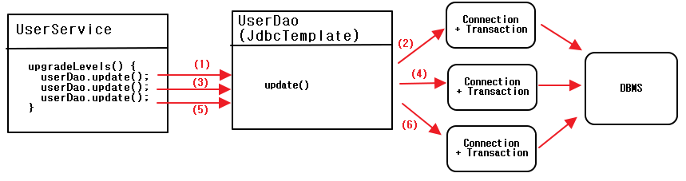
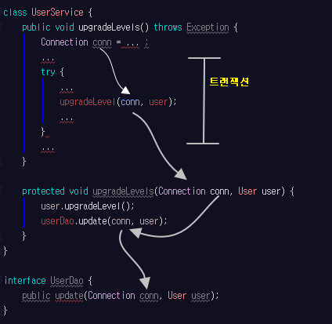
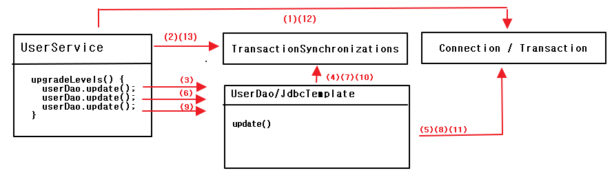

# ch5 서비스 추상화

- <a href="#5.1">5.1 사용자 레벨 관리 기능 추가</a>
- <a href="#5.2">5.2 트랜잭션 서비스 추상화</a>
- <a href="#5.3">5.3 서비스 추상화와 단일 책임 원칙</a>
- <a href="#5.4">5.4 메일 서비스 추상화</a>


- <a href="#5."></a>

<div id="5.1">

## 5.1 사용자 레벨 관리 기능 추가
;지금까지 구현 한 UserDao는 가장 기초적인 CRUD만 가능  
=> 간단한 비즈니스 로직 추가  

**사용자 관리 기능 추가**  

- 사용자의 레벨은 BASIC, SILVER, GOLD 세 가지 중 하나
- 처음 가입 시 BASIC, 활동에 따라 한단계 씩 업그레이드
- 50회 이상 로그인 하면 BASIC -> SILVER
- SILVER이면서 30번 이상 추천을 받으면 GOLD가 됨
- 사용자 레벨의 변경 작업은 일정한 주기를 가지고 일괄적으로 진행. 변경 작업 전에는  
  조건을 충족하더라도 레벨의 변경이 일어나지 X


### 5.1.1 필드 추가

**Level 이늄**

> 정수형 상수 값으로 정의한 사용자 레벨

<pre>
class User {
	private static final int BASIC = 1;
	private static final int SILVER = 2;
	private static final int GOLD = 3;
	...
}
</pre>

=> 자료형에 안전하지 않고, 컴파일 타임에 오류 잡지 못함

> 사용자 레벨용 이늄

<pre>
package springbook.user.domain;

public enum Level {
	// 세 개의 enum 오브젝트 정의
	BASIC(1), SILVER(2), GOLD(3);
	private final int value;

	//DB에 저장할 값을 넣어줄 생성자를 만들어 둠
	Level(int value) {
		this.value = value;
	}

	// 값을 가져오는 메소드
	public int intValue() {
		return value;
	}

	// 값으로부터 Level 타입 오브젝트를 가져오도록
	// 만드는 static method
	public static Level valueOf(int value) {
		switch(value) {
			case 1: return BASIC;
			case 2: return SILVER;
			case 3: return GOLD;
			default :
				throw new AssertionError("Unknown value : " + value);
		}
	}
}
</pre>

---


**User 필드 추가**

---

> User에 추가 된 필드

<pre>
public class User {
	...
	Level level;
	int login;
	int recommend;
	//setter,getter 생략
	...
}
</pre>

> USER 테이블 추가 필드

<table>
	<tr>
		<th>필드명</th>
		<th>타입</th>
		<th>설정</th>
	</tr>
	<tr>
		<td>Level</td>
		<td>tinyint</td>
		<td>Not Null</td>
	</tr>
	<tr>
		<td>Login</td>
		<td>int</td>
		<td>Not Null</td>
	</tr>
	<tr>
		<td>Recomment</td>
		<td>int</td>
		<td>Not Null</td>
	</tr>
</table>

alter table users add level tinyint;
alter table users add login int;
alter table users add recommend int;

---


**UserDaoTest 테스트 수정**

---

> 수정된 테스트 픽스처

<pre>
...
@Before
public void setUp() {		
	user1 = new User("gyumee","박성철","springno1",Level.BASIC,1,0);
	user2 = new User("leegw700","이길원","springno2",Level.SILVER,55,10);
	user3 = new User("bumjin","박범진","springno3",Level.GOLD,100,40);
}
...
</pre>

---

**UserDaoJdbc수정**

---

> 추가 된 필드를 위한 UserDaoJdbc 코드

<pre>
public class UserDaoJdbc implements UserDao {		
	...
	private RowMapper<User> userMapper = new RowMapper<User>() {
		@Override
		public User mapRow(ResultSet rs, int rowNum) throws SQLException {
			User user = new User();
			user.setId(rs.getString("id"));
			user.setName(rs.getString("name"));
			user.setPassword(rs.getString("password"));
			//추가 된 코드
			user.setLevel(Level.valueOf(rs.getInt("level")));
			user.setLogin(rs.getInt("login"));
			user.setRecommend(rs.getInt("recommend"));
			return user;
		}
	};
	...
	@Override
	public void add(final User user) {
		this.jdbcTemplate.update("insert into users(id, name, password,level,login,recomment) values(?,?,?,?,?,?)",
				user.getId(), user.getName(), user.getPassword(),
				user.getLevel().intValue(), user.getLogin(), user.getRecommend());
	}
	...
}
</pre>

-> Level enum은 오브젝트이므로, DB와 호환 되도록 변환

- add()에서는 Level enum -> 정수이므로 user.getLevel().intValue();
- 조회의 경우에는 user.setLevel(Level.valueOf(rs.getInt("level")));

---

=> 테스트 진행

### 5.1.2 사용자 수정 기능 추가
; 수정할 정보가 담긴 User 오브젝트를 전달하면 id를 참고해서 <br>
사용자를 찾아 필드 정보를 UPDATE문을 이용해 모두 변경해주는 메소드를 만듬

**수정 기능 테스트 추가**

---

> 사용자 정보 수정 메소드 테스트

<pre>
	@Test
	public void update() {
		dao.deleteAll();

		dao.add(user1);

		user1.setName("오민규");
		user1.setPassword("springno6");
		user1.setLevel(Level.GOLD);
		user1.setLogin(1000);
		user1.setRecommend(999);
		dao.update(user1);

		User user1update = dao.get(user1.getId());

		checkSameUser(user1,user1update);
	}
</pre>

-> 어차피 @Test마다 매번 새로운 User 텍스트 픽스처가 생성되므로, 변경해도 상관X

---

**UserDao와 UserDaoJdbc 수정**

---

> 사용자 정보 수정용 update() 메소드

<pre>
	@Override
	public void update(User user) {
		this.jdbcTemplate.update(
				"update users set name = ?, password=?, level = ?, login=?,recommend=? where id= ?",
				user.getName(), user.getPassword(), user.getLevel().intValue(),
				user.getLogin(),user.getRecommend(),user.getId() );				
	}
</pre>

---  


**수정 테스트 보완**

=> 위의 테스트로는, where 절을 뺴먹어도 정상 작동됨(전체가 다 update 됨)

*해결 방안*

1. 적용 된 레코드 수 반환 후 검증 코드 추가
2. 테스트를 보강 << 선택

---

> 보완된 update() 테스트

<pre>
	@Test
	public void update() {
		dao.deleteAll();

		dao.add(user1); // 수정할 사용자
		dao.add(user2); // 수정하지 않을 사용자

		user1.setName("오민규");
		user1.setPassword("springno6");
		user1.setLevel(Level.GOLD);
		user1.setLogin(1000);
		user1.setRecommend(999);
		dao.update(user1);

		User user1update = dao.get(user1.getId());		
		checkSameUser(user1,user1update);
		User user2same = dao.get(user2.getId());
		checkSameUser(user2,user2same);
	}
</pre>

---


### 5.1.3 UserService.upgradeLevels()
; 사용자 관리 로직추가(UserService) UserDaoJdbc는 적당하지 X


**UserService 클래스와 빈 등록**

---

> UserService 클래스

<pre>
package springbook.user.service;

import springbook.user.dao.UserDao;

public class UserService {
	UserDao userDao;

	public void setUserDao(UserDao userDao) {
		this.userDao = userDao;
	}

}
</pre>

> userService 빈 설정

<pre>
&lt;bean id=&quot;userService&quot; class=&quot;springbook.user.service.UserService&quot;&gt;
		&lt;property name=&quot;userDao&quot; ref=&quot;userDao&quot; /&gt;
&lt;/bean&gt;

&lt;bean id=&quot;userDao&quot; class=&quot;springbook.user.dao.UserDaoJdbc&quot;&gt;
	&lt;property name=&quot;dataSource&quot; ref=&quot;dataSource&quot; /&gt;		
&lt;/bean&gt;
</pre>

---

**UserServiceTest 테스트 클래스**

---

> userService 빈의 주입을 확인하는 테스트

<pre>
...
@RunWith(SpringJUnit4ClassRunner.class)
@ContextConfiguration(locations="/test-applicationContext.xml")
public class UserServiceTest {
	@Autowired
	UserService userService;

	@Test
	public void bean() {
		assertThat(this.userService, is(notNullValue()));
	}
}
</pre>

-> 빈 테스트 후 별 의미 없으니, 삭제해도 좋음


**upgradeLevels() 메소드**  

> 사용자 레벨 업그레이드 메소드

```
public void upgradeLevels() {
	List<User> users = userDao.getAll();
	for(User user : users) {
		// 레벨 변화 확인 플래그
		Boolean changed = null;
		if(user.getLevel() == Level.BASIC && user.getLogin() >=50) {
			user.setLevel(Level.SILVER);
			changed = Boolean.TRUE;
		}
		else if( user.getLevel() == Level.SILVER && user.getRecommend() >= 30) {
			user.setLevel(Level.GOLD);
			changed = Boolean.TRUE;
		}
		else if(user.getLevel() == Level.GOLD) {
			changed = Boolean.FALSE;
		}
		else {
			changed = Boolean.FALSE;
		}

		if( changed ) {
			userDao.update(user);
		}
	}		
}
```  

-> 간단해 보이는 코드이지만, 정말 뛰어난 개발자는 아무리 간단해 보여도 실수할 수 있음을 알고

있기 때문에 테스트를 만들어서 직접 동작하는 모습을 확인해보려고 할 것임.

---

**upgradeLevels()테스트**

-> 사용자 레벨 BASIC,SILVER,GOLD 마다 업그레드 or not (GOLD제외)

-> 5가지 경우의 수를 생각할 수 있음.

---

> 리스트로 만든 테스트 픽스처

<pre>
public class UserServiceTest {
	...
	List<User> users; // 테스트 픽스처

	@Before
	public void setUp() {
		users = Arrays.asList(
				new User("bumjin","박범진","p1",Level.BASIC,49,0),
				new User("joytouch","강명성","p2",Level.BASIC,50,0),
				new User("erwins","신승한","p3",Level.SILVER,60,29),
				new User("madnite1","이상호","p4",Level.SILVER,60,30),
				new User("green","오민규","p5",Level.GOLD,100,100)
		);
	}		
}
</pre>

-> 기준값의 전후로 선택하는 것이 좋음. 50,30 -> 50,29

> 사용자 레벨 업그레이드 테스트  

```
	@Test
	public void upgradeLevels() {
		userDao.deleteAll();

		for(User user : users) {
			userDao.add(user);
		}

		userService.upgradeLevels();

		//업그레이드 후의 예상 레벨 검증
		checkLevel(users.get(0),Level.BASIC);
		checkLevel(users.get(1),Level.SILVER);
		checkLevel(users.get(2),Level.SILVER);
		checkLevel(users.get(3),Level.GOLD);
		checkLevel(users.get(4),Level.GOLD);

	}

	// DB에서 사용자 정보를 가져와 레벨을 확인하는 코드가 중복되므로
	// 헬퍼 메소드로 분리
	private void checkLevel(User user, Level expectedLevel) {
		User userUpdate = userDao.get(user.getId());
		assertThat(userUpdate.getLevel(), is(expectedLevel));
	}
```

### 5.1.4 UserService.add()
; 처음 가입시 BASIC 레벨을 갖도록 하는 로직 어디에 ?

-> UserDao는 User오브젝트를 DB에 정보를 넣고 읽는 방법에만 관심을 가져야 함.

-> 초기에 Level.BASIC을 가지면? 회원가입 외에는 무의미한 코드가 됨.

-> UserService에 넣기 (레벨이 미리 정해 진 경우 / 레벨이 비어 있는 경우)


> add() 메소드의 테스트

```
@Test
public void add() {
	userDao.deleteAll();		
	// GOLD 레벨
	User userWithLevel = users.get(4);

  // LEVEL이 없는 경우 BASIC이 되어야 함
	User userWithoutLevel = users.get(0);
	userWithoutLevel.setLevel(null);
	userService.add(userWithLevel);  
	userService.add(userWithoutLevel);

	User userWithLevelRead = userDao.get(userWithLevel.getId());
	User userWithoutLevelRead = userDao.get(userWithoutLevel.getId());
	assertThat(userWithLevelRead.getLevel(), is(userWithLevel.getLevel()));
	assertThat(userWithoutLevelRead.getLevel(), is(Level.BASIC));		
	}
```  

> 사용자 신규 등록 로직을 담은 add() 메소드

```
	public void add(User user) {
		if(user.getLevel() == null)
			user.setLevel(Level.BASIC);
		userDao.add(user);
	}
```  

-> 테스트가 조금 복잡한 것이 흠. 뒤에서 다시 깔끔히 만들기 위해 다룸.

---

### 5.1.5 코드 개선

작성 된 코드를 살펴볼 때는 다음과 같은 질문을 해볼 필요가 있다.

- 코드에 중복된 부분은 없는가?
- 코드가 무엇을 하는 것인지 이해하기 불편하지 않은가?
- 코드가 자신이 있어야 할 자리에 있는가?
- 앞으로 변경이 일어난다면 어떤 것이 있을 수 있고, 그 변화에 쉽게 대응할 수 있게 <br>
  작성되어 있는가?

**upgradeLevels() 메소드 코드의 문제점**

- (1) user.getLevel() == Level.BASIC  
=> 현재 레벨이 무엇인지 파악하는 로직
- (2) user.getLogin() >=50  
=> 업그레이드 조건을 담은 로직
- (3) user.setLevel(Level.SILVER)  
=> 다음 단계의 레벨이 무엇이며 업그레이드 하기 위한 작업은 어떤것인지
- (4) changed = Boolean.TRUE;  
=> 자체로 의미 X, (5)의 작업이 필요한 지 여부
- (5) if( changed ) { userDao.update(user); }


**upgradeLevels() 리팩토링**  

> 기본 작업 흐름만 남겨둔 upgradeLevels()  

```
public void upgradeLevels() {
  List<User> users = userDao.getAll();
  for(User user : users) {
    if(canUpgradeLevel(user)) {
      upgradeLevel(user);
    }
  }		
}
```  

-> 모든 사용자 정보를 가져와 한 명씩 업그레이드가 가능한지 확인하고,  
가능 하면 업그레이드를 함. -> 쉽게 이해가 됨

> 업그레이드 가능 확인 메소드

```
private boolean canUpgradeLevel(User user) {
	Level currentLevel = user.getLevel();
	switch(currentLevel) {
		case BASIC : return (user.getLogin() >= 50);
		case SILVER : return (user.getRecommend() >= 30);
		case GOLD : return false;
		default :
			throw new IllegalArgumentException("Unknown Level : " + currentLevel);
	}		
}
```  

=> default 에서 현재 로직에서 다룰 수 없는 레벨이 주어지면, 예외 발생  
=> 레벨이 추가되고, 로직을 수정하지 않으면 에러가 나서 확인할 수 있음.

> 레벨 업그레이드 작업 메소드

```
private void upgradeLevel(User user) {
	if(user.getLevel() == Level.BASIC)
		user.setLevel(Level.SILVER);
	else if(user.getLevel() == Level.SILVER)
		user.setLevel(Level.GOLD);
	userDao.update(user);
}
```

=> upgradeLevel()은 GOLD에 대한 예외처리도 없고 레벨이 늘어나면, if문이 점점 늘어남.  
=> 레벨의 순서와 다음 단계 레벨이 무엇인지를 결정하는 일은 Level에게 맡기기!  

> 업그레이드 순서를 담고 있도록 수정한 Level

```
public enum Level {
	// 이늄 선언에 DB에 저장할 값과 함께
	// 다음 단계의 레벨 정보도 추가
	GOLD(3,null), SILVER(2,GOLD),BASIC(1,SILVER);

	private final int value;
	private final Level next;

	Level(int value,Level next) {
		this.value = value;
		this.next = next;
	}

	// 값을 가져오는 메소드
	public int intValue() {
		return value;
	}

	public Level nextLevel() {
		return this.next;
	}

	public static Level valueOf(int value) {
		switch(value) {
			case 1: return BASIC;
			case 2: return SILVER;
			case 3: return GOLD;
			default :
				throw new AssertionError("Unknown value : " + value);
		}
	}
}
```

-> 레벨의 업그레이드 순서는 Level 이늄 안에서 관리할 수 있음.

> User의 레벨 업그레이드 작업용 메소드

<pre>
public void upgradeLevel() {
	Level nextLevel = this.level.nextLevel();
	if( nextLevel == null )
		throw new IllegalStateException(this.level + "은 업그레이드가 불가능 합니다.");
	else
		this.level = nextLevel;
}
</pre>

-> User의 upgradeLevel()은 UserService이외에 사용가능하므로, 스스로 예외상황에 대한 검증 기능을 갖음으로써

User 오브젝트를 잘못 사용하는 코드가 있다면 확인해줄 수 있음.  

> 간결해진 upgradeLevel()

```
private void upgradeLevel(User user) {
	user.upgradeLevel();
	userDao.update(user);
}
```

=> if 분기가 많은 것보다 훨씬 깔끔해지고, 각 오브젝트가 해야 할 책임도 깔끔히 분리 됨.  


**User 테스트**

> User 테스트

```
package springbook.user.service;
...
public class UserTest {
	User user;

	@Before
	public void setUp() {
		user = new User();
	}

	@Test
	public void upgradeLevel() {
		Level[] levels = Level.values();
		for(Level level : levels) {
			if(level.nextLevel() == null)
				continue;
			user.setLevel(level);
			user.upgradeLevel();
			assertThat(user.getLevel(), is(level.nextLevel()));
		}		
	}

	@Test(expected=IllegalStateException.class)
	public void cannotUpgradeLevel() {
		Level[] levels = Level.values();
		for(Level level : levels) {
			if(level.nextLevel() != null)
				continue;
			user.setLevel(level);
			user.upgradeLevel();
		}
	}
}
```


**UserServiceTest 개선**

; 기존 테스트에서 다음 단계 레벨이 무엇인지 다 넣어줌


---

> 개선한 upgradeLevels() 테스트

<pre>
@Test
public void upgradeLevels() {
	userDao.deleteAll();

	for(User user : users) {
		userDao.add(user);
	}

	userService.upgradeLevels();

	//업그레이드 후의 예상 레벨 검증		
	checkLevelUpgraded(users.get(0),false);
	checkLevelUpgraded(users.get(1),true);
	checkLevelUpgraded(users.get(2),false);
	checkLevelUpgraded(users.get(3),true);
	checkLevelUpgraded(users.get(4),false);		
}

private void checkLevelUpgraded(User user, boolean upgraded) {
	User userUpdate = userDao.get(user.getId());
	if( upgraded ) {
		assertThat(userUpdate.getLevel(),is(user.getLevel().nextLevel()));
	}
	else {
		assertThat(userUpdate.getLevel(), is(user.getLevel()));
	}
}
</pre>


-> 업그레이드를 확인하려는 것인지 아닌지 좀더 이해하기 쉽게 true, false로 나타나있음


> 상수를 사용하도록 만든 테스트

<pre>
import static springbook.user.service.UserService.MIN_LOGCOUNT_FOR_SILVER;
import static springbook.user.service.UserService.MIN_RECCOMENT_FOR_GOLD;
...
	@Before
	public void setUp() {
		users = Arrays.asList(
				new User("bumjin","박범진","p1",Level.BASIC,MIN_LOGCOUNT_FOR_SILVER-1,0),
				new User("joytouch","강명성","p2",Level.BASIC,MIN_LOGCOUNT_FOR_SILVER,0),
				new User("erwins","신승한","p3",Level.SILVER,60,MIN_RECCOMENT_FOR_GOLD-1),
				new User("madnite1","이상호","p4",Level.SILVER,60,MIN_RECCOMENT_FOR_GOLD),
				new User("green","오민규","p5",Level.GOLD,100,Integer.MAX_VALUE)
		);
	}
</pre>

---

=> 레벨 업그레이드 정책을 좀더 유연하게 변경할 수 있는 코드도 생각 해보기. <br>
(연말 이벤트, 새로운 홍보기간 등등..)

=> UserService를 변경하고 다시 돌리는 것은 위험함.

---

> 업그레이드 정책 인터페이스

<pre>
package springbook.user.domain;

public interface UserLevelUpgradePolicy {
	boolean canUpgradeLevel(User user);
	void upgradeLevel(User user);
}
</pre>

> 정책 구현 인터페이스
<pre>
package springbook.user.domain;
import springbook.user.dao.UserDao;
public class UserLevelUpgradePolicyImpl implements UserLevelUpgradePolicy {
	public static final int MIN_LOGCOUNT_FOR_SILVER = 50;
	public static final int MIN_RECCOMENT_FOR_GOLD = 30;

	private UserDao userDao;
	public void setUserDao(UserDao userDao) {
		this.userDao = userDao;
	}

	@Override
	public boolean canUpgradeLevel(User user) {
		Level currentLevel = user.getLevel();
		switch(currentLevel) {
			case BASIC : return (user.getLogin() >= MIN_LOGCOUNT_FOR_SILVER);
			case SILVER : return (user.getRecommend() >= MIN_RECCOMENT_FOR_GOLD);
			case GOLD : return false;
			default :
				throw new IllegalArgumentException("Unknown Level : " + currentLevel);
		}		
	}

	@Override
	public void upgradeLevel(User user) {
		user.upgradeLevel();
		userDao.update(user);		
	}
}
</pre>

---

<div id="5.2"></div>  

## 5.2 트랜잭션 서비스 추상화  

- <a href="#5.2.1">5.2.1 모 아니면 도 </a>
- <a href="#5.2.2">5.2.2 트랜잭션 경계설정</a>
- <a href="#5.2.3">5.2.3 트랜잭션 동기화</a>
- <a href="#5.2.4">5.2.4 트랜잭션 서비스 추상화</a>
- <a href="#5.2.4"></a>

```
정기 사용자 레벨 관리 작업을 수행하는 도중에 네트워크가 끊기거나 서버에 장애가 있는 경우
작업을 완료할 수 없다면,
1) 그때까지 변경된 사용자의 레벨은 그대로 둘 것 인가?
2) 모두 초기 상태로 되돌려 놓아야 할 것인가?  
```

<div id="5.2.1"></div>

### 모 아니면 도  
; 모든 사용자에 대해 업그레이드 작업을 진행하다가, 중간에 예외를 발생  

** 테스트용 UserService 대역 **  
(테스트를 위해 기존 코드를 수정하는 것이아니라, UserService의 대역을 만듬)  
=> UserService를 상속 & 테스트 할 코드를 오버라이딩  

> TestUserService static class

```
package springbook.user.service;

public class UserService {
	...
  // private => protected 임시 변환
	protected void upgradeLevel(User user) {
		user.upgradeLevel();
		userDao.update(user);
	}

  static class TestUserService extends UserService {
      private String id;

      private TestUserService(String id) {
          this.id = id;
      }

      @Override
      public void upgradeLevel(User user) {
          if (user.getId().equals(this.id)) {
              throw new TestUserServiceException();
          }
          super.upgradeLevel(user);
      }
  }

  static class TestUserServiceException extends RuntimeException {

  }
}
```

> UserServiceTest

```
@Test
public void upgradeAllOrNothing() {
    // 예외를 발생 시킬 ID
    UserService testUserService = new TestUserService(users.get(3).getId());
    // UserDao setting
    testUserService.setUserDao(this.userDao);

    // given
    userDao.deleteAll();
    for (User user : users) {
        userDao.add(user);
    }

    try {
        testUserService.upgradeLevels();
        // 아래 코드가 실행되면 fail
        fail("TestUserServiceException expected");
    } catch (TestUserServiceException e) {

    }
    checkLevelUpgraded(users.get(1), false);
}
```


**테스트 실패 원인**  
=> 트랜잭션 문제!!

<div id="5.2.2"></div>

### 5.2.2 트랜잭션 경계설정  

트랜잭션 롤백(transaction rollback)과 트랜잭션 커밋(transaction commit)  

**JDBC 트랜잭션의 트랜잭션 경계설정**  


```
Connection conn = dataSource.getConnection();

// 트랜잭션 시작
conn.setAutoCommit(false);
try {
  // pstmt, pstmt2 하나의 트랜잭션으로 묶인 단위 작업
  PreparedStatement pstmt = conn.preparedStatement(sql);
  pstmt.executeUpdate();

  PreparedStatement pstmt2 = conn.preparedStatement(sql2);
  pstmt2.executeUpdate();

  // 트랜잭션 커밋
  conn.commit();
}
catch(Exception e) {
  // 트랜잭션 롤백
  conn.rollback();
}

conn.close();
```

- 트랜잭션 경계설정(transaction demarcation)  
; 트랜잭션이 존재하는 범위(트랜잭션의 시작과 끝)를 지정하는 것  
- 로컬 트랜잭션(local transaction)  
; 하나의 DB 커넥션 안에서 만들어지는 트랜잭션  

**UserService와 UserDao 트랜잭션 문제**  

> UserService와 UserDao의 트랜잭션 처리 과정  



=> 데이터 엑세스 코드를 Dao로 만들어 분리해놌을 경우, DAO 메소드를 호출할 때 마다  
하나의 새로운 트랜잭션이 만들어지는 구조가 될 수 밖에 없음  

**비즈니스 로직 내의 트랜잭션 경계 설정**  
Sol1) DAO 메소드 안에 upgradeLevels() 메소드 내용을 옮기기  
=> 비즈니스 로직과 데이터 로직을 한데 묶어버리는 결과 초래  
Sol2) UserService에 트랜잭션 경계 설정  
```
public void upgradeLevels() throws Exception {
  (1) DB Connection 생성
  (2) 트랜잭션 시작
  try {
    (3) DAO 메소드 호출
    (4) 트랜잭션 커밋
  }
  catch(Exception e) {
    (5) 트랜잭션 롤백
    throw e;
  }
  finally {
    (6) DB Connection 종료
  }
}
```

> Connection 오브젝트를 파라미터로 전달받는 UserDao 메소드  

```
public interface UserDao {
  public void add(Connection conn, User user);
  public void get(Connection conn, String id);
  ...
  public void update(Connection conn, User user1);
}
```

> Connection을 공유하도록 수정한 UserService 메소드  



**UserService 트랜잭션 경계설정의 문제점**  

- DB 커넥션을 비롯한 리소스의 깔끔한 처리를 가능하게 했던 JdbcTemplate을 더이상 활용X
- DAO의 메소드와 비즈니스 로직을 담고 있는 UserService의 메소드에 Connection 파라미터가 추가되어야 함
- Connection 파라미터가 UserDao 인터페이스에 추가되면, UserDao 인터페이스는 데이터 엑세스 기술에 독립적 X
- 지금까지 작성한 테스트 코드 모두 변경  

<div id="5.2.3"></div>

### 5.2.3 트랜잭션 동기화
; 스프링의 독립적인 트랜잭션 동기화(transaction synchronization)방식

**Connection 파라미터 제거**  

> 트랜잭션 동기화를 사용한 경우의 작업 흐름  



(1) UserService에서 Connection 생성  
(2) 트랜잭션 동기화 저장소에 저장  
setAutoCommit(false);로 트랜잭션을 시작  
(3) 첫 update() 메소드 호출  
(4) 트랜잭션 동기화 저장소에 현재 시작된 트랜잭션을 가진 Connection 오브젝트가 존재하는지 확인  
(5) 가져온 Connection을 이용해 PreparedStatement를 생성하여 SQL 실행 & Connection 오픈상태유지  
(6)~(11) 까지 반복  
(12) 트랜잭션 내 작업 성공/실패 여부에 따라 Connection의 commit() or rollback()  
(13) 트랜잭션 저장소가 더 이상 Connection 오브젝트를 사용하지 않도록 이를 제거  

**트랜잭션 동기화 적용**  

> 동기화를 적용한 UserService  

```
...
import java.sql.Connection;
import javax.sql.DataSource;
import org.springframework.jdbc.datasource.DataSourceUtils;
import org.springframework.transaction.support.TransactionSynchronizationManager;
...

public class UserService {
    ...
    private DataSource dataSource;

    public void setDataSource(DataSource dataSource) {
        this.dataSource = dataSource;
    }

    ...

    public void upgradeLevels() throws Exception {
        // 트랜잭션 동기화 관리자를 이용해 동기화 작업                
        TransactionSynchronizationManager.initSynchronization();
        // DB 커넥션 생성 + 동기화
        Connection conn = DataSourceUtils.getConnection(dataSource);
        conn.setAutoCommit(false);

        try {
            List<User> users = userDao.getAll();
            for(User user : users) {
                if(canUpgradeLevel(user)) {
                    upgradeLevel(user);
                }
            }
            // 정상 작업 마치면 트랜잭션 커밋
            conn.commit();
        } catch(Exception e) {
            conn.rollback();
            throw e;
        } finally {
            // 스프링 유틸 메소드를 이용해 DB 커넥션을 안전하게 닫음
            DataSourceUtils.releaseConnection(conn,dataSource);
            // 동기화 작업 종료 및 정리
            TransactionSynchronizationManager.unbindResource(this.dataSource);
            TransactionSynchronizationManager.clearSynchronization();
        }
    }

    ...
}
```  

=> TransactionSynchronizationManager.initSynchronization(); 를 호출하면  
private static final ThreadLocal<Set<TransactionSynchronization>> synchronizations   
= new NamedThreadLocal("Transaction synchronizations"); 에 저장  
=> JdbcTemplate의 경우 Connection con = DataSourceUtils.getConnection(this.getDataSource());  
를 이용하여 Connection을 가져옴  


**트랜잭션 테스트 보완**  

```
@Test
public void upgradeAllOrNothing() throws Exception {
  ...
  // DataSource setting
  testUserService.setDataSource(dataSource);
  ...
}
```

**JdbcTemplate과 트랜잭션 동기화**  

JdbcTemplate은 Connection을 생성할 때 트랜잭션 동기화 저장소에 등록 된 DB 커넥션  
여부에 따라 적절히 생성 or 사용  


---

<div id="5.2.4"></div>  

### 5.2.4 트랜잭션 서비스 추상화  

**기술과 환경에 종속되는 트랜잭션 경계설정 코드**  
문제점 : 기존 로컬 트랜잭션 처리 코드는 하나의 DB Connection에 종속적  
=> 글로벌 트랜잭션(global transaction) 방식을 사용해야 함  

  

=> 11장에서 다룸  

> JTA를 이용한 트랜잭션 코드 구조  
```
InitialContext ctx = new InitialContext();
UserTransaction tx = (UserTransaction)ctx.lookup(USER_TX_JNDI_NAME);
tx.begin();
// JNDI로 가져온 dataSource를 사용해야 한다.
Connection c = dataSource.getConnection();
try {
	// 데이터 엑세스 코드
	tx.commit();
} catch(Exception e) {
	tx.rollback();
	throw e;
} finally {
	c.close();
}
```  

=> 로컬 트랜잭션과 글로벌 트랜잭션을 요구하는 사항에 따라 UserService는 자신의 로직이 바뀌지 않았음에도  
기술환경에 따라서 코드가 바뀌는 코드가 되어버림  
=> 또한, 하이버네이트를 이용해 UserDao를 직접 구현 한 경우, 트랜잭션 관리 코드에 문제가 발생  
(하이버네이트는 Connection을 직접 사용하지 않고, Session이라는 것을 사용하고 독자적인 트랜잭션  
관리 API를 사용)  

**트랜잭션 API의 의존관계 문제와 해결책**  
; UserService에서 JDBC에 종속적인 Connection을 이용 한 트랜잭션 코드가 등장하면서,  
UserService는 UserDaoJdbc에 간접적으로 의존하는 코드가 되어버림  
=> UserService가 특정 트랜잭션 방법에 의존적이지 않고, 독립적으로 만드는 게 목표  
=> 추상화(하위 시스템의 공통점을 뽑아내 분리하는 것)를 적용  

**스프링의 트랜잭션 서비스 추상화**  

  

> 스프링의 트랜잭션 추상화 API를 적용한 upgradeLevels()  

```
import org.springframework.jdbc.datasource.DataSourceTransactionManager;
import org.springframework.transaction.PlatformTransactionManager;
import org.springframework.transaction.TransactionStatus;

...
// 스프링의 트랜잭션 추상화 API를 적용
public void upgradeLevels() throws Exception {
		// JDBC 트랜잭션 추상 오브젝트 생성
		PlatformTransactionManager transactionManager = new DataSourceTransactionManager(dataSource);
		TransactionStatus status = transactionManager.getTransaction(new DefaultTransactionDefinition());

		try {
				List<User> users = userDao.getAll();
				for (User user : users) {
						if (canUpgradeLevel(user)) {
								upgradeLevel(user);
						}
				}
				transactionManager.commit(status);
		} catch (Exception e) {
				transactionManager.rollback(status);
				throw e;
		}
}
```

**트랜잭션 기술 설정의 분리**  
; 트랜잭션 추상화 API를 적용한 UserService는 기술 환경에따라  
JTATransactionManager,HibernateTransactionManager, JPATransactionManager를 이용하면 됨  
```
PlatformTransactionManager transactionManager = new JTATransactionManager();
```  
=> BUT UserService는 어떤 트랜잭션 매니저 구현체를 쓸 것인지 아는것이 DI에 위배  
=> 구현체를 스프링 빈으로 등록(스레드 세이프 한지 항상 체크해야 됨)  

=> PlatformTransactionManager는 JTA의 TransactionManager와 혼동을 피하기위해 앞에 추가 된 이름  

> UserService.java  

```
private PlatformTransactionManager transactionManager;

public void setTransactionManager(PlatformTransactionManager transactionManager) {
	this.transactionManager = transactionManager;
}
...

// 스프링의 트랜잭션 추상화 API를 적용
public void upgradeLevels() throws Exception {
		// JDBC 트랜잭션 추상 오브젝트 생성
		TransactionStatus status = transactionManager.getTransaction(new DefaultTransactionDefinition());
		try {
				List<User> users = userDao.getAll();
				for (User user : users) {
						if (canUpgradeLevel(user)) {
								upgradeLevel(user);
						}
				}
				this.transactionManager.commit(status);
		} catch (Exception e) {
				this.transactionManager.rollback(status);
				throw e;
		}
}

...
```  

> applicationContext.xml  

```  
<bean id="userService" class="springbook.user.service.UserService">
		<property name="userDao" ref="userDao"/>		
		<property name="transactionManager" ref="transactionManager"/>
</bean>

<bean id="transactionManager" class="org.springframework.jdbc.datasource.DataSourceTransactionManager">
		<property name="dataSource" ref="dataSource"/>
</bean>
```

---

<div id="5.3"></div>

# ch5.3 서비스 추상화와 단일 책임 원칙  

  


- UserDao는 데이터를 어떻게 가져오고 등록할 것인가에 대한 데이터 엑세스 로직  
- UserService는 순수하게 사용자 관리의 업무의 비즈니스 로직을 담고 있음  
=> 인터페이스와 DI를 통해 연결됨으로써 결합도가 낮아짐  
- UserDao는 DB 연결을 생성하는 방법에 대해 독립적  
(DataSource 인터페이스와ㅕ DI를 통해 추상화된 방식으로 로우레벨의 DB 연결 기술을 사용하기때문)  
- UserService는 트랜잭션 기술과도 스프링이 제공하는 PlatformTransactionManager 인터페이스를  
통한 추상화 계층을 사이에 두고 사용했기 때문에, 트랜잭션 기술에 독립적인 코드  

=> 애플리케이션 로직의 종류에 따른 수평적인 구분 or 로직과 기술이라는 수직적인 구분이든  
모두 결합도가 낮으며 서로 영향을 주지 않고 자유롭게 확장할 수 있는 구조를 만드는데는  
스프링의 DI가 중요한 역할을 하고있음.  
=> DI의 가치는 이렇게 관심, 책임, 성격이 다른 코드를 깔끔하게 분리하는 데 있음  

**단일 책임 원칙(Single Responsibility Principle)**  
; 하나의 모듈은 한 가지 책임을 가져야 한다는 의미  

> 기존 JDBC Connection을 이용하여 트랜잭션 코드가 들어있는 UserService  

=> 1)어떻게 사용자 레벨을 관리할 것인가 2)어떻게 트랜잭션을 관리할 것인가  
에 대한 2가지 책임을 갖고 있었음  
=> UserService가 수정해야 되는 이유가 2가지라는 뜻  
=> 트랜잭션 서비스의 추상화 방식을 도입하고, 이를 DI를 통해 외부에서  
제어하도록 만들고 나서는 한가지 책임을 가지게 됨  

**단일 책임 원칙의 장점**  

=> 어떤 변경이 필요할 때 수정 대상이 명확해 짐  

---

<div id="5.4"></div>
