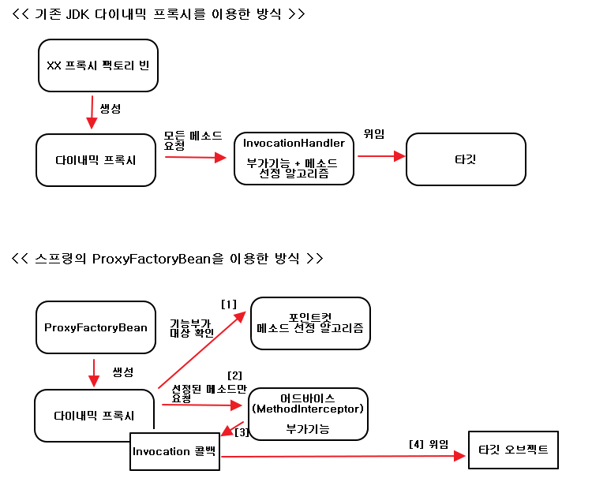
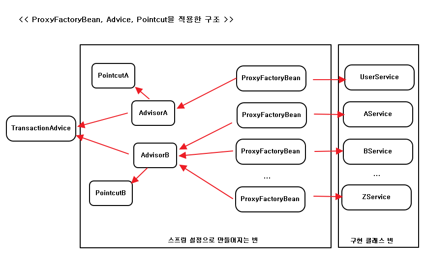

## 6.4 스프링의 프록시 팩토리 빈

- <a href="#6.4.1">6.4.1 ProxyFactoryBean</a>
- <a href="#6.4.2">6.4.2 ProxyFactoryBean 적용</a>

<div id="6.4.1"></div>

### 6.4.1 ProxyFactoryBean
; 자바에는 JDK에서 제공하는 다이나믹 프록시 이외에 다양한 기술 존재
=> 스프링은 일관된 방법으로 프록시를 만들 수 있게 도와주는 추상 레이어 제공
=> 스프링의 ProxyFactoryBean은 순수하게 프록시를 생성하는 작업만을 담당 &
부가기능을 별도의 빈에 둘 수 있음
=> MethodInterceptor 인터페이스를 구현해서 만듬
(InvocationHandler와 다른점은 타깃 오브젝트에 대한 정보도 함께 가지고 있음)


> 스프링의 ProxyFactoryBean을 이용한 다이나믹 프록시 테스트

```
import static org.hamcrest.core.Is.is;
import static org.junit.Assert.assertThat;

import java.lang.reflect.InvocationHandler;
import java.lang.reflect.Method;
import org.aopalliance.intercept.MethodInterceptor;
import org.aopalliance.intercept.MethodInvocation;
import org.junit.Test;
import org.springframework.aop.framework.ProxyFactoryBean;

public class DynamicProxyTest {

    @Test
    public void proxyFactoryBean() {
        ProxyFactoryBean pfBean = new ProxyFactoryBean();
        // 타깃 설정
        pfBean.setTarget(new HelloTarget());
        // 부가 기능을 담은 어드바이스 추가
        pfBean.addAdvice(new UppercaseAdvice());
        Hello proxiedHello = (Hello) pfBean.getObject();
        assertThat(proxiedHello.sayHello("zaccoding"), is("HELLO ZACCODING"));
        assertThat(proxiedHello.sayHi("zaccoding"), is("HI ZACCODING"));
        assertThat(proxiedHello.sayThankYou("zaccoding"), is("THANK YOU ZACCODING"));
    }

    static class UppercaseAdvice implements MethodInterceptor {

        public Object invoke(MethodInvocation invocation) throws Throwable {
            String ret = (String) invocation.proceed();
            return ret.toUpperCase();
        }
    }


    static interface Hello {

        String sayHello(String name);

        String sayHi(String name);

        String sayThankYou(String name);
    }

    static class HelloTarget implements Hello {

        public String sayHello(String name) {
            return "Hello " + name;
        }

        public String sayHi(String name) {
            return "Hi " + name;
        }

        public String sayThankYou(String name) {
            return "Thank You " + name;
        }
    }
}
```

**어드바이스 : 타깃이 필요 없는 순수한 부가기능**
; UppercaseAdvice에는 타깃 오브젝트가 등장 하지 않음
=> MethodInvocation은 일종의 콜백 오브젝트로, proceed() 메소드를 실행하면
타깃 오브젝트의 메소드를 내부적으로 실행해주는 기능이 존재

**포인트컷 : 부가기능 적용 대상 메소드 선정 방법**
; 기존 InvocationHandler에서는 메소드 이름으로 대상 메소드를 선정
=> ProxyFactoryBean과 MethodInterceptor에는 메소드 선정 기능을 적용X
(MethodInterceptor오브젝트는 타깃 정보를 갖고 있지 않도록 만들어지고
여러 프록시가 공유해서 사용할 수 있음)



> 기존 JDK 다이내믹 프록시를 이용한 방식
- InvocationHandler가 타깃과 메소드 선정 알고리즘 코드에 의존하고 있음
=> 타깃이 다르고 메소드 선정 방식이 다르면 InvocationHandler는 여러 프록시가
공유 할 수 없음

> 스프링의 ProxyFactoryBean(위의 순서 확인)

- 어드바이스 : 부가기능을 제공하는 오브젝트
- 포인트컷 : 메소드 선정 알고리즘을 담은 오브젝트
=> 두 가지 모두 여러 프록시에서 공유가 가능하도록 만들어지기 때문에 스프링의
싱글톤 빈으로 등록이 가능

=> 재사용 가능한 기능을 만들어두고 바뀌는 부분(콜백 오브젝트와 메소드 호출 정보)
만 외부에서 주입해서 이를 작업 흐름(부가기능 부여) 중에 사용하도록 하는 전형적인
템플릿/콜백 구조
(즉 어드바이스가 일종의 템플릿 && 타깃을 호출하는 기능을 갖고 있는 MethodInvocation이 콜백)

> 포인트컷까지 적용한 ProxyFactoryBean

```
@Test
public void pointcutAdvisor() {
    /* create proxy factory bean */
    ProxyFactoryBean pfBean = new ProxyFactoryBean();
    pfBean.setTarget(new HelloTarget());

    // 메소드 이름을 비교해서 대상을 선정하는 알고리즘을 제공하는 포인트컷 생성
    NameMatchMethodPointcut pointcut = new NameMatchMethodPointcut();
    pointcut.setMappedName("sayH*");

    pfBean.addAdvisor(new DefaultPointcutAdvisor(pointcut, new UppercaseAdvice()));

    /* use proxy */
    Hello proxiedHello = (Hello) pfBean.getObject();
    assertThat(proxiedHello.sayHello("zaccoding"), is("HELLO ZACCODING"));
    assertThat(proxiedHello.sayHi("zaccoding"), is("HI ZACCODING"));
    // pointcut의 메소드 선정X
    assertThat(proxiedHello.sayThankYou("zaccoding"), is("Thank You zaccoding"));
}
```

=> pointcut과 advice를 동시에 addAdvisor를 통해 호출
(여러 개의 어드바이스와 포인트컷이 추가될 수 있기 때문)
*어드바이저(advisor) = 포인트컷(메소드 선정 알고리즘) + 어드바이스(부가기능)*

<div id="6.4.2"></div>

### 6.4.2 ProxyFactoryBean 적용

**TransactionAdvice**
; 부가기능을 담당하는 어드바이스는 MethodInterceptor라는 Advice
서브인터페이스를 구현해서 만듬

> 트랜잭션 어드바이스

```
package springbook.user.service;

import org.aopalliance.intercept.MethodInterceptor;
import org.aopalliance.intercept.MethodInvocation;
import org.springframework.transaction.PlatformTransactionManager;
import org.springframework.transaction.TransactionStatus;
import org.springframework.transaction.support.DefaultTransactionDefinition;

public class TransactionAdvice implements MethodInterceptor {

    PlatformTransactionManager transactionManager;

    public void setTransactionManager(PlatformTransactionManager transactionManager) {
        this.transactionManager = transactionManager;
    }

    @Override
    public Object invoke(MethodInvocation methodInvocation) throws Throwable {
        TransactionStatus status = transactionManager.getTransaction(new DefaultTransactionDefinition());
        try {
            // 콜백을 호출해서 타깃의 메소드를 실행
            Object ret = methodInvocation.proceed();
            transactionManager.commit(status);
            return ret;
        } catch (RuntimeException e) {
            transactionManager.rollback(status);
            throw e;
        }

    }
}
```

**스프링 XML 설정파일**

```
<!-- 트랜잭션 어드바이스 빈 설정 -->
<bean id="transactionAdvice" class="springbook.user.service.TransactionAdvice">
    <property name="transactionManager" ref="transactionManager"/>
</bean>

<!-- 포인트컷 빈 설정 -->
<bean id="transactionPointcut" class="org.springframework.aop.support.NameMatchMethodPointcut">
    <property name="mappedName" value="upgrade*"/>
</bean>

<!-- 어드바이저 빈 설정 -->
<bean id="transactionAdvisor" class="org.springframework.aop.support.DefaultPointcutAdvisor">
    <property name="advice" ref="transactionAdvice"/>
    <property name="pointcut" ref="transactionPointcut"/>
</bean>

<!-- ProxyFactoryBean 설정 -->
<bean id="userService" class="org.springframework.aop.framework.ProxyFactoryBean">
    <property name="target" ref="userServiceImpl" />
    <property name="interceptorNames">
        <list>
            <value>transactionAdvisor</value>
        </list>
    </property>
</bean>
```


**테스트**


**어드바이스와 포인트컷의 재사용**  
; ProxyFactoryBean은 스프링의 DI와 템플릿/콜백 패턴, 서비스 추상화 등의 기법이 모두 적용  

  
