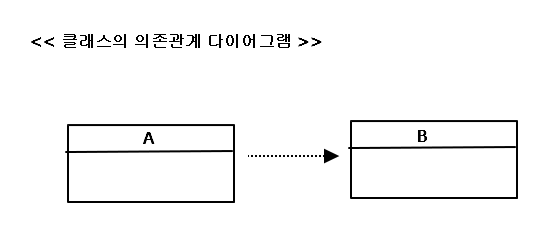
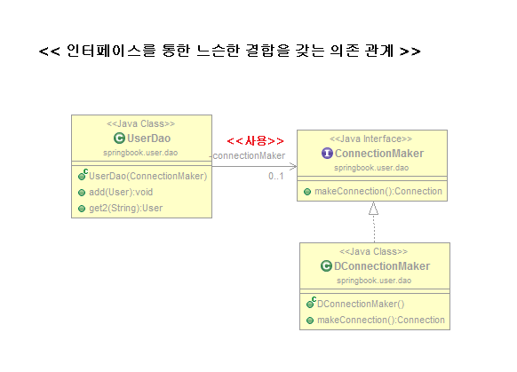
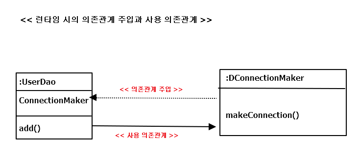
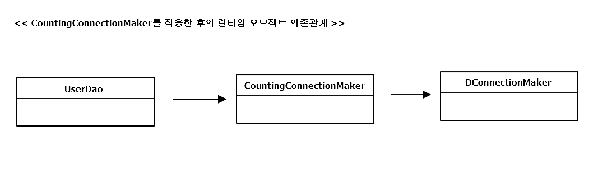

## 1.7 의존관계 주입(DI)

### 1.7.1 제어의 역전(IoC)과 의존관계 주입
; IoC는 소프트웨어에서 자주 발견하는 개념  
스프링의 IoC는 조금 포괄적임 
- 서버에서 동작하는 서비스 컨테이너(like Servlet) ?
- IoC 개념이 적용된 탬플릿 메소드 패턴을 이용해 만든 프레임워크 ?
- 또 다른 IoC 특징을 지닌 기술이라는 것?

=> 스프링이 제공하는 IoC 방식을 핵심을 직업주는  
=> *"의존관계 주입(Dependency Injection)* 사용하기 시작  
=> 의존관계 주입 컨테이너, DI 컨테이너 

### 1.7.2 런타임 의존관계 설정

**의존관계** 

두 개의 클래스 or 모듈이 의존관계에 있을 때   
=> 방향성을 부여해줘야 함  
( UML 에서는 위의 그림과 같이 두 클래스의  
의존관계(dependency relationship)를 점선으로 된   
화살표로 나타냄 )

=> 의존한다 == 의존대상(B)이 변하면 A에 영향을 미침  
e.g)  
A가 B를 사용하는 경우(==사용에 대한 의존관계),

B의 메소드가 변경되면 A도 그에 따라서 변경

단, B는 A의 변화에 영향을 받지 않음 

**UserDao의 의존관계**

UserDao 가 ConnectionMaker에 의존하고 있는 형태

-> ConnectionMaker 인터페이스가 변하면 그 영향을 UserDao가 직접 받음

-> BUT ConnectionMaker를 구현한 DConnectionMaker의 변화는

UserDao는 영향이 없음  

=> 인터페이스에 대해서만 의존관계를 만들어 주면, 인터페이스 구현 클래스와의 관계는

느슨해지면서 변화에 영향을 덜 받는 상태 == 결합도가 낮다

모델이나 코드에서 클래스와 인터페이스를 통해 드러나는 의존관계 말고 

런타임시에 오브젝트 사이에서 만들어지는 의존관계도 존재

=> 프로그램이 시작되고 UserDao 오브젝트가 만들어지고 나서 런타임 시에

의존관계를 맺는 대상, 즉 실제 사용대상인 오브젝트 == *의존 오브젝트 (dependent object)*

( 의존관계 주입은 구체적인 의존 오브젝트와 그것을 사용할 주체, 보통 클라이언트라 부르는

오브젝트를 런타임 시에 연결해주는 작업을 말함. )

Summary

- 클래스 모델이나 코드에는 런타임 시점의 의존관계가 드러나지 않는다  
   그러기 위해서는 인터페이스만 의존하고 있어야 한다.
- 런타임 시점의 의존관계는 컨테이너나 팩토리 같은 제3의 존재가 결정
- 의존관계는 사용할 오브젝트에 대한 레퍼런스를 외부에서 제공(주입)해줌으로써 만들어 짐

의존관계 주입의 핵심은 설계 시점에는 알지 못했던 두 오브젝트의 관계를 맺도록 도와주는 제3의 존재가 있음 

( DI에서 말하는 제3의 존재는 관계설정 책임을 가진 코드를 분리해서 만들어진 오브젝트라 볼 수 있음 )

=> 스프링 애플리케이션 컨텍스트, 빈 팩토리, IoC 컨테이너 등이 모두 외부에서 

오브젝트 사이의 런타임 관계를 맺어주는 책임을 지닌 제3의 존재라고 볼 수 있음

**UserDao의 의존관계 주입**

*관계설정 책임 분리 전의 UserDao 생성자*
<pre>
public UserDao() {
	connectionMaker = new DConnectionMaker();
}
</pre>

=> UserDao는 이미 설계 시점에서 DConnectionMaker라는 구체적인

클래스 존재를 알고 있음 i.e ConnectionMaker 인터페이스 관계뿐

아니라 런타임 의존관계 (DConnectionMaker)를 사용하겠다는 것까지

UserDao가 결정하고 관리하고 있는 셈

문제 : 런타임 시의 의존관계가 코드 속에 다 미리 결정되어 있음

=> IoC 방식을 써서 런타임 의존관계를 드러내는 코드 제거 & 

제 3의 존재에 런타임 의존관계 결정 권한을 위임

=> DaoFactory

( 런타임 시점에 UserDao가 사용할 ConnectionMaker 타입의 오브젝트를 결정 &

이를 생성한 후에 UserDao의 생성자 파라미터로 주입 &

UserDao가 DConnectionMaker의 오브젝트와 런타임 의존관계를 맺게 해줌

=> 런타임 시점의 의존관계를 결정하고 만들기 위해 제3의 존재 == DaoFactory )

DI 는 자신이 사용할 오브젝트에 대한 선택과 생성 제어권을 외부로 넘기고 

자신은 수동적으로 주입받은 오브젝트를 사용한다는 점에서 IoC 개념에 잘 맞음

*스프링 컨테이너의 IoC는 주로 의존관계 주입 또는 DI라는 데 초점이 맞춰져 있음*

*=> IoC 컨테이너 || DI 컨테이너 || DI 프레임워크라 부름* 

### 1.7.3 의존관계 검색과 주입
; 스프링이 제공하는 IoC 방법에는 의존관계 주입만 있는 것이 아님

=> 의존관계를 맺는 방법이 외부로 부터의 주입이 아니라 스스로 검색을 이용하기 때문에,

의존관계 검색(dependency lookup)이라고 불리는 것도 존재

*DaoFactory를 이용하는 생성자*
<pre>
public UserDao() {	
	DaoFactory daoFactory = new DaoFactory();
	this.connectionMaker = daofactory.connectionMaker();
</pre>

DaoFactory가 IoC 컨테이너라고 하면

UserDao는 여전히 자신이 어떤 ConnectionMaker 오브젝트를 사용할 지 미리 알지 못함

( 코드의 의존대상은 ConnectionMaker 인터페이스 뿐)

또한, 런타임 시에 DaoFacotyr가 만들어서 돌려주는 오브젝트와 다이내믹하게

런타임 의존관계를 맺으므로 IoC 개념을 잘 따르고 있음

BUT 적용 방법은 외부로부터의 주입이 아니라, 스스로 IoC 컨테이너인 DaoFactory에게 요청

일반화한 스프링의 애플리케이션 컨텍스트라면, 미리 정해놓은 이름을 전달해서 그 이름에

해당하는 오브젝트를 찾아므로 일종의 검색 == 의존관계 검색

=> 스프링의 IoC 컨테이너인 애플리케이션 컨텍스트는 getBean()이라는 메소드 제공

*의존관계 검색을 이용하는 UserDao 생성자*
<pre>
public UserDao() {
	AnnotationConfigApplicationContext context = 
		new AnnotationConfigApplicationContext(DaoFactory.class);
	this.connectionMaker = context.getBean("connectionMaker", ConnectionMaker.class);		
</pre>

=> UserDao는 사용자에 대한 DB 정보를 어떻게 가져와야하는 것인가에 집중해야하므로

의존관계 검색( 스프링 API , 오브젝트 팩토리 클래스 등의 코드가 등장하므로) 보다

의존관계 주입이 훨씬 단순하고 깔끔함

*의존관계 검색이 필요한 경우 ?* 

=> 애플리케이션의 기동시점에서 적어도 한 번은 의존관계 검색 방식을 사용해 

오브젝트를 가져와야 함 ( e.g UserDaoTest )

( static 메소드인 main() 에서는 DI를 이용해 오브젝트를 주입받을 방법이 없으므로 )

(in Server) 서블릿에서 스프링 컨테이너에 담긴 오브젝트를 사용하려면 한 번은 의존관계

검색 방식을 사용해 오브젝트를 가져와야 함 ( 직접 구현 하지는 않지만,)

*의존관계 검색 vs 의존관계 주입의 중요한 차이점 ?*

- 의존관계 검색

=> 검색하는 오브젝트는 자신이 스프링의 빈일 필요가 없음 

e.g) UserDao에 getBean()을 사용한 경우, UserDao는 굳이 스플링이 만들고 

관리하는 빈일 필요가 없음. 그냥 어디가에서 직접 new 연산자를 통해 사용해도 됨

(ConnectionMaker만 스프링의 빈이기만 하면 됨)

- 의존관계 주입

=> UserDao --> ConnectionMaker 사이에 DI가 적용되려면, UserDao도 반드시

컨테이너가 만드는 빈 오브젝트여야 한다.

( 컨테이너가 UserDao에 ConnectionMaker 오브젝트를 주입해주려면 UserDao에 대한

생성과 초기화 권한을 갖고 있어야 하려면, UserDao는 IoC 방식으로 컨테이너에서 생성

되는 오브젝트, 즉 빈이어야 하기 때문 )

### 1.7.4 의존관계 주입의 응용

*DI 기술 ( 런타임 시에 사용 의존관계를 맺을 오브젝트를 주입 ) 의 장점 ?*

- 코드에는 런타임 클래스에 대한 의존관계가 나타지 않고
- 인터페이스를 통해 결합도가 낮은 코드를 만들고
- 다른 책임을 가진 사용 의존관계에 있는 대상이 변경되어도 자신은 영향 X
- 변경을 통한 다양한 확장 방법에는 자유로움
- 그 외에도 스프링이 제공하는 기능의 대부분이 DI 의 혜택을 이용하고 있음

**기능 구현의 교환**

가정 :  
실제 운영 시 사용할 데이터베이스는 매우 중요한 자원이므로, 평상시에도 항상 부하를 많이 받고 있음

개발 중에는 절대 사용하지 말아야 하므로, 로컬 DB로 사용 & 개발 후 배포 하는 상황   

DI 방식을 적용하지 않았다고 가정

-> 로컬 DB에 연결 기능이 있는 LocalDBConntionMaker 만들고, 모든 DAO에서 

이 클래스의 오브젝트를 매번 생성해서 사용하다가 서버에 배포 시

ProductionDBConnectionMaker라는 클래스로 변경 해야 한다면?

-> DAO가 100개라면 최소한 100군데 코드를 수정해야 함. 하나라도 빼 먹으면 오류가 발생

-> 다시 Local로 사용하려면, 또 수정..

DI를 적용하면 ? 

-> 모든 DAO는 생성 시점에 ConnectionMaker 타입의 오브젝트를 컨테이너로부터 제공 받는다.

*개발용 ConnectionMaker 생성 코드*

<pre>
@Bean
public ConnectionMaker connectionMaker() {
	return new LocalDBConnectionMaker();
}
</pre>

*운영용 ConnectionMaker 생성 코드*

<pre>
@Bean
public ConnectionMaker connectionMaker() {
	return new ProductionDBConnectionMaker();
}
</pre>

=> 개발환경과 운영환경에서 DI의 설정정보에 해당하는 DaoFactory만 다르게 만들어 두면

나머지 코드에는 전혀 손대지 않고 개발 시와 운영 시에 각각 다른 런타임 오브젝트에 의존관계를 갖게 해줘서 문제 해결 가능!

추가적으로, 다른 팀이 테스트용의 별도의 테스트 DB를 만들어서 개발한 코드를 쓸 때도 DAO를 손댈 필요 X

 
 
**부가기능 추가**

가정 : 

DAO가 DB를 얼마나 많이 연결해서 사용하는지 파악 

-> 모든 DAO의 makeConnection()에 코드 추가해야 함

-> 노가다 일 뿐만 아니라, DB의 연결횟수를 세는 일은 DAO의 관심사항도 아님

==> DI 컨테이너라면, DAO와  DB 커넥션을 만드는 오브젝트 사이에

연결횟수를 카운팅하는 오브젝트를 하나 더 추가해주면 간편히 해결

*연결횟수 카운팅 기능이 있는 클래스*
<pre>
import java.sql.Connection;
import java.sql.SQLException;

//자신의 관심사인 DB 연결 횟수 카운팅 작업
public class CountingConnectionMaker implements ConnectionMaker {
	
	int counter = 0;
	private ConnectionMaker realConnectionMaker;
	
	// DI 받음
	public CountingConnectionMaker(ConnectionMaker realConnectionMaker) {
		this.realConnectionMaker = realConnectionMaker;
	}
	
	@Override
	public Connection makeConnection() throws ClassNotFoundException, SQLException {
		this.counter++;
		return realConnectionMaker.makeConnection();
	}
	
	public int getCounter() {
		return this.counter;
	}
}
</pre>

*CountingConnectionMaker 의존관계가 추가된 DI 설정용 클래스*
<pre>
import org.springframework.context.annotation.Bean;
import org.springframework.context.annotation.Configuration;

@Configuration
public class CountingDaoFactory {	
	@Bean
	public UserDao userDao() {
		return new UserDao(connectionMaker());
	}
	
	@Bean
	public ConnectionMaker connectionMaker() {
		return new CountingConnectionMaker( realConnectionMaker() );
	}
	
	@Bean
	public ConnectionMaker realConnectionMaker() {
		return new DConnectionMaker();
	}
}
</pre>

*CountingConnectionMaker에 대한 테스트 클래스*
<pre>
import java.sql.SQLException;

import org.springframework.context.annotation.AnnotationConfigApplicationContext;

public class UserDaoConnectionCountingTest {
	
	public static void main(String[] args) throws ClassNotFoundException, SQLException {
		AnnotationConfigApplicationContext context =
				new AnnotationConfigApplicationContext( CountingDaoFactory.class );
		
		UserDao dao = context.getBean("userDao",UserDao.class);
		
		/*
		 * DAO 사용 코드 
		 */
		CountingConnectionMaker ccm = context.getBean("connectionMaker",CountingConnectionMaker.class);
		System.out.println("Connection counter : " + ccm.getCounter() );		
	}
	
}
</pre>

=> DI의 장점은 관심사의 분리(SoC)를 통해 얻어지는 높은 응집도에서 나옴 

=> 모든 DAO가 의존해서 사용할 ConnectionMaker 타입의 오브젝트는 connectionMaker()에서 만듬

=> CountingConnectionMaker의 의존관계를 추가하려면, 이 메소드만 수정하면 끝

=> 또한, CountingConnectionMaker를 이용한 분석 작업이 모두 끝나면, 다시 

CountingDaoFactory 설정 클래스를 DaoFactory로 변경 or connectionMaker() 메소드를 수정

하는 것만으로 DAO의 런타임 의존관계는 이전상태로 복구!!

> 스프링은 DI를 편하게 사용할 수 있도록 도와주는 도구이면서 그 자체로 DI를 적극 활용한 프레임 워크 이기도 함

### 1.7.5 메소드를 이용한 의존관계 주입
지금까지 UserDao의 의존관계 주입을 위해 생성자를 사용했지만, 일반 메소드를 이용하는 방법은

아래와 같음

- 수정자 메소드를 이용한 주입  
수정자(Setter) 메소드는 외부에서 오브젝트 내부의 애트리뷰트 값을 변경하려는 용도로 주로 사용  
- 일반 메소드를 이요한 주입  
여러 개의 파라미터를 갖는 일반 메소드를 DI용으로 사용할 수도 있음  
(한번에 모든 필요한 파라미터를 다 받아야 하는 생서자 보다 나음)  

*수정자 메소드 DI 방식을 사용한 UserDao*
<pre>
public class UserDao {
	
	private ConnectionMaker connectionMaker;
	
	public void setConnectionMaker(ConnectionMaker connectionMaker) {
		this.connectionMaker = connectionMaker;
	}
	....	
}
</pre>

*수정자 메ㅗ드 DI를 사용하는 팩토리 메소드*
<pre>
	@Bean
	public UserDao userDao() {
		UserDao userDao = new UserDao();
		userDao.setConnectionMaker( connectionMaker() );
		return userDao;
	}
</pre>

 

 

 

  
 

  
  

 
 
 

