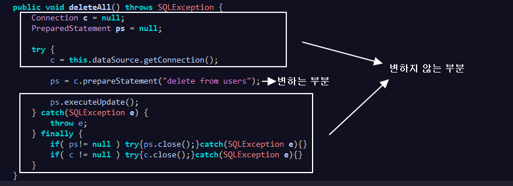
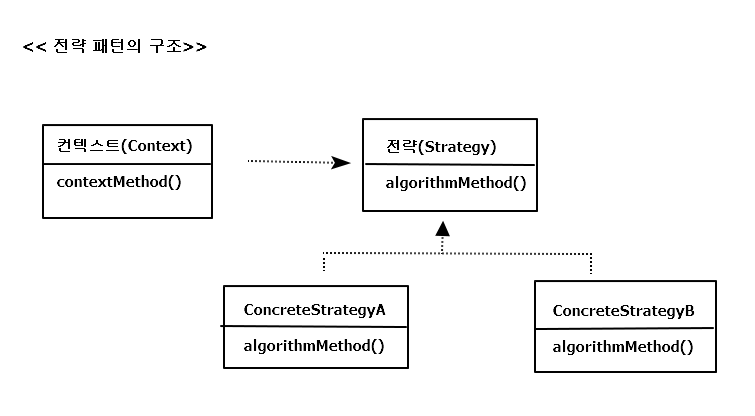
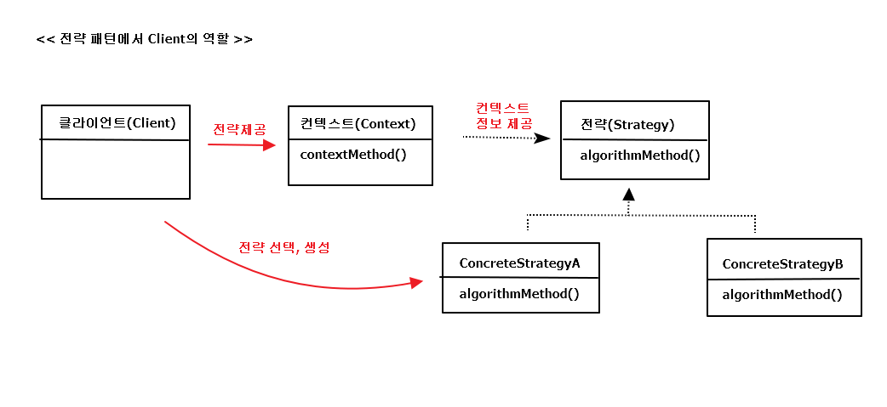

## 3.2 변하는 것과 변하지 않는 것

### 3.2.1 JDBC try/catch/finally 코드의 문제점
; try/catch/finally 블록이 2중 중첩 + 모든 메소드 반복

=> Copy&Paste 신공으로 여러 번 복붙은 어려운 건 아니지만,  
실수로 잘못 복붙했거나, 초반엔 발견되지 않고 배치 후 에러 발생 등  
실수 확률이 너무 높음  
=> 테스트를 통해 리소스를 반납하는 건 적용하지 쉽지 않음

### 3.2.2 분리와 재사용을 위한 디자인 패턴 적용

*개선할 deleteAll() 메소드*

**메소드 추출**

*변하는 부분을 메소드로 추출한 후의 deleteAll()* 
<pre>
	public void deleteAll() throws SQLException {
		...
		
		try {
			c = this.dataSource.getConnection();
			
			ps = makeStatement(c);
			
			ps.executeUpdate();
		} catch(SQLException e) {
			...				
	}
	
	private PreparedStatement makeStatement(Connection c) throws SQLException {
		PreparedStatement ps;
		ps = c.prepareStatement("delete from users");
		return ps;
	}	
</pre>

=> 자주 바뀌는 부분을 메소드로 독립했지만, 당장 봐서는 별 이득 X

메소드 추출 리팩토링을 적용하는 경우에는 분리된 메소드를 다른 곳에서

재사용할 수 있어야 하는데, 이건 반대로 분리시키고 남은 메소드가

재사용이 필요한 부분이고, 분리된 메소드는 DAO 로직마다 새롭게 만들어서

확장돼야 하는 부분이기 때문에 뭔가 반대로 됐음

**탬플릿 메소드 패턴의 적용**  
; 상속을 통해 기능을 확장해서 사용하는 부분

( 변하지 않는 부분은 슈퍼클래스에 두고, 변하는 부분은 추상 메소드로

정의해둬서 서브클래스에서 오버라이드하여 새롭게 정의해 쓰도록 하는 것 )

*템플릿 메소드 패턴의 적용* 
<pre>
	public abstract class UserDao {
		...
		abstract protected PreparedStatement makeStatement(Connection c) throws SQLException;
		..
	}
	
	public class UserDaoDeleteAll extends UserDao {
		protected PreparedStatement makeStatement(Connection c) throws SQLException {
			PreparedStatement ps;
			ps = c.prepareStatement("delete from users");
			return ps;
		}
	}	
</pre>

==> UserDao 클래스의 기능을 확장하고 싶을 때마다 상속을 통해 자유롭게 확장할 수 있고,

확장 때문에 기존의 상위 DAO 클래스에 불필요한 변화는 생기지 않도록 할 수 있으니 객체지향 설계의

핵심 원리인 개방 폐쇄 원칙(OCP)을 그럭저럭 지키는 구조는 만든 것 같음

**BUT** DAO 로직마다 상속을 통해 새로운 클래스를 만들어야 함 > 단점이 더 많아 보임

**전략 패턴의 적용**  
; 개방 폐쇄 원칙(OCP)을 잘 지키는 구조이면서도 템플릿 메소드 패턴보다 유연하고

확장성이 뛰어난 것이, 오브젝트를 아예 둘로 분리하고 클래스 레벨에서는 인터페이스를 통해서만

의존하도록 만드는 전략 패턴

=> 전략 패턴은 OCP 관점에 보면 확장에 해당하는 변하는 부분을 별도의 클래스로 만들어

추상화된 인터페이스를 통해 위임하는 방식

위의 그림에서, deleteAll() 메소드에서 변하지 않는 부분이라고 명시한 것이

contextMethod()가 됨

=> deleteAll()은 JDBC를 이용해 DB를 업데이트하는 작업이라는 변하지 않는

맥락(context)을 갖는다

*deleteAll()의 컨텍스트를 정리*

- DB 커넥션 가져오기
- PreparedStatement를 만들어줄 외부 기능 호출하기 (전략)
- 전달받은 PreparedStatement 실행하기
- 모든 경우에 만들어진 PreparedStatement와 Connection을 적절히 닫아주기

==> 전략 패턴의 구조를 따라 이 기능을 인터페이스로 만들어두고 인터페이스의 메소드를 통해

PreparedStatement 생성 전략을 호출

*StatementStrategy 인터페이스*

<pre>
package springbook.user.dao;

...

public interface StatementStrategy {
	PreparedStatement makePreparedStatement(Connection c) throws SQLException;
}
</pre>

*deleteAll() 메소드의 기능을 구현한 StatementStrategy*

<pre>
package springbook.user.dao;

...

public class DeleteAllStatement implements StatementStrategy {
	@Override
	public PreparedStatement makePreparedStatement(Connection c) throws SQLException {
		PreparedStatement ps = c.prepareStatement("delete from users");
		return ps;
	}
}
</pre>

*전략 패턴을 따라 DeleteAllStratement가 적용된 deleteAll() 메소드*

<pre>
	public void deleteAll() throws SQLException {
		...		
		try {
			c = this.dataSource.getConnection();
			
			StatementStrategy strategy = new DeleteAllStatement();			
			ps = strategy.makePreparedStatement(c);
			
			ps.executeUpdate();
		} catch(SQLException e) {
			...			
	}
</pre>

=> 전략 패턴은 필요에 따라 컨텍스트는 그대로 유지되면서(OCP의 폐쇄원칙)

전략을 바꿔 쓸 수 있다(OCP의 개방 원칙)는 것인데, 위처럼 컨텍스트 안에서

이미 구체적인 전략 클래스인 DeleteAllStatement를 사용하도록 고정되어 

있으므로 이상함

=> 컨텍스트가 StatementStrategy 인터페이스와 특정 구현 클래스인 

DeleteAllStatement를 직접 알고 있는 건, 전략 패턴과 OCP에도 잘 들어맞지X

**DI 적용을 위한 클라이언트/컨텍스트 분리**

; 전략 패턴에 따르면 Context가 어떤 전략을 사용하게 할 것인가는 

Context를 사용하는 앞단의 Client가 결정하는게 일반적.

(Client가 구체적인 전략의 하나를 선택하고 오브젝트로 만들어서 Context에 전달)

 

==> like 1장에서 컨텍스트(UserDao)가 필요로 하는 전략(ConnectionMaker)의 

특정 구현 클래스(DConnectionMaker) 오브젝트를 클라이언트(UserDaoTest)가

만들어서 제공하는 방법

==> 결국 이 구조에서 전략 오브젝트 생성과 컨텍스트로의 전달을 담당하는 책임을 분리 \

시킨 것이 바로 ObjectFactory이며, 이를 일반화한 것이 앞에서 살펴봤던 의존관계 주입(DI)

==> 결국 DI란, 이러한 전략 패턴의 장점을 일반적으로 활용할 수 있도록 만든 구조!

*메소드로 분리한 try/catch/finally 컨텍스트 코드*

<pre>
// stmt : 클라이언트가 컨텍스트를 호출할 때 넘겨줄 전략 파라미터
public void jdbcContextWithStatementStrategy(StatementStrategy stmt) throws SQLException {
	Connection c = null;
	PreparedStatement ps = null;
	
	try {
	c = this.dataSource.getConnection();
					
		ps = stmt.makePreparedStatement(c);
		
		ps.executeUpdate();
	} catch(SQLException e) {
		throw e;
	} finally {
		if( ps!= null ) try{ps.close();}catch(SQLException e){}
		if( c != null ) try{c.close();}catch(SQLException e){}
	}	
}
</pre>

==> 클라이언트로부터 StatementStrategy 타입의 전략 오브젝트를 제공 받고,

JDBC try/catch/finally 구조로 만들어진 컨텍스트 내에서 작업을 수행

( 제공받은 전략 오브젝트는 PreparedStatement 생성이 필요한 시점에 호출해서 사용 )

클라이언트 deleteAll() : 

deleteAll()은 전략 오브젝트를 만들고, 컨텍스트를 호출하는 책임을 지고 있음

*클라이언트 책임을 담당할 deleteAll() 메소드*

<pre>
public void deleteAll() throws SQLException {
	// 선정한 전략 클래스의 오브젝트 생성
	StatementStrategy st = new DeleteAllStatement();
	// 컨텍스트 호출. 전략 오브젝트 전달
	jdbcContextWithStatementStrategy(st);
}
</pre>

=> 구조로 볼 때 완벽한 전략 패턴의 모습을 갖춤

(비록 클라이언트와 컨텍스트는 클래스로 분리하지 않았지만, 의존관계와 

책임을 볼 때 이상적인 클라이언트/컨텍스트 관계를 갖고 있음)

=> 이 구조가 기반이 돼서 앞으로 진행할 UserDao 코드의 본격적인

개선 작업이 가능한 것

*마이크로 DI*

: 의존관계 주입(DI)는 다양한 형태로 적용할 수 있음

( *제3자의 도움을 통해 두 오브젝트 사이의 유연한 관계가 설정되도록 만드는 것 )

- 의존관계에 있는 두 개의 오브젝트와 이 관계를 다이내믹하게 설정해주는 오브젝트 팩토리(DI 컨테이너) 
클라이언트라는 4개의 오브젝트 사이에서 일어나는 것

- 원시적인 전략 패턴 구조를 따라 클라이언트가 오브젝트 팩토의 책임을 함께 지고 있을 수도 있음

- 클라이언트와 전략(의존 오브젝트)이 결합될 수도 있음

- 클라이언트와 DI 관계에 있는 두 개의 오브젝트가 모두 하나의 클래스 안에 담길 수도 있음

=> 밑의 경우, DI가 매우 작은 단위의 코드와 메소드 사이에서 일어나기도 함.

얼핏 보면 DI 같아 보이지 않지만, 세밀하게 관찰해보면 작은 단위지만 엄연히 DI가 이뤄지고 있음을 알 수 있음

=> DI의 장점을 단순화해서 IoC 컨테이너의 도움 없이 코드 내에서 적용한 경우를

마이크로 DI  or 수동 DI(코드에 의한 DI)라고 부를 수 있음

