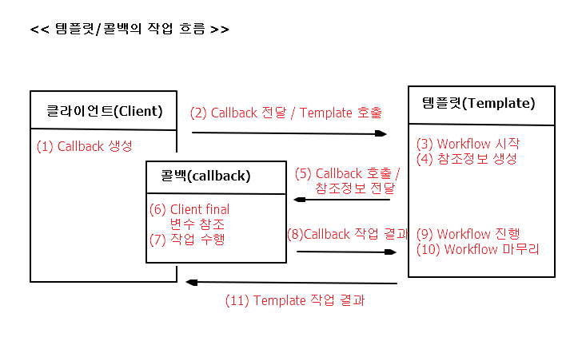
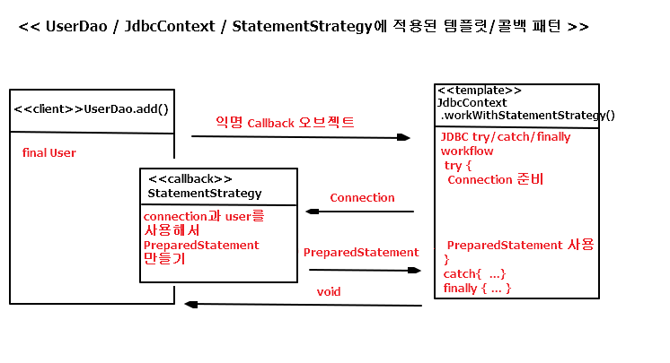
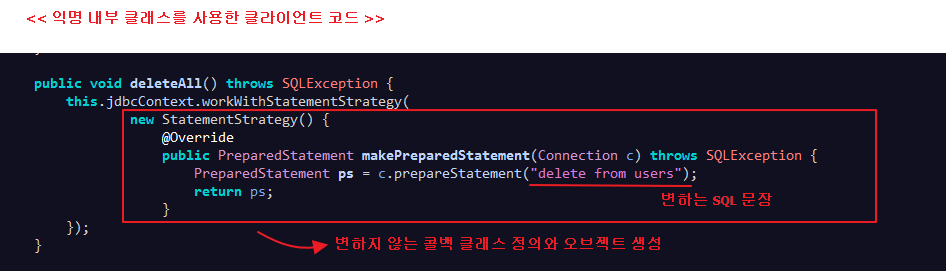
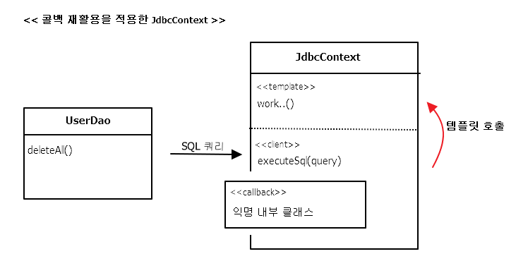

## 3.5 템플릿과 콜백
;UserDao, StatementStrategy, JdbcContext를 이용해 만든 코드는 

일종의 전략 패턴이 적용 된 것.

( 복잡하지만 바뀌지 않는 일정한 패턴을 갖는 작업 흐름이 존재하고 그 중 일부분만 자주 바꿔서

사용해야 하는 경우에 적합한 구조 )

=> 전략 패턴의 기본 구조에 익명 내부 클래스를 활용한 방식.

=> 이러한 방식을 스프링에서는 **템플릿/콜백 패턴**이라고 부름.

( 전략 패턴의 컨텍스트 == 템플릿 // 익명 내부 클래스 오브젝트 == 콜백 )

*템플릿(template)*  
=> 어떤 목적을 위해 미리 만들어둔 모양이 있는 틀

( JSP는 HTML이라는 고정된 부분에 EL과 스크립트릿이라는 변하는 부분을 넣은 일종의

템플릿 파일 )

*콜백(callback)* 
=> 실행되는 것을 목적으로 다른 오브젝트의 메소드에 전달되는 오브젝트를 말함.

( 파라미터로 전달되지만 값을 참조하기 위한 것이 아니라 특정 로직을 담은 메소드를

실행시키기 위해 사용. 자바에서는 메소드 자체를 파라미터로 전달할 방법이 없기 때문에

메소드가 담긴 오브젝트를 전달(펑셔널 오브젝트(functional object) 라고도 부름)

### 3.5.1 템플릿/콜백의 동작원리

**템플릿/콜백의 특징**

-> 보통 단일 메소드 인터페이스를 사용

( 템플릿의 작업 흐름 중 특정 기능을 위해 한 번 호출되는 경우가 일반적이므로 

하나의 템플릿에서 여러 가지 종류의 전략을 사용해야 한다면, 하나 이상의 콜백 오브젝트를 사용할 수 도 있음 )

---

> 클라이언트 : UserDao 
<pre>
public class UserDao {
	...
	public void add(final User user) throws SQLException {		
		this.jdbcContext.workWithStatementStrategy(
				new StatementStrategy() {
					@Override
					public PreparedStatement makePreparedStatement(Connection c) throws SQLException {
						PreparedStatement ps = 
									c.prepareStatement("insert into users(id, name, password) values(?,?,?)");
						ps.setString(1, user.getId());
						ps.setString(2, user.getName());
						ps.setString(3, user.getPassword());

						return ps;
					}
				}
		);
	}	
	..
}
</pre>

> 콜백 : 익명 클래스 (in UserDao)
<pre>
new StatementStrategy() {
	@Override
	public PreparedStatement makePreparedStatement(Connection c) throws SQLException {
		PreparedStatement ps = 
				c.prepareStatement("insert into users(id, name, password) values(?,?,?)");
		ps.setString(1, user.getId());
		ps.setString(2, user.getName());
		ps.setString(3, user.getPassword());

		return ps;
	}
}	
</pre>

> 템플릿 : JdbcContext 
<pre>
public class JdbcContext {
	...
	public void workWithStatementStrategy(StatementStrategy stmt) throws SQLException {
		Connection c = null;
		PreparedStatement ps = null;
		
		try {
			c = this.dataSource.getConnection();
						
			ps = stmt.makePreparedStatement(c);
			
			ps.executeUpdate();
		} catch(SQLException e) {
			throw e;
		} finally {
			if( ps!= null ) try{ps.close();}catch(SQLException e){}
			if( c != null ) try{c.close();}catch(SQLException e){}
		}	
	}	
}
</pre>
 
---

- 클라이언트의 역할은 템플릿 안에서 실행될 로직을 담은 콜백 오브젝트를 만들고,

콜백이 참조할 정보를 제공. 만들어진 콜백은 클라이언트가 템플릿의 메소드를 호출할 때

파라미터로 전달

- 템플릿은 정해진 작업 흐름을 따라 작업을 진행하다 내부에서 생성한 참조정보를 가지고

콜백 오브젝트의 메소드를 호출. 콜백은 클라이언트 메소드에 있는 정보와 템플릿이 제공한 참조정보를

이용해서 작업을 수행하고 그 결과를 다시 템플릿에 돌려줌

- 템플릿은 콜백이 돌려준 정보를 사용해서 작업을 마저 수행. 

경우에 따라 최종 결과를 클라이언트에 다시 돌려주기도 함

=> 템플릿/콜백 방식은 전략 패턴과 DI의 장점을 익명 내부 클래스 사용 전략과 결합한 

독특한 활용법이라고 이해할 수 있음.

---

**JdbcContext에 적용된 템플릿/콜백**

=>JdbcContext의 workWithStatementStrategy() 템플릿은 리턴 값이 없는

단순한 구조. 조회 작업에서는 보통 템플릿의 작업 결과를 클라이언트에 리턴 해줌

( 복잡한 경우에는 한 번 이상 콜백을 호출하기도 하고 여러 개의 콜백을 클라이언트로부터

받아서 사용하기도 한다 )

### 3.5.2 편리한 콜백의 재활용

;템플릿/콜백 방식은 템플릿에 담긴 코드를 여기저기서 반복적으로 사용하는 원시적인 방법에 비해

많은 장점이 있음.

- JdbcContext를 사용하기만 해도 기존에 JDBC 기반의 코드를 만들었을 때 발생했던 여러 가지 문제점과

불편한 점을 제거할 수 있음

- DAO의 메소드는 간결해지고 최소한의 데이터 엑세스 로직만 갖고 있게 됨

BUT DAO 메소드에서 매번 익명 클래스를 사용하기 때문에 상대적으로 코드를 작성하고 읽기가 불편!

**콜백의 분리와 재활용**

; 복잡한 익명 내부 클래스의 사용을 최소화할 수 있는 방법 찾아 보기.

---

> 변하지 않는 부분을 분리시킨 delteAll() 메소드

<pre>
	public void deleteAll() throws SQLException {
		executeSql("delete from users"); // 변하는 SQL 문장
	}
	
	/// ---- 분리 ----
		
	private void executeSql(final String query) throws SQLException {
		this.jdbcContext.workWithStatementStrategy(new StatementStrategy() {
			@Override
			public PreparedStatement makePreparedStatement(Connection c) throws SQLException {
				return c.prepareStatement(query);
			}
		});
		// 변하지 않는 콜백 클래스 정의와 오브젝트 생성
	}
</pre>

---

=> 재활용 가능한 콜백을 담은 메소드가 만들어짐

=> 변하는 것과 변하지 않는 것을 분리하고 변하지 않는 건 유연하게 재활용할 수 있게 

만든다는 간단한 원리를 계속 적용했을 때, 위와 같이 단순하면서도 안전하게 작성 가능한 

JDBC 활용 코드가 완성!

---

**콜백과 템플릿의 결합**

; 조금더 나아가, executeSql() 메소드는 UserDao만 사용하기 아까움!

-> 재사용 가능한 콜백을 담고 있는 메소드라면, DAO가 공유할 수 있는 템플릿 

클래스 안으로 옮겨도 됨! (엄밀히 템플릿은 JdbcContext가 아니라, work..()메소드 )

---

> JdbcContext로 옮긴 executeSql() 메소드
<pre>
public class JdbcContext {
	...
	public void executeSql(final String query) throws SQLException {
		workWithStatementStrategy(new StatementStrategy() {
			@Override
			public PreparedStatement makePreparedStatement(Connection c) throws SQLException {
				return c.prepareStatement(query);
			}
		});
	}
}
</pre>

> JdbcContext로 옮긴 executeSql()을 사용하는 deleteAll() 메소드

<pre>
public void deleteAll() throws SQLException {
	this.jdbcContext.executeSql("delete from users");
}
</pre>

---

-> 모든 DAO 메소드에서 executeSql() 메소드를 사용할 수 있게 됨

-> JdbcContext 안에 클라이언트와 템플릿, 콜백이 모두 함께 공존하면서

동작하는 구조가 됨!

=> 일반적으로는 성격이 다른 코드들은 가능한 한 분리하는 편이 낫지만,

위의 경우는 반대임. 하나의 목적을 위해 서로 긴밀하게 연관되어 동작하는

응집력이 강한 코드들이기 때문에, 한 군데 모여 있는게 유리.

=> i.e 구체적인 구현, 내부의 전략 패턴, 코드에 의한 DI, 익명 내부 클래스 등의

기술은 최대한 감춰두고, 외부에는 꼭 필요한 기능을 제공하는 단순한 메소드만 노출해주는 것!

-> add() 에도 같은 방법을 적용할 수 있음. 바인딩 될 파라미터 내용이 추가 돼야 함 

### 3.5.3 템플릿/콜백의 응용

; 템플릿/콜백 패턴은 스프링에서만 사용할 수 있는 독점적인 기술은 아니지만,

스프링만큼 적극적으로 활용하는 프레임워크는 없음

; DI 역시 객체지향의 장점을 잘 살려서 설계하고 구현하도록 도와주는 여러 가지 원칙과 패턴의

활용 결과일 뿐임. 단지 스프링은 이를 편리하게 사용할 수 있도록 도와주는 컨테이너를 제공하고

이런 패턴의 사용방법을 지지하는 것. 템플릿/콜백 패턴도 DI와 객체지향 설계를 적극적 응용한 결과

-> 고정된 작업 흐름을 갖고 있으면서 여기저기서 자주 반복되는 코드가 있다면, 중복되는 코드를

분리할 방법을 생각하는 습관을 기르기. (우선 메소드로 분리)

-> 그중 일부 작업을 필요에 따라 바꾸어 사용해야 한다면 인터페이스를 사이에 두고 분리해서 

전략 패턴을 적용하고 DI로 의존관계를 관리하도록 만듬

-> 바뀌는 부분이 한 애플리케이션 안에서 동시에 여러 종류가 만들어질 수 있다면, 템플릿/콜백

패턴을 적용하는 것을 고려해볼 수 있음

==> 가장 전형적인 템플릿/콜백 패턴 후보는 try/catch/finally

**테스트와 try/catch/finally**

e.g ) 간단한 템플릿/콜백 예제

; 파일을 하나 열어서 모든 라인의 숫자를 더한 합을 돌려주는 코드를 만들기.

---

> 예외시 BufferedReader를 닫아주고, 로그를 남기는 Calculator

<pre>
package springbook.learningtest.template;

import java.io.BufferedReader;
import java.io.FileReader;
import java.io.IOException;

public class Calculator {
	public Integer calcSum(String filepath) throws IOException {
		BufferedReader br = null;
		try {			
			// 한줄씩 읽기 편하게 BufferedReader
			br = new BufferedReader(new FileReader(filepath));
			Integer sum = 0;
			String line = null;
			while( ( line = br.readLine() ) != null ) {
				sum += Integer.valueOf(line);
			}
			return sum;
		} catch(IOException e) {
			System.out.println(e.getMessage());
			throw e;
		} finally {
			if( br != null ) { 
				try{ br.close();}
				catch(IOException e){System.out.println(e.getMessage());} 
			}
		}		
	}
}

</pre>

> 파일의 숫자 합을 계산하는 코드의 테스트 CalcSumTest

<pre>
package springbook.learningtest.template;

import static org.hamcrest.CoreMatchers.is;
import static org.junit.Assert.assertThat;

import java.io.IOException;

import org.junit.Test;

public class CalcSumTest {	
	@Test
	public void sumOfNumbers() throws IOException {
		Calculator calculator = new Calculator();		
		int sum = calculator.calcSum(getClass().getResource("numbers.txt").getPath());
		assertThat(sum, is(10));
	}
}
</pre>

> numbers.txt
<pre>
1
2
3
4
</pre>

---

-> Caculator는 DAO의 JDBC 코드에 적용했던 것과 기본 개념은 같음

- 만들어진 모든 리소스는 확실히 정리하고 빠져나오도록 만드는 것
- 모든 예외상황에 대해서는 적절한 처리를 해주도록 하는 것

---

**중복의 제거와 템플릿/콜백 설계**

*가정 : *

- 모든 숫자의 곱을 계산하는 기능을 추가
- 앞으로 많은 파일에 담긴 숫자 데이터를 여러 가지 방식으로 처리하는 기능이 추가 될 것

-> 복붙 ? 세 번 이상 반복된다면 코드를 개선할 시점이라고 생각해야 객체지향 언어를 사용하고

객체지향 설계를 통해 코드를 작성하는 개발자의 기본 자세!!

=> 템플릿/콜백 패턴을 적용해보면,

-> 템플릿에 담을 반복되는 작업 흐름이 어떤 것인지 살펴 보기

-> 템플릿이 콜백에게 전달해줄 내부의 정보는 무엇이고

-> 콜백이 템플릿에 돌려줄 내용은 무엇인지각

-> 템플릿이 작업을 마친 뒤 클라이언트에게 전달해줘야 할 것도 있을 것

==> 템플릿과 콜백의 경계를 정의하고 각각 전달하는 내용이 무엇인지 파악하는게 가장 중요

(그에 따라 인터페이스를 정의해야 하므로)

==> 가장 쉽게 생각해볼 수 있는 구조는

템플릿 : 파일을 열고 각 라인을 읽어올 수 있는 BufferedReader를 만들어서 콜백에 전달

콜백 : 각 라인을 읽어서 처리 한 후에, 최종 결과만 템플릿에게 돌려주는 것

---

> BufferedReader를 전달받는 콜백 인터페이스

<pre>
package springbook.learningtest.template;

import java.io.BufferedReader;
import java.io.IOException;

public interface BufferedReaderCallback {
	Integer doSomethingWithReader(BufferedReader br) throws IOException;
}
</pre>

> BufferedReaderCallback을 사용하는 템플릿 메소드 + 합,곱 메소드

<pre>
package springbook.learningtest.template;

...

public class Calculator {
	public Integer calcSum(String filepath) throws IOException {
		BufferedReaderCallback sumCallback = new BufferedReaderCallback() {
			@Override
			public Integer doSomethingWithReader(BufferedReader br) throws IOException {
				Integer sum = 0;
				String line = null;
				while( (line = br.readLine()) != null ) {
					sum += Integer.valueOf(line);
				}
				return sum;
			}			
		};
		return fileReadTemplate(filepath, sumCallback);
	}
	
	public Integer calcMultiply(String filepath) throws IOException {
		BufferedReaderCallback sumCallback = new BufferedReaderCallback() {
			@Override
			public Integer doSomethingWithReader(BufferedReader br) throws IOException {
				Integer multyply = 1;
				String line = null;
				while( (line = br.readLine()) != null ) {
					multyply *= Integer.valueOf(line);
				}
				return multyply;
			}			
		};
		return fileReadTemplate(filepath, sumCallback);
	}
	
	public Integer fileReadTemplate(String filepath, BufferedReaderCallback callback) throws IOException {
		BufferedReader br = null;
		try {
			br = new BufferedReader(new FileReader(filepath));
			// 콜백 오브젝트 호출. 템플릿에서 만든 컨텍스트 정보인 BufferedReader를 전달해 주고
			// 콜백의 작업 결과를 받아 둔다.
			int ret = callback.doSomethingWithReader(br); 
			return ret;
		} catch(IOException e) {
			System.out.println(e.getMessage());
			throw e;
		} finally {
			if( br != null ) { 
				try{ br.close();}
				catch(IOException e){System.out.println(e.getMessage());} 
			}
		}
	}	
}
</pre>

> 테스트 코드

<pre>
package springbook.learningtest.template;

import static org.hamcrest.CoreMatchers.is;
import static org.junit.Assert.assertThat;

import java.io.IOException;

import org.junit.Before;
import org.junit.Test;

public class CalcSumTest {
	Calculator calculator;
	String numFilepath;
	
	@Before
	public void setUp() {
		calculator = new Calculator();
		numFilepath = getClass().getResource("numbers.txt").getPath();
	}
	
	@Test
	public void sumOfNumbers() throws IOException {
		assertThat(calculator.calcSum(numFilepath), is(10));
	}
	
	@Test
	public void multiplyOfNumbers() throws IOException {
		assertThat(calculator.calcMultiply(numFilepath), is(24));
	}

}
</pre>

---

**템플릿/콜백의 재설계**

; 파일을 읽어 처리하는 코드를 상당히 깔끔하게 정리함! 

그런데, calcSum()과 calcMultiply()에 나오는 두 개의 콜백을 비교해 보자

<table>
	<tr>
		<th>calcSum()</th>
		<th>calcMultiply()</th>
	</tr>
	<tr>
		<td>
			Integer sum = 0; 
			String line = null; 
			while( (line = br.readLine()) != null ) { 
				<strong>sum += Integer.valueOf(line);</strong> 
			}  
			return sum;
		</td>
		<td>
			Integer multyply = 1; 
			String line = null; 
			while( (line = br.readLine()) != null ) { 
				<strong>multyply *= Integer.valueOf(line);</strong> 
			} 
			return multyply; 
		</td>
	</tr>
</table>

=> 바뀌는 부분은 네번째 라인 뿐!

---

> 라인별 작업을 정의한 콜백 인터페이스

<pre>
package springbook.learningtest.template;

public interface LineCallback {
	/**
	 * 파일의 각 라인과 현재까지 계산한 값을 넘겨주는 메소드
	 * 
	 * @param line 읽은 라인
	 * @param value 현재까지 계산 한 값
	 * @return value에 line을 계산한 값
	 */
	Integer doSomethingWithLine(String line, Integer value);
}
</pre>

> LineCallback을 사용하는 템플릿

<pre>
package springbook.learningtest.template;

...

public class Calculator {	
	...
	public Integer lineReadTemplate(String filepath, LineCallback callback, int initVal) 
																		throws IOException {
		BufferedReader br = null;
		try {
			br = new BufferedReader(new FileReader(filepath));
			Integer res = initVal;
			String line = null;
			while( (line = br.readLine()) != null ) {
				res = callback.doSomethingWithLine(line, res);
			}
			return res;
		} catch(IOException e) {
			System.out.println(e.getMessage());
			throw e;
		} finally {
			if( br != null ) { try{ br.close();}
			catch(IOException e){System.out.println(e.getMessage());} }
		}
	}
	...
</pre>

> lineReadTemplate()을 사용하도록 수정한 calcSum(), calcMultiply() 메소드

<pre>
package springbook.learningtest.template;

...

public class Calculator {
	...
	public Integer calcSum(String filepath) throws IOException {
		LineCallback sumCallback = new LineCallback() {
			@Override
			public Integer doSomethingWithLine(String line, Integer value) {				
				return value + Integer.valueOf(line);
			}			
		};
		return lineReadTemplate(filepath,sumCallback,0);
	}	
	public Integer calcMultiply(String filepath) throws IOException {
		LineCallback sumCallback = new LineCallback() {
			@Override
			public Integer doSomethingWithLine(String line, Integer value) {				
				return value * Integer.valueOf(line);
			}			
		};
		return lineReadTemplate(filepath,sumCallback,1);
	}
	...
}
	
</pre>

---

-> 익명 내부 클래스 때문에, 라인 수가 많아 보이긴 하지만, 핵심 코드는 딱 한줄!

-> 로우레벨 파일 처리 코드가 템플릿으로 분리되고 순수한 계산 로직만 남아 있기 때문에,

코드의 관심이 무엇인지 명확하게 보임!

---

**제네릭스를 이용한 콜백 인터페이스**

; 템플릿과 콜백이 만들어내는 결과가 Integer 외에 다양하게 가져가고 싶다면 제네릭스(Generics)를 이용!

*가정 :*

파일의 각 라인에 있는 문자를 모두 연결해서 하나의 스트링으로 돌려주는 기능을 만든다고 가정.

---

> 타입 파라미터를 적용한 LineCallback

<pre>
package springbook.learningtest.template;

public interface LineCallback<T> {	
	T doSomethingWithLine(String line, T value);
}
</pre>

> 타입 파라미터를 추가해서 제네릭 메소드로 만든 Calculator.lineReadTemplate()

<pre>
	public <T> T lineReadTemplate(String filepath,
			LineCallback<T> callback, T initVal) throws IOException {
		BufferedReader br = null;
		try {
			br = new BufferedReader(new FileReader(filepath));
			T res = initVal;
			String line = null;
			while( (line = br.readLine()) != null ) {
				res = callback.doSomethingWithLine(line, res);
			}
			return res;
		} catch(IOException e) {
			System.out.println(e.getMessage());
			throw e;
		} finally {
			if( br != null ) { try{ br.close();}
			catch(IOException e){System.out.println(e.getMessage());} }
		}
	}
</pre>

> 문자열 연결 기능 콜백을 이용해 만든 concatenate() 메소드

<pre>
	public String concatenate(String filepath) throws IOException {
		LineCallback<String> callback = new LineCallback<String>() {
			@Override
			public String doSomethingWithLine(String line, String value) {
				return value + line;
			}			
		};
		return lineReadTemplate(filepath,callback,"");
	}
</pre>

> concatenate() 메소드에 대한 테스트

<pre>
@Test
public void concatenateStrings() throws IOException {
	assertThat(calculator.concatenate(numFilepath), is("1234"));
}
</pre>

--- 

 

 

 

 
 
 
 
 
 
 
 
 
 
 
 
 
 
 
 
 
 
 
 
 
 
 
 
 
 
 
 