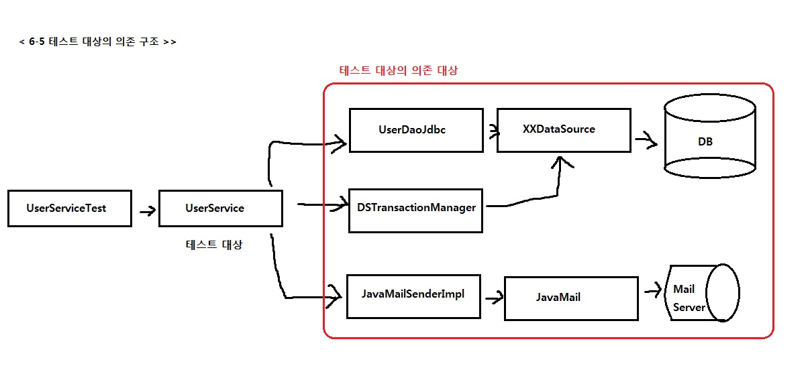

## 6.2 고립된 단위테스트

### INTRO
**가장 편하고 좋은 테스트 방법 : 작은 단위로 쪼개서 테스트**
- 실패 시 이유를 찾기 쉬움
- 테스트 의도가 분명해짐
- 추후 덩치가 커져도 작은 단위로 테스트 한 부분은 제외하고 접근할 수 있음

### 6.2.1 복잡한 의존관계 속의 테스트

**UserService는 UserDao, TransactionManager, MailSender 와 의존 관계를 지님**
=> UserService라는 테스트 대상이 테스트 단위인 것처럼 보이지만, 의존 관계를 따라 등장하는 것도 모두 테스트 대상  
=> 테스트 준비 힘듬 & 환경이 달라지면 결과도 달라 질 수 있음 & UserDao 잘못 변경하면 테스트 원인 찾기 힘듬. 
( 추가적으로, DB가 함께 동작해야 하는 테스트는 작성하기 힘든 경우가 많음 ) 

*DAO는 복잡 BUT Service는 간단한 로직. 배보다 배꼽이 더 큰 작업일 수도..?*

### 6.2.2 테스트 대상 오브젝트 고립시키기
#### 테스트를 위한 UserServiceImpl 고립 

=> 트랜잭션 코드를 분리했기 때문에, UserServiceImpl은 PlatformTransaactionManager에 의존하지 않음.

+ **UserDAO**
 - 테스트 대상의 코드가 정상적으로 수행되도록 도와주는 스텁 + 부가적인 검증 기능까지 가진 목 오브젝트로 만듬.(고립된 환경에서 동작하는 upgradeLevels()를 검증할 방법X)

=> UserServiceImpl은 아무리 그 기능이 수행돼도 그 결과가 DB에 남지 않음  
( upggradeLevels() 처럼 결과가 리턴되지 않는 경우는 더더욱 그럼 )  
=> UserServiceImpl(테스트대상)과 UserDao 에게 어떤 요청을 했는지 확인하는게 필요함

#### 고립된 단위 테스트 활용

<pre>
	@Test
	public void upgradeLevels() {
		/*===	DB 테스트 데이터 준비	===*/
		userDao.deleteAll();		
		for(User user : users) {
			userDao.add(user);
		}
		/*===	//. DB 테스트 데이터 준비	===*/
		
		/*===	메일 발송 여부 확인을 위해 목 오브젝트 DI	===*/		
		MockMailSender mockMailSender = new MockMailSender();  
		userServiceImpl.setMailSender(mockMailSender);
		/*===	//. 메일 발송 여부 확인을 위해 목 오브젝트 DI	===*/
		
		/*		테스트 대상 진행		*/
		userService.upgradeLevels();
				
		/*===	DB에 저장된 결과 확인	===*/
		checkLevelUpgraded(users.get(0), false);
		checkLevelUpgraded(users.get(1), true);
		checkLevelUpgraded(users.get(2), false);
		checkLevelUpgraded(users.get(3), true);
		checkLevelUpgraded(users.get(4), false);
		/*===	//. DB에 저장된 결과 확인	===*/
		
		
		/*===	목 오브젝트를 이용한 결과 확인	===*/
		List<String> request = mockMailSender.getRequests();  
		assertThat(request.size(), is(2));  
		assertThat(request.get(0), is(users.get(1).getEmail()));  
		assertThat(request.get(1), is(users.get(3).getEmail()));
		/*===	목 오브젝트를 이용한 결과 확인	===*/
	}
	
	private void checkLevelUpgraded(User user, boolean upgraded) {
		User userUpdate = userDao.get(user.getId());
		if (upgraded) {
			assertThat(userUpdate.getLevel(), is(user.getLevel().nextLevel()));
		}
		else {
			assertThat(userUpdate.getLevel(), is(user.getLevel()));
		}
	}
	
</pre>

1. 테스트 실행 중에 UserDao를 통해 가져올 테스트용 정보를 DB에 넣음.
2. 메일 발송 여부를 확인하기 위해 MailSender 목 오브젝트를 DI 해줌
3. 실제 테스트 대상인 userService의 메소드 실행
4. 결과가 DB에 반영됐는지 확인하기 위해서 UserDao를 이용해 DB에서 데이터를 가져와 결과를 확인
5. 목 오브젝트를 통해 UserService에 의한 메일 발송이 있었는지 확인하면 됨.
  
1,2 : 의존 오브젝트가 테스트의 목적에 맞게 동작하도록 준비  
4,5 : 테스트 대상 코드를 실행한 후에 결과를 확인

#### UserDao 목 오브젝트

UserDao와 DB까지 직접 의존하고 있는 위의 첫번째, 네번째 테스트 방식도 목 오브젝트를 적용

**UserServiceImpl**
<pre>
public void upgradeLevels() {
		List<User> users = userDao.getAll(); //업그레이드 후보 사용자 목록을 가져옴		
		for (User user : users) {
			if (canUpgradeLevel(user)) {
				upgradeLevel(user);
			}
		}
	}
	
protected void upgradeLevel(User user) {
		user.upgradeLevel();
		userDao.update(user); // 수정된 사용자 정보를 DB에 반영
		sendUpgradeEMail(user);
}

</pre>

getAll();  
=> 레벨 업그레이드 후보가 될 사용자의 목록을 받아옴  
=> 테스트용 UserDao에는 DB에서 읽어온 것처럼 미리 준비된 사용자 목록을 제공
=> 스텁

 
update();  
=> 핵심 로진인 '전체 사용자 중에서 업그레이드 대상자는 레벨을 변경' 중 '변경'에 해당하는 부분을 검증할 수 있는 중요한 기능이기 도함  
=> 목 오브젝트로서 동작하는 UserDao 타입의 대역이 필요.  
=> ==MockUserDao  

**UserDao 목 오브젝트**
<pre>
	static class MockUserDao implements UserDao {
		// 레벨 업그레이드 후보 User 오브젝트 목록
		private List<User> users; 
		//업그레이드 대상 오브젝트를 저장해둘 목록
		private List<User> updated = new ArrayList<>();
		
		private MockUserDao(List<User> users) {
			this.users = users;
		}
		
		public List<User> getUpdated() {
			return this.updated;
		}
		
		//스텁 기능 제공
		@Override
		public List<User> getAll() {
			return this.users;
		}
				
		//목 오브젝트 기능 제공
		@Override
		public void update(User user) {
			updated.add(user);
		}
		
		//테스트 사용되지 않는 메소드
		@Override
		public void add(User user) { throw new UnsupportedOperationException();	}
		@Override
		public User get(String id) { throw new UnsupportedOperationException();	}
		@Override
		public void deleteAll() { throw new UnsupportedOperationException();}
		@Override
		public int getCount() { throw new UnsupportedOperationException();	}		
	}
</pre>

- MockUserDao는 UserDao 구현 클래스를 대신하므로 UserDao를 구현  
- 테스트에 사용되지 않는 메소드 
 => 사용되지 않는 메소드는 그냥 빈채 || return null 해도 되지만, 실수로 사용할 수 있으므로 예외 발생  
- List<User> users;  
 => 생성자를 통해 전달받은 사용자 목록 저장 & getAll() 호출 시 DB에서 추출하는 용도와 같음  
 => 기존 일일이 DB에 저장 & 추출 대신, 테스트용 리스트를 메모리에 갖고 있다가 반환해주면 됨.
- List<User> updated     
 => update() 메소드를 실행하면서 넘겨준 업그레이드 대상 User 오브젝트를 저장해뒀다가 검증을 위해 돌려주기 위한 것
 
**MockUserDao를 사용해서 만든 고립된 테스트**
<pre>
	@Test
	public void upgradeLevels() throws Exception {
		//고립된 테스트에서는 테스트 대상 오브젝트를 직접 생성
		UserServiceImpl userServiceImpl = new UserServiceImpl();
		
		// 목 오브젝트를 마든 UserDao를 직접 DI
		MockUserDao mockUserDao = new MockUserDao(this.users);
		userServiceImpl.setUserDao(mockUserDao);
		
		MockMailSender mockMailSender = new MockMailSender();
		userServiceImpl.setMailSender(mockMailSender);
		
		userServiceImpl.upgradeLevels();
		
		List<User> updated = mockUserDao.getUpdated();
		assertThat( updated.size(), is(2) );
		checkUserAndLevel(updated.get(0) , "joytouch", Level.SILVER);
		checkUserAndLevel(updated.get(1) , "madnite1", Level.GOLD);
		
		List<String> request = mockMailSender.getRequests();
		assertThat(request.size(), is(2) );
		assertThat(request.get(0), is(users.get(1).getEmail()));
		assertThat(request.get(1), is(users.get(3).getEmail()));
		
	}
	
	// id와 level을 확인하는 간단한 헬퍼 메소드
	private void checkUserAndLevel(User updated, String expectedId, Level expectedLevel) {
		assertThat(updated.getId(), is(expectedId) );
		assertThat(updated.getLevel(), is(expectedLevel) );
	}
</pre>

**스프링 컨테이너에서 @Autowired를 통해 가져온 UserService 빈  **
-DI를 통해 많은 의존 오브젝트와 서비스, 외부 환경에 의존  
 => 완전히 고립 & 테스트만을 위해 독립적으로 동작 => 스프링 컨테이너에서 빈을 가져올 필요 X   
 => upgradeLevels()만 테스트하면, 스프링의 테스트 컨텍스트를 이용하기 위한 @RunWith 등은 제거 가능  
- 사용자 정보를 모두 삭제 & 테스트용 사용자 정보를 DB 에 삽입등 번거로운 준비 작업  
 => MockUserDao 오브젝트를 사용하도록 수동 DI + MockMailSender 

**검증**
=> UserServiceImpl은 UserDao의 update()를 이용해, 몇 명의 사용자 정보를 DB에 수정하려고 했는지, 그 사용자는 누구인지, 
   어떤 레벨로 변경됐는지, 변경 후 메일 보내려고 했는지 확인  
=> 목록 수 확인 => 수동으로 직접 확인(업그레이드 , 메일 발송 리스트)    
   

### 6.2.3 단위 테스트와 통합 테스트
단위 테스트의 단위는 정하기 나름 => **"하나의 단위에 초점을 맞춘 테스트"**

단위 테스트 : 테스트 대상 클래스를 목 오브젝트 등의 테스트 대역을 이용해 의존 오브젝트나 외부의 ㅇ리소스를 사용하지 않도록 고립 
통합 테스트 : 두 개 이상의, 성격이나 계층이 다른 오브젝트가 연동하도록 만들어 테스트 or 외부의 DB나 파일, 서비스 등의 리소스가 참여 
라 가정

가이드 라인

- 항상 단위 테스트를 먼저 고려
- 하나의 클래스나 성격과 목적이 같은 긴밀한 클래스 몇 개를 모아서 외부와의 의존관계를 모두 차단하고 필요에 따라 스텁 
  목 오브젝트 등의 테스트 대역을 이용하도록 테스트를 만듬.
- 외부 리소스를 사용해야만 가능한 테스트는 통합 테스트로 만듬
- DAO는 DB를 통해 로직을 수행하는 인터페이스와 같은 역할을 하므로, DB까지 연동 후 테스트 하는 게 좋음 
- DAO를 테스트를 통해 충분히 검증하면, DAO 역할을 스텁이나 목 오브젝트로 대체해 테스트 가능 & 오류 발생 낮아짐
- 여러 개의 ㅇ단위가 의존관계를 가지고 동작할 때를 위한 통합 테스트는 필요. (단위 테스트를 거쳤으면, 통합 테스트 부담 낮아짐)
- 단위 테스트를 만들기가 너무 복잡하다고 판단되는 코드는, 처음부터 통합 테스트를 고려해본다.
- 스프링 테스트 컨텍스트 프레임워크를 이용하는 테스트는 통합 테스트. 가능하면 스프링의 지원 없이 직접 코드 레벨의 DI를 사용하면서 
  단위 테스트를 하는 게 좋음. 스프링의 설정 자체도 테스트 대상이고, 스프링을 이용해 좀 더 추상적인 레벨에서 테스트할 경우 스프링  
  테스트 컨텍스트 프레임워크를 이용해 통합 테스트 작성
  
          

### 목 프레임 워크
단위 테스트를 만들기 위해서는 스텁이나 목 오브젝트의 사용이 필수적. 
테스트에 사용하지 않는 인터페이스도 모두 구현 & 테스트 별로 다른 검증이 필요하다면, 여러개의 목 클래스를 선언해야함 
=> 목 오브젝트 지원 프레임 워크

#### Mockito 프레임 워크
-목 클래스를 일일이 준비해둘 필요가 없음  
 => 간단한 메소드 호출만으로 다이나믹하게 특정 인터페이스를 구현한 테스트용 목 오브젝트를 만들 수 있음
<pre>
import static org.mockito.Mockito.mock;
import static org.mockito.Mockito.times;
import static org.mockito.Mockito.verify;
import static org.mockito.Mockito.when;

....
	UserDao mockUserDao = mock(UserDao.class);
	//mockUserDao.getAll()가 호출 -> users 리턴
	when(mockUserDao.getAll()).thenReturn(this.users);
	//mockUserDao의 update() 메소드가 2번 호출되었는지 확인
	verify(mockUserDao,times(2)).update((User) any(User.class));
...
</pre>

**Mockito 오브젝트 사용 순서**
- 인터페이스를 이용해 목 오브젝트를 만듬
- 목 오브젝트가 리턴할 값이 있으면 이를 지정. 메소드가 호출되면 예외를 강제로 던지게 만들 수도 있음
- 테스트 대상 오브젝트에 DI 해서 목 오브젝트가 테스트 중에 사용되도록 만듬
- 테스트 대상 오브젝트를 사용한 후에 목 오브젝트의 특정 메소드가 호출됐는지, 어떤 값을 가지고 몇 번 호출됐는지 검증

<pre>
...
import static org.mockito.Mockito.mock;
import static org.mockito.Mockito.times;
import static org.mockito.Mockito.verify;
import static org.mockito.Mockito.when;
import static org.mockito.Matchers.any;

import org.mockito.ArgumentCaptor;

...
	@Test
	public void upgradeLevels() throws Exception {
		
		UserServiceImpl userServiceImpl = new UserServiceImpl();
		
		//다이나믹 한 목 오브젝트 생성 & 메소드 리턴 값 설정 & DI 
		UserDao mockUserDao = mock(UserDao.class);
		when(mockUserDao.getAll()).thenReturn(this.users);
		userServiceImpl.setUserDao(mockUserDao);
		
		MailSender mockMailSender = mock(MailSender.class);
		userServiceImpl.setMailSender(mockMailSender);
		
		userServiceImpl.upgradeLevels();
		
		//목 오브젝트가 제공하는 검증 기능을 통해 
		//어떤 메소드가 몇 번 호출됐는지, 파라미터는 무엇인지 확인 가능
		//any()는 파라미터 무시
		verify(mockUserDao,times(2)).update(any(User.class));
		verify(mockUserDao,times(2)).update(any(User.class));
		
		//users.get(1)을 파라미터로 update()가 호출된 적이 있는지 확인
		verify(mockUserDao).update(users.get(1));
		assertThat(users.get(1).getLevel(), is(Level.SILVER));
		
		//users.get(3)을 파라미터로 update()가 호출된 적이 있는지 확인
		verify(mockUserDao).update(users.get(3));
		assertThat(users.get(3).getLevel(), is(Level.GOLD));
		
		ArgumentCaptor<SimpleMailMessage> mailMessageArg
							= ArgumentCaptor.forClass(SimpleMailMessage.class);
		verify(mockMailSender, times(2)).send(mailMessageArg.capture());
		List<SimpleMailMessage> mailMessages = mailMessageArg.getAllValues();				
		assertThat(mailMessages.get(0).getTo(), is(users.get(1).getEmail()));
		assertThat(mailMessages.get(1).getTo(), is(users.get(3).getEmail()));		
	}
...

</pre>

  

  
 
 

 
 

 
 
 
 
 
 
 
 
 
 
 
 
 
 
 
 
 