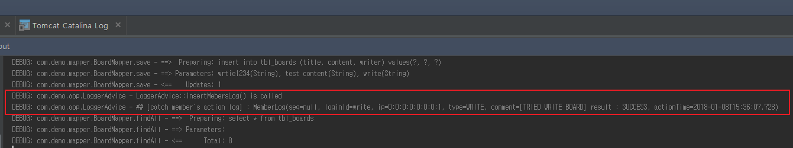

# Spring Security Demo

#### index

- <a href="#database">Database</a>  
- <a href="#security-settings">Security Settings</a>  
- <a href="#limit-login-attempts">Limit Login Attempts</a>  
- <a href="#aop-loggings">Logging for member's action</a>  

---

#### Database

> CREATE SCHEMA & USER

```
CREATE SCHEMA `spring_demo` DEFAULT CHARACTER SET utf8;

CREATE USER 'spring_user'@'localhost' IDENTIFIED BY '1234';

GRANT ALL PRIVILEGES ON spring_demo.* to 'spring_user'@'localhost';
```

> Create table

```
# member
CREATE TABLE tbl_members (
  login_id varchar(255) not null,
  name varchar(255) not null,
  password varchar(255) not null,
  primary key(login_id)
);

# member roles
CREATE TABLE tbl_member_roles (
  id bigint not null auto_increment,
  role_name varchar(255),
  login_id varchar(255),
  primary key(id),
  foreign key(login_id) references tbl_members(login_id) ON DELETE CASCADE ON UPDATE CASCADE
);

# board
CREATE TABLE tbl_boards (
  id bigint not null auto_increment,
  title varchar(255),
  content varchar(2000),
  writer varchar(255),
  reg_date timestamp default now(),
  mod_date timestamp,
  primary key(id),
  foreign key(writer) references tbl_members(login_id) ON DELETE CASCADE ON UPDATE CASCADE
);

# login attempts
create table login_attempts (
    id bigint not null auto_increment,
    ip varchar(128),
    attempts int default 1,
    last_modified timestamp,
    primary key(id)
);
```

<div id="security-settings"> </div>

---

<div id="limit-login-attempts"> </div>

#### limit login attempts

- Classify failures as exceptions
  - not exist login id or not matched password => throw LoginNotMatchedException
  - exceed login attempts => throw ExceedLoginAttemptsException


> First : MemberAuthProvider.java

```
public class MemberAuthProvider implements AuthenticationProvider {
  ...

  @Override
  public Authentication authenticate(Authentication authentication) throws AuthenticationException {
    String id = authentication.getName();
    String password = (String) authentication.getCredentials();

    // extract user ip & check try cnt
    WebAuthenticationDetails wad = (WebAuthenticationDetails) authentication.getDetails();
    String ip = wad.getRemoteAddress();
    checkLoginAttempts(ip);

    UserDetails securityMember = memberDetailService.loadUserByUsername(id);

    // check id & password
    if (securityMember == null || !passwordEncoder.matches(password, securityMember.getPassword())) {
      logger.debug("## [failed to sign in] id : {}", id);
      throw new LoginNotMatchedException();
    }
    ...
  }

  private void checkLoginAttempts(String ip) {
    LoginAttempts loginAttempts = loginAttemptsMapper.findByIp(ip);
    final int lockedMinutes = 5;
    final int limitOfAttempts = 3;

    // exist failure
    if (loginAttempts != null) {
      LocalDateTime lastModified = loginAttempts.getLastModified();
      if (lastModified != null) {
          long diff = System.currentTimeMillis() - lastModified.atZone(ZoneId.systemDefault()).toInstant().toEpochMilli();
          // check locked time
          if(TimeUnit.MILLISECONDS.toMinutes(diff) >= lockedMinutes) {
            loginAttemptsMapper.resetFailAttempts(ip);
          }
          // exceed login attempts
          else if(loginAttempts.getAttempts() >= limitOfAttempts) {
            throw new ExceedLoginAttemptsException();
          }
        }
      }
    }
}

```

> Second : AuthFailureHandler.java

```
public class AuthFailureHandler implements AuthenticationFailureHandler {
  ...

  @Override
  public void onAuthenticationFailure(HttpServletRequest request, HttpServletResponse response, AuthenticationException exception) throws IOException, ServletException {
      // extract login id
      String loginId = request.getParameter("loginid");
      boolean isExceedAttempts = false;
      request.setAttribute("loginid", loginId);

      String message = null;
      // Not exist id or Not matched password
      if(exception instanceof LoginNotMatchedException) {
          logger.debug("## [tried to login but failed] id : {}", loginId);
          message = "Please confirm ur id and password";
      }
      // exceed login attempts
      else if(exception instanceof ExceedLoginAttemptsException) {
          logger.debug("## [exceed login attempts] id : {}", loginId);
          isExceedAttempts = true;
          message = "Exceed login attempts. Please try again 5 minutes later";
      }
      else {
          if(exception != null) {
              logger.debug("## [not handle exception in auth failure handler] exception : {} , message : {}", new Object[] {
                      exception.getClass().getName(), exception.getMessage()
              });
          }
          else {
              logger.debug("## [cant handle login failure]");
          }
        }        
        request.setAttribute("failMessage", message);

        // update login failed attempts
        if (!isExceedAttempts) {
            String ip = request.getRemoteHost();
            LoginAttempts attempts = loginAttemptsMapper.findByIp(ip);

            if(attempts == null) {
                loginAttemptsMapper.save(ip);
            }
            else {
                loginAttemptsMapper.updateFailAttempts(ip);
            }
        }                
        request.getRequestDispatcher("/WEB-INF/views/loginPage.jsp").forward(request,response);
    }
}

```

---

<div id="aop-loggings"></div>

#### Logging for member's action

> Useage  

- apply annotation in Controller's methods

```
...
@Controller
public class BoardController {
  ...
  @MemberLoggings(logType = MemberLogType.WRITE, useComment = true)
  @PostMapping("/write")
  public String writeBoard(Board board, RedirectAttributes rttr) {
      ...

      // insert member`s log at current threads local variables
      SecurityUtil.setMemberLogComment("[TRIED WRITE BOARD] result : " + message);        
  }
  ...  
}
```

> Result  
(after read board)



**code**

> servlet-context.xml  
(for using aop)

```
<?xml version="1.0" encoding="UTF-8"?>
<beans:beans xmlns="http://www.springframework.org/schema/mvc"
	xmlns:xsi="http://www.w3.org/2001/XMLSchema-instance"
	xmlns:beans="http://www.springframework.org/schema/beans"
	xmlns:context="http://www.springframework.org/schema/context"
	xmlns:aop="http://www.springframework.org/schema/aop"
			 xsi:schemaLocation="http://www.springframework.org/schema/mvc http://www.springframework.org/schema/mvc/spring-mvc.xsd
		http://www.springframework.org/schema/beans http://www.springframework.org/schema/beans/spring-beans.xsd
		http://www.springframework.org/schema/context http://www.springframework.org/schema/context/spring-context.xsd
		http://www.springframework.org/schema/aop http://www.springframework.org/schema/aop/spring-aop-4.3.xsd">

	<!-- DispatcherServlet Context: defines this servlet's request-processing infrastructure -->

	<!-- Enables the Spring MVC @Controller programming model -->
	<annotation-driven />
	<aop:aspectj-autoproxy></aop:aspectj-autoproxy>
  ...

</beans:beans>
```

> MemberLoggins.java annotation  
(for using at controller)

```
@Target(ElementType.METHOD)
@Retention(RetentionPolicy.RUNTIME)
public @interface MemberLoggings {
    MemberLogType logType() default MemberLogType.NONE;

    boolean useComment() default false;
}
```

> MemberLogType.java Enum
(for classification log types)

```
public enum MemberLogType {
    NONE(0, ""),
    READ(1,"READ"),
    WRITE(2,"WRITE"),
    MODIFY(3,"MODIFY"),
    REMOVE(4,"REMOVE");


    private final int intValue;
    private final String stringValue;

    MemberLogType(int intValue, String stringValue) {
        this.intValue = intValue;
        this.stringValue = stringValue;
    }

    public int intVale() {
        return this.intValue;
    }

    public String stringValue() {
        return this.stringValue;
    }

    public static MemberLogType valueOf(int value) {
        switch(value) {
            case 0 :
                return NONE;
            case 1:
                return READ;
            case 2:
                return WRITE;
            case 3:
                return MODIFY;
            case 4:
                return REMOVE;
            default:
                return null;
        }
    }
}
```

> LoggerAdvice.java
(create dynamic proxy for Controller::methods)

```
@Aspect
@Component
public class LoggerAdvice {
    private static final Logger logger = LoggerFactory.getLogger(LoggerAdvice.class);

    @AfterReturning("@annotation(MemberLoggings)")
    public void insertMembersLog(JoinPoint jp) {        
        boolean clearedContext = false;

        try {
            MemberLoggings loggingAnnotation = getAdminLoggings(jp);
            boolean useComment = loggingAnnotation.useComment();
            clearedContext = (useComment == false);

            MemberLog log = getMemberLogFromMember(SecurityUtil.getMember());
            log.setType(loggingAnnotation.logType());
            log.setActionTime(LocalDateTime.now());

            ThreadLocalContext context = ThreadLocalManager.clearContext();
            if(useComment && context != null) {
                clearedContext = true;
                log.setComment(context.getMemberLogComment());
            }

            // ## use this data for ur needs
            logger.debug("## [catch member`s action log] : {}" , log);
        }
        catch(NullPointerException e) {
            e.printStackTrace();
            logger.error("## failed to insert members log",e);
        }
        catch(Exception e) {
            e.printStackTrace();
            logger.error("## failed to insert members log",e);
        }
        finally {
            if(!clearedContext) {
                ThreadLocalManager.clearContext();
            }
        }
    }

    private MemberLoggings getAdminLoggings(JoinPoint jp) throws NullPointerException {
        MemberLoggings annotation = null;
        try {
            MethodSignature methodSignature = (MethodSignature) jp.getSignature();
            Method method = methodSignature.getMethod();
            annotation = method.getAnnotation(MemberLoggings.class);
        }
        catch (Exception e) {
            // ignore exceptions
        }
        return annotation;
    }

    private MemberLog getMemberLogFromMember(Member member) {
        if(member == null) {
            return null;
        }

        MemberLog log = new MemberLog();
        log.setIp(member.getIp());
        log.setLoginId(member.getLoginId());

        return log;
    }
}
```

> Allocate variables at current thread by using ThreadLocal Class  
(Its used to distinguish each user requests.  
Because one servlet request == one thread)  

> ThreadLocalContext.java  

```
@Getter
@Setter
@ToString
public class ThreadLocalContext {
    private String memberLogComment;
}
```

> ThreadLocalManager

```
public class ThreadLocalManager {
    private static ThreadLocal<ThreadLocalContext> contexts = new ThreadLocal<>();

    public static ThreadLocalContext getContext() {
        return contexts.get();
    }

    public static ThreadLocalContext getContextAndCreateIfNotExist() {
        if (contexts.get() == null) {
            contexts.set(new ThreadLocalContext());
        }

        return contexts.get();
    }

    public static ThreadLocalContext clearContext() {
        ThreadLocalContext context = contexts.get();
        if(context != null) {
            contexts.remove();
        }
        return context;
    }
}
```

> SecurityUtil.java  
(settings and gettings comments)

```
public abstract class SecurityUtil {
  ...
  public static void setMemberLogComment(String comment) {
        ThreadLocalContext context = ThreadLocalManager.getContextAndCreateIfNotExist();
        context.setMemberLogComment(comment);
  }
  ...
}
```
