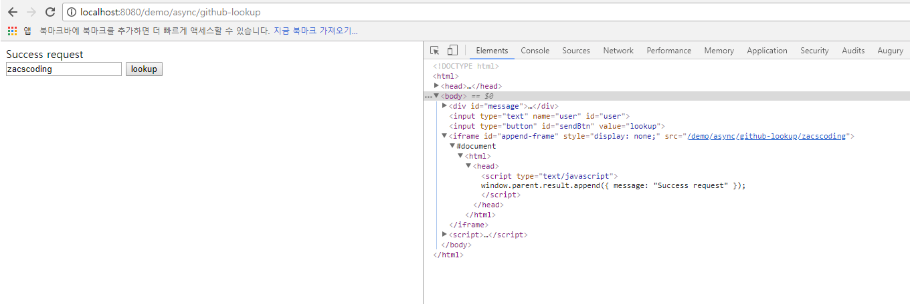

## Spring examples!!

- <a href="#cache">Cache</a>
- <a href="#profile">Profile</a>
- <a href="#async">Async</a>


---

<div id="cache"> </div>

## Cache

1. maven dependency
2. config(xml, java)
3. apply
4. test

> Maven dependency

```
<!-- EhCacheCacheManager -->
<!-- https://mvnrepository.com/artifact/org.springframework/spring-context-support -->
<dependency>
  <groupId>org.springframework</groupId>
  <artifactId>spring-context-support</artifactId>
  <version>${org.springframework-version}</version>
</dependency>
<!-- https://mvnrepository.com/artifact/net.sf.ehcache/ehcache -->
<dependency>
  <groupId>net.sf.ehcache</groupId>
  <artifactId>ehcache</artifactId>
  <version>2.10.3</version>
</dependency>
```

> config : java

```
@Configuration
@EnableCaching
@Profile("ehcache_java_config")
public class CacheConfig {
  /* ================
	 * 1) Simple Cache Manager
	 ================== */

    // Declare a cache manager
    //	@Bean
    //	public CacheManager cacheManager() {
    //		//  java.util.concurrent.ConcurrentHashMap 를 캐시 저장소로 사용
    //		return new ConcurrentMapCacheManager();
    //	}

	/* ================
	 * 2) EhCacheCacheManager
	 * docs :
	 * http://www.ehcache.org/documentation/3.3/
	 ================== */

    // Configure EhCacheCacheManager
    @Bean
    public EhCacheCacheManager cacheManager(CacheManager cm) {
        return new EhCacheCacheManager(cm);
    }

    // EhCacheManagerFactoryBean
    @Bean
    public EhCacheManagerFactoryBean ehcache() {
        EhCacheManagerFactoryBean ehCacheFactoryBean = new EhCacheManagerFactoryBean();

        ehCacheFactoryBean.setConfigLocation(new ClassPathResource("cache/ehcache.xml"));

        return ehCacheFactoryBean;
    }
}
```

> config : xml

```
<?xml version="1.0" encoding="UTF-8"?>
<beans xmlns="http://www.springframework.org/schema/beans"
       xmlns:xsi="http://www.w3.org/2001/XMLSchema-instance"
       xmlns:context="http://www.springframework.org/schema/context"
       xmlns:cache="http://www.springframework.org/schema/cache"
       xsi:schemaLocation="http://www.springframework.org/schema/beans http://www.springframework.org/schema/beans/spring-beans.xsd
		http://www.springframework.org/schema/context http://www.springframework.org/schema/context/spring-context-4.3.xsd
        http://www.springframework.org/schema/cache
        http://www.springframework.org/schema/cache/spring-cache.xsd">

    <beans profile="ehcache_xml_config">
        <cache:annotation-driven />
        <bean id="cacheManager" class="org.springframework.cache.concurrent.ConcurrentMapCacheManager" />
    </beans>

    <beans>
        <context:component-scan base-package="org.springdemo.config" />
    </beans>
</beans>
```

> apply

```
package org.springdemo.persistent.xml;

import org.apache.ibatis.session.SqlSession;
import org.slf4j.Logger;
import org.slf4j.LoggerFactory;
import org.springdemo.domain.Person;
import org.springframework.cache.annotation.CacheEvict;
import org.springframework.cache.annotation.Cacheable;
import org.springframework.stereotype.Repository;

import javax.inject.Inject;
import java.util.List;

@Repository
public class PersonDao {
    private static final Logger logger = LoggerFactory.getLogger(PersonDao.class);
    private static final String namespace= "org.springdemo.persistent.xml.PersonDao";
    @Inject
    private SqlSession session;

    @CacheEvict("personCache")
    public int save(Person person) {
        logger.info("## [request person save] person : {}", person);
        return session.insert(namespace + ".save", person);
    }

    @Cacheable(value="personCache")
    public List<Person> findAllByName(String name) {
        logger.info("## [request find all by name] name : {}", name);
        return session.selectList(namespace + ".findAllByName", name);
    }
}

```

> Test

```
package org.springdemo.persistent.xml;

import org.junit.After;
import org.junit.Before;
import org.junit.Test;
import org.springdemo.domain.Person;
import org.springdemo.runner.AbstractTestRunner;
import org.springdemo.util.DataSouceUtil;
import org.springframework.beans.factory.annotation.Autowired;
import org.springframework.test.context.ActiveProfiles;

import javax.sql.DataSource;

@ActiveProfiles("ehcache_java_config")
public class PersonDAOTest extends AbstractTestRunner {
    Person p1,p2,p3;
    @Autowired
    DataSource ds;
    @Autowired
    PersonDao personDao;
    @Before
    public void setUp() {
        p1 = new Person(null, "person1", 1);
        p2 = new Person(null, "person1", 2);
        p3 = new Person(null, "person3", 3);
    }

    @After
    public void tearDown() {
        DataSouceUtil.deleteAll(ds,"person");
        DataSouceUtil.dropAndCreateSeq(ds,"person_seq");
    }

    @Test
    public void test() {
        personDao.save(p1);
        personDao.save(p2);

        System.out.println("===================  First Call   ===============");
        personDao.findAllByName(p1.getName());
        System.out.println("====================================================");

        System.out.println("===================  Second Call   ===============");
        personDao.findAllByName(p1.getName());
        System.out.println("====================================================");
    }
}

```

> Result 1) Not use ehcache

```
...
//@ActiveProfiles("ehcache_java_config")
//@ActiveProfiles("ehcache_xml_config")
public class PersonDAOTest extends AbstractTestRunner {
  ...
}

==>

===================  First Call   ===============
INFO : org.springdemo.persistent.xml.PersonDao - ## [request find all by name] name : person1
====================================================
===================  Second Call   ===============
INFO : org.springdemo.persistent.xml.PersonDao - ## [request find all by name] name : person1
====================================================
```

> Result 2) user ehcache

```
...
@ActiveProfiles("ehcache_java_config")
// @ActiveProfiles("ehcache_xml_config")
public class PersonDAOTest extends AbstractTestRunner {
  ...
}

==>

===================  First Call   ===============
INFO : org.springdemo.persistent.xml.PersonDao - ## [request find all by name] name : person1
====================================================
===================  Second Call   ===============
====================================================
```

---

<div id="profile"></div>

## Profile  
- org.springdemo.config.ProfileConfig  
- org.springdemo.domain.EnvProfile
- web.xml
- WEB-INF/config/root-context.xml  
- test/org.springdemo.profile.ProfileTest

> Generate Beans depend on profile  

1. Java Config  

```
package org.springdemo.config;

import org.springdemo.domain.EnvProfile;
import org.springdemo.util.CustomPrinter;
import org.springdemo.util.GsonUtil;
import org.springframework.beans.factory.annotation.Autowired;
import org.springframework.context.annotation.Bean;
import org.springframework.context.annotation.Configuration;
import org.springframework.context.annotation.Profile;
import org.springframework.core.env.Environment;

@Configuration
@Profile("profile_java_config")
public class ProfileConfig {
    @Autowired
    private Environment env;

    @Bean
    @Profile("profile_test1")
    public EnvProfile envProfile() {
        CustomPrinter.println("## [ProfileConfig.envProfile() is called] activated profiles : {}", GsonUtil.toString(getActivatedProfiles()));
        EnvProfile profile = new EnvProfile();
        profile.setEnvProfile("profile_test1");
        return profile;
    }

    @Bean
    @Profile("profile_test2")
    public EnvProfile envProfile2() {
        CustomPrinter.println("## [ProfileConfig.envProfile2() is called] activated profiles : {}", GsonUtil.toString(getActivatedProfiles()));
        EnvProfile profile = new EnvProfile();
        profile.setEnvProfile("profile_test2");
        return profile;
    }

    private String[] getActivatedProfiles() {
        // get current activated profiles
        String[] activeProfiles = env.getActiveProfiles();
        return (activeProfiles == null) ? new String[]{} : activeProfiles;
    }
}
```


2. XML  

```
<beans profile="profile_xml_config">
  <beans profile="profile_test1">
    <bean id="envProfile" class="org.springdemo.domain.EnvProfile">
      <property name="envProfile" value="profile_test1" />
    </bean>
  </beans>
  <beans profile="profile_test2">
    <bean id="envProfile2" class="org.springdemo.domain.EnvProfile">
      <property name="envProfile" value="profile_test2" />
    </bean>
  </beans>
</beans>
```

3. Activate Profile web.xml  

```
<!-- Set default profile for context -->
<context-param>
  <param-name>spring.profiles.active</param-name>  
  <param-value>profile_xml_config,profile_test1</param-value>
</context-param>
```

4. Acivate Profile in test  

```
package org.springdemo.profile;

import org.junit.Test;
import org.springdemo.domain.EnvProfile;
import org.springdemo.runner.AbstractTestRunner;
import org.springframework.beans.factory.annotation.Autowired;
import org.springframework.test.context.ActiveProfiles;

@ActiveProfiles({"profile_java_config","profile_test1"})
// @ActiveProfiles({"profile_java_config","profile_test2"})
// @ActiveProfiles({"profile_xml_config","profile_test1"})
//@ActiveProfiles({"profile_xml_config","profile_test2"})
public class ProfileTest extends AbstractTestRunner {
    @Autowired
    EnvProfile envProfile;

    @Test
    public void profile() {
        System.out.println("## " + envProfile);
    }
}
```

> Test Result  

```
## [ProfileConfig.envProfile() is called] activated profiles : ["profile_java_config","profile_test1"]
## EnvProfile(envProfile=profile_test1)
```

5. Get activated profile

```
package org.springdemo.config;

import org.springdemo.domain.EnvProfile;
import org.springdemo.util.CustomPrinter;
import org.springdemo.util.GsonUtil;
import org.springframework.beans.factory.annotation.Autowired;
import org.springframework.context.annotation.Bean;
import org.springframework.context.annotation.Configuration;
import org.springframework.context.annotation.Profile;
import org.springframework.core.env.Environment;

/**
 * @author zacconding
 * @Date 2018-01-25
 * @GitHub : https://github.com/zacscoding
 */

@Configuration
@Profile("profile_java_config")
public class ProfileConfig {
    @Autowired
    private Environment env;    
    ...
    private String[] getActivatedProfiles() {
        // get current activated profiles
        String[] activeProfiles = env.getActiveProfiles();
        return (activeProfiles == null) ? new String[]{} : activeProfiles;
    }
}
```

---

<div id="async"></div>

## Spring Async

1. Settings  
2. Default test  
3. Simple sample  
User ---> Server : request github look up  
User <--- Server : response "Success request"  
User <--- Server : response Result of github user   
user <--- Server : response "Complete request"  

#### ref  

- http://javacan.tistory.com/entry/Servlet-3-Async  
- http://www.baeldung.com/spring-async
- https://spring.io/guides/gs/async-method/


***1. Settings***

> Java Config  
org.springdemo.config.SpringAsyncConfig

```
package org.springdemo.config;

import java.util.concurrent.Executor;
import org.springframework.beans.factory.annotation.Qualifier;
import org.springframework.context.annotation.Bean;
import org.springframework.context.annotation.ComponentScan;
import org.springframework.context.annotation.Configuration;
import org.springframework.scheduling.annotation.EnableAsync;
import org.springframework.scheduling.concurrent.ThreadPoolTaskExecutor;

/**
 * Spring Async Config
 *
 * @author zaccoding github : https://github.com/zacscoding
 */
@Configuration
@EnableAsync
@ComponentScan(basePackages = "org.springdemo.async")
public class SpringAsyncConfig {

    @Bean
    @Qualifier("asyncThreadPoolTaskExecutor")
    public Executor asyncThreadPoolTaskExecutor() {
        ThreadPoolTaskExecutor pool = new ThreadPoolTaskExecutor();
        // settings pool

        return pool;
    }
}
```

***2. Default Test***  

> org.springdemo.async.MessageSender

```
package org.springdemo.async;

import java.io.IOException;
import java.util.concurrent.Callable;
import java.util.concurrent.Future;
import javax.servlet.AsyncContext;
import javax.servlet.http.HttpServlet;
import javax.servlet.http.HttpServletRequest;
import javax.servlet.http.HttpServletResponse;
import lombok.extern.slf4j.Slf4j;
import org.springdemo.util.ServletUtil;
import org.springframework.scheduling.annotation.Async;
import org.springframework.scheduling.annotation.AsyncResult;
import org.springframework.stereotype.Component;

@Slf4j
@Component
public class MessageSender {

    @Async("asyncThreadPoolTaskExecutor")
    public Future<String> send(String message) {
        log.info("[## MessageSender:send()] message : {}, Thread id : {}, name : {}", message, Thread.currentThread().getId(), Thread.currentThread().getName());
        try {
            // work
            Thread.sleep(5000L);

            return new AsyncResult<>(message);
        } catch (InterruptedException e) {
            log.error("## InterruptedException occur", e);
            return new AsyncResult<>("");
        }
    }
}
```

> Controller  

```
package org.springdemo.controller;

import java.util.concurrent.Future;
import lombok.extern.slf4j.Slf4j;
import org.springdemo.async.MessageSender;
import org.springframework.beans.factory.annotation.Autowired;
import org.springframework.http.HttpStatus;
import org.springframework.http.ResponseEntity;
import org.springframework.stereotype.Controller;
import org.springframework.web.bind.annotation.GetMapping;
import org.springframework.web.bind.annotation.PathVariable;
import org.springframework.web.bind.annotation.RequestMapping;
import org.springframework.web.bind.annotation.ResponseBody;

/**
 * @author zaccoding github : https://github.com/zacscoding
 */
@Controller
@RequestMapping("/async/**")
@Slf4j
public class AsyncController {

    @Autowired
    private MessageSender messageSender;
    @Autowired
    private GithubLookupService githubLookupService;

    @GetMapping("/echo/{message}/{isWait}")
    @ResponseBody
    public ResponseEntity<String> echo(@PathVariable("message") String message, @PathVariable("isWait") boolean isWait) {
        log.info("[## Request /async/echo] Current Thread ID : {}, Name : {}, message : {}", Thread.currentThread().getId(), Thread.currentThread().getName(), message);
        Future<String> future = messageSender.send(message);
        log.info("[## after invoke messageSender.send()]");
        if (isWait && future != null) {
            try {
                // wait
                String result = null;
                while ((result = future.get()) == null) {
                }
                message += result;
            } catch (Exception e) {
                message += ("Exception occur : " + e.getMessage());
            }
        }
        return new ResponseEntity<>(message, HttpStatus.OK);
    }
    ...
}

```

> Request http://localhost:8080/demo/async/echo/test/false

```
INFO : org.springdemo.controller.AsyncController - [## Request /async/echo] Current Thread ID : 31, Name : http-nio-8080-exec-7, message : test
INFO : org.springdemo.controller.AsyncController - [## after invoke messageSender.send()]
INFO : org.springdemo.async.MessageSender - [## MessageSender:send()] message : test, Thread id : 58, name : asyncThreadPoolTaskExecutor-1
```  

=> Use another thread(asyncThreadPoolTaskExecutor-1) from executor pool  
=> Connection state is maintained after returning the thread(http-nio-8080-exec-7)  


***3. Simple sample***  

> Controller  

```
package org.springdemo.controller;

import java.io.IOException;
import java.io.PrintWriter;
import java.util.concurrent.CompletableFuture;
import java.util.concurrent.Future;
import javax.servlet.http.HttpServletResponse;
import lombok.extern.slf4j.Slf4j;
import org.springdemo.async.GithubLookupService;
import org.springdemo.async.MessageSender;
import org.springdemo.domain.User;
import org.springdemo.util.EscapeUtil;
import org.springdemo.util.ServletUtil;
import org.springframework.beans.factory.annotation.Autowired;
import org.springframework.http.HttpStatus;
import org.springframework.http.ResponseEntity;
import org.springframework.stereotype.Controller;
import org.springframework.web.bind.annotation.GetMapping;
import org.springframework.web.bind.annotation.PathVariable;
import org.springframework.web.bind.annotation.RequestMapping;
import org.springframework.web.bind.annotation.ResponseBody;

/**
 * @author zaccoding github : https://github.com/zacscoding
 */
@Controller
@RequestMapping("/async/**")
@Slf4j
public class AsyncController {

    ...
    @Autowired
    private GithubLookupService githubLookupService;

    ...

    @GetMapping("/github-lookup")
    public String githubLookupIndex() {
        return "githubLookup";
    }

    @GetMapping("/github-lookup/{user}")
    @ResponseBody
    public void githubLookup(@PathVariable("user") String user) throws IOException {
        HttpServletResponse res = ServletUtil.getHttpServletResponse();
        PrintWriter pw = res.getWriter();
        try {
            log.info("[## request github-lookup] user : {}", user);
            CompletableFuture<User> result = githubLookupService.findUser(user);
            log.info("[## after githubLookupService.findUser()] result.isDone() : {}", result.isDone());
            res.setContentType("text/html; charset=UTF-8");
            res.setHeader("Cache-Control", "private");
            res.setHeader("Pragma", "no-cache");
            res.setCharacterEncoding("UTF-8");

            // send complete request message
            sendMessage(pw, "Success request");
            // wait
            CompletableFuture.allOf(result).join();
            // send result
            sendMessage(pw, result.get().toString());
            sendMessage(pw, "Complete request");
        } catch (Exception e) {
            sendMessage(pw, e.getMessage());
        }
    }

    private void sendMessage(PrintWriter pw, String message) throws IOException {
        if (pw == null) {
            return;
        }
        pw.println(parseContent(message));
        pw.flush();
    }

    /**
     * http://javacan.tistory.com/entry/Servlet-3-Async parse JS append command
     */
    private String parseContent(String message) {
        return "<script type='text/javascript'>\n"
            + "window.parent.result.append({ message: \""
            + EscapeUtil.escape(message) + "\" });\n" + "</script>\n";
    }
}

```

> GithubLookupService  

```
package org.springdemo.async;

import java.util.concurrent.CompletableFuture;
import lombok.extern.slf4j.Slf4j;
import org.springdemo.domain.User;
import org.springframework.scheduling.annotation.Async;
import org.springframework.stereotype.Component;
import org.springframework.web.client.RestTemplate;

/**
 * ref :: https://spring.io/guides/gs/async-method/
 *
 * @author zacconding
 * @Date 2018-02-14
 * @GitHub : https://github.com/zacscoding
 */
@Component
@Slf4j
public class GithubLookupService {

    @Async("asyncThreadPoolTaskExecutor")
    public CompletableFuture<User> findUser(String user) throws InterruptedException {
        log.info("[## request findUser] user : {}", user);
        String url = String.format("https://api.github.com/users/%s", user);
        User result = new RestTemplate().getForObject(url, User.class);
        log.info("[## result of api] {}", result);
        Thread.sleep(2000L);
        log.info("##[after sleep]");
        return CompletableFuture.completedFuture(result);
    }
}
```  

> User (domain)

```
package org.springdemo.domain;

import com.fasterxml.jackson.annotation.JsonIgnoreProperties;
import com.fasterxml.jackson.databind.PropertyNamingStrategy.SnakeCaseStrategy;
import com.fasterxml.jackson.databind.annotation.JsonNaming;
import lombok.Getter;
import lombok.Setter;
import lombok.ToString;

/**
 * result of  "https://api.github.com/users/zacscoding"
 *
 * @author zacconding
 * @Date 2018-02-14
 * @GitHub : https://github.com/zacscoding
 */
@Getter
@Setter
@ToString
@JsonNaming(SnakeCaseStrategy.class)
public class User {

    private String login;
    private long id;
    private String htmlUrl;
    private String name;
    private String bio;
}
```


> githubLookup.jsp  

```
<%@ page contentType="text/html;charset=UTF-8" language="java" %>
<%@ taglib prefix="c" uri="http://java.sun.com/jsp/jstl/core" %>
<!DOCTYPE HTML>
<html>
<head>
    <title>GithubLookUp</title>
    <script src="https://ajax.googleapis.com/ajax/libs/jquery/3.3.1/jquery.min.js"></script>
    <c:set var="context" value="${pageContext.request.contextPath}"/>
</head>
<body>

<div id="message"></div>
<input type="text" name="user" id="user">
<input type="button" id="sendBtn" value="lookup">
<iframe id="append-frame" style="display: none;"></iframe>

<script>
  var resultMessageDiv = $('#message');
  var result = {
    append: function (messageObj) {
      console.log('append message', messageObj);
      resultMessageDiv.append("<div>" + messageObj.message + "</div>");
    }
  };

  $(function () {
    var userObj = $('#user');
    $('#sendBtn').on('click', function () {
      var user = userObj.val();
      console.log('click send btn ' + user);
      if (!user) {
        return;
      }

      var url = '${context}/async/github-lookup/' + user;
      document.getElementById('append-frame').src = url;
    });
  });
</script>
</body>
</html>
```

> Result(Console)  

```
INFO : org.springdemo.controller.AsyncController - [## request github-lookup] user : zacscoding
INFO : org.springdemo.controller.AsyncController - [## after githubLookupService.findUser()] result.isDone() : false
INFO : org.springdemo.async.GithubLookupService - [## request findUser] user : zacscoding
INFO : org.springdemo.async.GithubLookupService - [## result of api] User(login=zacscoding, id=25560203, htmlUrl=null, name=zaccoding, bio=BEGINNER :))
INFO : org.springdemo.async.GithubLookupService - ##[after sleep]
```

> Result(Browser)  

  

  

  


<br/><br/><br/><br/><br/><br/><br/><br/><br/><br/><br/><br/>

---
