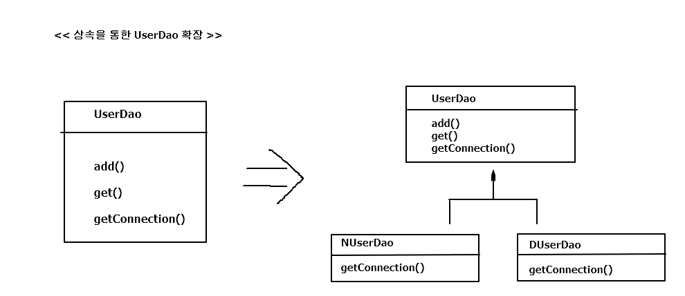
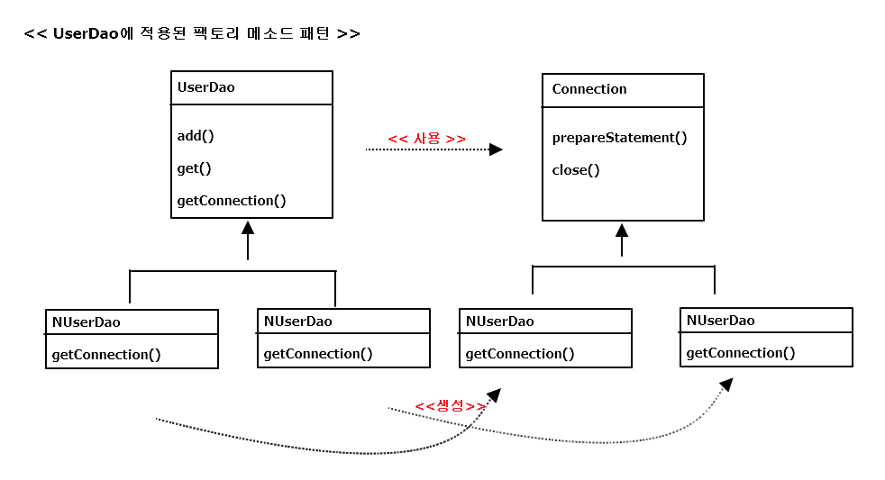

## 1.2 DAO의 분리

### 1.2.1 관심사의 분리

객체 지향 기술은
1. 실세계를 최대한 가깝게 모델링 해낼 수 있기 때문에 의미 있음
2. 객체지향 기술이 만들어내는 가상의 추상세계 자체를 효과적으로 구성할 수 있고,  
이를 자유롭고 편리하게 변경,발전,확장 시킬 수 있는데 의미 가 더큼.
=> 변화의 폭을 최소한으로 줄여주는 것  
=> **분리와 확장**을 고려한 설계!

문제점 : 변화는 대체로 집중된 한 가지 관심에 대해 일어나지만, 그에 따른 작업은 한곳에 집중되지 않는 경우가 많다. 
e.g) DB 접속 암호 변경 -> DAO 클래스 수백개 수정? || 트랜잭션 기술 변경 -> 비즈니스 로직이 담긴 코드 모두 수정??  
=> 변화가 한 번에 한 가지 관심에 집중돼서 일어나면, 준비해야 할 일은 한가지 관심이 한 군데에 집중.  
=> == 관심이 같은 것끼리는 모으고, 관심이 다른 것은 따로 떨어져 있게 하는것  
=> **관심사의 분리 Separation of Concenrns**

### 1.2.2 커넥션 만들기의 추출

#### UserDao의 관심사항
1. DB와 연결을 위한 커넥션을 어떻게 가져올까는 관심( 세분화 하면, 어떤 DB, 어떤 드라이버, 어떤 로그인 정보 등등...)
2. 사용자 등록으리 위한 DB에 보낼 SQL 문장을 담을 Statement를 만들고 실행.
3. 작업이 끝나면, 사용한 리소스인 Statement와 Connection 오브젝트를 닫아줘서 공유 리소스를 시스템에게 돌려 주는 것.

=> 가장 먼저 Connection 오브젝트를 가져오는 부분을 보면, 메소드가 늘어 날 수록 중복코드 계속 증가.

#### 중복 코드의 메소드 추출

**getConnection()) 메소드를 추출해서 중복을 제거한 UserDao**
<pre>
	public User get(String id) throws ClassNotFoundException, SQLException {		
		Connection conn = getConnection();
		...
	}
	public void add(User user) throws ClassNotFoundException, SQLException {
		Connection conn = getConnection();
		...
	}
	private Connection getConnection() throws ClassNotFoundException, SQLException {
		Class.forName("com.mysql.jdbc.Driver");
		Connection c = DriverManager.getConnection("jdbc:mysql://localhost/springbook", "spring","book");
		return c;
	}
</pre>

=> 만약 URL 변경 or 로그인 정보 변경 => getConnection() 한 메소드의 코드만 수정하면 됨.  
=> 관심의 종류에 따라 코드를 구분해놓았기 떄문에 가능!

#### 변경사항에 대한 검증 : 리팩토링과 테스트

=> 이전에 사용했던 main메소드 사용  
=> 위의 작업은 UserDao의 기능에는 아무런 변화X  
=> 여러 메소드에 중복돼서 등장하는 특정 관심사항이 담긴 코드를 별도의 메소드로 분리  
=> 이 작업은 기능에는 영향을 주지 않으면서 코드의 구조만 변경   
=> 코드가 훨씬 깔끔 & 미래의 변화에 좀 더 손쉽게 대응할 수 있는 코드  
=> 리팩토링 (refactoring) ( 메소드 추출(extract method) 기법 ) 

### 1.2.3 DB 커넥션 만들기의 독립

가정 )  
UserDao 를 판매하는 상황 + 구매 업체마다 다른 종류의 DB 사용 + DB 커넥션을 가져오는 데 독자적으로 만든 방법 적용하고 싶음  

#### 상속을 통한 확장

UserDao에서 메소드의 구현 코드 제거 & getConnection()을 추상메소드로 만들기

*상속을 통한 UserDao 확장 방법*

<pre>

public abstract class UserDao {
	public void add(User user) throws ClassNotFoundException, SQLException {
		Connection conn = getConnection();
		...
	}
	
	public User get(String id) throws ClassNotFoundException, SQLException {		
		Connection conn = getConnection();
		...
	}
	
	public abstract Connection getConnection() throws ClassNotFoundException, SQLException;
}

public class NUserDao extends UserDao {
	public Connection getConnection() throws ClassNotFoundException, SQLException {
		// N사 DB connection 생성 코드
	}
}

public class DUserDao extends UserDao {
	public Connection getConnection() throws ClassNotFoundException, SQLException {
		// D사 DB connection 생성 코드
	}
}

</pre>

관심사항
- UserDao  
 : 데이터를 등록하고 가져오는 것 ( SQL 작성 ,파라미터 바인딩, 쿼리 실행, 검색정보 전달)
- NUserDao, DUserDao  
 : DB 연결 방법은 어떻게 할 것인가

**템플릿 메소드 패턴(template method pattern)**  
 : 슈퍼 클래스에 기본적인 로직의 흐름을 만들고, 그 기능의 일부를 추상 메소드나 오버라이딩이 가능한 protected 메소드 등으로  
   만든 뒤 서브클래스에서 이런 메소드를 필요에 맞게 구현해서 사용하는 방법  

**팩토리 메소드 패턴(factory method pattern)**  
 : 서브클래스에서 구체적인 오브젝트 생성 방법을 결정 하게 하는 것  
( UserDao의 getConnection() 메소드는 Connection 타입의 오브젝트를 생성한다는 기능을 정의해놓은 추상 메소드  
  & UserDao의 서브클래스의 getConnection() 메소드는 어떤 Connection 클래스의 오브젝트를 어떻게 생성할 것인지를 결정하는 방법 ) 
  
  
*UserDao에 적용된 팩토리 메소드 패턴*

==> 탬플릿 메소드 패턴 or 팩토리 메소드 패턴으로 관심사항이 다른 코드를 분리해내고, 서로 독집적적으로 변경 OR 확장  
할 수 있도록 만드는 것은 간단하면서 매우 효과적!

*여전히 존재하는 문제점*
- 상속을 사용했다는 단점 
 ( 다른 목적을 위해 상속을 사용하거나 등 후ㅠ에 다른 목적으로 UserDao에 상속을 적용하기 힘듬 )
- 상속을 통한 상하위 클래스의 관계는 생각보다 밀접함  
 ( 서브클래스는 슈퍼 클래스의 기능을 직접 사용가능  
   => 슈퍼 클래스 변경? -> 서브 클래스 모두 변경 or 다시 개발  
   => or 위와 같은 변화에 따른 불편을 주지 않기 위해, 슈퍼 클래스의 제약 을 가해야함 )
- 확장 기능(DB 커넥션 생성 코드)를 다른 다른 DAO 클래스에 적용할 수 없음  