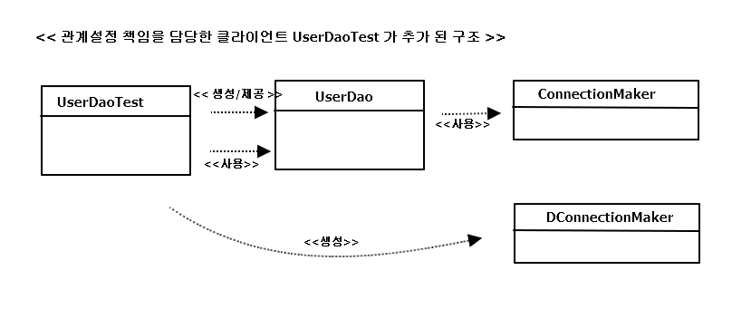

## 1.3 DAO의 확장

모든 오브젝트는 변하지만, 다 동일한 방식으로 변하는 건 아님 
=> 관심사에 따라서 분리한 오브젝트들은  제각기 독특한 변화의 특징이 있음 
(데이터 엑세스 로직을 어떻게 만들 것인가와 DB 연결을 어떤 방법을 할 것인가 라는 두 관심을 상하위 클래스로 분리함) 

=> 추상 클래스를 만들고 이를 상속한 서브클래스에서 변화가 필요한 부분만 바꿔서 쓸 수 있게 만든 이유  
 : 변화의 성격이 다른 것을 분리 & 서로 영향을 주지 않은 채, 각각 필요한 시점에 독립적으로 변경할 수 있기 위해서! 
 BUT 여러 단점이 많은 상속이라는 방법을 사용한 것이 불편함.
 

### 1.3.1 클래스의 분리  

(이전 작업)
- 독립된 메소드를 만들어 분리
- 상하위 클래스로 분리
 

(현 작업)
- 완전히 독립적인 클래스

*UserDao.java*
<pre>
public class UserDao {
	
	private SimpleConnectionMaker simpleConnectionMaker;
	
	public UserDao() {
		simpleConnectionMaker = new SimpleConnectionMaker();
	}
	
	public void add(User user) throws ClassNotFoundException, SQLException {
		Connection conn = simpleConnectionMaker.makeConneection();
		...
	}
	public User get(String id) throws ClassNotFoundException, SQLException {		
		Connection conn = simpleConnectionMaker.makeConneection();
		..	
	}
</pre>

*독립시킨 DB 연결 기능인 SimpleConnectionMaker.java*
<pre>
import java.sql.Connection;
import java.sql.DriverManager;
import java.sql.SQLException;

public class SimpleConnectionMaker {
	
	public Connection makeConneection() throws ClassNotFoundException,SQLException {		
		Class.forName("com.mysql.jdbc.Driver");
		Connection c = DriverManager.getConnection(
						"jdbc:mysql://localhost/springbook", "spring","book");
		return c;
	}
}
</pre>

=> main()을 이용해서 테스트 해보기

*또 다른 문제점 *  
: N 사와 D 사의 UserDao 클래스만 공급하고 상속을 통한 DB 커넥션 기능을 확장해서 사용했던 점

해결해야하는 문제 : 
- SimpleConnectionMaker의 메소드 문제  
 : makeNewConnection()을 사용해 DB 커넥션을 가져오는데, 만약 D사가 openConnection() 이라는 메소드를 사용하면,  
   수십, 수백개가 되면 작업 양이 너무 커짐.
- DB 커넥션을 제공하는 클래스가 어떤 것인지를 UserDao가 구체적으로 알고 있어야 함. 

=> UserDao가 바뀔 수 있는 정보 , i.e DB 커넥션을 가져오는 클래스에 대해 너무 많이 알고 있기 때문임. 
(어떤 클래스가 쓰일지, 그 클래스에서 커넥션을 가져오는 메소드는 이름이 뭔지 일일이 알아야함..)

### 1.3.2 인터페이스의 도입
위의 문제를 해결하기 위해,  
두 개의 클래스가 서로 긴밀하게 연결되어 있지 않도록, 중간에 추상적인 느슨한 연결고리를 만들어 주는 것 

**추상화**  
: 어떤 것들의 공통적인 성격을 뽑아내어 이를 따로 분리해내는 작업  
=> 인터페이스

*ConnectionMaker 인터페이스*
<pre>
package springbook.user.dao;

import java.sql.Connection;
import java.sql.SQLException;

public interface ConnectionMaker {	
	public Connection makeConnection() throws ClassNotFoundException, SQLException;

}
</pre>

*ConnectionMaker 구현 클래스*
<pre>
package springbook.user.dao;

import java.sql.Connection;
import java.sql.SQLException;

public class DConnectionMaker implements ConnectionMaker {
	@Override
	public Connection makeConnection() throws ClassNotFoundException, SQLException {
		// D 사의 독자적인 방법으로 Connection 을 생성하는 코드..
		return null;
	}	
}
</pre>

*UserDao.java*
<pre>
package springbook.user.dao;

import java.sql.Connection;
import java.sql.PreparedStatement;
import java.sql.ResultSet;
import java.sql.SQLException;

import springbook.user.domain.User;

public class UserDao {
	
	// 인터페이스를 통해 오브젝트에 접근하므로,
	// 구체적인 클래스 정보를 알 필요가 없음
	private ConnectionMaker connectionMaker;
	
	public UserDao() {
		//아직 까지 클래스 이름이 나옴..;
		connectionMaker = new DConnectionMaker();
	}
	
	public void add(User user) throws ClassNotFoundException, SQLException {
		// 인터페이스에 정의된 메소드를 사용하므로, 클래스가 바뀐다 해도
		// 메소드 이름이 변경될 걱정은 없음!
		Connection conn = connectionMaker.makeConnection();
		...
	}
	public User get(String id) throws ClassNotFoundException, SQLException {		
		Connection conn = connectionMaker.makeConnection();
		..
	}	
	
</pre>

=> 여전히 문제 ?  
connectionMaker = **new DConnectionMaker();**

### 1.3.3 관계설정 책임의 분리
여전히 UserDao 에는 어떤 ConnectionMaker 구현 클래스를 사용할지를 결정하는 코드가 남아 있다.  
UserDao의 관심사항
- JDBC API와 User 오브젝트를 이용해 DB에 정보를 넣고 빼는 관심 사항 => X
- ConnectionMaker 인터페이스로 대표되는 DB 커넥션을 어떻게 가져올 것인가 라는 관심사항 => X
=> UserDao가 어떤 ConnectionMaker 구현 클래스의 오브젝트를 이용하게 할지 결정하는 것 

사용되는 오브젝트를 서비스 / 사용하는 오브젝트를 클라이언트라 할 때,  
클라이언트를 통해 UserDao와 ConnectionMaker 구현 클래스를 분리할 수 있음!  

=> 오브젝트 사이에 런타임 사용관계 또는 링크 , 또는 의존관계라고 불리는 관계를 맺어주는 것  
=> 클라이언트는 UserDao를 사용해야 할 입장이므로, UserDao의 세부 전략이라고 볼 수 있는   
ConnectionMaker 구현 클래스 선택, 선택한 클래스의 오브젝트를 생성해서 UserDao 와 연결

*수정한 생성자 : UserDao.java*
<pre>
	public UserDao(ConnectionMaker connectionMaker) {
		this.connectionMaker = connectionMaker;
	}
</pre>

*관계설정 책임이 추가된 UserDao 클라이언트인 main() 메소드*
<pre>
public class UserDaoTest {
	
	public static void main(String[] args) throws ClassNotFoundException, SQLException {
		
		ConnectionMaker connecionMaker = new DConnectionMaker();
		
		UserDao dao = new UserDao(connecionMaker);
		....
	}
}
</pre>

=> UserDaoTest는 UserDao와 ConnectionMaker 구현 클래스와의 런타임 오브젝트 의존관계를 설정하는 책임을 담당  
=> UserDao에 있으면 안 되는 다른 관심사항, 책임을 클라이언트로 떠넘기는 작업 완료!  

### 1.3.4 원칙과 패턴

**개방 폐쇄 원칙 (Open-Closed Principle)**  
'클래스나 모듈은 확장에는 열려 있어야 하고, 변경에는 닫혀 있어야 한다' 
=> 깔끔한 설계를 위해 적용 가능한 객체지향 설계 원칙 중의 하나  
e.g)  
UserDao는 DB 연결 방법이라는 기능을 확장하는 데는 열려 있음  
UserDao는 자신의 핵심 기능을 구현한 코드는 그런 변화에 영향을 받지 않고 유지할 수 있으므로, 변경에는 닫혀 있음  

**높은 응집도와 낮은 결합도 (high coherence and low coupling)**  
: 응집도가 높다는 것은 하나의 모듈, 클래스가 하나의 책임 또는 관심사에만 집중되어 있다는 뜻  

- 높은 응집도  
 응집도가 높다는 것은 변화가 일어날 때 해당 모듈에서 변하는 부분이 크다는 것으로 설명할 수 있음.  
 처음 초난감DAO 처럼 여러 관심사와 책임이 얽혀 있는 복잡한 코드에서는, 변경이 필요한 부분을 찾기도 어렵고 그렇게  
 변경한 것이 혹시 DAO의 다른 기능에 영향을 줘서 오류를 발생시키지는 않는지도 일일이 확인해야 한다.  
 BUT DB 연결 방식에 변경이 일어난 경우에, 이를 검증하려고 하면 ConnectionMaker 구현 클래스만 테스트 해보는 것으로 충분! 

- 낮은 응집도  
 '하나의 오브젝트가 변경이 일어날 때에 관계를 맺고 있는 다른 오브젝트에게 변화를 요구하는 정도' 라고 할 수 있음  
 낮은 결합도는 높은 응지도보다 더 민감한 원칙. 책임과 관심사가 다른 오브젝트 또는 모듈과는 낮은 결합도  
 -> 즉 느슨하게 연결된 형태를 유지하는 것이 바람직하다  
 -> 결합도가 낮아지면, 변화에 대응하는 속도가 높아지고 구성이 깔끔 & 확장하기에도 매우 편리 
 ( 지속해서 변경 한 패턴을 보면, ConnectionMaker 와 UserDao는 인터페이스를 통해 결합도가 낮아짐 )  
 
 
**전략 패턴 (Strategy Pattern)**  
 : 자신의 기능 맥락(Context)에서, 필요에 따라 변경이 필요한 알고리즘을 인터페이스를 통해 통째로 외부로 분리시키고,  
   이를 구현한 구체적인 알고리즘 클래스를 필요에 따라 바꿔서 사용할 수 있게 하는 디자인 패턴  
-> 컨텍스트(UserDao)를 사용하는 클라이언트(UserDaoTest)는 컨텍스트가 사용할 전략(ConnectionMaker를 구현한 클래스) 
  을 컨텍스트의 생성자 등을 통해 제공해주는 게 일반적!  

  
>스프링이란 바로 지금까지 설명한 객체지향적 설계 원칙과 디자인 패턴에 나난 장점을 자연스럽게 개발자들이 활용할 수 있게 해주는 프레임워크 
    

 

 

     

   

   