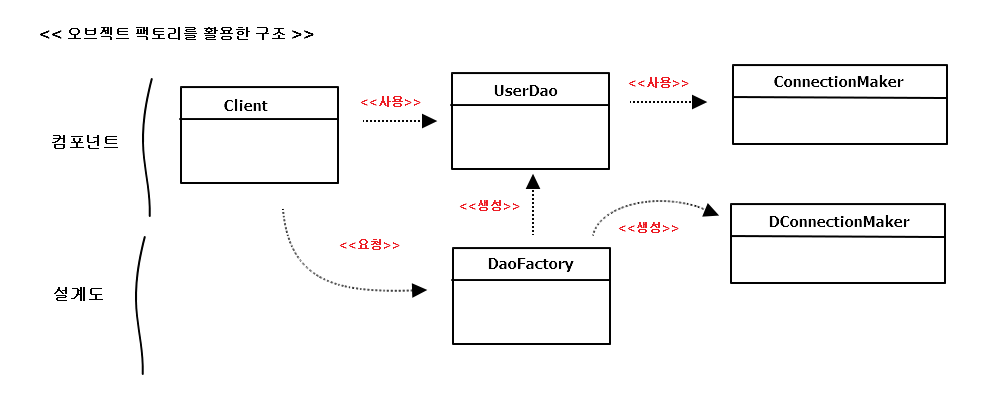

##1.4 제어의 역전(IoC)
:제어의 역전 (IoC, Inversion Of Control)

### 1.4.1 오브젝트 팩토리

문제점  
: UserDaoTest가 ConnectionMaker 구현 클래스를 사용할지 결정하는 기능을 엉겁결에 떠맡음. 
BUT UserDaoTest는 UserDao 기능이 잘 동작하는지를 테스트하려고 만든것. -> 그러므로 이것도 분리 
=> 이렇게 분리될 기능은 UserDao와 ConnectionMaker 구현 클래스의 오브젝트를 만드는 것과 
    그렇게 만들어진 두 오브젝트가 연결돼서 사용할 수 있도록 관계를 맺어주는 것.
    

#### 팩토리
분리 시킬 기능을 담당할 클래스 하나 만들기 ( 객체의 생성 방법을 결정 & 그렇게 만들어진 오브젝트를 반환 == 팩토리(factory) )  
( 디자인 패턴에서 말하는 추상 팩토리 패턴, 팩토리 메소드 패턴과 다른 개념 )  

*UserDao의 생성 책임을 맡은 팩토리 클래스 : DaoFactory.java*

<pre>
package springbook.user.dao;

public class DaoFactory {	
	public UserDao userDao() {
		// 팩토리의 메소드는 UserDao 타입의 오젝트를
		// 어떻게 만들고, 어떻게 준비 시킬지 결정
		ConnectionMaker connectionMaker = new DConnectionMaker();
		UserDao userDao = new UserDao(connectionMaker);
		return userDao;
	}
}
</pre>

*팩토리를 사용하도록 수정한 UserDaoTest*

<pre>
public class UserDaoTest {	
	public static void main(String[] args) throws ClassNotFoundException, SQLException {
			
//		// 변경 전 코드
//		ConnectionMaker connecionMaker = new DConnectionMaker();
//		UserDao dao = new UserDao(connecionMaker);
		
		//변경 후 코드
		UserDao dao = new DaoFactory().userDao();
</pre>

=> 리팩토링 후 테스트 잊지 말기!!

#### 설계도로서의 팩토리
UserDao , ConnectionMaker : 각각 애플리케이션의 핵심적인 데이터 로직과 기술 로직 담당  
DaoFactory : 이런 애플리케이션의 오브젝트들을 구성하고 그 관계를 정의하는 책임을 맡고 있음  

=> 핵심 기술인 UserDao는 변경이 필요 없으므로, 안전하게 소스코드를 보존 + DB 연결 방식은 자유로운 확장이 가능  
  ( DaoFactory를 수정해서 변경된 클래스를 생성해 설정해주도록 코드를 수정해주면 되므로)  
  
=>DaoFactory를 분리했을 때 얻을 수 있는 장점 중 , 애플리케이션의 컴포넌트 역할을 하는 오브젝트와   
   애플리케이션의 구조를 결정하는 오브젝트를 분리했다는 데 가장 의미가 있음   
   

### 1.4.2 오브젝트 팩토리의 활용

*만약 여러 개의 DAO를 생성해야하는 경우 DaoFactory?*  
<pre>
package springbook.user.dao;

public class DaoFactory {
	//ConnectionMaker를 선정하고 생성하는 코드의 중복 발생

	public UserDao userDao() {
		return new UserDao(new DConnectionMaker());
	}
	
	public AccountDao accountDao() {
		return new AccountDao(new DConnectionMaker());
	}
	
	public MessageDao messageDao() {
		return new MessageDao(new DConnectionMaker());
	}		
}
</pre>

 
=> 중복 문제를 해결하려면 분리해내는 게 가장 좋은 방법!  
 
 
*생성 오브젝트 코드 수정*
<pre>
package springbook.user.dao;

public class DaoFactory {	
	public UserDao userDao() {
		return new UserDao(connectionMaker());
	}
	
	public AccountDao accountDao() {
		return new AccountDao(connectionMaker());
	}
	
	public MessageDao messageDao() {
		return new MessageDao(connectionMaker());
	}		
	
	public ConnectionMaker connectionMaker() {
		// 분리해서 중복을 제거한 
		// ConnectionMaker 타입 오브젝트 생성코드
		return new DConnectionMaker();
	}
}
</pre> 

### 1.4.3 제어권의 이전을 통한 제어관계 역전

제어의 역전 ? 간단히 프로그램의 제어 흐름 구조가 뒤바뀌는 것  

일반적인 흐름 : 
main() 메소드와 같이 프로그램의 시작 지점 -> 다음에 사용할 오브젝트를 결정 -> 결정한 오브젝트 생성  
-> 만들어진 오브젝트에 있는 메소드 호출 -> ...

제어의 역전 :
이런 제어 흐름의 개념을 거꾸로 뒤집는 것(제어의 역전에서는 오브젝트가 자신이 사용할 오브젝트를 스스로 선택 X)  
-> 모든 제어 권한을 자신이 아닌 다른 대상에게 위임  
e.g)
- 서블릿 , EJB 등
- 처음 구현했던 템플릿 메소드 패턴에서 슈퍼 클래스가 결정하는 것

*라이브러리 vs 프레임워크*  
- 라이브러리  
  : 라이브러리를 사용하는 애플리케이션 코드는 애플리케이션 흐름을 직접 제어 한다. 
    ( 단지 동작하는 중에 필요한 기능이 있을 때 능동적으로 라이브러리를 사용)
- 프레임워크  
  : 거꾸로 애플리케이션 코드가 프레임워크에 의해 사용된다.  
    ( 보통 프레임워크 위에 개발한 클래스를 등록해두고, 프레임워크가 흐름을 주도하는 중에, 개발자가 만든 애플리케이션  
       코드를 사용하도록 만드는 방식 )
       
제어의 역전에서는 프레임워크 or 컨테이너와 같이 애플리케이션 컴포넌트의 생성과 관계설정, 사용, 생명주기 관리 등을  
관장하는 존재가 필요하다.  
DaoFactory는 오브젝트 수준의 가장 단순한 IoC 컨테이너 or IoC 프레임워크라 불릴 수 있다. 

> 스프링은 IoC를 모든 기능의 기초가 되는 기반 기술로 삼고 있으며, IoC를 극한까지 적용하고 있는 프레임워크           

 
    
   

    
 

