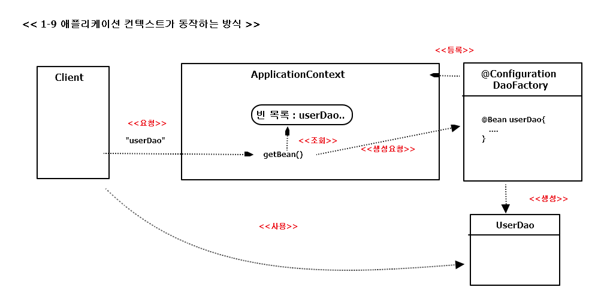

## 1.5 스프링의 IoC

### 1.5.1 오브젝트 팩토리를 이용한 스프링 IoC

**애플리케이션 컨텍스트와 설정정보** 
빈(bean) : in spring, 스프링이 제어권을 가지고 직접 만들고 관계를 부여하는 오브젝트  
           == 스프링 컨테이너가 생성과 관계설정, 사용 등을 제어해주는 제어의 역전이 적용 된 오브젝트
           
=> 빈의 생성과 관계설정 같은 제어를 담당하는 IoC 오브젝트  
== 빈 팩토리(bean factory) 
== (이를 확장 한) 애플리케이션 컨텍스트 (application context)  
=>그림 1.8의 설계도라는 것이 애플리케이션 컨텍스트와 그 설정정보를 말한다고 봐도 됨  
=> 그 자체로는 애플리케이션 로직을 담당하지는 않지만  
  IoC 방식을 이용해 컴포넌트 생성 & 사용할 관계를 맺어주는 등의 책임
  

**DaoFactory를 사용하는 애플리케이션 컨텍스트**  
; DaoFactory를 스프링의 빈 팩토리가 사용할 수 있는 설정정보로 만들기  

*애노테이션이 적용 된 DaoFactory ( == XML 과 같은 스프링 전용 설정정보 )*
<pre>
package springbook.user.dao;

import org.springframework.context.annotation.Bean;
import org.springframework.context.annotation.Configuration;

//스프링 빈 팩토리를 위한 오브젝트 설정을
//담당하는 클래스라고 인식할 수 있도록 => @Configuration
@Configuration
public class DaoFactory {	
	
	//오브젝트 생성을 담당하는 IoC 용 메소드라는 표시
	@Bean
	public UserDao userDao() {
		return new UserDao(connectionMaker());
	}
	
	@Bean
	public ConnectionMaker connectionMaker() {
		// 분리해서 중복을 제거한 
		// ConnectionMaker 타입 오브젝트 생성코드
		return new DConnectionMaker();
	}
}
</pre>

*애플리케이션 컨텍스트를 적용한 UserDaoTest*
<pre>
import java.sql.SQLException;

import org.springframework.context.ApplicationContext;
import org.springframework.context.annotation.AnnotationConfigApplicationContext;

import springbook.user.domain.User;

public class UserDaoTest {
	
	public static void main(String[] args) throws ClassNotFoundException, SQLException {
		
		ApplicationContext context = 
				new AnnotationConfigApplicationContext(DaoFactory.class);
		
		// DaoFactory의 메소드 이름 == 빈 이름
		UserDao dao = context.getBean("userDao",UserDao.class);
		
		User user = new User();
		user.setId("whiteship");
		user.setName("백기선");
		user.setPassword("married");
		
		dao.add(user);
		
		System.out.println(user.getId() + "등록 성공");
		
		User user2 = dao.get( user.getId() );
		System.out.println(user2.getName());
		System.out.println(user2.getPassword());
		
		System.out.println(user2.getId() + "조회 성공");
	}
}
</pre>
 

위 코드만 보면 DaoFactory를 직접 이용하는 것보다 번거로워 보이나 ,  
스프링은 DaoFactory를 통해서는 얻을 수 없는 방대한 기능과 활용 방법을 제공

### 1.5.2 애플리케이션 컨텍스트의 동작방식

- DaoFactory  
  : UserDao를 비롯한 DAO 오브젝트를 생성하고 DB 생성 오브젝트와 관계를 맺어주는 제한적인 역할 담당  
    ( @Configuration이 붙으므로 애플리케이션 컨텍스트가 활용하는 IoC 설정 정보 )
- 애플리케이션 컨텍스트  
  : 애플리케이션에서 IoC를 적용해서 관리할 모든 오브젝트에 대한 생성과 관계설정을 담당  
    ( 대신 ApplicationContext에는 DaoFactory와 달리 직접 오브젝트 생성 및 관계를 맺는 코드가 없음 )
    
    
*DaoFactory를 오브젝트 팩토리로 직접 사용하는 것과 비교해서 애플리케이션 컨텍스트를 사용함으로써의 장점?*  

- 클라이언트는 구체적인 팩토리 클래스를 알 필요가 없다.  
  -> 애플리케이션이 발전하면, DaoFactory 처럼 IoC를 적용한 오브젝트 계속 추가 됨  
  -> 클라이언트가 필요한 오브젝트를 가져오려면 어떤 팩토리 클래스를 사용해야 할 지 알아야 함   
	<pre>+ 필요할 때마다 팩토리 오브젝트를 생성해야 하는 번거로움<pre> 
  => 애플리케이션 컨텍스트를 사용하면, 이를 알아야 하거나 직접 사용할 필요가 없음  
  => + 일관된 방식으로 원하는 오브젝트를 가져올 수 있음  
  => DaoFactory 처럼 자바 코드를 작성하는 대신 XML 처럼 단순한 방법을 사용해 IoC 설정 정보를 만들 수 있음 
  
- 애플리케이션 컨텍스트는 종합 IoC 서비스를 제공해준다.  
  => 애플리케이션 컨텍스트의 역할은 단지 오브젝트 생성과 다른 오브젝트의 관계설정만이 전부가 아님  
  => 오브젝트가 만들어지는 방식, 시점과 전략을 다르게 가져갈 수 있음  
  => 부가적으로 자동생성, 오브젝트에 대한 후처리, 정보의 조합, 설정 방식의 다변화, 인터셉팅 등 다기능 제공  
  => 빈이 사용할 수 있는 기반기술 서비스 or 외부 시스템과의 연동 등을 컨테이너 차원에서 제공해주기도 함  
   
- 애플리케이션 컨텍스트는 빈을 검색하는 다양한 방법을 제공한다.
  => 애플리케이션 컨텍스트의 getBean() 메소드는 빈의 이름을 이용해 빈을 찾아줌  
  => 타입만으로 빈 검색 or 특별한 애노테이션 설정이 되어 있는 빈을 찾을 수도 있음
  

### 1.5.3 스프링 IoC의 용어 정리

- 빈 (bean)  
: 스프링이 IoC 방식으로 관리하는 오브젝트 ( == 관리되는 오브젝트(managed object) )  
스프링을 사용하는 애플리케이션에서 만들어지는 모든 오브젝트가 빈이 아니라, 
 그 중 스프릉이 직접 생성과 제어를 담당하는 오브젝트만을 빈이라 부름  

- 빈 팩토리 (bean factory)  
: 스프링의 IoC를 담당하는 핵심 컨테이너  
빈을 등록 / 생성 / 조회 / 돌려주고 / 그 외 부가적인 빈을 관리하는 기능  
보통은 빈 팩토리를 바로 사용하지 않고 이를 확장한 애플리케이션 컨텍스트를 이용  
BeanFactory라고 붙여쓰면 빈 팩토리가 구현하고 있는 가장 기본적인 인터페이스의 이름이 됨  
( 이 인터페이스에 getBean()과 같은 메소드가 정의 )

- 애플리케이션 컨텍스트 (application context)  
: 빈 팩토리를 확장 한 IoC 컨테이너 ( 빈을 등록하고 관리하는 기본적인 기능은 빈 팩토리와 동일 ) 
여기에 스프링이 제공하는 각종 부가 서비스를 추가로 제공하는 것  
( 빈 팩토리 : 주로 빈의 생성과 제어의 관점에서 이야기 하는 것  
  애플리케이션 컨텍스트 : 스프링이 제공하는 애플리케이션 지원 기능을 모두 포함해서 이야기 하는 것 ) 
ApplicationContext는 BeanFactory를 상속

- 설정정보/설정 메타정보 (configuration metadata)  
: 애플리케이션 컨테스트 or 빈 팩토리가 IoC를 적용하기 위해 사용하는 메타 정보  
( 'configuration' == 구성정보 or 형상정보 )  
스프링의 설정정보는 컨테이너에 어떤 기능을 세팅하거나 조정하는 경우에도 사용하지만,  
그보다는 IoC 컨테이너에 의해 관리되는 애플리케이션 오브젝트를 생성하고 구성할 때 사용   
== 애플리케이션의 형상정보 or 애플리케이션의 전체 그림이 그려진 청사진(blueprints) 라고도 함

- 컨테이너 (container) OR IoC 컨테이너  
: IoC 방식으로 빈을 관리한다는 의미에서, 애플리케이션 컨텍스트나 빈 팩토리를 컨테이너 or IoC 컨테이너라 함  

- 스프링 프레임 워크  
: IoC 컨테이너, 애플리케이션 컨텍스트를 포함해서 스프링이 제공하는 모든 기능을 통들어 말할 때 

  

    
      

 
 
  

            

