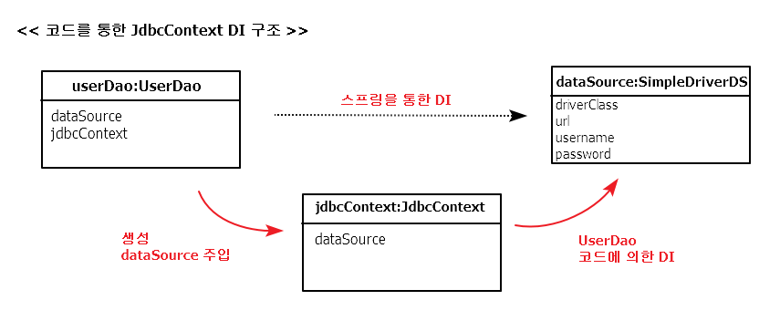

## 컨텍스트와 DI

### 3.4.1 JdbcContext의 분리
;전략 패턴의 구조를 보면
<table>
	<tr>
		<th>클라이언트</th>
		<td>UserDao의 메소드</td>
	</tr>
	<tr>
		<th>개별 전략</th>
		<td>익명 내부 클래스</td>
	</tr>
	<tr>
		<th>컨텍스트</th>
		<td>jdbcContextWithStatementStrategy()</td>
	</tr>	
</table>

=> JDBC의 일반적인 작업 흐름을 담고 있는 jdbcContextWithStatementStrategy()는 

다른 DAO에서도 사용 가능.

**클래스 분리**

---
> JDBC 작업 흐름을 분리해서 만든 JdbcContext 클래스

<pre>
package springbook.user.dao;
...
public class JdbcContext {
	private DataSource dataSource;

	public void setDataSource(DataSource dataSource) {
		this.dataSource = dataSource;
	}
		
	public void workWithStatementStrategy(StatementStrategy stmt) throws SQLException {
		Connection c = null;
		PreparedStatement ps = null;
		
		try {
			c = this.dataSource.getConnection();
						
			ps = stmt.makePreparedStatement(c);
			
			ps.executeUpdate();
		} catch(SQLException e) {
			throw e;
		} finally {
			if( ps!= null ) try{ps.close();}catch(SQLException e){}
			if( c != null ) try{c.close();}catch(SQLException e){}
		}	
	}
}
</pre>
---

---
> JdbcContext를 DI 받아서 사용하도록 만든 UserDao

<pre>
package springbook.user.dao;
...
public class UserDao {
	private JdbcContext jdbcContext;
	
	public void setJdbcContext(JdbcContext jdbcContext) {
		this.jdbcContext = jdbcContext;
	}
	
	public void add(final User user) throws SQLException {		
		this.jdbcContext.workWithStatementStrategy(
		...
	}
	
	public void deleteAll() throws SQLException {
		this.jdbcContext.workWithStatementStrategy(
				new StatementStrategy() {...}
		);
	}
</pre>

---

**빈 의존관계 변경**

; JdbcContext는 DataSource와는 달리 구체 클래스

-> 그 자체로 독립적인 JDBC 컨텍스트를 제공해주는 서비스 오브젝트로서

의미가 있을 뿐이고, 구현 방법이 바뀔 가능성은 없음

-> 별도의 인터페이스를 구현하도록 만들지 X

[!JdbcContext를 적용한 UserDao의 의존관계](./pics/pic3-4.png)

[!JdbcContext가 적용된 빈 오브젝트 관계](./pics/pic3-5.png)

---
> JdbcContext 빈을 추가하도록 수정한 설정 파일
<pre>
&lt;?xml version=&quot;1.0&quot; encoding=&quot;UTF-8&quot;?&gt;
&lt;beans xmlns=&quot;http://www.springframework.org/schema/beans&quot;
	xmlns:xsi=&quot;http://www.w3.org/2001/XMLSchema-instance&quot;
	xsi:schemaLocation=&quot;http://www.springframework.org/schema/beans 
						http://www.springframework.org/schema/beans/spring-beans-3.0.xsd&quot;&gt;
						
	&lt;bean id=&quot;dataSource&quot; class=&quot;org.springframework.jdbc.datasource.SimpleDriverDataSource&quot;&gt;
		&lt;property name=&quot;driverClass&quot; value=&quot;com.mysql.jdbc.Driver&quot; /&gt;
		&lt;property name=&quot;url&quot; value=&quot;jdbc:mysql://localhost/springbook?characterEncoding=UTF-8&quot; /&gt;
		&lt;property name=&quot;username&quot; value=&quot;spring&quot; /&gt;
		&lt;property name=&quot;password&quot; value=&quot;book&quot; /&gt;
	&lt;/bean&gt;
	
	&lt;bean id=&quot;jdbcContext&quot; class=&quot;springbook.user.dao.JdbcContext&quot;&quot;&gt;
		&lt;property name=&quot;dataSource&quot; ref=&quot;dataSource&quot; /&gt;
	&lt;/bean&gt;

	&lt;bean id=&quot;userDao&quot; class=&quot;springbook.user.dao.UserDao&quot;&gt;
		&lt;property name=&quot;dataSource&quot; ref=&quot;dataSource&quot; /&gt;		
		&lt;property name=&quot;jdbcContext&quot; ref=&quot;jdbcContext&quot; /&gt;
	&lt;/bean&gt;
&lt;/beans&gt;
</pre>
---

### 3.4.2 JdbcContext의 특별한 DI
; UserDao와 JdbcContext 사이에는 인터페이스를 사용하지 않고 DI를 적용

-> 지금까지 적용한 DI는 클래스 레벨에서 구체적은 의존관계 만들어지지 않도록 인터페이스를 사용

-> 설정을 변경하는 것만으로 다양한 의존 오브젝트를 변경해서 사용할 수 있음

=> UserDao는 인터페이스를 거치지 않고, 코드에서 바로 JdbcContext 클래스를 사용

( UserDao와 JdbcContext는 클래스 레벨에서 의존관계가 결정 )

**스프링 빈으로 DI**

; 스프링 DI의 기본 의도에 맞게 인터페이스 정의 후 사용해도 상관은 없지만, 그럴 필요도 없음

의존관계 주입(DI)의 개념 

: 인터페이스를 사이에 둬서 클래스 레벨에서는 의존관계가 고정되지 않게 하고, 런타임 시에 의존할 오브젝트와의

관계를 다이내믹하게 주입해주는 것이 맞음

BUT 스프링의 DI는 넓게 보면, 객체의 생성과 관계설정에 대한 제워권한을 오브젝트에서 제거하고

외부로 위임했다는 IoC라는 개념을 포괄

=> JdbcContext를 스프링을 이용해 UserDao 객체에서 사용하게 주입한 건 DI의 기본을 따르고 있음

*why JdbcContext를 UserDao와 DI 구조로 만드는지?*

- JdbcContext가 스프링 컨테이너의 싱글톤 레지스트리에서 관리되는 싱글톤 빈이 되기 때문  
 JdbcContext는 그 자체로 변경되는 상태정보를 갖고 있지 않음. (dataSource는 읽기 전용)
- JdbcContext가 DI를 통해 다른 빈에 의존하고 있기 때문(중요)  
 dataSource 프로퍼티를 통해 오브젝트를 주입 받도록 되어 있음.	  
 DI를 위해서는 주입되는 오브젝트와 주입받는 오브젝트 양쪽 모두 스프링 빈으로 등록 되어야 함.

=> 인터페이스가 없다는 건 UserDao와 JdbcContext가 매우 긴밀한 관계를 가지고 강하게 결합

**코드를 이용한 수동 DI**
;UserDao 내부에서 직접 DI를 적용하는 방법

=> 
1. 싱글톤을 포기 (그렇다고 매번 새로운 것 생성 X)  
=> DAO마다 JdbcContext 오브젝트를 갖고 있게 하는 것  
- JdbcContex는 DAO 개수만큼 생성 됨
- JdbcContext는 내부에 두는 상태 정보가 없어서, 메모리에 주는 부담 적음
- 자주 만들었다가 제거되는 게 아니기 때문에 GC에 대한 부담도 없음

2. DataSource의 DI에 의해 의존하고 있음  
=> JdbcContext에 대한 제어권을 갖고 생성과 관리를 담당하는 UserDao에게 DI까지 맡기는 것

---

> jdbcContext 빈을 제거한 설정 파일

<pre>
&lt;?xml version=&quot;1.0&quot; encoding=&quot;UTF-8&quot;?&gt;
&lt;beans xmlns=&quot;http://www.springframework.org/schema/beans&quot;
	xmlns:xsi=&quot;http://www.w3.org/2001/XMLSchema-instance&quot;
	xsi:schemaLocation=&quot;http://www.springframework.org/schema/beans 
						http://www.springframework.org/schema/beans/spring-beans-3.0.xsd&quot;&gt;
						
	&lt;bean id=&quot;dataSource&quot; class=&quot;org.springframework.jdbc.datasource.SimpleDriverDataSource&quot;&gt;
		...
	&lt;/bean&gt;
	
	&lt;bean id=&quot;userDao&quot; class=&quot;springbook.user.dao.UserDao&quot;&gt;
		&lt;property name=&quot;dataSource&quot; ref=&quot;dataSource&quot; /&gt;		
	&lt;/bean&gt;
&lt;/beans&gt;
</pre>
---

=> 설정 파일만 보면 UserDao가 직접 DataSource를 의존하고 있는 것 같지만,

내부적으로는 JdbcContext를 통해 간접적으로 DataSource를 사용하고 있을 뿐.

---

> jdbcContext 생성과 DI 작업을 수행하는 setDataSource() 메소드

<pre>
...
public class UserDao {
	private JdbcContext jdbcContext;	
	private DataSource dataSource;
	
	// 수정자 메소드 이면서 JdbcContext에 대한
	// 생성, DI 작업을 동시에 수행
	public void setDataSource(DataSource dataSource) {
		//JdbcContext 생성(IoC)
		jdbcContext = new JdbcContext();
		
		// 의존 오브젝트 주입(DI)
		jdbcContext.setDataSource(dataSource);
		
		// 아직 jdbcContex를 적용하지 않은 메소드를 위해 저장
		this.dataSource = dataSource;
	}
	...
}
</pre>

--- 

=> 인터페이스를 두지 않아도 될 만큼 긴밀한 관계를 갖는 DAO 클래스와 JdbcContext를 어색하게

따로 빈으로 분리하지 않고 내부에서 직접 만들어 사용하면서도 다른 오브젝트에 댛나 DI를 적용할 수 있다는 점

<table>
	<tr>
		<th>&nbsp;</th>
		<th>장점</th>
		<th>단점</th>
	</tr>		
	<tr>
		<th>빈으로 등록해서 사용<th>
		<td>오브젝트 사이의 실제 의존관계가 설정파일에 명확하게 드러남
		</td>
		<td>DI의 근본적인 원칙에 부합하지 않는 구체적인 클래스와 관계가 설정에 직접 노출된다는 단점
		</td>		
	</tr>
	<tr>
		<th>수동 DI<th>
		<td>
			JdbcContext가 UserDao의 내부에서 만들어지고 사용되면서 그 관계를 외부에 드러내지 않는 장점
		</td>
		<td>
			JdbcContext를 여러 오브젝트가 사용하더라도 싱글톤으로 만들 수 없고, DI 작업을 위한
			부가적인 코드가 필요하다는 단점
		</td>		
	</tr>
</table>

=> 일반적으로 어떤 방법이 더 낫다고 말할 수는 없지만, 상황에 따라 적절하다고 판단 되는 방법을 선택해서 사용!

단, 왜 그렇게 선택했는지에 대한 분명한 이유와 근거는 있어야 함.(귀찮아서 등등 X)

