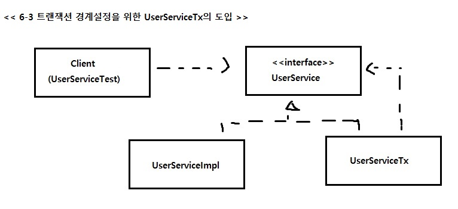

##6.1 트랜잭션 코드의 분리

### 6.1.1 메소드 분리
#### 비즈니즈 로직 + 트랜잭션 코드
<pre>
public void upgradeLevels() throws Exception {
	/*	=========== 트랜잭션 경계 =========== */ 
		TransactionStatus status = 
			this.transactionManager.getTransaction(new DefaultTransactionDefinition());
	/*	=========== 트랜잭션 경계 =========== */
		List<User> users = userDao.getAll();
			for (User user : users) {
				if (canUpgradeLevel(user)) {
					upgradeLevel(user);
				}
			}
	/*	=========== 트랜잭션 경계 =========== */
			this.transactionManager.commit(status);
	} catch (RuntimeException e) {
		this.transactionManager.rollback(status);
		throw e;
	}
}
</pre>

- 비즈니스 로직과 트랜잭션 코드가 서로 주고 받는 정보가 없음  => 독립적 코드

#### 비즈니스 로직 \\ 트랜잭션 코드 분리
<pre>
	public void upgradeLevels() {
		TransactionStatus status = 
			this.transactionManager.getTransaction(new DefaultTransactionDefinition());
		try {
			upgradeLevelsInternal();
			this.transactionManager.commit(status);
		} catch (RuntimeException e) {
			this.transactionManager.rollback(status);
			throw e;
		}
	}	
	/*	===========  분리된 비즈니스 로직 코드 =========== */
	public void upgradeLevelsInternal() {
		List<User> users = userDao.getAll();
		for (User user : users) {
			if (canUpgradeLevel(user)) {
				upgradeLevel(user);
			}
		}		
	}
</pre>

- UserService는 클래스로 되어있어서 직접 참조 -> 트랜잭션 코드를 빼면, UserService 클래스를 사용하는 클라이언트 코드에서는
  트랜잭션 기능이 빠지게됨.
 => 간접적으로 사용 ( **DI의 기본 아이디어 : 실제 사용할 오브젝트의 클래스 정체는 감춘 채 인터페이스를 통해 간접 접근 **)
 =>
Client ----> UserService(interface) <---UserServiceImpl
 => 테스트 시 필요에 따라 테스트 구현 클래스 , 정식 운영 중에는 정규 구현 클래스를 DI!
 

#### UserService 인터페이스 도입

<pre>

package springbook.user.service;
import springbook.user.domain.User;

public interface UserService {
	void add(User user);
	void upgradeLevels();
}

</pre>

<pre>
public class UserServiceImpl implements UserService {
	public void upgradeLevels() {
		List<User> users = userDao.getAll();
		for (User user : users) {
			if (canUpgradeLevel(user)) {
				upgradeLevel(user);
			}
		}		
	}
}
</pre>

#### 분리된 트랜잭션 기능

<pre>

package springbook.user.service;

import org.springframework.transaction.PlatformTransactionManager;
import org.springframework.transaction.TransactionStatus;
import org.springframework.transaction.support.DefaultTransactionDefinition;

import springbook.user.domain.User;

public class UserServiceTx implements UserService {	
	// UserService를 구현한 다른 오브젝트를 DI 받음 
	UserService userService;		
	// 트랜 잭션 적용
	PlatformTransactionManager transactionManager;
	public void setUserService(UserService userService) {
		this.userService = userService;
	}
	public void setTransactionManager(PlatformTransactionManager transactionManager) {
		this.transactionManager = transactionManager;
	}
	//DI 받은 UserService 오브젝트에 모든 기능을 위임 
	@Override
	public void add(User user) {
		userService.add(user);		
	}		
	@Override
	public void upgradeLevels() {
		TransactionStatus status = 
			this.transactionManager.getTransaction( new DefaultTransactionDefinition() );
						
		try {			
			userService.upgradeLevels();			
			this.transactionManager.commit(status);
		} catch(RuntimeException e) {
			this.transactionManager.rollback(status);
			throw e;
		}
	}	
	//==> 사용자 관리 로직을 전혀 갖지 않고 다른 UserServicew 구현 객체에 기능을 위임
}

</pre> 
  
#### 트랜잭션 적용을 위한 DI 설정

**기존 설정** 
<pre>
	&lt;bean id=&quot;userService&quot; class=&quot;springbook.user.service.UserService&quot;&gt;
			&lt;property name=&quot;userDao&quot; ref=&quot;userDao&quot; /&gt;
			&lt;property name=&quot;transactionManager&quot; ref=&quot;transactionManager&quot; /&gt;
			&lt;property name=&quot;mailSender&quot; ref=&quot;mailSender&quot; /&gt;
	&lt;/bean&gt;
</pre> 
 
**변경**
<pre>
	&lt;code&gt;
		&lt;bean id=&quot;userService&quot; class=&quot;springbook.user.service.UserServiceTx&quot;&gt;
			&lt;property name=&quot;transactionManager&quot; ref=&quot;transactionManager&quot; /&gt;
			&lt;property name=&quot;userService&quot; ref=&quot;userServiceImpl&quot; /&gt;
		&lt;/bean&gt;
		
		&lt;bean id=&quot;userServiceImpl&quot; class=&quot;springbook.user.service.UserServiceImpl&quot;&gt;
			&lt;property name=&quot;userDao&quot; ref=&quot;userDao&quot; /&gt;
			&lt;property name=&quot;mailSender&quot; ref=&quot;mailSender&quot; /&gt;
		&lt;/bean&gt;
	&lt;/code&gt;
</pre>

=> 클라이언트 -> UserServiceTx 호출

#### 트랜잭션 분리에 따른 테스트 수정
테스트 코드 수정하기

#### 트랜잭션 경계설정 코드 분리의 장점

* 비즈니스 로직을 작성할 떄, 트랜잭션과 같은 기술적인 내용 신경쓰지 않아도 됨.
* 비즈니스 로직에 대한 테스트를 손쉽게 만들어 낼 수 있음

#### Summary

* Service 객체에 직접 접근하는 것보다 간접적으로 결합성을 낮추는 필요성을 다시 느낌
* 기존 Spring 트랜잭션을 사용하면서 프록시 패턴이 적용된 것을 알았는데 직접 프록시패턴을 적용해볼 수 있었음 (JSP 이후 처음 commit, rollback 코드 직접 생성 해봄..)

