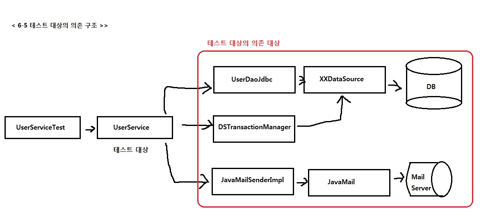
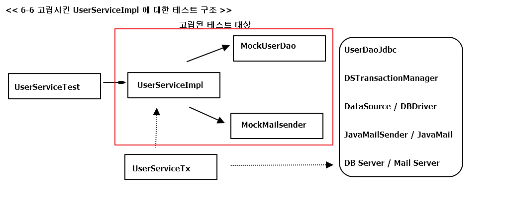

## 6.2 고립된 단위테스트

### INTRO
**가장 편하고 좋은 테스트 방법 : 작은 단위로 쪼개서 테스트**
- 실패 시 이유를 찾기 쉬움
- 테스트 의도가 분명해짐
- 추후 덩치가 커져도 작은 단위로 테스트 한 부분은 제외하고 접근할 수 있음

### 6.2.1 복잡한 의존관계 속의 테스트

**UserService는 UserDao, TransactionManager, MailSender 와 의존 관계를 지님**
=> UserService라는 테스트 대상이 테스트 단위인 것처럼 보이지만, 의존 관계를 따라 등장하는 것도 모두 테스트 대상  
=> 테스트 준비 힘듬 & 환경이 달라지면 결과도 달라 질 수 있음 & UserDao 잘못 변경하면 테스트 원인 찾기 힘듬. 
( 추가적으로, DB가 함께 동작해야 하는 테스트는 작성하기 힘든 경우가 많음 ) 

*DAO는 복잡 BUT Service는 간단한 로직. 배보다 배꼽이 더 큰 작업일 수도..?*

### 6.2.2 테스트 대상 오브젝트 고립시키기
#### 테스트를 위한 UserServiceImpl 고립 

=> 트랜잭션 코드를 분리했기 때문에, UserServiceImpl은 PlatformTransaactionManager에 의존하지 않음.

+ **UserDAO**
 - 테스트 대상의 코드가 정상적으로 수행되도록 도와주는 스텁 + 부가적인 검증 기능까지 가진 목 오브젝트로 만듬.(고립된 환경에서 동작하는 upgradeLevels()를 검증할 방법X)

=> UserServiceImpl은 아무리 그 기능이 수행돼도 그 결과가 DB에 남지 않음  
( upggradeLevels() 처럼 결과가 리턴되지 않는 경우는 더더욱 그럼 )  
=> UserServiceImpl(테스트대상)과 UserDao 에게 어떤 요청을 했는지 확인하는게 필요함

#### 고립된 단위 테스트 활용

<pre>
	@Test
	public void upgradeLevels() {
		/*===	DB 테스트 데이터 준비	===*/
		userDao.deleteAll();		
		for(User user : users) {
			userDao.add(user);
		}
		/*===	//. DB 테스트 데이터 준비	===*/
		
		/*===	메일 발송 여부 확인을 위해 목 오브젝트 DI	===*/		
		MockMailSender mockMailSender = new MockMailSender();  
		userServiceImpl.setMailSender(mockMailSender);
		/*===	//. 메일 발송 여부 확인을 위해 목 오브젝트 DI	===*/
		
		/*		테스트 대상 진행		*/
		userService.upgradeLevels();
				
		/*===	DB에 저장된 결과 확인	===*/
		checkLevelUpgraded(users.get(0), false);
		checkLevelUpgraded(users.get(1), true);
		checkLevelUpgraded(users.get(2), false);
		checkLevelUpgraded(users.get(3), true);
		checkLevelUpgraded(users.get(4), false);
		/*===	//. DB에 저장된 결과 확인	===*/
		
		
		/*===	목 오브젝트를 이용한 결과 확인	===*/
		List<String> request = mockMailSender.getRequests();  
		assertThat(request.size(), is(2));  
		assertThat(request.get(0), is(users.get(1).getEmail()));  
		assertThat(request.get(1), is(users.get(3).getEmail()));
		/*===	목 오브젝트를 이용한 결과 확인	===*/
	}
	
	private void checkLevelUpgraded(User user, boolean upgraded) {
		User userUpdate = userDao.get(user.getId());
		if (upgraded) {
			assertThat(userUpdate.getLevel(), is(user.getLevel().nextLevel()));
		}
		else {
			assertThat(userUpdate.getLevel(), is(user.getLevel()));
		}
	}
	
</pre>

1. 테스트 실행 중에 UserDao를 통해 가져올 테스트용 정보를 DB에 넣음.
2. 메일 발송 여부를 확인하기 위해 MailSender 목 오브젝트를 DI 해줌
3. 실제 테스트 대상인 userService의 메소드 실행
4. 결과가 DB에 반영됐는지 확인하기 위해서 UserDao를 이용해 DB에서 데이터를 가져와 결과를 확인
5. 목 오브젝트를 통해 UserService에 의한 메일 발송이 있었는지 확인하면 됨.
  
1,2 : 의존 오브젝트가 테스트의 목적에 맞게 동작하도록 준비  
4,5 : 테스트 대상 코드를 실행한 후에 결과를 확인

### UserDao 목 오브젝트

 
 

 