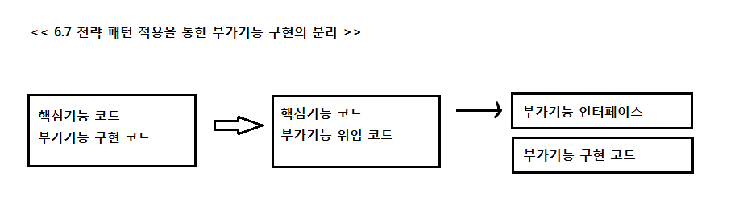
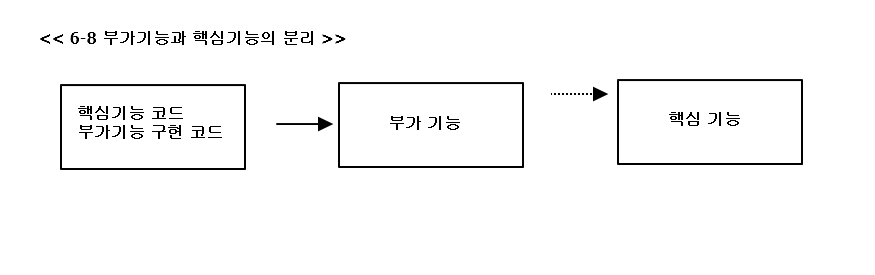
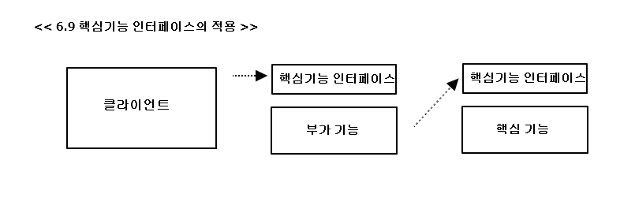
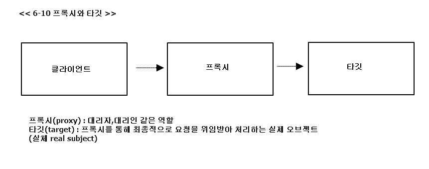
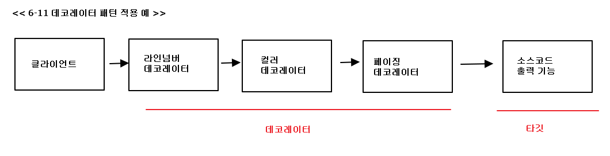
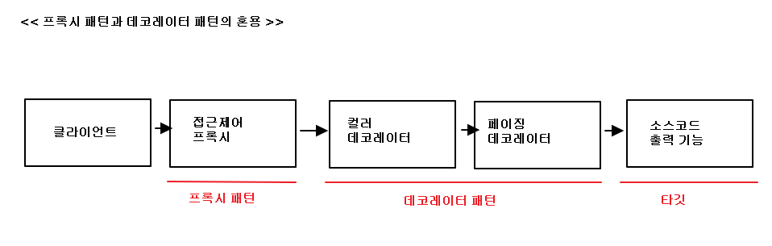
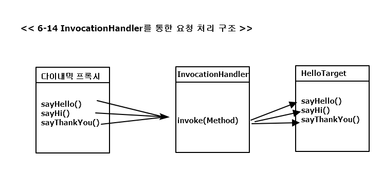

## 6.3 다이내믹 프록시와 팩토리 빈

### 6.3.1 프록시와 프록시 패턴, 데코레이터 패턴

트랜잭션과 같은 부가적인 기능을 위임을 통해 외부로 분리  

부가기능을 전부를 핵심코드가 담긴 클래스에서 독립(UserServiceTx 와 같은)
**부가기능과 핵심기능 분리**

부가기능 외의 나머지 모든 기능은 원래 핵심기능을 가진 클래스로 위임  
핵심기능은 부가기능을 가진 클래스의 존재 자체를 모름  
=> 부가기능이 핵심기능을 사용하는 구조가 됨

문제점 : 클라이언트가 핵심기능을 가진 클래스를 직접 사용해버리면, 부가기능이 적용될 기회가 없음  
=> 부가기능을 통해 핵심 기능 이용

**핵심기능 인터페이스의 적용**

**프록시와 타깃**

1. 클라이언트가 타깃에 접근하는 방법을 제어
2. 타깃에 부가적인 기능을 부여해주기 위해서
=> 두가지 모두 대리 오브젝트라는 개념의 프록시를 두고 사용하지만, 목적에 따라 디자인 패턴에서는 다른 패턴으로 구분함. 

#### 데코레이터 패턴
타깃에 부가적인 기능을 런타임 시 다이나믹 하게 부여해주기 위해, 프록시를 사용하는 패턴
e.g)
  핵심기능 : 소스코드 출력  
 + 소스코드 라인넘버 추가, 문법에 따라 색을 변경, 특정 폭으로 소스를 잘라줌, 페이지를 표시 등의 부가적인 기능
**데코레이터 패턴 적용 예** 

e.g) 자바 IO 패키지의 InputStream, OutputStream 구현 클래스는 데코레이터 패턴이 사용 된 대표적인 예
<pre>
InputStream is = new BufferedInputStream( new FileInputStream("a.txt") );
</pre>
  

**데코레이터 패턴을 위한 DI 설정
<pre>
	&lt;!-- 데코레이터 --&gt;
	&lt;bean id=&quot;userService&quot; class=&quot;springbook.user.service.UserServiceTx&quot;&gt;
		&lt;property name=&quot;transactionManager&quot; ref=&quot;transactionManager&quot; /&gt;
		&lt;property name=&quot;userService&quot; ref=&quot;userServiceImpl&quot; /&gt;
	&lt;/bean&gt;
	
	&lt;!-- 타깃 --&gt;
	&lt;bean id=&quot;userServiceImpl&quot; class=&quot;springbook.user.service.UserServiceImpl&quot;&gt;
		&lt;property name=&quot;userDao&quot; ref=&quot;userDao&quot; /&gt;
		&lt;property name=&quot;mailSender&quot; ref=&quot;mailSender&quot; /&gt;
	&lt;/bean&gt;
</pre>

UserServiceTx 클래스로 선언된 userService 빈은 데코레이터.  
UserServiceTx는 트랜잭션 경계설정 기능 부여 + UserService 타입의 오브젝트를 DI 받아서 기능을 위임  
 

#### 프록시 패턴
- 일반적으로 사용하는 프록시   
 + 클라이언트와 사용 대상 사이에 대리 역할을 맡은 오브젝트를 두는 방법  
 
- 디자인 패턴에서 프록시 패턴  
 + 프록시를 사용하는 방법 중에서 타깃에 대한 접근 방법을 제어하는 목적을 가진 경우  
 + 타깃의 기능을 확장하거나 추가하지 않음. 대신 클라이언트가 타깃에 접근하는 방식을 변경.
 

**사용예제** 
1. 원격 오브젝트를 이용하는 경우  
 원격 오브젝트에 대한 프록시를 만들어주고, 클라이언트는 마치 로컬에 존재하는 오브젝트를 쓰는 것처럼 프록시 사용 
 => 클라이언트 요청 -> 네트워크를 통해 오브젝트 실행 & 결과 받기 -> 클라이언트에게 결과 전송 
 (e.g RMI, EJB , 각종 리모팅 기술을 이용해 다른 서버에 존재하는 오브젝트를 사용)

2. 특별한 상황에서 타깃에 대한 접근권한 제어 
 수정 가능한 오브젝트가 있는데, 특정 레이어로 넘어가서는 읽기전용으로 동작하게 강제 해야하는 경우와 같음 
 (e.g Collections의 unmodifiableCollection()을 통해 만들어지는 오브젝트  
  파라미터로 전달된 Collection 오브젝트의 프록시를 만들어서, add(), remove() 같이 정보를 수정하는 메소드 호출 시  
  UnsupportedOperationException 예외 발생 )  
   
**프록시 패턴과 데코레이터 패턴의 혼용**

기능의 부가 or 접근 제어 인지를 구분해보면, 각각 어떤 목적으로 프록시가 사용돼었는지, 어떤 패턴이 적용되었는지 알 수 있음.

### 6.3.2 다이내믹 프록시
프록시는 기존 코드에 영향을 주지 않으면서, 타깃의 기능을 확장 or 접근 방법을 제어할 수 있는 유용한 방법 
BUT 인터페이스의 구현해야 할 메소드는 많으면 모든 메소드를 일일히 구현해서 위임하는 코드를 넣으므로  
프록시를 만드는 일이 상당히 번거롭게 느껴짐.

=> java.lang.reflect 패키지 안에 프록시를 손쉽게 만들 수 있도록 지원해주는 클래스가 존재 

#### 프록시의 구성과 프록시 작성의 문제점
프록시는 두 가지 기능으로 구성
 - 타깃과 같은 메소들르 구현하고 있다가 메소드가 호출되면 타깃 오브젝트로 위임한다.
 - 지정된 요청에 대해서는 부가기능을 수행한다.

<pre>
public class UserServiceTx implements UserService {	
	//타깃 오브젝트
	UserService userService;	
	...
	//메소드 구현과 위임
	@Override
	public void add(User user) {
		userService.add(user);		
	}	
	//메소드 구현		
	@Override
	public void upgradeLevels() {
		//부가 기능 수행
		TransactionStatus status = this.transactionManager.getTransaction( new DefaultTransactionDefinition() );
		try { // -- 부가 기능 수행 
			
			//위임
			userService.upgradeLevels();
			// -- 위임
			
			//부가기능 수행
			this.transactionManager.commit(status);
		} catch(RuntimeException e) {
			this.transactionManager.rollback(status);
			throw e;
		} // --부가기능 수행
	}
}
</pre>

프록시가 만들기가 번거운 이유
- 타깃의 인터페이스를 구현하고 위임하는 코드를 작성하기가 번거로움. (부가 기능이 필요없는 메소드도 구현해서 타깃으로 위임하는  
  코드를 일일히 만들어야함. 복잡하진 않지만, 메소드가 많고 다양해지면 부담스러운 작업임. 또한, 메소드 추가/변경 시 함께 수정
- 부가기능 코드가 중복될 가능성이 많다는 점. 트랜잭션은 DB를 사용하는 대부분의 로직에 적용될 필요가 있음. 

  
#### 리플렉션
자바의 코드 자체를 추상화해서 접근하도록 만듬 -> 다이내믹 프록시는 리플렉션 기능을 이용해서 프록시를 만듬 
java.lang.reflet 를 이용해, 클래스 코드에 대한 메타정보를 가져오거나 오브젝트 조장가능 
( e.g 클래스 이름, 부모 클래스 , 구현 인터페이스 , 필드 등등..) 

**리플렉션 테스트**
<pre>
import static org.hamcrest.CoreMatchers.is;
import static org.junit.Assert.assertThat;

import java.lang.reflect.Method;

import org.junit.Test;

public class ReflectionTest {	
	/*
	 * invoke() 메소드를 실행시킬 대상 오브젝트(obj)와 파라미터 목록(args)을 받아서 
	 * 메소드를 호출한 뒤에 그 결과를 Obejct 타입으로 돌려줌. 
	 */
	@Test
	public void invokeMethod() throws Exception {
		String name = "Spring";
		
		//length()
		assertThat(name.length(), is(6));
		
		Method lengthMethod = String.class.getMethod("length");
		assertThat( (Integer)lengthMethod.invoke(name) , is(6) );
		
		// charAt()
		assertThat(name.charAt(0), is('S'));
		
		Method charAtMethod = String.class.getMethod("charAt",int.class);
		assertThat((Character)charAtMethod.invoke(name, 0), is('S') );
	}
}
</pre>

#### 프록시 클래스
**Hello 인터페이스**
<pre>
public interface Hello {
	String sayHello(String name);
	String sayHi(String name);
	String sayThankYou(String name);
}
</pre>

**타깃 클래스**
<pre>
public class HelloTarget implements Hello {
	@Override
	public String sayHello(String name) {
		return "Hello " + name;
	}

	@Override
	public String sayHi(String name) {
		return "Hi " + name;
	}

	@Override
	public String sayThankYou(String name) {
		return "Thank You " + name;
	}
}
</pre>

**클라이언트 역할의 테스트**
<pre>
import static org.hamcrest.CoreMatchers.is;
import static org.junit.Assert.assertThat;

import org.junit.Test;

public class ProxyTestRunner {	
	@Test
	public void simpleProxy() {
		//타깃은 인터페이스를 통해 접근하는 습관을 들이기
		Hello hello = new HelloTarget(); 
		
		assertThat(hello.sayHello("Toby"), is("Hello Toby"));
		assertThat(hello.sayHi("Toby"), is("Hi Toby"));
		assertThat(hello.sayThankYou("Toby"), is("Thank You Toby"));
				
	}
}
</pre>

**프록시 클래스**
데코레이터 패턴을 적용해서 , 타깃(HelloTarget)에 부가 기능 추가
기능 : 
- 리턴하는 문자를 모두 대문자로 바꿔줌
<pre>
public class HelloUppercase implements Hello {
	// 위임할 타깃 오브젝트. 여기서 타깃 클래스의 오브젝트인 것은 알지만
	// 다른 프록시를 추가할 수도 있으므로 인터페이스로 접근.
	Hello hello;
	
	public HelloUppercase(Hello hello) {
		this.hello = hello;
	}

	@Override
	public String sayHello(String name) {
		return hello.sayHello(name).toUpperCase();
	}

	@Override
	public String sayHi(String name) {
		return hello.sayHi(name).toUpperCase();
	}

	@Override
	public String sayThankYou(String name) {
		return hello.sayThankYou(name).toUpperCase();	
	}
}
</pre>

**HelloUppercase 프록시 테스트**
<pre>
	@Test
	public void upperProxy() {		
		//프록시를 통해 타깃 오브젝트에 접근
		Hello proxiedHello = new HelloUppercase(new HelloTarget());
		
		assertThat(proxiedHello.sayHello("Toby"), is("HELLO TOBY"));
		assertThat(proxiedHello.sayHi("Toby"), is("HI TOBY"));
		assertThat(proxiedHello.sayThankYou("Toby"), is("THANK YOU TOBY"));		
		
	}
</pre>

문제점 
- 인터페이스의 모든 메소드를 구현해 위임하도록 코드를 만들어야 함
- 부가기능인 리턴 값을 대문자로 바꾸는 기능이 모든 메소드에 중복

#### 다이내믹 프록시 적용
**다이내믹 프록시의 동작 방식**

 
**다이내믹 프록시**
- 프록시 팩토리에 의해 런타임 시 다이내믹하게 만들어지는 오브젝트
- 타깃의 인터페이스와 같은 타입으로 만들어짐.

**InvocationHandler 인터페이스**
<pre>
	public Object invoke(Object proxy, Method method, Object[] args)
</pre>
=>다이내믹 프록시 오브젝트는 클라이언트의 모든 요청을 리플렉션 정보로 변환   
  & InvocationHandler 구현 오브젝트의 invoke() 메소드로 넘김 
  

**InvocationHandler를 통한 요청 처리 구조**

**InvocationHandler 구현 클래스**
<pre>
	import java.lang.reflect.InvocationHandler;
	import java.lang.reflect.Method;
	import java.lang.reflect.Proxy;

	public class UppercaseHandler implements InvocationHandler {
		// 다이내믹 프록시로부터 전달받은 요청을 
		// 다시 타깃오브젝트에 위임해야 하기 때문에, 타깃 오브젝트를 주입
		Hello target;
		public UppercaseHandler(Hello target) {
			this.target = target;
		}
		
		@Override
		public Object invoke(Object proxy, Method method, Object[] args) throws Throwable {
			//타깃으로 위임. 인터페이스의 메소드 호출에 모두 적용됨.
			String ret = (String) method.invoke(target,args);
			//부가 기능 제공
			return ret.toUpperCase();
		}		
	}
</pre>

**프록시 생성**
<pre>
		Hello proxiedHello = (Hello)Proxy.newProxyInstance(
				getClass().getClassLoader(), //동적으로 생성되는 다이내믹 프록시 클래스의 로딩에 사용할 클래스 로더
				new Class[] {Hello.class}, //구현할 인터페이스
				new UppercaseHandler(new HelloTarget()) //부가기능과 위임 코드를 담은 InvocationHandler 
				);
</pre>
- getClass.getClassLoader()  
 클래스 로더를 제공 (다이내믹 프록시가 정의되는 클래스 로더를 지정하는 것)
- new Class[] {Hello.class}  
 다이내믹 프록시가 구현해야 할 인터페이스(한 번에 하나 이상의 인터페이스 구현 가능(배열) )
- new UppercaseHandler(new HelloTarget())  
 부가기능 + 위임 관련 코드를 담고 있는 InvocationHandler 구현 오브젝트를 제공
 
 
 
#### 다이내믹 프록시의 확장

- Hello 인터페이스의 메소드가 늘어나면 ?  
 => HelloUppercase 는 매번 코드 추가 // UppercaseHandler 는 invoke() 메소드에서 처리
- 타입의 주의   
 => invoke()를 통해 String으로 타입 변화해주지만, 다른 반환형일 경우 런타임 에러  
 => 타입 체크 후 String 만 upper 나머지는 그대로 반환 하도록 수정   
- 타깃의 종류에 상관없이 적용이 가능 

**확장된 UppsercaseHandler**
<pre>
	public class UppercaseHandler implements InvocationHandler {
		//어떤 종류의 인터페이스를 구현한 타깃에도 적용 가능하도록 Object 타입으로 수정
		Object target;
		public UppercaseHandler(Object target) {
			Object.target = target;
		}
		
		@Override
		public Object invoke(Object proxy, Method method, Object[] args) throws Throwable {			
			// String인 경우만, 대문자 변경 기능 적용
			Object ret = method.invoke(target, args);
			if(ret instanceof String) 
				return ((String)ret).toUpperCase();
			return ret;
		}		
	}
</pre>

**메소드를 선별해서 부가기능을 적용하는 invoke()**
<pre>
	@Override
	public Object invoke(Object proxy, Method method, Object[] args) throws Throwable {					
		Object ret = method.invoke(target, args);
		if(ret instanceof String && method.getName().startsWith("say")) {
			return ((String)ret).toUpperCase();
		} else {
			return ret;				
		}	
	}
</pre>

### 6.3.3 다이내믹 프록시를 이용한 트랜잭션 부가기능

   
 
  

   

   
 

 
 

 
 

 

